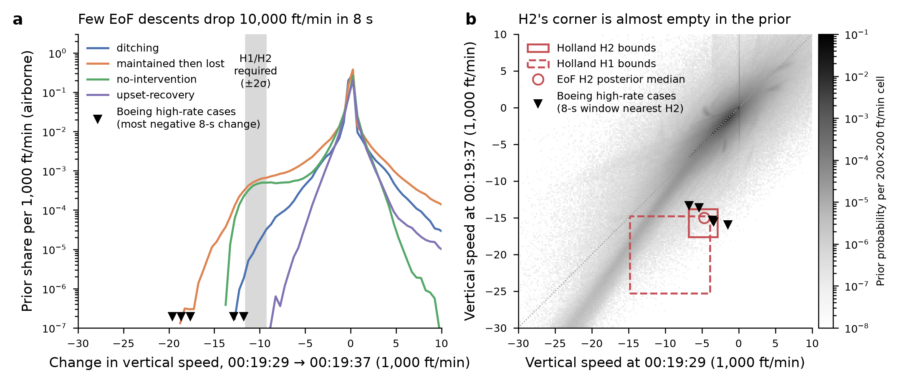
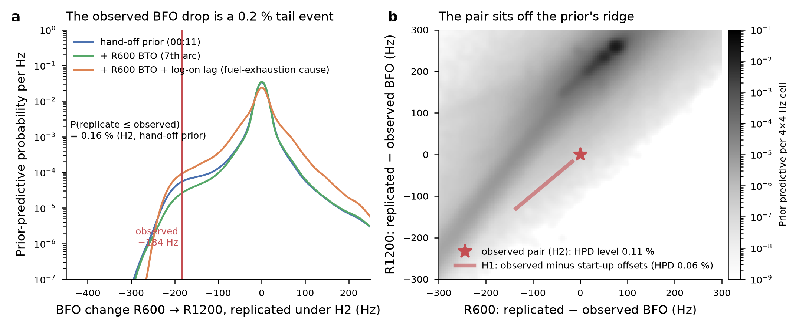
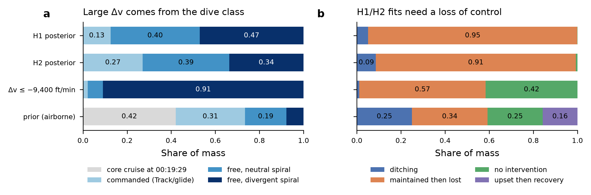

# The two 00:19 bursts: how plausible is the push-over, and does our descent model under-sample it?

Modular Architecture (independent read-only study), 10 Oct 2026, for Pete. **Nothing was built or changed in any sampler.**

**Labels on every number below:** `core (b): split-half NOT converged` · `two-tank bookkeeping only` · `EoF sweep run by an architecture stand-in (EoF to review)` · `PROVISIONAL-OVERNIGHT dive class (b), divergent spiral at 0.5, 90° cap` · `descent idle floor ON` · `two-burst stopgap proposal OFF`. Strata are combined with core's fixed P(family): free 0.6948, Davey dynamics + radar 0.1527, descent-climb 0.1376, routes 0.0149. Seeds are equal-weighted within a stratum. Monte Carlo (MC) errors are ±1 s.e. from the seed-to-seed spread (16 replicates), which is 2-4 times the parent-clustered s.e.; that spread includes core (b)'s non-convergence.

**Holland's two hypotheses, as mapped here:** H2 = `no-offset` (BFOs at face value); H1 = `startup-offset` (offset on R1200 U[17, 130] Hz, R600 larger by U[0, 6] Hz). This follows EoF's own usage ("Holland H1:H2 evidence", `hypothesis.toml`).

## Verdict

**Question 1. The 0.8 % is mostly an artefact of how the descent model is built. It is not evidence that the push-over is physically unlikely. The true physical rate is undetermined.**

- **Structure.** EoF's free dynamics are a fixed-C_L point mass (`integrator.rs`, `Command::FixedTrim`). The load factor can fall below 1 only through bank, or through a speed loss at a phugoid crest. A mean downward acceleration of 0.675 g needs n·cos φ ≈ 0.33: either wings level at n ≈ 0.33, or about 70° of bank at n = 1.
  - In the model, the only route to that is the provisional divergent spiral (90° cap).
  - By the time that spiral gives 0.6 g, the aircraft is already descending fast: the median is −30,600 ft/min at 00:19:29, not the −4,600 ft/min H2 needs.
  - Commanded profiles are capped at 6,500 ft/min with an 8 s first-order lag (`profile.rs`; `integrator.rs`, `Command::Track`). So a deliberate push-over cannot be represented at all.
- **Consequence.** Under no intervention, the probability of being inside Holland's H2 bounds at the burst times is about 4 × 10⁻⁷ (per airborne descent).
  - Boeing's engineering simulator, also with no control inputs, met H2's bounds in some 8-s window in 3 of its 10 ATSB-selected cases, and H1's in all 5 high-rate cases.
  - ATSB states that the 8-s increases in some scenarios "equalled or exceeded" those derived from the SATCOM data (ATSB, *Search and debris examination update*, Nov 2016, folio 8 of the project extract).
- **What EoF does produce comes from a different mechanism.** 91 % of EoF's H2 posterior lies in *maintained-then-lost*. The push-over is the transient at loss of control, when a Track descent switches to fixed trim at a C_L referenced to the **takeover** state plus the trim offset (`profile.rs`, `Profile::sample`, `level_c_l`). That is a load-factor step whose physical basis has not been checked.
- **What is not an artefact.** Even in Boeing's high-rate cases, only 0.2-0.7 % of the 8-s windows during the descent meet H2's bounds, and 1.5-4.8 % meet H1's. The coincidence of the bursts with the push-over is rare in any model. The *magnitude* of EoF's shortfall is a model artefact; the *true* rate is not determined by anything we have.

**Questions 2-3: the BFO pair as evidence.**
- The BFO difference measures Δv almost exactly. In the sample, predicted (R1200 − R600) = 17.61 Hz per 1,000 ft/min × Δv + 0.12 Hz, with residual s.d. 1.2 Hz.
- The observed −184 Hz therefore needs **Δv = −10,450 ± 560 ft/min (1σ)** under H2, and −10,120 to −10,450 under H1. That is **0.675 g** over 8.027 s, matching Holland's 0.68 g (p. 8).
- H1 and H2 need the same push-over, because Holland's offsets are shared and almost cancel in the difference.
- In the hand-off prior, the observed drop sits at the **0.16 ± 0.01 % lower tail** (H2), 0.18 % (H1) and 0.26 % (inflated, 34 Hz).
- The observed pair has a prior-predictive HPD level of 0.11 % (H2) and 0.06 % (H1).

**Question 4: alternatives.** Each is assessed in §5.
- **Ruled out on sign or size:** impact during the R1200; antenna lever-arm and attitude effects; logged-time error. The R1200 BTO anomaly changes Δt by at most about 0.03 s.
- **Ruled out by the record:** a 9M-MRO-type oscillator transient that is larger on R600 than on R1200. The only in-flight log-on (18:25) goes the other way, by +131 Hz.
- **Live but untested:**
  - in-flight break-up (ballistic, up to about 1 g);
  - a change of Doppler-compensation or channel state between the two messages (Ashton et al. p. 7 call the R1200 log-on acknowledge's delay "an artefact of the terminal switching channel and frequency during logon");
  - treating R1200 as unusable (Davey et al.'s treatment).

**Recommended design (§6).**
- **Prior decisions for Pete:**
  - add elevator-fixed pitch dynamics, or the 6-DOF-fitted reduced model, that can unload;
  - reference the trim at loss of control to the state at loss;
  - add the Boeing-documented sequence: TAC, autopilot loss at the first or second flame-out, residual rudder;
  - choose whether a deliberate push-over belongs in the control prior.
- **Sampling only (exact, no change in expectation):** a stratified or defensive proposal on the burst-time regime with unnormalised weights (core request 9), or multilevel splitting on the BFO-difference event.
- **Validation:** Boeing summary statistics as acceptance tests.

## 1. Prior-predictive vertical speed at 00:19:29 and 00:19:37, and Δv

Data: all 16 `impacts.npy` (4 strata × 4 seeds), 51.2 M descent rows, 106 columns, read through numpy memmap in 100,000-row chunks (`extract.py`).
- **Vertical speed at a burst:** the module-flown `latent:state_m0019{a,b}_vertical_speed_fpm`.
  - If the takeover falls after the burst, the core was still flying at the burst, so the vertical rate is 0 (the cruise-model convention, `terminal.rs`).
  - Rows that impacted before the burst are excluded, since they make the burst impossible.
- **Prior weight** = the `weight` column (hand-off weight × exp(ln q) self-normalised within the parent).
- **Proposal weight** = the parent's weight / 32: the raw sampling frequency.
- They differ only through the onset early-oversampling correction (ln q ∈ {−0.262, 0, +0.357}).

Conditioning columns:
- (i) the hand-off prior: the posterior through 00:11;
- (ii) × the R600 BTO likelihood (18,400 µs, s.d. 63 µs): on the 7th arc;
- (iii) × also the log-on lag density (Erlang(8, 14.875 s) on the time from realised flame-out to the log-on): the fuel-exhaustion cause.

**Table 1. Tail probability P(Δv ≤ x), airborne at both bursts** (%, ± 1 s.e. from seed spread)

| x (ft/min) | proposal (raw frequency) | prior (i) | prior (ii) + 7th-arc BTO | prior (iii) + BTO + log-on lag |
|---|---|---|---|---|
| −5,000 | 1.03 ± 0.03 | 1.00 ± 0.04 | 0.62 ± 0.04 | 2.18 ± 0.11 |
| −8,000 | 0.465 ± 0.011 | 0.448 ± 0.017 | 0.236 ± 0.012 | 0.799 ± 0.025 |
| −9,400 (settling's H2 best fits) | 0.281 ± 0.008 | 0.271 ± 0.011 | 0.137 ± 0.007 | 0.462 ± 0.020 |
| −9,800 (settling's H1 best fits) | 0.232 ± 0.007 | 0.223 ± 0.010 | 0.113 ± 0.006 | 0.377 ± 0.017 |
| **−10,450 (required by the BFO difference)** | **0.153 ± 0.006** | **0.147 ± 0.007** | **0.076 ± 0.004** | **0.249 ± 0.011** |
| −12,000 | 0.039 ± 0.003 | 0.037 ± 0.003 | 0.022 ± 0.002 | 0.046 ± 0.003 |

Reconciliation with "0.8 %" (`results/settling-h1h2-estimability.md`):
- On the 1 % random subsample, 0.77 % of the rows **in which the module flew both bursts** reach Δv < −8,000. That is settling's figure (provisional, subsample).
- Over all airborne rows the figure is 0.45 %, because 42 % of the airborne prior is still in core-flown cruise at 00:19:29 (Table 3).
- Under the fuel-exhaustion cause the figure is 0.80 %.

**Table 2. Joint states the hypotheses require** (absolute probability per descent; vertical-speed bins of 200 ft/min)

| region | proposal | prior (i) | prior (ii) | prior (iii) |
|---|---|---|---|---|
| Holland H2 bounds: 00:19:29 in [−6,800, −2,900], 00:19:37 in [−17,600, −13,800] (Holland Table VI, p. 10) | 5.3 × 10⁻⁵ ± 0.3 | 5.1 × 10⁻⁵ ± 0.3 | 6.1 × 10⁻⁵ ± 0.5 | 1.1 × 10⁻⁴ ± 0.3 |
| Holland H1 bounds: [−14,800, −3,900] and [−25,300, −14,800] (Table IV, p. 9) | 2.2 × 10⁻³ | 2.1 × 10⁻³ ± 0.07 | 1.2 × 10⁻³ | 4.5 × 10⁻³ |

- The H1 box is wide. In the 1 % subsample, 62 % of its prior mass has Δv > −4,000 ft/min: already fast at both bursts, not a push-over. The H1 posterior (Table 5) is the meaningful H1 figure.
- Marginally, 4.7 % of the airborne prior has a 00:19:29 rate within 2σ of H2's −4,560 ft/min, but only 0.18 % has a 00:19:37 rate within 2σ of −15,150. **The R1200 is the binding constraint.**

*Figure 1.*
- **Data:** EoF next-run on core (b) m0011 hand-offs, 4 strata × 4 seeds, 51.2 M rows; prior weights, condition (i).
- **(a)** The prior share of airborne descents per 1,000 ft/min of Δv, by realised control type. The shaded band is Δv required by the observed −184 Hz under H1/H2 (−10,450 ± 1,120 ft/min, 2σ, from BFO noise 7 Hz per burst and the fitted 17.61 Hz per 1,000 ft/min). Triangles are the most negative 8-s change in each of Boeing's five high-rate cases.
- **(b)** The prior probability of (vertical speed at 00:19:29, at 00:19:37), on 200 ft/min cells. The boxes are Holland's H2 and H1 bounds (arXiv:1702.02432v3, Table IV p. 9, Table VI p. 10). The circle is the EoF H2 posterior median (cause other). Triangles mark, per Boeing high-rate case, the 8-s window nearest the H2 centre.
- **Boeing data:** 1-Hz altitude, 3-s smoothed central differences, used as summary statistics only (`2018-08-19-eof-sims.zip`, sha256 `e400ac73…`).
- **Assumptions:**
  - vertical rate 0 where the core still flew the burst;
  - rows down before 00:19:29 excluded;
  - the 0.5 divergent-spiral weight and 90° cap are PROVISIONAL-OVERNIGHT;
  - core (b) unconverged;
  - two tanks are bookkeeping only (no one-engine phase is flown by EoF).

## 2. Prior-predictive BFO pair and the observed pair's percentile

- **Replication.** For each descent, the replicated pair is the predicted BFO (+ bias mean) plus, under each model, its noise and offsets:
  - H2: N(0, 7²) per burst;
  - H1: Holland's offsets plus N(0, 7²);
  - inflated: N(0, 34²).
- **The observed pair is (182, −2) Hz.** The difference statistic D = BFO(R1200) − BFO(R600) cancels the shared bias and, under H1, all but 0-6 Hz of the offset.
- **Not modelled here:** the Kalman bias variance in the 2D HPD calculation. It is a few Hz and shared, so it cancels in D.

**Table 4. The observed pair against the prior predictive** (%, conditions as in Table 1)

| statistic | model | prior (i) | prior (ii) | prior (iii) |
|---|---|---|---|---|
| P(D_rep ≤ −184 Hz) | H2 | 0.159 ± 0.008 | 0.076 ± 0.004 | 0.243 ± 0.010 |
| | H1 | 0.176 ± 0.008 | 0.084 ± 0.005 | 0.271 ± 0.011 |
| | inflated | 0.256 ± 0.010 | 0.143 ± 0.007 | 0.469 ± 0.013 |
| 2D HPD level of the observed pair (mass at lower predictive density) | H2 | 0.11 | 0.13 | 0.14 |
| | H1 | 0.06 | 0.06 | 0.07 |
| | inflated | 0.27 | 0.33 | 0.71 |

The 2D HPD values are on a 4 Hz grid over ±600 Hz with no MC error computed, so they are **provisional**.

By control type, under condition (i), the H2 HPD level is:

| control type | H2 HPD level |
|---|---|
| ditching | 0.013 % |
| maintained then lost | 0.33 % |
| no intervention | 0.001 % |
| upset then recovery | < 0.001 % |

*Figure 2.*
- **Data:** as in Figure 1, airborne at both bursts.
- **(a)** The prior-predictive density of the replicated BFO difference under H2 (predicted difference convolved with N(0, (7√2)²)), for conditions (i)-(iii). The vertical line is the observed −184 Hz.
- **(b)** The prior predictive of (replicated − observed) for R600 and R1200 under H2 (predicted + bias mean, smoothed by 7 Hz per axis; 4 Hz cells), condition (i).
  - The star is the observed pair under H2.
  - The segment is where the observation lands under H1 once Holland's offsets are removed (U[17, 130] Hz on R1200, plus U[0, 6] Hz on R600).
  - The dark ridge is level or near-level flight at both bursts.
- **Assumptions:**
  - BFO s.d. 7 Hz (`data/satcom-observations.csv`);
  - bias variance neglected in (b);
  - Holland H1/H2 mapped to `startup-offset` / `no-offset`;
  - core (b) unconverged; dive class provisional.

## 3. Mechanisms that can give about 0.6 g 2-4 min after the second flame-out

**Kinematics.**
- The vertical acceleration is d(v_z)/dt ≈ g(n cos φ cos γ − 1) − ((D − T)/m) sin γ.
- At γ ≈ −6° to −18° and D/W ≈ 0.05, the drag term is under 0.02 g, so 0.675 g needs n cos φ ≈ 0.33.
- This is a positive load factor, well inside the 777's structural envelope. It is mild for a pilot. For an unpiloted aircraft, it needs a nose-down pitch excursion (unloading) or a steep bank.

**Table 3. Where the sampled mass sits at 00:19:29** (prior, condition (i))

| regime at 00:19:29 | share of all descents | P(Δv < −8,000 \| regime) | share of all Δv < −8,000 | share of H2 posterior (cause other) |
|---|---|---|---|---|
| core-flown powered cruise (takeover later) | 0.379 | 0 (vertical rate 0 by convention) | 0 | 0 |
| commanded (Track / glide) | 0.284 | 0.065 % | 4.5 % | 27 % |
| free dynamics, neutral spiral | 0.169 | 0.17 % | 7.2 % | 39 % |
| free dynamics, divergent spiral (dive class (b)) | 0.070 | 5.2 % | 88 % | 34 % |
| down before 00:19:29 | 0.099 | n/a | n/a | n/a |

The descents that do reach Δv < −8,000 are not H2-like:
- 00:19:29 rate: median −30,600 ft/min (5-95 %: −45,100 to +9,200);
- 00:19:37 rate: median −41,000;
- altitude at 00:19:29: median 16,500 ft;
- time in free dynamics at 00:19:29: median 172 s.

Of the prior mass with Δv ≤ −9,400, only 1.6 % has a 00:19:29 rate inside H2's [−6,800, −2,900].

**Table 3b. Mechanism inventory**

| mechanism | no control / control | in EoF's model? | how often proposed | is the rate physical or a modelling choice? | Boeing / ATSB record |
|---|---|---|---|---|---|
| Unloading at a phugoid crest (n ∝ V²/V_trim²) after a large pull-up | no control | Yes (fixed-C_L phugoid). It cannot reach 0.6 g: the module's peaks are 0.36 g at trim −0.08 (`results/eof-boeing-calibration-oct09`) | part of free-trim, 0.17 % of neutral-spiral mass reaches −8,000 | **Choice.** The phugoid amplitude is set by the trim-offset prior U[−0.08, 0.08]. No pitch dynamics | Boeing's dives swing from about +20,000 to −58,000 ft/min, which is pitch dynamics (EoF calibration note); App. 1.6E p. 8 reports large phugoids and V_D exceedances |
| Divergent spiral to steep bank (≥ 70°) | no control | Yes: dive class (b), bank doubling U[60, 120] s, cap 90° | 0.5 of free dynamics; 7.0 % of all descents at 00:19:29 | **Choice, PROVISIONAL.** The 50/50 weight is Pete's indifference ruling. The bank reads 78-80° against Boeing's 53-60°, and the chords are 1.0-2.7 NM against 4.7-7.9 NM | 4 of 5 high-rate Boeing cases reach 53-60° of bank; peak downward 0.87-1.31 g |
| Autopilot disconnect out of trim at the second flame-out (electrical loss), with residual TAC rudder | no control | **No.** No autopilot state and no TAC. No one-engine phase is flown (sweep README) | 0 | **Absent by construction** | App. 1.6E p. 8: TAC left rudder after the right flame-out; autopilot disconnect at the left spool-down; RAT; about 0.2° residual rudder, giving a slow left roll and a spiral |
| Autopilot lost at the first flame-out (alternate electrical configuration), then asymmetric thrust and the second flame-out | no control | **No** | 0 | **Absent by construction.** A prior over electrical configuration is needed | ATSB Nov 2016 folio 8: in that configuration, descents went both ways. Iannello (2018, grade C) attributes 4 of the 5 high-rate cases to it |
| Mach tuck above M_cc | no control | Yes (`tuck_cl_per_mach` U[0, 0.6], EXTRAPOLATED) | inside free trim | **Choice**; changes peak descent by under 10 % (calibration sweep) | Boeing left its database in some runs (ATSB folio 8) |
| Load-factor step at loss of control: Track → fixed trim with C_L referenced to the takeover state | control, then loss | Yes. **It is the source of 91 % of the H2 posterior.** Loss of control median 38 s before 00:19:29 (cause other), 2 s (cause fuel) | maintained-then-lost is 0.34 of the prior; the loss delay is U[30, 1,800] s | **Choice, untested.** The step size depends on how far the state at loss is from the takeover state, which is not physics | none |
| Deliberate push-over / dive by a pilot | control | **No.** Commanded rates are at most 6,500 ft/min with an 8 s lag, so at most about 4,100 ft/min change in 8 s | 0 | **Absent by construction.** A prior on intent (hook `deliberate_control_weights` exists) | none (not simulated) |
| In-flight break-up (loss of lift, ballistic) | either | **No** (breakup only at contact) | 0 | **Absent** | Boeing observed V_D exceedances (App. 1.6E p. 8) |

**The EoF H1/H2 fits** (Table 5; posterior on all 16 seeds, condition (i); `both/*` options) are **parent-limited and unconverged**.

**Table 5. EoF posterior under the two-burst options**

| option, cause | effective parents | 00:19:29 rate, median (5-95 %) | 00:19:37 rate, median | Δv median (5-95 %) | maintained-then-lost / no intervention | time from 00:19:37 to impact, median (5-95 %) |
|---|---|---|---|---|---|---|
| H2, other | 87 | −4,730 (−5,480 to −4,060) | −15,030 | −10,280 (−11,210 to −9,440) | 0.91 / 0.007 | 732 s (33-1,598) |
| H2, fuel exhaustion | 20 | −4,620 | −14,870 | −10,220 | 0.74 / 0.000 | n/c |
| H1, other | 412 | −8,110 (−11,820 to −5,870) | −18,320 | −10,210 (−11,140 to −9,220) | 0.95 / 0.001 | 492 s (22-1,787) |
| H1, fuel exhaustion | 62 | −7,980 | −18,130 | −10,160 | 0.86 / 0.000 | n/c |

- The median of 12 minutes from 00:19:37 to impact under H2 means EoF's push-overs mostly recover (the fixed-C_L pull-out).
- In Boeing's cases, the window meeting H2's bounds came 24-44 s before the end of the record.
- This difference bears directly on the distance from the 7th arc.

**Table 6. Boeing engineering-simulator cases** (no control inputs; ATSB-selected conditions; summary statistics only)

| case | 8-s windows after descent onset | most negative 8-s Δv (ft/min) | windows with Δv ≤ −9,400 | windows meeting H2 bounds | windows meeting H1 bounds | first H2 window: altitude, s before end of record |
|---|---|---|---|---|---|---|
| 1, 2, 7, 8, 9 (glides) | 1,452-2,012 | −3,250 to −3,560 | 0 | 0 | 0 | – |
| 3 | 416 | −18,670 | 62 | 1 | 9 | 16,805 ft, 34 s |
| 4 | 294 | −12,850 | 19 | 2 | 14 | 17,260 ft, 44 s |
| 5 | 1,028 | −11,770 | 23 | 3 | 15 | 7,647 ft, 24 s |
| 6 | 229 | −17,650 | 19 | 0 | 11 | – |
| 10 | 311 | −19,610 | 34 | 0 | 9 | – |

- Averaged over all 10 cases, a random 8-s window during the descent meets H2's bounds with frequency 0.12 % and H1's with 1.6 %.
- EoF's prior gives 0.005 % (H2 box) at the actual burst times.
- The two figures are **not the same estimand**: Boeing's is time-averaged, and the alignment to flame-out is unknown because the files carry no flame-out times. They bound the plausibility; they do not measure a frequency. ATSB chose the ten scenarios.

*Figure 3.*
- **Data:** as in Figure 1, prior condition (i), airborne descents.
- **(a)** Shares by flight regime at 00:19:29.
- **(b)** Shares by realised control type. Each row is a population:
  - the prior;
  - prior descents with Δv ≤ −9,400 ft/min;
  - the H2 and H1 posteriors (`both/no-offset`, `both/startup-offset`, cause other; 87 and 412 effective parents, unconverged).
- **Assumptions:**
  - posteriors from rows with Δv < −4,000, predicted BFO drop > 120 Hz, or two-burst log-likelihood > −40 (complete for these posteriors);
  - divergent-spiral weight 0.5 and 90° cap PROVISIONAL-OVERNIGHT;
  - core (b) unconverged.

## 4. Questions 2(a)-(e) in brief

- **(a) Performance.** n ≈ 0.33 at M ≈ 0.8, 15,000-30,000 ft is aerodynamically and structurally unremarkable. The constraint is the dynamics that produce it, not the airframe.
- **(b) Fits at 00:11.**
  - The hand-off parents already carry all evidence to 00:11.
  - Adding the 7th-arc BTO **halves** the push-over tail: 0.147 → 0.076 % at −10,450.
  - Adding the fuel-exhaustion log-on lag raises it to 0.249 %, because it removes the 42 % of descents still in powered cruise at 00:19:29 (that share falls to 0.04 %).
- **(c) Operating modes.** Boeing App. 1.6E p. 8 gives the sequence: right engine first; TAC left rudder; autopilot disconnect at the left-engine spool-down and electrical loss; RAT; residual rudder of about 0.2° left; a descending left spiral, often with phugoids, sometimes beyond V_D. ATSB (Nov 2016, folios 7-8) aligns its results to 2 min after the loss of engine power, the theorised time of the 7th-arc transmissions. EoF models none of autopilot, TAC, RAT, APU or electrical configuration as states.
- **(d) No control.** EoF's no-intervention family puts 3.8 × 10⁻⁷ per airborne descent in the H2 box and 0.1 % of the H2 posterior. Boeing's no-input simulator produced the H2 signature in 3 of 10 cases. **EoF's no-control feasible set is too narrow**, by construction.
- **(e) Human control.** A sustained push to n ≈ 0.33 for 8 s from a 4,500 ft/min descent is easily flown. EoF cannot represent it (6,500 ft/min cap, 8 s lag). Its only controlled-to-push-over route is the untested load-factor step at loss of control.

## 5. Alternative explanations

| explanation | what it predicts | can the existing sample contain it? | in the modelled feasible space? | test |
|---|---|---|---|---|
| R1200 sent during water entry or rapid deceleration | Vertical deceleration **raises** the BFO (less descent); the observed drop needs more descent. Impact at about 00:19:37 also needs about 1,300 ft at 00:19:29 | 0.13 % of the prior impacts within 5 s after 00:19:37 (subsample, provisional); none is scored during entry (the integrator stops at the surface) | No (no state during entry) | **Rejected on sign** |
| In-flight break-up between the bursts | Loss of lift gives up to about 1 g downward. A wide, mixed-ballistic debris field. The APU-powered SDU and antenna must survive to transmit R1200 | No | No (breakup only at contact) | Settling / drift: field spread against recovered debris; the flaperon / flap separation evidence. Open |
| Attitude or antenna lever-arm | ω × r: 184 Hz would need about 33-55 m/s at the antenna, i.e. more than 2 rad/s pitch rate | n/a | n/a | **Rejected on size** (under about 10 Hz plausible) |
| Doppler-compensation or channel state changes between the R600 and R1200 (compensation frozen or stale at log-on, AFC/synthesiser update) | A jump of order 5 Hz per m/s of uncompensated line-of-sight horizontal velocity: tens to hundreds of Hz, dependent on track and speed | Partly: lat/lon at both bursts are stored, but not the velocity at each burst | No (the BFO model assumes live compensation) | Fleet log-on BFO sequences; manufacturer SDU behaviour (ATSB Aug 2017 update, **not read: server stalled**). Ashton et al. p. 7 call R1200 log-on delays a channel-switching artefact; p. 15 trusts only the log-on request's BFO |
| Oscillator start-up transient (Holland) | H1's shared offset cancels in D, so a push-over is still needed. To remove it, the R600 offset would have to exceed the R1200 offset by about 130-180 Hz | Yes (`startup-offset`, `inflated`) | Yes, but H1 bounds the difference to 0-6 Hz | **Contradicted by 18:25** (R1200 − R600 = +131 Hz, Ashton Table 1, p. 3). Holland's ground log-ons decay 0-6 Hz (p. 7) |
| R1200 BFO unusable (Davey et al. pp. 7, 83) | No push-over required | Yes (option `r600`) | Yes | A modelling choice. Report `r600` and `both` side by side, never mixed by evidence across different data |
| Timing anomaly of the R1200 (BTO 49,660 µs raw) | Δt changes by about 0.03 s, so the required acceleration changes by under 0.4 % | n/a | n/a | **Rejected on size** |

## 6. Recommended design

**A. Changes to the prior.** Modelling decisions for Pete; each config-gated and default off.
1. **Longitudinal dynamics that can unload:** elevator-fixed pitch with a Mach-dependent pitching moment (EoF option (a)), or the 6-DOF-fitted reduced model. Fixed-C_L free flight is the main reason the H2 corner is empty under no intervention.
2. **The Boeing-documented sequence as explicit states:** first and second flame-out; TAC rudder and its residual; autopilot retained or lost at the first flame-out (electrical configuration as a prior with stated weights); RAT; optional APU or engine relight on unusable fuel (ATSB folio 8). The one-engine phase is coming in core's next run, and EoF should fly it.
3. **Reference the free-flight trim at loss of control to the state at loss,** or declare the trim mismatch at loss as an explicit uncertain parameter with a justified range. Today most of the H2 posterior rests on this step.
4. **A deliberate push-over / dive element** in the control prior, behind `deliberate_control_weights`, or retire the 6,500 ft/min Track cap for controlled descents. This is a statement about intent, so it is Pete's decision, labelled.

**B. Sampling efficiency only.** Exact, and no change to the answer in expectation.
1. Core request 9 (unnormalised per-parent weights) first; the existing stopgap stays off until it lands.
2. A defensive mixture or stratification on the burst-time regime: loss-of-control time relative to 00:19:29, spiral state, trim. Exact ln(p/q) corrections, ε ≥ 0.2 on the prior.
3. Multilevel splitting / subset simulation on the event |D_pred + 184| < 20 Hz, from the about 12,000 parents per seed that already reach Δv < −8,000.
4. The core request 10 look-ahead at the hand-off.

**C. Validation.** No fitting to the Boeing files. Use as acceptance tests:
- the high-rate share;
- peak downward g (0.87-1.31);
- bank (53-60°);
- chord (4.7-7.9 NM);
- the 8-s window occupancy of Table 6 (H2 0.12 %, H1 1.6 % averaged over 10 cases);
- time from the H2 window to impact (24-44 s).

**Smoke tests that would settle the open points** (not run here; owned by EoF):
1. **Trim reference.** One seed, `next-free`, N = 8, with the loss-of-control C_L referenced to the state at loss. If H2 effective parents fall by more than half, the current H2 posterior rests on the artefact.
2. **Within-parent saturation.** The top 200 parents per two-burst option × 1,024 descents (EoF's own §3 test 1). If ln Z(H2) rises by more than 3 s.e., within-parent sampling limits; otherwise the hand-off does.
3. **Free-dynamics acceptance.** Re-run `results/eof-boeing-calibration-oct09` with the Table 6 window-occupancy statistic added.

## Deviations and provisional items

- **Full data:** all 16 files were read for histograms, tail probabilities and masses (Tables 1-4).
- **1 % random subsample** (seeded, 512 k rows), **provisional:**
  - the BFO-Δv regression;
  - the 0.77 % reconciliation;
  - the impact-timing figures;
  - the 62 % H1-box statement.
- **Retained subset:** Δv < −4,000 ft/min, or predicted BFO drop > 120 Hz, or two-burst log-likelihood > −40; 39,127 rows per file on average. Used for Tables 3 (last column), 3b and 5 and Figure 3. It is complete for the H2 box and for the posteriors, but **not** for the H1 box by control type, which is not reported for that reason.
- **No MC error for:** the 2D HPD levels (4 Hz grid; bias variance neglected), and Table 5.
- **Literature:**
  - Holland (arXiv:1702.02432v3) was read: printed pp. 7-10.
  - Boeing App. 1.6E (p. 8) and Ashton et al. (pp. 3, 7, 15) were read from the project text extractions.
  - ATSB Nov 2016 was read only through the project extract (folios 7-8; EoF's ledger gives pp. 11-12, still to reconcile).
  - **Not read:** ATSB Dec 2015, Aug 2017 and Oct 2017 (the ATSB server timed out).
  - Davey et al. pp. 7 and 83 are cited through EoF's ledger, not re-read.
  - Iannello (2018) is grade C and is used only for the electrical-configuration attribution.
- **No unauthorised manual was used.**

Scripts and figures are in the artifact store (`extract.py`; analysis cells in this session's lineage).

- Modular Architecture (independent study)
