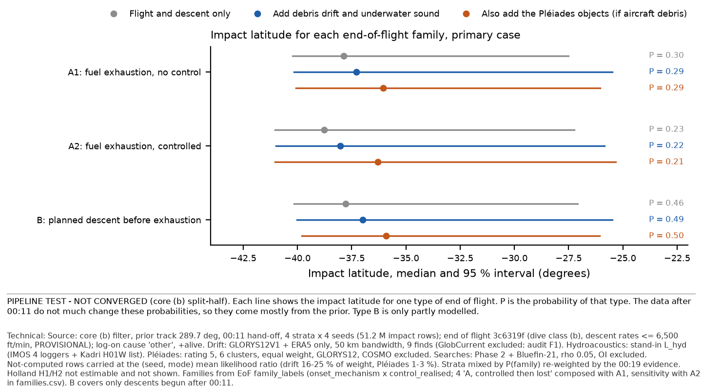
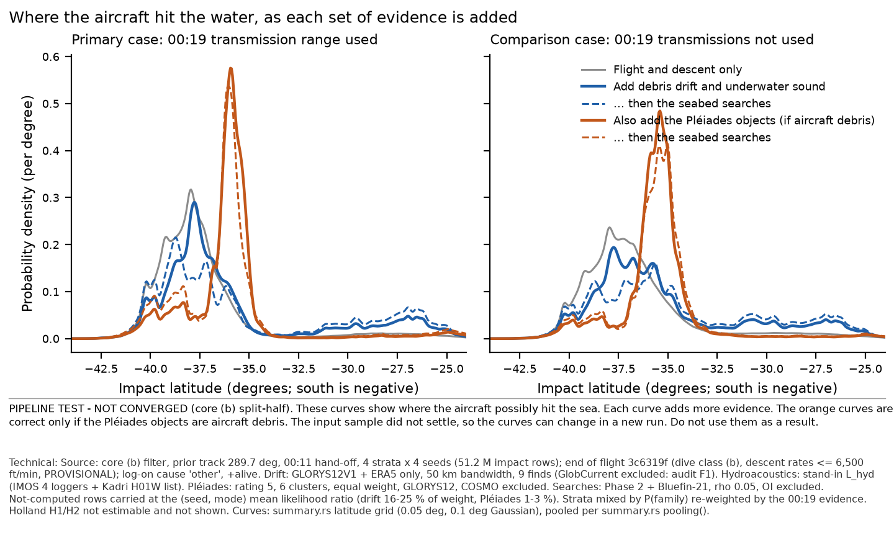
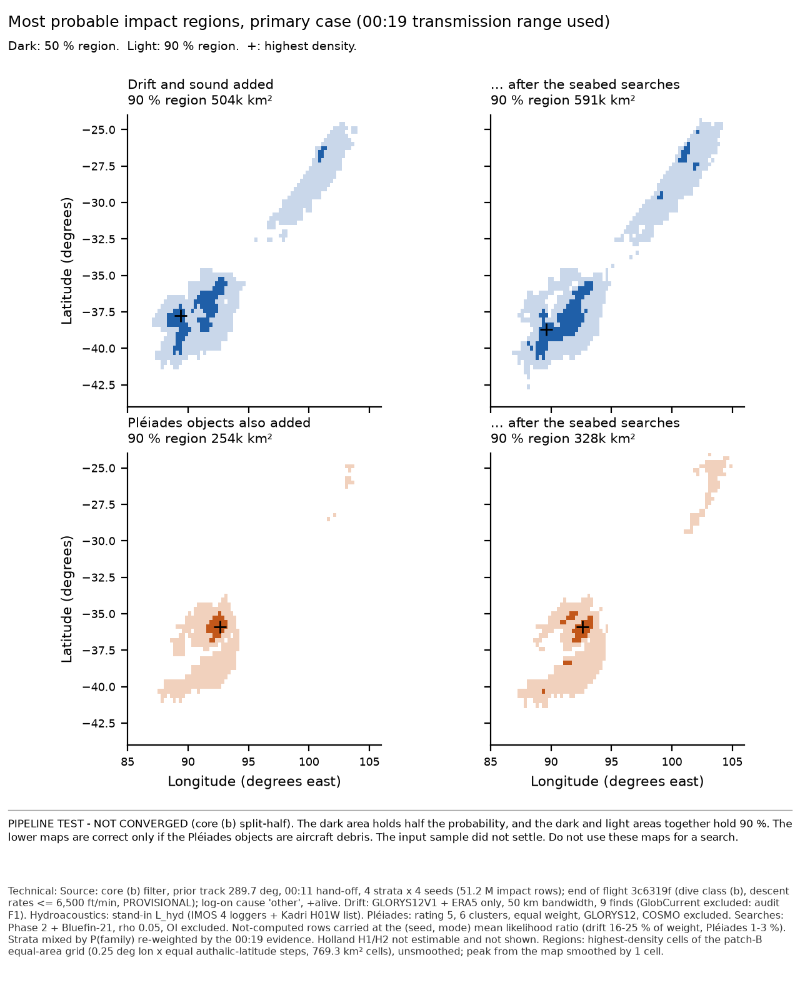
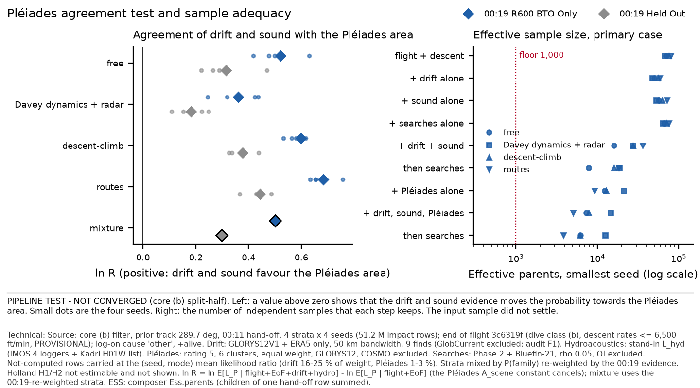

# Composer pass 0: first end-to-end composition on core (b)

10 Oct 2026, ~22:05 UTC. **Run by an architecture stand-in on the composer's behalf; the composer module reviews it.**
Pete approved the pass (~15:10 -0600). Authority: `threads/master-prompts/composer.md`, the eight composition rules
(`ISO Sept 28 Status/threads/master-prompts/common.txt`), `ARCHITECTURE.md`.

> **Every number in this note is a PIPELINE TEST — core (b) unconverged; EoF physics provisional; hydro L_hyd stand-in;
> GlobCurrent F1; Holland H1/H2 not estimable.** The pass tests the plumbing. It gives no estimate of where the aircraft is.

## 1. What the pass did

- **Library.** `crates/compose` used unchanged (`lib.rs`, `tests.rs`; `cargo test -p mh370-compose`: 7 of 7 pass). A thin
  driver was added: `engine/crates/compose/examples/pass0.rs`. It reads row-aligned columns, declares each factor, calls
  `Product::filter` and `compose()`, and writes product bookkeeping plus composed weights. It touches no core file.
  `Cargo.toml` and `Cargo.lock` are unchanged.
- **Glue** (`results/composer-pass0/`):
  - `prep_inputs.py` builds the factor columns. Each factor is computed by its owner's own code, imported read-only.
  - `make_hdr.py`, `run_pass0.sh`: headers and the per-stratum driver.
  - `summarise_stratum.py`, `report.py`: a transcription of summary.rs and patch B (see gap 18).
  - `crosscheck.py`: the independent numpy check.
  - `seabed.py`: the seabed step, not yet run (§6).
- **Samples.** End of flight's sweep on core (b): 4 strata × 4 seeds, 51.2 M impact rows (`mh370-exchange/end-of-flight/next-run`).
  Every row was used. Nothing was subsampled.
- **Replicates = seeds; strata = core families.** Each stratum is composed separately (4 replicates). The strata are then
  mixed three ways, and all three are shown:
  1. by the 00:19-re-weighted P(family) (primary, ruling C);
  2. by the fixed core P(family);
  3. by all the evidence in each product, P_core × Z (rule 7).
- **Compute.** Outside the heavy lock: 2 threads; the composer is single-threaded. About 8 min per stratum. Peak
  intermediate disk is about 2.2 GB, deleted per stratum. New committed data is 3.4 MB.

### Factors and how they were declared

| factor | column source | observations declared | alternatives | scale |
|---|---|---|---|---|
| flight (base) | hand-off `weight`, `mode`, `parent` | core run.json assignment, epochs ≤ m0011 + radar (26 IDs) | — | — |
| end of flight, 00:19 option | EoF `derived_logliks` (r600-bto) + `constraint_log_factor(alive)`, displacement_hist.py `f964a9b9` (3c6319f) | `m0019a.bto`, `m0019b.burst-exists` (Held Out: the latter only) | `terminal-data` (one option) | absolute |
| debris drift | `score_impacts.lookup` on `debris-drift-production-glorys12/merged`, `ln_l` (50 km); NaN outside support | 9 finds (`debris:reunion-right-flaperon` … `debris:pemba-right-outboard-flap`) | `ocean-model` = {GLORYS12V1+ERA5: 1} | absolute |
| hydroacoustics | stand-in `lhyd.Model.station_terms` total, scenario A, KE, rng [20261010, stratum, seed] (lhyd.py `5000c56e`) | stand-in IDs: `imos:3315/3376/3274/3275`, `ims:H01W:kadri2024-table1` (hook declares none) | — | absolute |
| Pléiades (H only) | `lnL_pleiades_glorys12` from the Pléiades stand-in columns; NaN where `not_computed` | `ga-rec2017-13:pleiades-objects` | `pleiades-origin` [not-H, H] **given H**; `object-rating` [rho4-0]; `cluster-weight` [equal]; `ocean-model` [GLORYS12] | absolute (carries A_scene) |
| searched areas | `mh370 evaluate hypotheses/seabed-search/run.toml` (ρ 0.05) on every seed | `search:phase2-2014-2017`, `search:bluefin-2014` | — | absolute |

**Ocean model: GLORYS12 only.** It is declared as one shared `ocean-model` alternative across drift and Pléiades, and
composed in one set for H. GlobCurrent is excluded under audit F1. With one option the joint marginalisation is trivial.
The two-option case is refused by the composer (gaps 8 and 9).

**Not-computed rows (NaN).** These are carried at their (seed, mode) mean likelihood ratio (composer ruling 1).
- Drift leaves 16-25 % of the pre-composition weight not computed, and Pléiades 1.3-3.1 %. The default tolerance of 10⁻³
  refuses both (refusal R3).
- Pass 0 sets the tolerance to 0.5 for those sets and records it.
- The sensitivity that excludes these rows instead (NaN → zero weight, the drift and Pléiades convention) is shown as
  Gx / Hx.

**Products** (per option): P1 = flight + EoF; **G** = P1 + drift + hydro; **Ga** = G + searched areas; **H** = P1 +
{drift, hydro, Pléiades} in one set, conditional on H; **Ha** = H + searched areas; PE = P1 + Pléiades. Sensitivities:
Gx, Hx, PEx (NaN excluded), Hc / PEc (Pléiades + COSMO). Single factors: D, Y, S.

## 2. Checks

- **Independent numpy cross-check** (next-free, seed 1; P1, G, Ga, H; both options). Plain numpy recomputed the weights
  and ln D per mode, using composer.md ruling 1 for NaN rows.
  - Weights: max |Δw| = 3.8 × 10⁻¹¹ (R600 G), and max relative difference 5.96 × 10⁻⁸. That is the f32 storage precision
    of the exported weights (5.96 × 10⁻⁸).
  - ln D per mode: max |Δ| = 4.8 × 10⁻¹¹.
  - The composer's own `moments()` mean latitude equals numpy's to 10⁻⁹ °.
  - File: `composer-pass0-next-run-b/crosscheck-next-free-seed1.json`.
- **End-of-flight evidence.** The composer's P1 increment per stratum equals EoF's `family-evidence-next-run-b.json`
  ln Ẑ(00:19 R600 BTO Only +alive): free −5.802, Davey dynamics + radar −5.902, descent-climb −5.734, routes −5.711.
  P_core × Z then reproduces EoF's re-weighted P(family) to 4 decimals: 0.6972 / 0.1386 / 0.1478 / 0.0164.
- **Hydro stand-in reproduced.** Per-row L_hyd regenerated from its scripts gives lnS0L|A = −0.052101 for free seed 1,
  R600 BTO Only. That equals the stand-in's `per_seed.json` to every digit, and ln Z₀₀:₁₉ = −5.86022 also matches.
- **Row alignment.**
  - Pléiades `row` and `parent` equal the impacts in all 16 seeds.
  - The evaluate `weight` column is identical to impacts.npy.
  - Settling outcomes match impact rows 100 % (A 200,000 / 200,000 and C 79,788 / 79,788 per stratum, exact (seed, parent, lat, lon)).
- **Determinism.** Rerunning the free stratum end to end (prep → compose) gave bit-identical replicate evidence.

## 3. Interface gaps (the main deliverable of a pass 0)

The full table, with owners and requests, is `composer-pass0-next-run-b/interface-gaps.csv` (21 rows). The composer
refused eight cases (R1-R7, and R3/R4/R5 in both options). Those refusals are the rules working:

| # | refusal (composer's own words, shortened) | owner |
|---|---|---|
| R1 | filter: "rows of stratum true heading carry 0.1023, but the filter gives it posterior probability 0.1400" — run.json modes are the final (m0019b) evidence, not the m0011 hand-off's | core |
| R2 | "observation m0019a.bto is used by both the base product (filter) and terminal:r600-bto+alive" — run.json lists observations through its m0019b stop | core |
| R3 | "debris-drift is not computed (NaN) on 564,652 samples … 0.234 of the pre-composition posterior, above tolerance 0.001; refused" | drift / architecture |
| R4 | "alternative ocean-model has options [GLORYS12] in debris-drift but [GLORYS12, GlobCurrent] in pleiades; a shared name must mean the same options" | drift / Pléiades |
| R5 | drift with both ocean models, given GLORYS12: "the samples have no column debris-drift:loglik:globcurrent…" — the library reads every combination's column, even under `given` | composer library |
| R6 | "seabed-search is already in the base product … a factor is never applied twice" (double-application guard: correct) | — |
| R7 | Pléiades + COSMO onto H: "observation ga-rec2017-13:pleiades-objects is used by both …" (ownership guard: correct) | — |

**The silent gaps matter most.**
- The hydroacoustics hook declares **no** observation IDs, so it can never be refused for double use (gap 14).
- The `alive` constraint and the COSMO contacts have no IDs (gaps 4 and 12).
- `Status::Converged` tests only the ESS floor: every product here reports "converged" while core (b) fails split-half (gap 20).
- Pléiades columns exist for one rating and one cluster weighting only (gap 10). There is no not-H likelihood, so P(H | D)
  cannot be reported (gap 11).
- Settling seabed samples are outcome sets with no row index, and the first stand-in's element files are gone (gaps 16, 17).
- summary.rs patch B is unlanded, so the PDFs come from a transcription that must be deleted when core lands B (gap 18).

## 4. Results — PIPELINE TEST

### 4.1 Per end-of-flight family first

EoF posted the A1/A2/B mapping at ~21:20 UTC (`family_labels`, d4c0926), answering a4d4427a. The labels are derived from
`latent:onset_mechanism` × `latent:control_realised`, and **every row has a family**.
- Code 4 ("A, controlled then lost") is composed with A1. Pete still has to rule on this; the A2 sensitivity is in
  `families.csv`.
- The shares are mostly the module's prior. EoF warns that per-family results are conditional, not evidence for a family.
- B covers only descents begun after 00:11.

00:19 R600 BTO Only, strata re-weighted. Each cell gives P(family), then the median impact latitude (95 % interval):

| family | flight + EoF | G (+ drift + hydro) | H (G + Pléiades, given H) |
|---|---|---|---|
| A1: fuel exhaustion, uncontrolled (+ A-then-lost) | 0.303; −37.87 (−40.23 to −27.51) | 0.291; −37.28 (−40.17 to −25.48) | 0.292; −36.04 (−40.08 to −26.06) |
| A2: fuel exhaustion, controlled or arrested | 0.232; −38.76 (−41.05 to −27.25) | 0.224; −38.03 (−41.00 to −25.84) | 0.209; −36.30 (−41.03 to −25.33) |
| B: planned descent before exhaustion | 0.465; −37.77 (−40.16 to −27.07) | 0.485; −37.00 (−40.03 to −25.49) | 0.499; −35.91 (−39.81 to −26.07) |

00:19 Held Out: P(A1, A2, B) is 0.270, 0.207, 0.523 under flight + EoF, and 0.252, 0.201, 0.548 under G. The full
tables are in `families.csv`.

### 4.2 Mixture (labelled as a mixture over families; re-weighted strata)

| product | 00:19 R600 BTO Only: median (95 %) | 90 % region | split-half overlap | 00:19 Held Out: median (95 %) | 90 % region |
|---|---|---|---|---|---|
| flight + EoF (P1) | −37.95 (−40.52 to −27.23) | 360k km² | 0.923 | −37.24 (−40.35 to −27.42) | 580k km² |
| **G** general | −37.30 (−40.44 to −25.56) | 504k km² | 0.916 | −36.18 (−40.24 to −25.84) | 741k km² |
| **G after searches** | −37.14 (−40.60 to −25.22) | 591k km² | 0.902 | −35.55 (−40.36 to −25.55) | 830k km² |
| **H** under Pléiades | −35.99 (−40.33 to −25.81) | 254k km² | 0.964 | −35.51 (−40.03 to −28.13) | 338k km² |
| **H after searches** | −36.14 (−40.56 to −25.02) | 328k km² | 0.967 | −35.44 (−40.19 to −26.82) | 417k km² |
| G, not-computed excluded | −36.90 (−39.20 to −25.71) | 313k km² | 0.912 | −35.97 (−38.97 to −25.96) | 436k km² |
| H, not-computed excluded | −35.88 (−37.18 to −34.68) | 62k km² | 0.970 | −35.46 (−36.93 to −33.86) | 92k km² |

Notes on the table:
- The fixed and all-evidence mixtures differ from the re-weighted one by at most 0.02° in the median and 2k km² in area.
- Split-half overlap is the summary.rs latitude-density overlap of seeds 1-2 against 3-4, from **one** partition. It is
  not EoF's three-partition minimum and is not tested against its 0.896 floor.
- 90 % regions are unsmoothed equal-area cells.

**Reading (provisional):**
1. Drift moves the median 0.65° north (R600), as drift's interim scoring found (0.62°). It also lifts a northern arm,
   0.17 of the mass north of 30 °S.
2. The searches widen G (504k → 591k km²) and leave the peak in the south, as the searched-areas module found.
3. How NaN rows are handled is a first-order choice:
   - excluding them shrinks the H 90 % region 254k → 62k km²;
   - it moves G's median 0.40° north.
   Architecture has to rule on it before any composed area is quoted.

### 4.3 Evidence, ESS and split-half per factor (00:19 R600 BTO Only, min over seeds of effective parents)

| step | free | Davey dyn. + radar | descent-climb | routes | ln-evidence increment, free (halves 1-2 / 3-4) |
|---|---|---|---|---|---|
| flight + EoF | 70,244 | 67,326 | 75,408 | 79,923 | −5.802 (−5.874 / −5.735) |
| + drift alone | 50,069 | 47,285 | 56,001 | 58,725 | −127.934 (absolute density constant) |
| + hydro alone | 57,177 | 52,994 | 62,655 | 71,340 | −0.072 (−0.064 / −0.078) |
| + searches alone | 66,032 | 62,991 | 70,812 | 75,668 | −0.405 (−0.393 / −0.415) |
| G | 15,991 | 27,336 | 27,530 | 36,043 | −128.004 (−127.966 / −128.039) |
| G after searches | 7,817 | 18,554 | 15,949 | 18,397 | −0.333 |
| H | 7,360 | 14,518 | 7,870 | 5,030 | −135.463 (−135.283 / −135.652) |
| H after searches | 6,219 | 12,542 | 6,136 | 3,816 | −0.373 |

- Every product clears the composer's floor of 1,000 effective parents per seed.
- Evidence increments per (replicate, mode) for every product: `evidence-increments-per-seed-mode.csv`.
- Per stratum: `products-per-stratum.csv`.

### 4.4 Tension of H against G (Pléiades hypothesis)

ln R = ln E[L_P | flight + EoF + drift + hydro] − ln E[L_P | flight + EoF]. The Pléiades A_scene constant cancels.
Positive values mean drift and hydro move probability towards the Pléiades area.

| quantity | 00:19 R600 BTO Only | 00:19 Held Out |
|---|---|---|
| ln R, re-weighted mixture (fixed / all-evidence) | **+0.50** (+0.50 / +0.51) | **+0.30** (+0.30 / +0.30) |
| ln R per stratum: free / Davey + radar / descent-climb / routes | +0.52 / +0.36 / +0.60 / +0.68 | +0.31 / +0.18 / +0.38 / +0.44 |
| ln R split halves, free | +0.49 / +0.55 | +0.28 / +0.35 |
| ln R, not-computed excluded | +0.50 | +0.30 |
| 90 % HDR overlap (Jaccard) G vs H, before / after searches | 0.41 / 0.44 | 0.43 / 0.44 |
| share of H's 90 % region inside G's | 0.87 | 0.96 |
| peak displacement G → H, before / after searches | 192 NM / 222 NM | 199 NM / 244 NM |

- The peaks are taken from the equal-area map smoothed by one cell. G's peak is (−37.74, 89.38), and H's is (−35.88, 92.62).
- The seed-to-seed spread of ln R is about ±0.1 within a stratum. The spread across strata, 0.36-0.68, is larger, and
  that is core (b)'s non-convergence.
- Within this pipeline test, **drift and hydro do not conflict with the Pléiades hypothesis**. They mildly favour its
  area: R ≈ 1.6 (R600) and R ≈ 1.35 (Held Out).
- Hydro alone contributes about −0.05, as the stand-in found. The positive value comes from drift.
- This is a direction, not evidence:
  - drift is a single ocean model with 16-25 % of the weight unscored;
  - core (b) has not converged;
  - L_hyd is a stand-in.

## 5. Coverage (standing rule, 90ee3eb5)

What the inputs can and cannot reach. Each gap applies to every number above.

| gap | what it does to these results |
|---|---|
| EoF descent rates capped at 6,500 ft/min; free flight cannot unload (dive class (b), no push-over) | A1/A2 impact spread near the arc is model-limited; A2 is commanded profiles only |
| Family B only partly represented (descents begun after 00:11) | B's share and position are conditional on that restriction |
| Holland H1/H2 not estimable (impact ESS 34-125 per stratum, settling stand-in) | not composed; **reported as a coverage gap, not dropped** |
| Core free stratum unconverged (split-half 0.709; 0.69 of P(family)) | stratum spread of ln R 0.36-0.68 and of the G median −37.64 to −36.71 |
| Drift support: 16-25 % of weight outside it | carried at the mean (primary) or excluded (Gx/Hx); the choice moves areas by a factor up to 4 |
| Pléiades grid 85-103 E, 43-25 S | 1.3-3.1 % of weight not computed, all north of 25 °S or outside the box |
| Northern tail weakly sampled | G puts 0.171 of its mass north of 30 °S on as few as **329** effective impact rows (min seed, R600; Held Out 662). The 30-33 °S band has 1,151. The northern arm in Fig. 2 rests on a few hundred effective rows |
| Family A1 thin under G | effective impact rows (min seed): A1 1,750, A2 43,227, B 10,037, A-then-lost 4,187 (R600, G) |

ESS per option, family and latitude band, for P1/G/Ga/H/Ha/Gx/Hx per stratum and seed: `coverage-ess.csv`.

## 6. Seabed PDF — not produced

The plan was settling's per-impact seabed samples, reweighted by the composed impact weights (`seabed.py`).
- The first settling stand-in's element files (5.3 GB, `work/<stratum>/field/`) are no longer on disk.
- The `-wider` re-run has its impact sets prepared: A none__other, C r600-bto__other.
- That run has been waiting for `/tmp/.mh370-heavy.lock` since 20:10:37 UTC. No elements had been written at 22:05 UTC.

The importance weights for every settling outcome (G, Ga, H, Ha, P1; both options) are computed and stored. All
outcomes are matched; the per-seed arrays sit in the workspace `hist.npz`. When the elements appear, `seabed.py` finishes
the step without re-running the composer, but it needs the workspace intermediate. If that has been swept, the step
needs a re-run of `run_pass0.sh`, about 35 min. **Seabed PDF: not available in this pass.**

## 7. Deviations (declared)

1. **Declarations changed from the hooks:**
   - Pléiades was restricted to the computed options: rho4-0, equal, GLORYS12.
   - Hydro was given stand-in observation IDs; the hook declares none.
   - The `alive` constraint was given the invented ID `m0019b.burst-exists`.
   - The base observations were restricted to ≤ m0011.
2. **Per-mode evidence:** a common replicate constant was used, so seeds have equal weight within a stratum (gap 1).
   This matches EoF's and every module's convention. It is not the core island estimator.
3. **Tolerance** raised to 0.5 for sets containing drift or Pléiades.
4. **Summariser:** summary.rs pooling, smoothing, stats and the patch-B equal-area grid were transcribed in Python,
   because patch B is unlanded. This is a second implementation by necessity, marked for deletion.
5. **ln R after searches** is not computed: it needs a flight + EoF + searches + Pléiades denominator that was not composed.
6. **Peak displacement** uses a one-cell Gaussian smoothing of the equal-area map. The 90 % regions are unsmoothed.
7. **Split-half** uses one partition (seeds 1-2 vs 3-4) only.
8. **Inputs read in place** from other sessions' workspaces (read-only; sha256 in each seed's prep header):
   - drift's surface and `score_impacts.py`;
   - hydro module data;
   - EoF 3c6319f helpers;
   - settling's prepared impact sets.
9. **Seabed PDF not produced** (§6).
10. **Branch:** the existing remote `core/composer` (5d2a206) is not an ancestor of `claude-science-sep29`, so it was
    not overwritten. This work is on `core/composer-pass0`.

## 8. Requests (posted to each inbox)

- **Core:** hand-off per-mode evidence; hand-off observation list; patches B and C.
- **EoF:** option and constraint columns, or declarations, plus the alive ID.
- **Drift:** per-impact columns or the surface in mh370-exchange; a shared ocean-model list; extended support.
- **Pléiades:** all options, a not-H density, a ruling on COSMO, grid north of 25 °S.
- **Hydro:** observation IDs.
- **Searched areas:** remove arc-kernel from the evaluate base.
- **Settling:** row index in `<T>_impacts.f64`; publish elements to the exchange.
- **Composer library:** look up consistent combinations only; a split-half Status.
- **Architecture:** rule on the NaN tolerance, carry versus exclude, and the code-4 family mapping.

## Files

- `composer-pass0-next-run-b/interface-gaps.csv` — the gap table (main deliverable).
- `composer-pass0-next-run-b/pass0-results.json` — mixtures, tensions, family tables, refusals.
- `products-per-stratum.csv`, `mixtures.csv`, `families.csv`, `evidence-increments-per-seed-mode.csv`, `coverage-ess.csv`.
- `fig1`-`fig4` (PNG and PDF), each footnoted in STE100 and technical versions.
- Code: `engine/crates/compose/examples/pass0.rs`; `results/composer-pass0/`.

— Modular Architecture (stand-in for the Composer)
