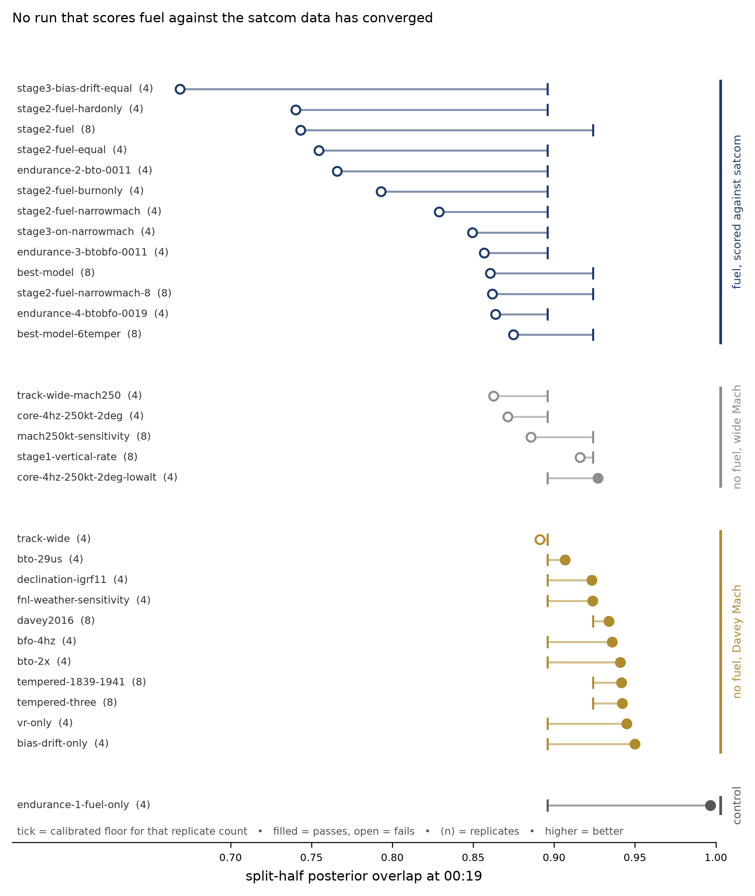

# Every full-scale run this project has done, and what separates the converged ones

`results/convergence-ledger.csv` is the harvest of every `convergence.json` in the tree — 33
archived sensitivity runs under `results/<name>/` plus the four live runs under `engine/runs/`,
37 case rows in all. For each it carries the split-half overlap, the replicate-count-calibrated
floor, log evidence, overlap against Davey Fig. 10.3, the replicate median span, the tightest
epoch and the full per-epoch ESS vector, alongside the configuration features that distinguish
the runs: fuel on or off, Mach range, number of tempered epochs, vertical-rate term, allocation.

Two things motivated building it. The first is that it is the sampler-validation evidence the
paper needs in one place. The second is a correction: this project's notes have twice recorded
that the full-scale wide-Mach fuel runs were lost. **They were not.** Their posterior grids
(`summary.json`) are gone, but `results/stage2_fuel/convergence.json` and its siblings survive
with the complete diagnostic record, so the numbers below are read from file rather than from
prose.

*Figure: `results/convergence-ledger.pdf`. Each row is one run; the dot is its split-half overlap
at 00:19 and the tick is the convergence floor calibrated for that run's replicate count. Filled
dots pass, open dots fail. Four runs are omitted as exact duplicates of a row already shown —
`davey2016_base` repeats `davey2016`, `stage2_fuel_narrowmach` repeats `reject_4_btobfo_0019`, and
`tempered_1839_1941` and `tempered_three` each appear both in the archive and under
`engine/runs/`. The two-seed `bto-only` cases are excluded because no floor is calibrated for two
replicates.*

## The result

Group the 33 runs that have a calibrated floor (four seeds or more) by whether fuel is carried in
the filter and scored against the satcom data, and by Mach prior:

| group | n | split-half range | passes |
|---|---|---|---|
| fuel, scored against satcom | 14 | 0.669 – **0.875** | **0 / 14** |
| no fuel, Davey Mach 0.73–0.84 | 14 | **0.891** – 0.950 | 13 / 14 |
| no fuel, wide Mach 0.41–0.86 | 5 | 0.863 – 0.927 | 1 / 5 |

**No run that scores fuel against the satcom data has ever passed split-half, and no run that
omits fuel at Davey's Mach prior has ever clearly failed.** The two ranges do not overlap: the
best fuel run is `best-model-6temper` at 0.875 and the worst *passing* fuel-free narrow-Mach run
is `bto_29us` at 0.907. The single narrow-Mach fuel-free failure is `track_wide` at 0.891 against
a 0.896 floor, which is a widened *track* prior, not a measurement-model change.

The control that makes this interpretable is `endurance_1_fuel_only`: fuel scored with no satcom
data at all. It returns 0.9965 and a Fig. 10.3 overlap of 0.005 — it is sampling the prior, and it
converges perfectly while doing so. **Fuel alone is not hard to sample. Fuel against the satcom
likelihood is.** The two constraints are close to orthogonal in the region the posterior occupies:
the arcs fix where the aircraft can be at each handshake, endurance fixes how fast it can have got
there, and their intersection is a thin set that the prior proposes into rarely.

Wide Mach behaves the same way and for the same reason — it widens the proposal relative to a
constraint that does not widen with it. Four of the five wide-Mach fuel-free runs fail, and the
one that passes, `core_4hz_250kt_2deg_lowalt`, pairs the wide Mach with a lowered altitude floor
that restores some of the affordable envelope.

## What this does to the diagnosis

The project has now spent two full-scale runs on tempering (00:11, then 20:41/21:41/22:41) on the
hypothesis that per-epoch ESS was the binding constraint. The ledger lets that hypothesis be
tested two ways, and the two answers differ in a way worth being precise about.

*Across* runs the two statistics are positively rank-associated: Spearman ρ = +0.60 (n = 34,
p < 0.001) between tightest-epoch ESS fraction and split-half overlap, and the association
survives within the fuel-free group (ρ = +0.47, p = 0.04) though not within the fuel group
(ρ = +0.36, p = 0.20). Taken alone that would support tempering. But it is confounded by exactly
the grouping above — a configuration that is hard to sample tends to be hard in both ways at once,
and fuel moves both statistics together.

The unconfounded test is the three matched interventions, where tempering was added and nothing
else changed:

| intervention | tightest ESS | split-half |
|---|---|---|
| `davey2016` → `tempered_1839_1941` | 1.02% → 4.60% (4.5×) | 0.9340 → 0.9416 (+0.008) |
| `tempered_1839_1941` → `tempered_three` | 4.60% → 6.04% (1.3×) | 0.9416 → 0.9422 (+0.001) |
| `best-model` → `best-model-6temper` | 2.50% → 5.67% (2.3×) | 0.8604 → 0.8748 (+0.014) |

**The elasticity is about +0.01 of split-half per 2–5× of ESS.** `best-model-6temper` needs
+0.05. On that slope it would take something like a 100× ESS gain, which 16-stage tempering of
every epoch cannot deliver — and the ESS gains are already large, 10.3× at 20:41. So the
cross-run association is real but not the lever: tempering fixes per-epoch ESS, and per-epoch ESS
is not what is short.

What the fuel runs have that the fuel-free runs do not is a weight contribution that is strongly
dependent on the whole trajectory rather than on the current state, so resampling cannot repair
it locally. That is a path-degeneracy signature, and the remedies for it are different from the
remedies for low ESS: more particles where the mass is, a better proposal, or a change to the
state so the fuel constraint becomes local.

The reallocation run now in flight tests the first of those. The endurance proposal is already the
second. The third — carrying a sufficient statistic for fuel burn in the state so the constraint
is evaluated incrementally rather than over the whole path — is not built, and is the structural
option if reallocation is not enough.

## Caveats on the numbers

1. **These are the engine's stored first-half-against-second-half values, not the mean over all
   balanced partitions.** `results/split-half-threshold.md` establishes that the single value can
   be off by up to 0.05 at four replicates. For the two runs where both are available the stored
   value reads low: `best-model` 0.8604 stored against 0.8798 over all 35 partitions, and
   `best-model-6temper` 0.8748 against 0.8869. Using the partition mean would move the fuel runs
   up by ~0.02 and would not close the 0.016 gap to the fuel-free range.
2. **The floors are those of `split-half-threshold.md`** — 0.896, 0.914 and 0.924 at four, six and
   eight replicates, the 5th percentile of the converged reference run's partition distribution.
   The `floor_applied` column records what the engine used at the time, which was a flat 0.90; the
   `floor_correct` column is the calibrated value and `passes` is recomputed against it. Exactly
   one verdict changes: `stage1_vertical_rate` scored 0.9161 at eight replicates, which passed
   the flat 0.90 and fails the calibrated 0.924. Every other run falls the same side of both.
3. **`code_revision` differs across the archive.** The early sensitivity runs predate the fuel
   model and some predate the tempered sampler, so this is a ledger of what was measured, not a
   matched factorial. The fuel/no-fuel contrast survives that because it holds across every
   revision in the table.
4. Two seeds give no calibrated floor, so the three two-seed rows are excluded from the tallies.
