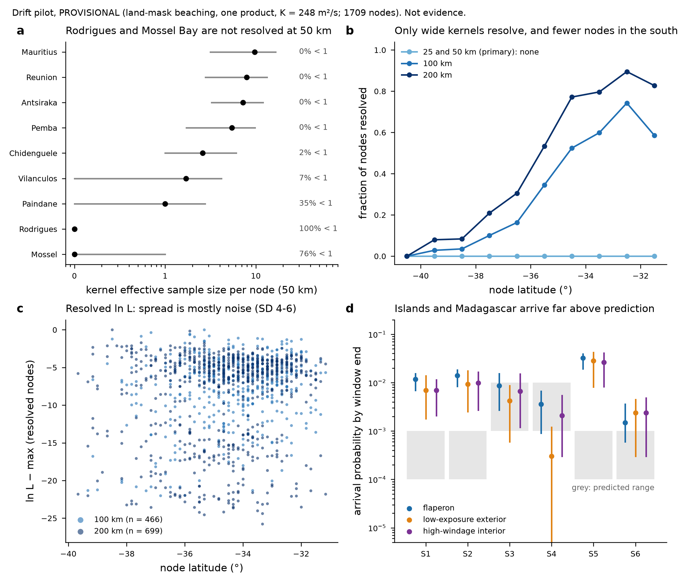

# Drift pilot: result, read against the prediction

Ocean drift module, 9 October 2026, ~09:30 UTC. **PILOT, PROVISIONAL, NOT EVIDENCE.**
- Beaching is read from GLORYS12 land-mask stranding.
- There is one ocean product (GLORYS12 + ERA5), one diffusivity (248 m²/s) and no ocean-error model.
- The extent is the no-exhaustion-prior map at 00:19:37 (295.66° prior).

**Run provenance (convention of ~16:40 UTC):**
- Drift config `pilot.toml`, base `config/davey2016.toml`, module commit `4311e7c`.
- The extent map is from core's `no-exhaustion-prior` run (`results/no-exhaustion-prior-summary.json`),
  prior track 295.66.
- The pilot uses no impact samples.

Nothing here is a statement about where MH370 is. The prediction it is read against was committed
before any trajectory was integrated (`results/debris-drift-pilot-prediction.md`, `050fc05`).

**Run.** `engine/hypotheses/debris-drift/pilot.toml` on `hypothesis/debris-drift` at `4311e7c`
(frozen test binary, sha256 prefix `3d8bd1848bf6f824`).
- 1,709 main-band nodes at 10 NM spacing.
- 3,334 particles per node per motion class, 17,093,418 trajectories in all.
- 8 Mar 2014 00:19:37 UTC to 30 Jun 2016, RK2 with a 6 h step.
- Run beside core's heavy job at 2 threads, in four interleaved chunks (node stride 4, offsets 0-3).
  Common random numbers are keyed by environment seed, not by node, so the chunks concatenate into
  the unchunked surface (`prepare/pilot/merge_chunks.py`).

**Outputs:**
- node table `results/debris-drift-pilot-nodes.csv` (sha256 prefix `f192ca10041e8f05`);
- numbers `results/debris-drift-pilot-numbers.json`;
- figure `results/debris-drift-pilot.png` / `.pdf`, made by `prepare/pilot/analyse.py` and
  `prepare/pilot/figures.py`.

## The three numbers

**1. Throughput: 1.72 × 10⁶ particle-steps per second at 2 threads.**
- That is 4.385 × 10¹⁰ steps in 25,445 s of chunk wall time, about 7.1 h.
- Per chunk it rose from 1.57 to 2.02 × 10⁶ as the machine's load fell.
- Predicted: about 1.5 × 10⁶ per thread. The measurement is about 0.86 × 10⁶ per thread on a loaded
  machine (load average 35-100 on 18 cores), so the per-thread prediction was optimistic by about
  1.7×.
- No trajectory ended in model error. 21.2% left the domain (15-120°E, 50-0°S); they stay in the denominator as not recovered.
  Where they left was not recorded by this run.

**2. Arrival probability by segment** (median over nodes, with the 5-95% range; per particle, by
30 Jun 2016):

| segment | predicted | flaperon | low-exposure exterior | high-windage interior |
|---|---|---|---|---|
| S1 Réunion | 10⁻⁴-10⁻³ | 1.2e-2 (6.9e-3-1.5e-2) | 6.9e-3 (1.8e-3-1.4e-2) | 6.9e-3 (2.1e-3-1.1e-2) |
| S2 Mauritius-Rodrigues | 10⁻⁴-10⁻³ | 1.4e-2 (8.4e-3-1.8e-2) | 9.3e-3 (2.5e-3-1.7e-2) | 9.9e-3 (2.7e-3-1.7e-2) |
| S3 southern Mozambique | 10⁻³-10⁻² | 8.7e-3 (2.7e-3-1.5e-2) | 4.2e-3 (6e-4-8.7e-3) | 6.6e-3 (1.2e-3-1.5e-2) |
| S4 South African south coast | 10⁻³-10⁻² | 3.6e-3 (9e-4-6.6e-3) | 3e-4 (0-1.2e-3) | 2.1e-3 (3e-4-5.4e-3) |
| S5 NE Madagascar | 10⁻⁴-10⁻³ | 3.2e-2 (2.0e-2-3.9e-2) | 2.8e-2 (8.1e-3-4.2e-2) | 2.6e-2 (8.2e-3-4.1e-2) |
| S6 Pemba | 10⁻⁴-10⁻³ | 1.5e-3 (6e-4-3.6e-3) | 2.4e-3 (3e-4-4.5e-3) | 2.4e-3 (3e-4-4.8e-3) |

- 26-34% of particles beach somewhere by the window end, inside or outside the segments.
- **The prediction was wrong in two directions:**
  - Réunion, Mauritius-Rodrigues and north-east Madagascar receive about 7-30× more than the top of
    the predicted range. The S5 box is large, and land-mask stranding on islands may be generous at
    1/12°; this is untested until the real coastline exists.
  - South Africa (S4) is inside the predicted range for the flaperon and high-windage classes, but
    below it for low-exposure parts (3e-4).
  - Southern Mozambique and Pemba are about as predicted.

**3. How fast relative likelihood changes with source separation: not measurable at the primary
bandwidth, and below the Monte Carlo noise at the wider ones.**
- **At 25 and 50 km, no node resolves the nine-find likelihood.** At 50 km, Rodrigues has zero
  kernel hits at all 1,709 nodes, and Mossel Bay has fewer than one effective particle at 76% of
  nodes (panel a). With every node unresolved there are no split halves, so the planned
  noise-corrected semivariogram cannot be formed at 50 km.
- At 100 km, 27% of nodes resolve; at 200 km, 41%. The resolved fraction rises northward, from about
  0.02-0.06 at 39-41°S to 0.71-0.88 at 31-33°S (panel b).
- Noise at those bandwidths comes from the variogram nugget. This rule is declared in
  `analyse.py`. The pilot wrote split halves only at 50 km, and `9475ae5` adds them at every
  bandwidth.
  - Monte Carlo SD of ln L at 10⁴ particles per node: **3.9 at 100 km, 5.9 at 200 km.** The 200 km
    figure is the larger because the wider kernel admits more marginal nodes.
  - With the noise removed, the semivariogram is 0.9 ± ~0.7 at 75-110 NM, 1.6 at 165 NM and 5.4 at
    250 NM (100 km). The ± is a lower bound, because pairs are not independent.
  - So the RMS change in ln L is under about 2 ln units out to about 165 NM, and about 3 units at
    250 NM. **A correlation length is not resolved at this depth.**
- The prediction had less than one ln unit over 50 NM and a correlation length over 51 NM. The pilot
  is consistent with that but does not test it.
- **Unresolved, and not a measurement.** Panel c's tens-of-units spread among resolved nodes is the
  noise above, not structure.

## What the pilot cannot say, and the scientific prediction

**The scientific prediction is untested.** "Drift reweights the shoulders and the north, not the mode;
the median moves less than 10 NM" needs a resolved surface over the reference mass. At 50 km the
resolved surface covers none of it. The northward rise in the resolved fraction is suggestive: a node
is unresolved when some find has no particle near it, and that happens more in the south. But it is
also a selection effect of the Monte Carlo depth, and it is **not reported as evidence**. It is
neither confirmation nor falsification.

**Corrections to the prediction note.** It cites Part II "p. iii" for the 32°S statement. The CSIRO
pages are footers, and that statement is on **p. iv** (`a691461`).

## What it means for production (step 4)

1. **Brute force does not reach Rodrigues.**
   - Zero hits in 5.7 M high-windage particles means the per-particle rate of a Rodrigues kernel hit
     is under about 5 × 10⁻⁷ (3/5.7 M, the 95% upper bound, averaged over nodes).
   - Ten hits per node would need more than about 2 × 10⁷ particles per node for that class alone.
   - Rodrigues is a single land cell on the GLORYS12 mask (Réunion 27, Mauritius 24), so the shared
     coastline (transport deliverable 6) matters here. Even a real coastline leaves an 18 × 8 km
     target.
   - **Importance splitting (`fbaad33`, `84b6f85`) is the module's answer:** unbiased, tested, and
     off by default. A diagnostic on 16 pilot nodes measures its gain for Rodrigues and Mossel Bay.
2. **Noise.**
   - Reaching an SD of 0.5 in ln L at 100 km by particle count alone would take about 6 × 10⁵
     particles per node, if variance scales as 1/N.
   - The surface changes by under about 2 ln units over 165 NM, so production spacing can be much
     coarser than 10 NM. That trades nodes for particles. The spacing comes from the diagnostic and
     the measured ocean error, not from this pilot's noise-dominated variogram.
3. **Measured ocean error** (ruling of ~07:00 UTC).
   - The GDP replay gives K_equiv of 3,400-10,300 m²/s against 248. Production adopts the shared
     `OceanErrorModel` (`[ocean_error]`, `84b6f85`).
   - That spreads each node's cloud far more than the pilot did. It should raise kernel hits for the
     rare finds and lower the noise. It also changes the likelihood surface, so the pilot's
     arrival numbers are not production numbers.

- Ocean drift
