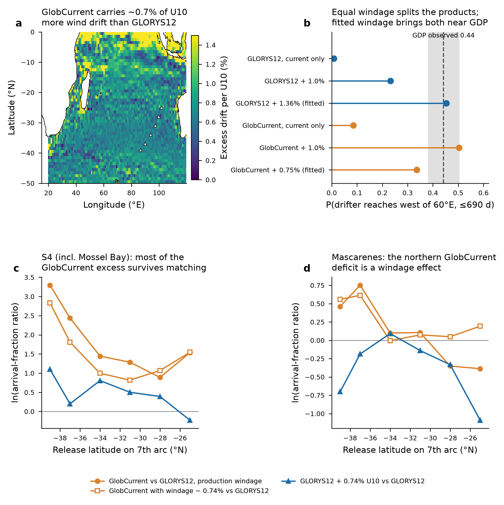

# Debris-drift ocean-model disagreement: independent audit (architecture)

10 Oct 2026, ~16:45 UTC. Auditor: MH370 Modular Architecture (independent sub-agent). Read-only on all code and on
the drift module's workspace; at most 2 threads, no heavy lock taken. Inputs: `hypothesis/debris-drift` @ 8ab90bf
(drift code and production configs), `core/ocean-transport` @ d51de4b (crates/ocean), `claude-science-sep29` @ c7db092
(coordination), local forcing under `/Users/pete/Downloads/mh370-ocean-data/` (read-only).

## Declared reductions and substitutions (read first)

- **Not the production likelihood.** Production scores 367 nodes with the full evidence model: ocean-error
  realisations, a K draw per environment, three object classes including the flaperon's 0.10 m/s leeway term,
  importance splitting, recovery-delay kernels and nine finds. My attribution ensembles use **6 nodes** (25, 28, 31,
  34, 37, 39 °S on the reference-289 arc), **two windage classes** (c_wind 1.2 % and 2.5 %, no constant-speed leeway,
  no wind-angle spread), **fixed K = 300 m²/s**, **no ocean-error model**, and **arrival fractions** in the G1 segment
  boxes in place of the find likelihood. All ensemble numbers below are therefore **provisional** indicators of
  mechanism, not reproductions of the production surface.
- **GDP period mismatch.** The forcing covers 2014-03-07 to 2017-01-31. The long-range (test 3ii) and Agulhas (3iii)
  drifter samples span 1995-2025; each drifter was re-released at its entry position on the same day of year in
  2014-15. This tests climatological pathways, not the drifters' own years. The SWIO replays (3i) use only
  2014-2016 drifters in their own years.
- **Small sample for South Africa.** Only **5** of 622 long-range drifters reached 20-35 °E within their censored
  lifetime; that statistic cannot discriminate the products (stated below with its interval).
- **CSIRO reports not read.** The ATSB copies of Griffin, Oke & Jones (2017, Part II, EP172633) and Griffin & Oke
  (2017, Part III, EP174155) timed out from this sandbox, and the CSIRO repository refused the automated request
  (HTTP 403). I give **no** printed-page citations from them; the page numbers in the drift configs (Part II
  pp. 10, 13, 17; Part III p. 6) are the drift module's and are unverified by this audit.
- **Production node diagnostics not read.** The drift workspace's `runs/.../nodes.csv` was not visible from this
  sandbox. The production numbers I quote (correlation −0.09, SD of difference 3.33, n_eff ratios) are from the
  drift module's coordination entries.

## Verdict

**Not a bug (a). Mostly a modelling-choice artefact (c), with a smaller real product difference (b) left over.**

1. **Ingestion and integration are correct for both products.** The converted grids match the producers' netCDF
   to ≤2.4×10⁻⁷ m/s, with identical land masks. The Rust integrator agrees with an independent Python
   re-implementation that reads the netCDF directly: ≤0.1 m at 30 d, ≤3.4 m at 60 d, ≤52 m at 90 d and ≤0.60 km at
   120 d, the worst of 27 deterministic particles at 3 nodes, for each product.
2. **The two systems are given the same windage, but the products do not carry the same wind-driven drift.**
   GlobCurrent's 0 m total current carries **0.74 % of U10 more** near-downwind drift than GLORYS12 at 0.494 m (gridded
   median, rotated 12° to the left of downwind). That is **≈0.45 of the WAVERYS surface Stokes drift** (1.41 % of
   U10). The GlobCurrent 0 m Ekman term is fitted to Argo surface displacements, whose residual includes Stokes drift
   (QUID p. 9). Fitted to undrogued 2014-2016 drifters, GLORYS12 needs **1.36 %** windage and GlobCurrent needs
   **0.75 %**. Production applies identical c_wind priors to both (production-*.toml:78, 88, 97). GlobCurrent particles
   therefore drift with about 0.6-0.75 % of U10 more wind. In effect, GlobCurrent's Ekman (plus Stokes-like) content
   **is partly double-counted** against the CSIRO-system leeway: yes to the question asked, by about half the
   surface Stokes drift.
3. **Long-range transit is controlled by this term.** Of 622 GDP drifters entering 30-40 °S, 80-100 °E, 44 %
   (95 % CI 38-50 %) reached west of 60 °E within 690 d. With currents alone the forecasts are 0.8 % (GLORYS12) and
   8.5 % (GlobCurrent). With equal 1 % windage they are 23 % and 50 %, so the products split. With each product's
   fitted windage they are 45 % and 34 %, so both land near the observation and the sign of the gap reverses.
4. **Attribution (provisional ensembles).** GlobCurrent delivers fewer arrivals to the Mascarenes from the northern
   nodes (ln ratio −0.35 to −0.39 at 25-28 °S). This deficit is **reproduced by adding 0.74 % U10 to GLORYS12** and
   **disappears at matched windage** (+0.05 to +0.19), so it is an artefact. Its general excess of African
   beachings is mostly an artefact too. The **South African south-coast (S4, Mossel Bay)** excess is **mostly not**
   windage: the total ln ratio is +0.9 to +3.3, of which windage-matched GlobCurrent keeps +0.8 to +2.8, largest at
   37-39 °S. That residual is a real difference between the products, of the size and latitude pattern drift
   reports.
5. **Where the residual arises is not settled.** Drifters entering the Agulhas source region (30-36 °S, 30-45 °E)
   reach the Mossel Bay coastal box at similar rates under both products: 17-23 % against an observed 25 %
   (95 % CI 20.5-29.7 %). So, for drifter-like objects, the leg from the Agulhas source region to the coast does not
   separate the products. This does **not** support the drift note's reading that the products "differ mainly in
   how they carry debris through the Agulhas system to the South African coast". The residual is more likely
   upstream: how much debris reaches the Agulhas source region, and when, by the 30 Jun 2016 window end. It was not
   decomposed for the debris classes.

**Skill.** For undrogued SWIO drifters, with each product given its fitted windage, GlobCurrent's median separation
is smaller by 22, 22 and 49 km at 30, 60 and 90 d. That is 5-8 %, and only the 30 d and 90 d intervals exclude zero.
On drogued (15 m) drifters GLORYS12 is better at 60-90 d (by 56 km and 84 km). The two products are of comparable
skill. Nothing here supports skill weights.

## Findings

| id | severity | file:line | evidence | fix |
|---|---|---|---|---|
| F1 | **High** | `hypotheses/debris-drift/production-globcurrent.toml:78,88,97` (identical to `production-glorys12.toml:78,88,97`); `crates/ocean/src/integrate.rs:285-303` adds `c_wind·R·U10` whatever the current already contains | GlobCurrent − GLORYS12 = 0.74 % U10, 12° left of downwind (gridded, 2014-03 to 2017-01). Undrogued windage fit: 1.36 % (GLORYS12), 0.75 % (GlobCurrent). Long-range test: equal windage splits the products (23 % vs 50 %), fitted windage reconciles them (45 % vs 34 %; observed 44 %) | Make the leeway product-relative. For GlobCurrent, c_wind_GC = c_wind_CSIRO − Δc with Δc ≈ 0.6-0.75 % (regional range 0.41-0.80 %), declared and marginalised. Or run both products in one explicit-Stokes system with a refitted residual leeway. Config-gated, default off for the reproduction |
| F2 | Medium | `crates/ocean/src/integrate.rs:218-265` (`check`) | Guards against counting Stokes twice only when `a_stokes ≠ 0`. With `leeway_absorbs_stokes = true` (`production-*.toml:33`) there is no guard on a Stokes- or windage-bearing current (`products.rs:321` declares GlobCurrent's Stokes content `Partial`) | Extend the check: if the current's Stokes content is `Partial`/`Unknown` and `c_wind > 0` under `leeway_absorbs_stokes`, require an explicit product-relative leeway declaration (core request to ocean transport) |
| F3 | Medium | `production-glorys12.toml:61` vs `production-globcurrent.toml:62` | The ocean-error calibration used GLORYS12 + 1 % ERA5 and GlobCurrent + 0 % wind. Transport's own replay found +1 % worsens GlobCurrent (`results/ocean-transport-error-gdp-replay.md:83-84`) and left the per-product refit to drift (`:88`). The asymmetry was known upstream but not carried into the object leeway | Close transport's item 5: one fitted (a_stokes, c_wind) per product, recorded in both configs |
| F4 | Medium (interpretation) | `coordination/OCEAN_DRIFT.md`, entry ~12:35 UTC 10 Oct | "differ mainly in how they carry debris through the Agulhas system" is not supported. The Agulhas-source-to-coast leg agrees between products (17-23 %); the northern discrepancy is a windage artefact | Revise the note after the F1 smoke test |
| F5 | Low (reporting) | drift entries ~10:45 and ~12:35 UTC | On its own figures (node SD 1.98, split-half noise 1.42), GLORYS12's node-level signal variance is about 1.0× its noise variance (the "about 1.9×" quoted is the total-to-noise ratio). A correlation across all nodes is therefore strongly attenuated whatever the models do. The SD of the difference (3.33) against the combined noise (√(1.42²+0.63²) ≈ 1.55) is the informative statistic | Report the SD of the difference against noise, by latitude band. Drop the bare correlation from the paper |
| F6 | Low | `transport.rs:256-261`; GlobCurrent grid 15.125-119.875 °E, −49.875 to −0.125 °N against domain `[15,120,−50,0]` (`production-*.toml:30`) | A 0.125° rim (~14 km) inside the domain has no GlobCurrent value. Particles there are scored `LeftDomain` | Clip the domain to the common extent of both products (inside the 0.125° rim) |
| F7 | Low | `field.rs:283-315` land renormalisation; `integrate.rs:383-389` 25 km snap | The coarser 0.25° GlobCurrent mask ends more model tracks at the mask in coast-free replays (18 % vs 15 % by 180 d, Agulhas test). In production the GSHHG snap converts most of these to beachings. GlobCurrent's production model-error fraction was not visible to me | Report the GlobCurrent model-error fraction beside GLORYS12's (0 reported) |
| F8 | Info (verified) | `prepare/netcdf_to_grid.py:39-48,66-91`; manifests | Variables: GLORYS12 uo/vo at 0.494 m (file `z_min` 0.49402499), int16 × 6.1037×10⁻⁴, fill −32767. GlobCurrent uo/vo at depth 0 m, "geostrophic + depth Ekman + tide", int16 × 0.001, fill 32767. Units m/s, east/north. Latitude ascending after decode; longitude 15-120 °E, no wrap. Time "hours since 1950-01-01", Gregorian calendar, labels 00:00 UTC, placed at +12 h for both (PROVISIONAL, but the same for both) | none |

## Test 2: independent re-implementation

Three nodes (101.88 °E 25 °S; 96.34 °E 32 °S; 88.47 °E 38 °S), 3×3 particles at ±0.05° each, released
2014-03-08 00:19:37 UTC. Currents only: no diffusion, no windage, no ocean error, no coast. RK2 with a 6 h step. The
Rust side runs `ocean::integrate` through the audit harness (`drift-model-audit-harness-audit_tracks.rs`); the
Python side is `drift-model-audit-independent-integrator.py` and reads the netCDF directly.

| lead (d) | max Rust − Python, both products (km) | median RK4-1 h − RK2-6 h (km), GLORYS12 / GlobCurrent, by node |
|---|---|---|
| 30 | 0.0001 | 0.20, 0.11, 0.21 / 0.43, 0.09, 0.03 |
| 60 | 0.0034 | 1.0, 3.2, 0.5 / 0.6, 0.3, 0.1 |
| 90 | 0.052 | 5.6, 17.7, 0.6 / 2.6, 1.8, 0.3 |
| 120 | 0.60 | 83, 20, 1.4 / 82, 12, 0.3 |

The Rust − Python column is float32 rounding amplified by chaotic advection. The RK4 − RK2 column is the 6 h step's
truncation error. By 120 d it is comparable to diffusive spread at K = 300 m²/s (√(4Kt) ≈ 110 km), and it is the
same for both products. Neither column can explain the disagreement.

## Test 3: physical validation with GDP drifters

**(o) Windage content.** These are daily-centred (24 h) drifter velocities, 2014-03-09 to 2017-01-29, 15-120 °E,
50-0 °S. The model is drifter − product = α·U10 (complex least squares, no intercept). "Angle" is clockwise from
downwind; a negative value means to the left.

| region | state | n days / drifters | GLORYS12 α (%), angle | GlobCurrent α (%), angle |
|---|---|---|---|---|
| all | undrogued | 90,440 / 383 | 1.36, −2° | 0.75, +6° |
| SWIO 20-60 °E 15-40 °S | undrogued | 19,051 / 132 | 1.63, −2° | 1.09, +4° |
| 60-110 °E 20-40 °S | undrogued | 33,334 / 150 | 1.09, −1° | 0.49, +12° |
| Agulhas 20-35 °E 30-40 °S | undrogued | 2,600 / 44 | 1.28, −9° | 0.87, +9° |
| all | drogued (15 m) | 61,080 / 445 | 0.12, 158° | 0.78, 169° (0 m is faster downwind than 15 m water) |

Gridded GlobCurrent − GLORYS12 on U10 (1° grid, every 5 d): 0.74 % (all), 0.80 % (trades, 10-25 °S), 0.71 %
(westerlies, 35-45 °S). Wind explains 7 % of the variance of the difference overall and 20 % in the westerlies;
the rest is mesoscale and geostrophic. Band-mean zonal current: South Equatorial Current (12-20 °S, 55-95 °E)
−13.8 cm/s (GLORYS12) against −19.0 cm/s (GlobCurrent); 35-40 °S, 45-95 °E +3.8 against +6.0 cm/s. Both
differences match the sign and size of the excess wind drift.

**(i) SWIO replays, 30-90 d.** Starts every 10 d per drifter in 15-40 °S, 20-60 °E, 2014-03 to 2016-10. Undrogued:
1,706 / 1,560 / 1,424 segments from 108 / 97 / 90 drifters at 30 / 60 / 90 d. Drogued: 624 / 576 / 536 segments.
Values are median separations in km.

| composition | undrogued 30 / 60 / 90 d | drogued 30 / 60 / 90 d |
|---|---|---|
| GLORYS12 current only | 317 / 521 / 664 | 290 / 449 / 608 |
| GLORYS12 + 1.36 % (fitted) | 273 / 459 / 625 | 338 / 588 / 768 |
| GlobCurrent current only | 258 / 458 / 600 | 274 / 499 / 691 |
| GlobCurrent + 0.75 % (fitted) | 249 / 439 / 580 | 328 / 583 / 736 |
| GLORYS12 + 1 % / GlobCurrent + 1 % | 296 / 482 / 640 vs 245 / 449 / 577 | — |

Paired differences in the median, bootstrapped over drifters (2,000 resamples):

| comparison | 30 d | 60 d | 90 d |
|---|---|---|---|
| GlobCurrent + 0.75 % vs GLORYS12 + 1.36 % (undrogued) | −22.7 km [−43.1, −6.3] | −22.2 [−53.3, +10.4] | −48.7 [−85.2, −19.2] |
| equal 1 % on both (undrogued) | −49.9 [−63.7, −32.0] | −35.5 [−65.6, −5.0] | −60.6 [−99.5, −28.2] |
| current only, drogued | −20.1 [−58.5, +14.0] | +56.3 [−5.9, +110.6] | +83.9 [+15.3, +144.4] |

**(ii) Long-range transit.** 622 drifters entered 30-40 °S, 80-100 °E (1995-2025; 410 undrogued at entry). The
statistic is the Kaplan-Meier probability of reaching the target within 690 d, censored at each drifter's
lifetime. Simulated tracks are censored identically.

| composition | reach west of 60 °E | reach 20-35 °E, 25-36 °S |
|---|---|---|
| **GDP observed** | **0.442 [0.381, 0.503]** (127 events) | **0.025 [0.006, 0.047]** (5 events) |
| GLORYS12 current only | 0.008 | 0.000 |
| GLORYS12 + 1.0 % | 0.232 | 0.024 |
| GLORYS12 + 1.36 % (fitted) | 0.453 | 0.012 |
| GlobCurrent current only | 0.085 | 0.000 |
| GlobCurrent + 1.0 % | 0.504 | 0.059 |
| GlobCurrent + 0.75 % (fitted) | 0.336 | 0.017 |

The South Africa column rests on 5 observed events. Its interval contains every windage-bearing composition except,
marginally, GlobCurrent + 1 %, so **it cannot rank the products**. Ranking would need roughly 10× more drifters, or
the full 1993-present forcing.

**(iii) Agulhas source region to the Mossel Bay coast.** 369 drifters entered 30-36 °S, 30-45 °E (84 events). The
statistic is the probability of reaching the box 20-26.5 °E, 34.9-33.6 °S (S4) within 180 d. Observed: 0.250
[0.205, 0.297]. GLORYS12: 0.214 (current only), 0.226 (+1 %), 0.176 (+1.36 %). GlobCurrent: 0.170 (current only),
0.191 (+1 %), 0.176 (+0.75 %). The products agree on this leg, and both sit slightly below the observation.

## Attribution ensembles (provisional; see declared reductions)

Four variants, each with 8,000 particles per node per class (96,000 per variant): GLORYS12 production windage;
GlobCurrent production windage; GlobCurrent with c_wind − 0.74 % ("matched"); GLORYS12 with c_wind + 0.74 %.
Settings: ERA5 10 m wind, GSHHG-f coast with 25 km snap, release 2014-03-08 00:19:37 UTC, end 2016-07-01, 6 h RK2.
Pooled S4 arrival fraction, by node latitude 39 / 37 / 34 / 31 / 28 / 25 °S:

- GLORYS12 (production): 0.0000 / 0.0002 / 0.0017 / 0.0036 / 0.0021 / 0.0012
- GlobCurrent (production): 0.0008 / 0.0032 / 0.0072 / 0.0132 / 0.0051 / 0.0056
- GlobCurrent, matched windage: 0.0005 / 0.0017 / 0.0046 / 0.0082 / 0.0061 / 0.0057
- GLORYS12 + 0.74 %: 0.0001 / 0.0003 / 0.0038 / 0.0060 / 0.0031 / 0.0009

*Figure footnote.* (a) Magnitude of the complex regression of GlobCurrent − GLORYS12 surface current on ERA5 U10.
Grid 1°, sampled every 5 d, 2014-03-12 to 2017-01-26; the 24 h wind window is centred on each sample. GLORYS12V1
uo/vo at 0.494 m daily mean; GlobCurrent MULTIOBS_GLO_PHY_MYNRT_015_003 v202411 P1D uo/vo at 0 m (total =
geostrophic + Ekman + tide). Both daily means are placed at label + 12 h (provisional). Values near the equator
(>1.5 %, saturated) reflect the Ekman model's equatorial singularity. Triangles: the six ensemble nodes.
(b) Kaplan-Meier probability that a GDP drifter entering 30-40 °S, 80-100 °E (n = 622; 1995-2025; drogued and
undrogued pooled) reaches west of 60 °E within 690 d. Simulations re-release each drifter at its entry point on the
same day of year in 2014-15: deterministic, no diffusion, no coast, censored at each drifter's lifetime. Grey band:
bootstrap 95 % CI of the observation (1,000 resamples). "Fitted" windage is the undrogued 2014-2016 regression of
panel (o) and is in-sample for that period. (c, d) ln ratio of the arrival fraction against GLORYS12 with
production windage, by release latitude. Provisional ensembles: 6 nodes on the reference-289 arc, 16,000 particles
per node per variant (two classes, c_wind 1.2 % and 2.5 %), K = 300 m²/s, no ocean error, no flaperon constant
leeway, GSHHG-f coast (25 km snap), 2014-03-08 to 2016-07-01; continuity +0.5 count. S4 = 20-26.5 °E,
34.9-33.6 °S (G1 segment 4, contains Mossel Bay); Mascarenes = beachings in 55-64 °E, 22-19 °S. Not the production
likelihood: no recovery kernels, no timing, no importance splitting.

## Literature, graded

Grades: A = primary source, read in this audit, page verified; B = peer-reviewed, abstract or metadata read, not the
full text; C = known to the auditor, not re-read here (cite only after reading).

- **A.** CLS for the Copernicus Marine Service, *QUID for MOB TAC products MULTIOBS_GLO_PHY_MYNRT_015_003*,
  CMEMS-MOB-QUID-015-003, issue 2.0, 3 May 2024.
  - p. 9: the 0 m Ekman parameters are fitted to YoMaHa'07 Argo surface displacements, and the 15 m parameters to
    drogued SVP drifters only. Stokes drift is treated as part of the residual, not removed.
  - pp. 6-7: a 100 km Bessel filter is applied to the geostrophic current, and the first ocean point along the coast
    is masked for wind stress.
  - p. 17: biases correlate with wind-stress and Stokes patterns.
  - p. 20: the validation observations contain an uncorrected wind-slippage signal.
- **A (project primary).** `results/ocean-transport-error-gdp-replay.md` lines 24, 83-84 and 88: the asymmetric
  1 %/0 % windage in the error calibration, the finding that adding 1 % worsens GlobCurrent, and the per-product
  refit left to drift.
- **B.** Dobler, D. et al. (2019), Large impact of Stokes drift on the fate of surface floating debris in the South
  Indian Basin, *Marine Pollution Bulletin* 148, 202-209. Adding surface Stokes drift radically changes where South
  Indian Ocean particles go. This is consistent with test (ii): the long-range westward pathway is set by the
  wind- and wave-correlated surface drift, which is exactly the term on which the products differ.
- **C (not re-read).** Lellouche, J.-M. et al. (2021), GLORYS12 reanalysis, *Front. Earth Sci.* 9, 698876. Rio, M.-H.
  et al. (2014), *GRL* 41, 8918-8925. Mulet, S. et al. (2021), *Ocean Sci.* 17, 789-808 (cited by the QUID for the
  Ekman method).
- **Not retrieved.** Griffin, Oke & Jones (2017) Part II and Griffin & Oke (2017) Part III; see the declared
  reductions. What CSIRO concluded about model dependence is **not stated here** for that reason.

## Recommendation for the paper

1. **Do not publish the current pair at equal weight.** As configured, the GlobCurrent arm carries about 0.6-0.75 % of
   U10 more wind drift than the GLORYS12 arm. That is a composition inconsistency, not an ocean-model alternative.
2. **Then use equal prior weight.** Once the leeway is product-relative (F1), equal weight between GLORYS12 and
   GlobCurrent is defensible. Their skill on SWIO drifters is comparable: GlobCurrent is 5-8 % better on undrogued
   drifters and GLORYS12 better on drogued ones. With fitted windage, both reproduce the observed long-range
   westward transit within or near its interval. Skill weighting is not supported: the differences are small, the
   long-range test is period-mismatched, and the Mossel Bay statistic rests on 5 events.
3. **A third system is useful but not required.** The residual S4 difference (+0.8 to +2.8 ln at 34-39 °S) is real
   and drives the southern half of the surface. Report it as ocean-model uncertainty. The best low-cost check is the
   explicit-Stokes system on both products (GLORYS12 + WAVERYS with a refitted residual leeway; GlobCurrent at 15 m
   + WAVERYS), because it removes the product-dependent wind-content question by construction. A third assimilating
   model needs coverage through mid-2016 and a compatible licence; none is on disk (BRAN is held on licence; OSCAR is
   comparison-only by Pete's decision).
4. **Option B (186-node extension, ~9 h): hold** until the smoke test below has run. Extending the current
   GlobCurrent configuration would extend the artefact.

**Smoke test that settles F1** (for drift; about 2 h per arm at 12 threads, one chunk). Re-run GlobCurrent chunk 0
(92 nodes) with every class's c_wind reduced by Δc = 0.60 % and, separately, by 0.75 %; the flaperon's constant
leeway stays. Pass criterion: north of 30 °S, the SD of the GLORYS12 − GlobCurrent node ln L difference falls to
≤ 2× the combined split-half noise (~3.1), and the "GLORYS12 4-8 higher north of 25 °S" band disappears.
Expected (provisional): the northern discrepancy goes, and a GlobCurrent excess at 37-41 °S of a few ln units
remains. Record that remainder as the real product difference.

## Comparison with the drift module's interpretation (read after forming the findings above)

- Agree: there is no evidence of an implementation defect. The windage classes, Stokes treatment and wind field are
  identical across products (drift entry ~15:55 UTC); that identity is the problem (F1). The 16:05 entry's pattern
  (agreement at 27-37 °S, GlobCurrent higher at 38-41 °S, GLORYS12 higher north of 25 °S) matches the attribution
  here: north = windage artefact, south = residual product difference plus part windage.
- Disagree: "differ mainly in how they carry debris through the Agulhas system" (F4). Also "the paper reports both
  models and the equal-weight combination" as currently configured (recommendation 1).

## Not checked

- The production likelihood itself: timing kernels, recovery delay, splitting weights, the n_eff arithmetic, the
  composer.
- GlobCurrent's production model-error fraction.
- Hourly GlobCurrent (PT1H); the 15 m GlobCurrent level.
- The explicit-Stokes compositions.
- Sensitivity to K and to the ocean-error length scale.
- WAVERYS ingestion beyond its time and extent.
- ERA5 ingestion against its source zarr: only the converted grid was used.
- The daily-mean time-placement convention (a shared provisional choice).
- The flaperon class's constant-speed leeway with wind-angle spread.
- Beaching detail on the GlobCurrent 0.25° mask near the S4 coast.
- CSIRO Parts II/III.

## Files

`drift-model-audit-numbers.json`; CSVs `drift-model-audit-{crossimpl,windage-fit,gdp-swio-replay,gdp-swio-paired,
gdp-longrange,gdp-agulhas,ensemble-arrivals,attribution,upstream-supply,band-means}.csv`; harness sources
`drift-model-audit-harness-audit_{tracks,fates}.rs` (untracked examples against `mh370-ocean` @ 8ab90bf; not part of
the crate); `drift-model-audit-independent-integrator.py`; `drift-model-audit-figure.png`.
