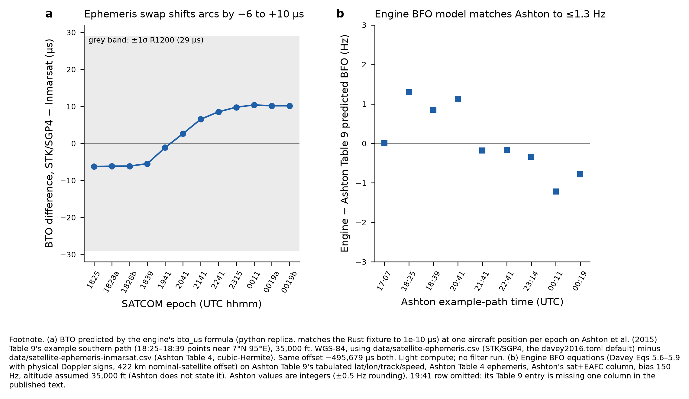

# Independent audit of the core filter: satellite measurement model, flight dynamics, sampler

Auditor: architecture sub-agent (independent of Pete's own auditor). 9 October 2026.
Brief: `threads/master-prompts/filter-audit.md`. Repository state audited: branch
`claude-science-sep29`, head `67769ef`. Read-only: no code or config was changed. No filter was run.
Light compute only: a Python replica of the satcom equations, checked against the Rust
fixture to 1e-10, a 1-D toy SMC, and the `mh370-geo`, `mh370-satcom` and `mh370-flight` unit
tests run with `-j 2`.

The findings below were formed before reading `results/*.md` or `coordination/*.md`. The comparison
with the project's own notes is in §6.

**Scope reductions, declared.**
1. The ERA5 and IGRF grids (`data/*.bin`) are not in git and were not loaded, so the effects of
   the weather and declination substitutions are unquantified.
2. The STK/SGP4 workbook is not in git, so the BTO calibration could not be redone with it.
3. The MH371 truth track (ACARS) is not in git, so the calibration-flight reproduction is limited
   to Ashton's KLIA tarmac data.
4. The `mh370` crate's own tests were not compiled.
5. The fuel tests could not run, because `fuel-tables.json` is not in git (by design).

Every effect on the posterior latitude quoted below is **unmeasured**. Section 5 specifies the
smoke tests that would measure it.

**Sources and grades.**
- Davey et al. 2016: primary for the model it reproduces; CC BY-NC 4.0. Cited by printed page
  (printed = PDF − 13, read from the running headers).
- Ashton et al. 2015, *J. Navigation* 68(1) 1–22, DOI **10.1017/S037346331400068X**: primary
  (Inmarsat). Cited by journal page. The DOI in the delegation to this auditor
  (10.1017/S0373463314000708) resolves to a different *J. Navigation* paper (ship trajectory
  planning by ant-colony optimisation). See F8.
- Holland, arXiv:1702.02432: primary (DST Group). Cited by arXiv page.

## 1. Findings

| id | severity | file:line | evidence | proposed fix |
|---|---|---|---|---|
| F1 | **High** (extensions only; `davey2016.toml` unaffected) | `crates/mh370/src/filter.rs:718-719`, `:757`, `:765`, `:783` | In annealed (tempered) epochs, `before_step` is captured once per epoch and indexed by the *current* population index `anc` at every stage. After the first stage that resamples, `particles[c]` descends from `parents₁[c]`, but the move re-simulates from `before_step[anc]`, which is another particle's pre-epoch history. The Metropolis ratio `β(d_new − d_old)` scores only the epoch's likelihood. So the swap silently replaces a history's earlier weight and prior with another's. Toy reproduction (R8; 1-D linear-Gaussian, 16 stages, N = 4000, 200 replicates): when the pre-epoch weights are non-uniform, E[x₀\|y] is biased by −0.055 (z = −15.9) as coded, against −0.001 (z = −0.3) with the ancestry fixed. When the pre-epoch weights are uniform the bias is not significant (z = 1.6). Affected configs: `config/sensitivity/{tempered-three, tempered-1839-1941, best-model-6temper, realloc-bfo4hz, 6temper-realloc, _6temper-bfo4hz, _32stage, best-model, bfo4hz-fixed, no-exhaustion-prior}.toml` (all with `temper_epochs`). | Carry `ancestry: Vec<usize>` (identity at epoch start). On each stage resample set `ancestry = parents.map(\|a\| ancestry[a])`, then use `before_step[ancestry[anc]]` and, when a move is accepted, `ancestry[c] = ancestry[anc]` (the candidate shares the same history). Add a unit test on `CalmAir` comparing a tempered and an untempered run's evidence and posterior mean within Monte Carlo error. Mark all tempered results **provisional** until they are re-run. The one-shot rejuvenation at `:949` is correctly indexed. |
| F2 | **Medium** (Davey fidelity, BTO self-consistency) | `config/davey2016.toml:25`; `crates/satcom/src/lib.rs:24` | The reproduction config uses `data/satellite-ephemeris.csv` (the STK/SGP4 workbook). The −495,679 µs bias it applies was derived by Inmarsat with Inmarsat's own states (Ashton p. 5, Tables 2–3 pp. 5–6), and the satellite + EAFC terms are also Inmarsat-derived. Against Ashton Table 4 (p. 10) the two ephemerides differ by 1.9–3.9 km. The resulting BTO difference is **not** a near-constant offset: it runs from −6.3 µs (18:25) through −1.1 µs (19:41) to +10.4 µs (00:11), a 16.7 µs swing (R5, Fig. 1a), with BFO differences of 0.4–1.4 Hz. Davey does not name his ephemeris (p. 25: the satellite "moves in a known way"); his BTO model cites Ashton [2]. | Either (a) point the Davey reproduction at `satellite-ephemeris-inmarsat.csv`, or (b) recalibrate the BTO offset on the 17 KLIA tarmac BTOs (Ashton Table 3, p. 6) using the SGP4 states at 16:00–16:30, which the workbook holds, and adopt whichever ephemeris leaves the smaller tarmac residual. Run the smoke test S1. |
| F3 | Medium (fidelity claim) | `crates/flight/src/lib.rs:295-296`, `:857`; `config/davey2016.toml:3` | Manoeuvres are integrated in 5 s steps against Davey's 1 s (p. 59). LNAV uses the same 10 s cruise step as the other modes, against Davey's 60 s (p. 45). LNAV is a great-circle azimuth-rate integration (`:897-901`), not Vincenty (p. 43). The config header says the dynamics "are the published values compiled into crates/flight", which is true of the parameters but not of the steps. The effect is probably small: a 0.585°/s turn gives 2.9° per step with a midpoint update. It is unmeasured. | Add a `[dynamics] manoeuvre_step_s` override; run S2 at 1 s. Correct the header comment in a new config, since `davey2016.toml` must stay byte-reproducible. |
| F4 | Low–Medium (extension, default off) | `crates/mh370/src/terminal.rs:173`; `crates/mh370/src/filter.rs:639-641` | With `bfo_bias.drift_hz2_per_s` set, the cruise filter inflates the bias variance between BFO epochs. The end-of-flight stage takes the 00:11 posterior bias unchanged into the 00:19 likelihood, so the 510 s gap from 00:11 to 00:19 gets no drift. Missing variance: 6.8 Hz² at 0.01334 Hz²/s (`stage3-bias-drift*.toml`, `bias-drift-only.toml`, `stage3-on-narrowmach.toml`); 27.2 Hz² at 0.05336 (`stage3-bias-drift-wide.toml`). The two 00:19 bursts are 8 s apart; the drift between them is negligible. | Apply `bias.drift(t_00:19 − t_00:11, rate)` before `FinalBfo::log_likelihood`, and between the two contacts. Record the rate in `terminal.json`. |
| F5 | Low (documented Davey inconsistency) | `data/satcom-observations.csv:12` | The R600 BTO σ is 63 µs, following Davey Table 10.1 (p. 88). Davey p. 27 gives 62 µs. | Keep 63 (Table 10.1 is what was run); add a note citing both pages. |
| F6 | Info (engine correct; Davey misprint confirmed) | `crates/satcom/src/lib.rs:20-24` | Davey Eq. 5.3 as printed (p. 25), with T_nom = 499,962 and T_channel = −4,283 (p. 26), predicts the KLIA tarmac BTO about 8,566 µs low (6,233 against 14,791 µs measured; R1). The engine's T − 495,679 reproduces Ashton's path lengths and delays to within 1 km and 1 µs, with residuals of −7.9, +10.5 and +1.4 µs at 16:00, 16:10 and 16:30. Holland (p. 3, footnote 4) notes that Davey's Doppler sign convention is opposite to the physical one. The engine uses the physical one, which reproduces Ashton (R2–R3). | None. Cite R1–R3 in the paper's methods. |
| F7 | Low (provenance policy) | `results/davey-2016.pdf` (commit `7c2c03b`); `engine/.sources/davey-2016/README.md:15` | The README says the PDF is "deliberately gitignored and is not in the repository", but the identical file (sha256 37554ca5…91b2, 6,898,866 bytes) is committed under `results/` in the public repo. CC BY-NC 4.0 permits non-commercial redistribution with attribution, so this is a policy inconsistency rather than an unauthorised copy. | Architecture decision: either keep it and amend the README (adding the attribution and licence notice beside the file), or remove it from the tip (history keeps it). |
| F8 | Low (citation) | delegation text for this audit (the master prompt `threads/master-prompts/filter-audit.md:34` names Ashton without a DOI) | 10.1017/S0373463314000708 is a different paper. The correct DOI is 10.1017/S037346331400068X (Cambridge Core; also cited as ref. [1] in Holland). | Correct it wherever the delegation template lives. Grep before publication. |
| F9 | Low (test hygiene) | `crates/flight/src/fuel.rs:350`; `crates/flight/src/lib.rs:1387` | On a clean clone, `cargo test -p mh370-flight` gives 12 passed and 13 failed. Every failure is a panic reading the untracked `data/fuel-tables.json`. A reviewer cannot tell these from regressions. | Skip with a message, or `#[ignore]`, when the tables are absent. |
| F10 | Low (extension consistency) | `data/satcom-observations.csv:12-13`; `:10` | The 00:19 satellite + EAFC term is a flat −37.8 Hz for both bursts (the other rows are interpolated to 1e-12). Ashton Table 9 (p. 20) gives −38 at 00:19:29. The 23:15:02 value of −31.98 Hz differs by 1.0 Hz from Ashton's −33 at 23:14:00, more than the 62 s difference explains (about 0.1 Hz). Only cruise BFOs and the end-of-flight stage are affected; the size is at most 1 Hz against σ = 7 Hz. Provenance ("ATSB tables") was not independently checked. | Record the ATSB table and row for each value. Interpolate 00:19:29 and 00:19:37 from the same table. |
| F11 | Low (diagnostic) | `crates/mh370/src/summary.rs:221` | The reported `log_evidence` is the arithmetic mean of per-replicate log Ẑ, which is Jensen-biased low. The pooling itself correctly uses mean Ẑ (`:111-120`). Readers could compare the two. | Report log(mean Ẑ) beside it, or rename the field to `mean_log_evidence`. |
| F12 | Info | `crates/satcom/src/lib.rs:78`; `crates/flight/src/environment.rs:4` | Altitude is pressure altitude for weather and ellipsoidal height for geometry; no geoid or temperature correction is applied. dBTO/dh ≈ 4.3 µs/km at 39° elevation, so 1,000 ft is about 1.3 µs (0.05σ). Epoch times are truncated to the second (at most 0.93 s), giving BTO effects of order 1 µs. | None for the reproduction; mention in the methods. |
| F13 | Info (primary sources disagree) | `data/satcom-observations.csv:2-4` | The engine follows Davey Table 10.1 (p. 88): the 18:25:34 anomalous R1200 BTO (51,700 − 5 × 7,820 = 12,600 µs, σ 43) and both 18:28 BFOs. Ashton (pp. 7, 15–16) instead uses the 18:25:27 R600 BTO (12,520 µs) and advises discounting the BFOs from 18:25:34 to 18:28:15 inclusive. Davey-faithful as built. | A config-gated sensitivity (`1825-r600`, `drop-1828-bfo`) belongs with the extensions, default off. |

No double counting was found:
- **Observation ownership.** `crates/mh370/src/observations.rs` and the per-case assignment at
  `main.rs:143-167` refuse any datum claimed twice. The cruise filter claims exactly what it scores
  (`satcom/src/lib.rs:63-72` against `filter.rs:629-651`).
- **Look-ahead.** The auxiliary factor is folded in and divided out exactly (`filter.rs:565-596`):
  log Σwλ + log mean(L/λ).
- **Bridge and endurance proposals.** Each carries its exact prior-to-proposal ratio (`flight/src/lib.rs:1213-1219`, `:1281-1287`).
- **Gibbs refresh of τ.** It samples the correct conditional λ^(N−1)e^(−Eλ) under the Jeffreys
  prior (`flight/src/lib.rs:1042-1069`; the unit test `tau_refresh_matches_its_conditional_distribution` passes).
- **Rejuvenation.** The one-shot move is correctly indexed (`filter.rs:943-960`).
- **Hand-off weights.** They sum to one and preserve P(mode \| D) (`handoff.rs:91-110`).
- **Replicate pooling.** It weights by Ẑ share and P(mode) by mean Ẑ (`summary.rs:111-133`), which
  is the unbiased combination.
- **Branching.** The resampler keeps E[Σw] (Davey Eq. 8.5, p. 56), with its threshold applied to
  relative rather than absolute weights. That is a different but still unbiased scheme.

## 2. Reproduction tables

The CSVs sit beside this file (prefix `filter-audit-`). All computations use a Python replica of
`bto_us` and `bfo_without_bias_hz`, verified against the Rust fixture `bto_and_bfo_match_independent_fixture`
to 1.2e-10 µs and 2.8e-13 Hz.

**R1. BTO calibration, KLIA tarmac** (Ashton Tables 2–3, pp. 5–6; `filter-audit-bto-calibration.csv`).
The AES is at the ECEF point in Ashton Table 2, with Ashton's satellite states.

| time | path km (Ashton) | delay µs (Ashton) | engine prediction µs | mean measured µs | residual µs | Davey Eq. 5.3 literal µs |
|---|---|---|---|---|---|---|
| 16:00 | 153,038 (153,037) | 510,478 (510,478) | 14,799.3 | 14,791.4 (n = 7) | −7.9 | 6,233.3 |
| 16:10 | 153,048 (153,048) | 510,513 (510,514) | 14,834.5 | 14,845.0 (n = 4) | +10.5 | 6,268.5 |
| 16:30 | 153,068 (153,068) | 510,581 (510,581) | 14,901.9 | 14,903.3 (n = 6) | +1.4 | 6,335.9 |

**R2. BFO, Ashton Tables 5, 7 and 8** (pp. 12, 18; `filter-audit-bfo-ashton-t5-t8.csv`).

Table 5, 16:30 on the tarmac:

| term | engine | Ashton |
|---|---|---|
| uplink | −6.1 Hz | −6 |
| downlink | −84.6 Hz | −85 |
| implied bias | 149.7 Hz | 150 |

Tables 7 and 8, 17:07 at 867 km/h:

| position, track | engine compensation / predicted | Ashton |
|---|---|---|
| 5.27° N, track 25° | 487.4 / 130.2 Hz | 490.4 / 129.7 |
| 5.27° N, track 0° | 107.3 / 133.6 Hz | 108.0 / 132.6 |
| 5.27° N, track 50° | 776.1 / 121.1 Hz | 779.0 / 121.1 |
| 0.27° N | 395.4 / 126.3 Hz | 398.0 / 125.7 |
| 10.27° N | 577.9 / 133.7 Hz | 581.3 / 133.4 |

Predictions agree to within 1.0 Hz. The aircraft compensation and the aircraft uplink terms are each
about 0.6% smaller than Ashton's and cancel; a 0.6% speed difference would do this (unexplained,
not material). Dropping the 422 km nominal-satellite offset (Davey p. 29) changes the compensation
by +0.6 Hz.

**R3. BFO, Ashton Table 9 example path** (p. 20; `filter-audit-bfo-ashton-t9.csv`; Fig. 1b). All
nine rows that can be read agree to within 1.3 Hz. Engine − Ashton by row (Hz):

| time | difference (Hz) |
|---|---|
| 17:07 | 0.0 |
| 18:25 | +1.3 |
| 18:39 | +0.9 |
| 20:41 | +1.1 |
| 21:41 | −0.2 |
| 22:41 | −0.2 |
| 23:14 | −0.3 |
| 00:11 | −1.2 |
| 00:19 | −0.8 |

The downlink and satellite-uplink terms agree to within 1 Hz.

**R4. Vertical-rate term against Holland** (pp. 3–4, Eqs. 5–6; `filter-audit-vertical-rate.csv`).
Holland: 2.8 Hz per 100 ft/min × sin θ, so 1.7 Hz per 100 ft/min at θ = 38.8°. The engine gives
1.758–1.787 Hz per 100 ft/min at θ = 39.0–39.8° on the 6th and 7th arcs. This matches Holland's formula
to 1e-3 Hz.

**R5. Ephemeris substitution** (`filter-audit-ephemeris-delta.csv`; Fig. 1a). STK/SGP4 against
Ashton Table 4 (Hermite):

| quantity | range |
|---|---|
| position | 1.90–3.92 km |
| velocity | 0.12–0.17 m/s |
| BTO | −6.3 µs (18:25) to +10.4 µs (00:11) |
| BFO | −1.35 to +0.40 Hz |

The committed `satellite-ephemeris-inmarsat.csv` reproduces my own Hermite interpolation of
Ashton Table 4 exactly.

**R6. Observation table** (`filter-audit-observation-table.csv`). The table matches Davey Table 10.1
(p. 88) in time, measurement type and σ at all 12 epochs. It matches Ashton Table 1 (pp. 3–4) in
every raw BTO and BFO. The corrections reproduce the corrected values exactly:
- 51,700 − 5 × 7,820 = 12,600;
- 23,000 − 4,600 = 18,400 (Ashton p. 7);
- 49,660 − 4 × 7,820 = 18,380.

The C-channel means are 87.82 Hz (Ashton: 88, mean of 51) and 217.28 Hz (217, mean of 29).
`logged_utc` milliseconds were not checked against the raw SITA log.

**R7. Dynamics constants** (Davey pp. 38–39, 44, 49–50, 59).

| quantity | engine | Davey |
|---|---|---|
| OU stationary s.d., Mach | 3.1126e-3 | 3.113e-3 |
| OU stationary s.d., angle | 0.08264° | 0.0826° |
| OU stationary s.d., wind | 5.683 kt | 5.684 |
| turn rate at 500 kt, 15° bank | 0.585°/s; 90° in 2.56 min | ≈0.6°/s; 2.5 min (p. 49) |
| altitude levels | 19 | δh = 19 (p. 50) |
| speed of sound | 577.99 kt at 220 K | 578.02 kt from R/M (p. 38) |

**R8. Tempered-move indexing, toy** (`filter-audit-tempering-toy.csv`). Model: x₀ ~ N(0,1),
y₀ = x₀ + N(0, 0.7²) with weights not resampled; x₁ = x₀ + N(0,1), y₁ = x₁ + N(0, 0.1²) tempered
over 16 stages. ESS-triggered systematic resampling at 0.5N, the same move and acceptance rule as
`filter.rs:743-786`, N = 4000, 200 replicates; exact moments from the Kalman filter.

| pre-epoch weights | move index | bias in E[x₀\|y] (z) | bias in E[x₁\|y] (z) |
|---|---|---|---|
| non-uniform | as coded | −0.0549 (−15.9) | −0.0009 (−1.8) |
| non-uniform | fixed | −0.0011 (−0.3) | −0.0004 (−0.8) |
| uniform | as coded | +0.0045 (+1.6) | −0.0000 (−0.2) |
| uniform | fixed | +0.0018 (+0.6) | −0.0001 (−0.4) |

**R9. Unit tests** (Rust 1.98.0, `-j 2`, own target directory):

| crate | result |
|---|---|
| `mh370-geo` | 3/3 pass |
| `mh370-satcom` | 5/5 pass |
| `mh370-flight` | 12 of 25 pass; the 13 failures all need the untracked `fuel-tables.json` (F9) |

*Fig. 1 footnote.*
- *Data.* (a) The engine's `bto_us` (Python replica, Rust-fixture-verified) at one position per
  epoch on Ashton Table 9's example southern path (points near 7° N 95° E for 18:25–18:39), at
  35,000 ft on WGS-84. The difference plotted is `data/satellite-ephemeris.csv` (STK/SGP4, the
  `davey2016.toml` default) minus `data/satellite-ephemeris-inmarsat.csv` (Ashton Table 4,
  cubic Hermite). Both use the offset −495,679 µs. (b) The engine's BFO equations (Davey
  Eqs. 5.6–5.9 with physical Doppler signs and the 422 km nominal-satellite offset) on Ashton
  Table 9's latitude, longitude, track and speed, with Ashton Table 4 states, Ashton's
  satellite + EAFC column and a 150 Hz bias.
- *Assumptions.* Altitude 35,000 ft, which Ashton does not state. Ashton's values are integers
  (±0.5 Hz rounding). The 19:41 row is omitted because the published row is missing a column.
- *Not used.* No filter run, ERA5, IGRF, posterior or fuel.

## 3. Davey-fidelity table (`config/davey2016.toml` plus compiled defaults)

| setting | Davey (printed page) | engine (file:line) | status |
|---|---|---|---|
| Prior epoch and point | 18:01:49, penultimate radar point; not tabulated (pp. 19, 21) | 5.624829° N, 99.048157° E (`davey2016.toml:44-46`) | reconstruction (not checkable against the book) |
| Prior position s.d. | 0.5 NM (p. 21); Table 8.2 gives 0.4 arcmin (p. 59) | 0.5 NM (`:47`) | matches p. 21; Davey internally inconsistent |
| Prior track | Kalman output at 18:02, Fig. 4.2 (p. 21) ≈ −70° | 289.7° (`:48`) | matches (my read of Fig. 4.2 ≈ −70°) |
| Prior track s.d. | 1° (p. 21; Table 8.2) | 1.0° (`:49`) | matches |
| Initial Mach | uniform 0.73–0.84 (p. 22); Table 8.2 "Gaussian s.d. 0.03", no mean | uniform (`flight/src/lib.rs:609-612`, `main.rs:110`) | matches p. 22 text; Davey internally inconsistent |
| Initial altitude | not stated | uniform on 25–43 kft, 1,000 ft levels (`main.rs:112`) | unspecified in Davey |
| Initial deviations (Mach, angle, wind) | 0.00311, 0.0826°, 5.68 kt (p. 59) | stationary s.d. (`lib.rs:625-630`) | matches |
| OU β, q (Mach, angle, wind) | pp. 38, 39, 44; Table 8.2 | `lib.rs:281-286` | matches |
| τ prior | Jeffreys on 0.1–10 h, one τ for all types (p. 51) | log-uniform (`lib.rs:613-614`) | matches |
| Turns | 15° bank, Eq. 7.4, uniform ±180° (p. 49) | `lib.rs:291`, `:891`, `:1174` | matches |
| Accelerations | 0.1 Mach/min to U(0.73, 0.84) (p. 49) | `lib.rs:288`, `:292` | matches |
| Altitude changes | 4,000 ft/min to U{25–43 kft} (pp. 49–50) | `lib.rs:289-293`, `:1305-1309` | matches |
| Manoeuvre gaps | exponential, restarted after each manoeuvre (p. 48) | `lib.rs:635-637`, `:912`, `:926`, `:932` | matches |
| LNAV reversion | exponential, mean 6/ln 2 h, to CMH or CTH (p. 43) | `lib.rs:294`, `:632-633` (50/50) | matches (split unspecified in Davey) |
| Five modes, Eqs. 6.14–6.19 | pp. 41–43 | `lib.rs:707-726` | matches |
| Cruise step | 10 s; LNAV 60 s (p. 45) | 10 s, all modes (`lib.rs:295`) | **differs** (LNAV finer) — F3 |
| Manoeuvre step | 1 s (p. 59) | 5 s (`lib.rs:296`) | **differs** — F3 |
| LNAV geodesic | Vincenty (p. 43) | great-circle azimuth rate (`lib.rs:897-901`) | method differs; equivalent to first order at 10 s |
| Wind and temperature | ACCESS-G, 3-hourly, 0.375° × 0.5625°, 150–500 hPa (pp. 38, 44) | ERA5, hourly, 0.5°, 12 levels (`davey2016.toml:26`) | **substituted** (Davey's fields are not public); effect unmeasured |
| Declination | NOAA (Fig. 6.2, p. 41) | IGRF-14 at epoch 2014.18 (`:27`) | **substituted**; effect unmeasured |
| Speed of sound | γ = 1.4, R/M (p. 38) | γ = 1.4, R = 287.053 (`environment.rs:17-18`) | equivalent (0.006%) |
| BTO model | Eqs. 5.2–5.4, T_nom 499,962, T_channel −4,283 µs (pp. 25–26) | T − 495,679 µs (`satcom/src/lib.rs:24`) | matches Ashton; Davey's printed sign is wrong (R1) — F6 |
| BTO σ | 29 / 62 / 43 µs (p. 27); 29 / 63 / 43 µs (Table 10.1, p. 88) | 29 / 63 / 43 µs (CSV) | matches Table 10.1 — F5 |
| Measurements used | Table 10.1 (p. 88); both 00:19 BTOs (p. 94) | CSV `cruise` column | matches exactly (R6) |
| Ephemeris | not named (p. 25); calibration via Ashton [2] | STK/SGP4 (`davey2016.toml:25`) | **differs** from the calibration's ephemeris — F2 |
| BFO model | Eqs. 5.6–5.9, compensation at zero altitude and zero vertical speed, satellite +422 km (pp. 28–29) | `satcom/src/lib.rs:82-98` | matches, with physical signs (Holland p. 3, footnote 4) |
| Satellite + EAFC | Inmarsat, proprietary (p. 29) | ATSB-tabulated column | consistent with Ashton Table 9 to ≤0.6 Hz, except 23:15 (1.0 Hz) — F10 |
| BFO σ; bias prior | 7 Hz (p. 31); N(150, 25²) Hz (p. 30) | CSV; `davey2016.toml:53-54` | matches |
| Bias marginalisation | Rao-Blackwellised Kalman filter (p. 57) | `satcom/src/lib.rs:146-153` | matches |
| Vertical rate in cruise BFO | not modelled (p. 50) | `bfo_vertical_rate = false` (`lib.rs:298`) | matches |
| Sampler | branching, n̄ 3–10, η e^−25 / e^−30 (pp. 56–59) | systematic resampling at ESS < 0.5, mode-stratified, Gibbs τ (`davey2016.toml:12`; `filter.rs:919-936`) | **different algorithm**, same target; branching is available (`filter.rs:831-918`) |
| Mode prior | mode is a state element (Table 8.1, p. 58); prior not stated | equal (`main.rs:113`) | unspecified in Davey |

## 4. Verdict

- **Satellite measurement model.** Correct, and verified against primary worked examples. It
  reproduces Inmarsat's tarmac BTO calibration to measurement noise (≤10.5 µs), Inmarsat's
  example-path BFOs to ≤1.3 Hz, and Holland's vertical-rate term exactly. Where it departs from
  Davey's printed equations (the BTO channel sign, the Doppler sign convention) the book is the one
  in error, and the engine says so.
- **Observation table.** Agrees with Davey Table 10.1 and Ashton Table 1 at every epoch.
- **Flight dynamics.** Reproduce Davey's parameters exactly. The departures are numerical (5 s
  manoeuvre step, 10 s LNAV step) or forced substitutions (ERA5, IGRF-14).
- **Ephemeris (F2).** The one modelling choice I would change for the reproduction. It is a
  structured, time-varying BTO error of up to a third of σ, not a constant offset, and the
  reproduction config does not use the ephemeris the calibration was made with.
- **Sampler.** Sound on its default path, which is the path `davey2016.toml` uses: no observation
  counted twice; the look-ahead, proposals, Gibbs step, pooling and hand-off are all exact. It has
  one correctness defect (F1) in the annealed multi-stage move. The defect biases every tempered
  configuration, so those results should be treated as provisional until re-run.
- **Status of the reproduction.** `davey2016.toml` is a faithful reproduction in model terms, with
  the six departures listed above. Whether these explain the 0.5° gap at 00:19 (median −38.02
  against Davey's −37.53, no fuel) is **unmeasured**. S1 and S2 would settle it.

## 5. Smoke tests that would settle the open quantities (for the core thread; not run here)

- **S1. Ephemeris (F2).**
  - Runs: `davey2016.toml` against `config/sensitivity/inmarsat-ephemeris.toml` at smoke scale,
    8 seeds, both cases.
  - Report: the 00:19 median latitude and 90% interval, split-half overlap, and mode probabilities.
  - Separately: the KLIA tarmac residuals of Ashton Table 3 under the SGP4 states (from the
    workbook), to decide which ephemeris the −495,679 µs offset belongs with.
- **S2. Step sizes (F3).** The same smoke run with `manoeuvre_step_s = 1` (and 60 s for LNAV).
  Report the median shift against the seed-to-seed s.d.
- **S3. Tempering (F1).** After the fix, re-run one tempered config (e.g. `tempered-1839-1941.toml`)
  and compare its median and evidence with the untempered result at matched particles. Agreement
  within Monte Carlo error is the acceptance test.
- **S4. Drift (F4).** After the fix, re-run `bias-drift-only.toml` end-of-flight options; report
  the change in P(option).

## 6. Comparison with the project's own notes (read after the findings above were formed)

**Already known to the project:**
- the 5 s manoeuvre step (`results/6temper-realloc-datasheet.md:80`, `results/compute-plan.md:188`);
- R600 63 against 62 µs (`results/measurement-model-sensitivity.md:4,21`);
- the Eq. 5.3 sign (in the code comment);
- the ephemeris sensitivity config exists (`config/sensitivity/inmarsat-ephemeris.toml`).

**Not found in the notes:**
- F1 (no note mentions the tempered-move indexing);
- F4, F7, F8, F9, F10, F11.

**Contradicted:**
- `results/shoulder-comparison.md:61-63`, `:135` treats the ephemeris swap as "a near-uniform
  offset" that "cannot change the mode mix". R5 shows a 16.7 µs swing that changes sign at 19:41.
  The recorded shoulder change (3.5% → 2.9%) may be real, but the stated reason is not.
- The notes disagree with each other on the initial Mach:
  - `results/shoulder-comparison.md:56-59` says the Gaussian of Table 8.2 is "the correct reading"
    and that the uniform applies only after an acceleration (p. 49);
  - `results/davey-2016-reference.md:74` says the uniform matches Ch. 4.

  Davey p. 22 states it explicitly: "An initial Mach number was selected from a uniform prior
  between 0.73 and 0.84". The engine and `davey-2016-reference.md` are right;
  `shoulder-comparison.md` should be corrected.

## 7. Not checked

- **Any filter output.** No run was made. The latitude effects of F2 and F3, and the size of F1's
  bias in the engine (as opposed to the toy), are unmeasured.
- **Environment grids.** The ERA5 and IGRF-14 grids (`data/*.bin`, not in git), including the size
  of the IGRF-14 against NOAA declination difference, and ERA5 against ACCESS-G.
- **SGP4 provenance.** The STK/SGP4 workbook, and a recalibration of the BTO offset with it.
- **Satellite + EAFC provenance.** The ATSB source of the column, beyond comparison with Ashton
  Table 9's rounded values.
- **Raw log timing.** The `logged_utc` milliseconds against the raw SITA log.
- **Prior position.** The reconstruction against the Drive radar data; MH371 truth (ACARS).
- **The `mh370` crate.** Its unit tests, the `compose` crate, the end-of-flight stage beyond F4,
  the hypotheses crate, and the fuel model (separate audit).
- **Proposals and options beyond the weight algebra:** the `EarlyPhase` options, route guidance,
  and the endurance and bridge proposals.
- **Davey §10.7 Cost Index mode.** Not implemented in the engine, and not part of Fig. 10.3.
- **The Fig. 10.3 comparison.**
