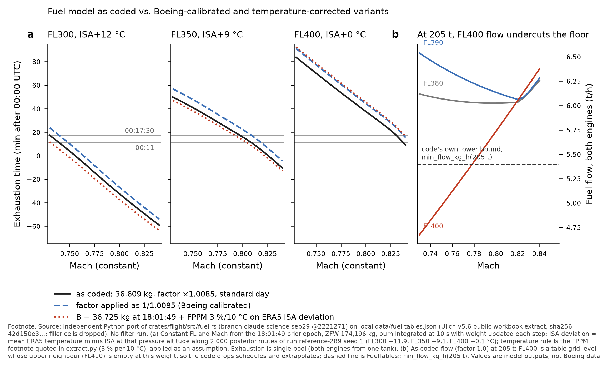

# Independent audit of the fuel model (auditor: architecture)

Architecture sub-agent, 9 October 2026, at Pete Large's request, under
`results/fuel-model-audit-brief.md` (artifact v57b92547). Read-only: no code or config was changed and no
filter was run. Branch `claude-science-sep29` at `2221271`. The reference run read below, `reference-289`,
records `code_revision = 4f6487a-dirty`, so it was built from uncommitted changes; the fuel files audited here
are those at `2221271`.

**How this audit was done.** I wrote an independent Python port of `crates/flight/src/fuel.rs` and checked it
against the Rust crate. The port reproduces the worst-flow figure from the crate's own test,
`every_reachable_cruise_cell_prices`, to the kg/h (23,571 kg/h at FL395, 217.86 t, M0.41). All 25 unit tests of
`mh370-flight` pass (`cargo test --release -p mh370-flight --lib`, 2 threads, run in a scratch copy outside the
repo with the tables symlinked in). I then re-derived every number from the primary sources, and read the saved
outputs of three full runs (`reference-289`, `no-exhaustion-prior` and `6temper-realloc`, whose `final.npy` and
`handoff-m0011/handoff.toml` I opened read-only). Only after that did I read the project's own fuel notes; §6
compares the two.

`data/fuel-tables.json` was read in place and not copied, uploaded or saved. Its recorded source is
`ulich-9M-MRO-fuel-model-v5.6-public.xlsm`, sha256 `42d150e36a79e2b9493680128e4833f14eebd6c1cc9551c66d00e0c7127d92a4`.
That is the same hash the archived prior work (`Archive ISO Pre Sept 28/…/ulich-mh370-fuel-performance/README.md`)
pins as the public V5.6 artifact. Every table value quoted below is a model output: no Boeing cell is reproduced.

## 0. Verdict

**The northward shift is, in direction, a property of correct physics. It is not produced by a defect.**
The evidence for that does not depend on the project's tables at all. Boeing's own Table 4 (SIR Appendix 1.6E,
printed p. 6), with 73,908 lb at arc 1 at 18:28:06 (Table 1, p. 2; p. 5), has these paths dry before 00:11:
FL350 at 475 kt (M0.824, dry 00:04), FL300 at 500 kt (dry 22:58) and FL300 at 437 kt (M0.742, dry 00:10).
FL350 at 466 kt (M0.808) lasts to 00:22. A fuel-free reproduction lets Mach run to 0.84 at every level, so a
correct fuel model has to remove the fastest and lowest paths, and on these arcs that moves the 7th-arc crossing
north.

**The size of the shift is not yet trustworthy.** The model as coded has several defects with opposite signs:

- The calibration factor is applied the wrong way round (F1): too restrictive by about 6–7 min of endurance.
- There is no temperature correction (F2): too permissive by about 10–12 min at FL300–350 on the posterior's
  routes, and roughly neutral at FL400.
- Two table-edge and extrapolation defects create cheap states at FL400–430 and low Mach (F3, F4). These favour
  slow, high, northern paths.
- About 45 % of the posterior flies above the service ceiling for part of the flight, and about 42 % of flight
  time is on extrapolated Mach (F5, F6).
- The 00:11 power constraint leaks 0.05–0.8 % of weight onto paths that are dry before 00:11, which lie to the
  south (F7).

At FL350 the agreement between the model as coded and a Boeing-calibrated, temperature-corrected model (−2.6 min
at M0.80) is a cancellation of F1 against F2. At FL400 that cancellation does not happen: the model as coded runs
dry 7.8 min early. With 48 % of the reference posterior ending at or above FL380, the net effect on the 00:19
latitude has not been measured.

A crude weighted regression of final latitude on final Mach in `reference-289` gives −0.16° per 0.01 Mach. On
that **provisional** basis, the corrections move the fuel-limited Mach boundary by up to ±0.01, so a few tenths of
a degree, mostly at the fast edge. That is enough to matter for a shoulder claim. It is not enough to reverse the
direction. §7 specifies the smoke tests that would settle the size.

## 1. Findings

Severity follows the brief: critical / major / minor / note. No finding is critical: none invalidates the
direction of the result. Line numbers are at `2221271`, in the folder `Claude Science Project Sep 29/engine/`.

| id | sev. | file:line | what is wrong | evidence | suggested fix |
|---|---|---|---|---|---|
| F1 | major | `crates/flight/src/fuel.rs:331-333,340`; `crates/flight/src/lib.rs:646-649,799`; `crates/hypothesis/src/lib.rs:221-222` | **The calibration factor is applied the wrong way round.** `validate.py` defines the factor as model burn over Boeing burn (`implied_factor`, `validate.py:134-140`; its header line 154 says ">1: the model burns more"). So 1.0085 means the tables already burn 0.85 % more than Boeing, and multiplying the flow by a draw from N(1.0085, 0.0178) compounds the excess rather than removing it. | Reproduced: 1.0085 ± 0.0178 over 11 in-range items. On the 8 in-range Table 4 items, endurance from arc 1 is −1.7 % against Boeing at factor 1, −2.5 % (−8.9 min mean) as coded, and −0.8 % with 1/1.0085 (Table R4). From 18:01:49, inverting the factor delays exhaustion by +5.6 to +7.2 min (Fig. 1a, A to B). | Multiply by 1/f, or redefine f as Boeing over model and refit (mean 0.9916). Because of F1b, a weight-dependent calibration fits better than a constant. |
| F1b | minor | `.sources/fuel-performance/validate.py:150-204` | **One constant factor fits two opposing calibration groups.** The 3 heavy Table 3 items, at 208–217 t, give 0.979–0.998 (the model under-burns). The 8 Table 4 items, mean 191 t, give 1.017 ± 0.011 (the model over-burns). Weight trend: −1.4 % per 10 t. | Python reproduction of `validate.py`. | Fit f(W), or calibrate on Table 4 alone for endurance, and carry the Table 3 residual as an uncertainty on the 18:01 fuel. |
| F2 | major | `crates/flight/src/fuel.rs:196` (no temperature argument); `crates/flight/src/lib.rs:772` | **No temperature correction to fuel flow**, although true air speed uses ERA5 temperature (`lib.rs:693-694`). The FPPM footnote that `extract.py:16-17` itself records is ±3 % per 10 °C (its wording says TAT; it is normally a deviation from standard). Boeing's figures are standard-day (App. 1.6E p. 3), so the calibration cannot absorb this. | Along 2,000 posterior routes of `reference-289` seed 1, ERA5 gives a mean ISA deviation of +11.9 °C at FL300, +9.1 °C at FL350 and +0.1 °C at FL400. The ACARS SAT of −43.8 °C at FL350 at 17:06:43 is ISA+10.5 (SIR Table 1.9A, via the archive ledger). The correction brings exhaustion 10.1–12.5 min earlier at FL300–350 (Fig. 1a, C to D). | Multiply the flow by (1 + 0.003 ΔISA), or use the √θ physics form (about 0.23 %/°C), and declare it. Fix together with F1. |
| F3 | major | `crates/flight/src/fuel.rs:93-114`; same rule in `validate.py:63-75` | **The bilinear lookup drops a cell when a corner with zero weight is missing.** At an exact grid level such as FL400, the FL410 column carries weight 0, yet a missing or filler cell there returns `None` and removes the schedule. The filter's 1,000 ft altitude steps coincide with the table's 10-FL grid from FL250 upwards. | Sweep of FL250–430 × 174–211 t × 4 Mach: 212 of 548 "above ceiling" flags are spurious (FL400–420). 9.8 % of states change flow by more than 0.5 %, at most by 24 %. FL400 at M0.76: exhaustion 01:03:34 as coded against 00:32:15 with the edge fixed (−31 min; table E). | Ignore corners whose bilinear weight is zero. Add a test at the exact grid levels next to the frontier. |
| F4 | major | `crates/flight/src/fuel.rs:232-261` | **Extrapolation produces flows below the code's own floor.** Below the lowest schedule, the `aM²+b/M²` fit from two close points (MRC and CI 52 at FL400, 0.005 Mach apart) gives flow that falls with falling Mach, where physically it should rise on the back side of the drag curve. | At 205 t, FL400 M0.73: 4,674 kg/h against `min_flow_kg_h(205 t)` = 5,395 and FL390 at 6,538 (Fig. 1b). At 185 t, FL430 M0.73: 3,864 kg/h. In the posterior (**provisional**, rebuilt from final states): about 1 % of weight sits in a pocket at the final state, and those paths lie north (−35.0° against −36.1°), at M0.74 and FL430. | Clamp the flow at or above the tabulated-envelope minimum at that weight, or make below-lowest-schedule states infeasible. Test that no state undercuts `min_flow_kg_h`. |
| F5 | major | `crates/flight/src/lib.rs:796-798`; `crates/flight/src/fuel.rs:205-224` | **Above-ceiling states are kept in the posterior.** The altitude prior ignores weight; an above-ceiling step burns at a lower level's flow and is only counted. | `reference-289`, 4 seeds: 44–47 % of weight flew above the ceiling, for a mean of 90–115 min when it did. 26–32 % did so for more than 1 h. Paths with ceiling time end slightly north (−35.80 to −35.92° against −35.93 to −36.35°). Part of this is F3. | Weight-dependent altitude bounds in the dynamics, or a declared penalty, with a sensitivity arm. |
| F6 | major | `crates/flight/src/fuel.rs:19-24` (claim); `crates/flight/src/lib.rs:793-795` | **A large share of flight time rests on extrapolated flow,** and the uncertainty there is not carried. Validation error outside the schedules is −11.5 % to +3.7 % (Boeing items, merged code), against ±1.8 % inside. The docstring still says "up to about 8 %"; `hypothesis/src/lib.rs:224` says 12 %. | Posterior mean of `fuel_extrapolated_s` over flight time: 0.40–0.43 (`reference-289`) and 0.17–0.18 (`no-exhaustion-prior`). | Inflate the factor s.d. on extrapolated steps, or restrict the Mach and altitude envelope. Correct the docstring. |
| F7 | major | `crates/mh370/src/filter.rs:415-417,617-620,658-662,745-790` | **The hard power constraint at 00:11 leaks.** −50 nats is charged once (`fuel_penalised`). Paths dry well before 00:11 still carry normal weight. | `final.npy`, 12 seed files: 0.05–0.77 % of posterior weight on paths dry before about 00:07:47 (earliest 22:53:52), mostly in the lateral-navigation stratum, located −37.4 to −37.9° (south). The m0011 hand-off (f64) confirms 0.07–0.48 % dry before 00:10:59. Mechanism **not isolated**: the candidates are a stratum likelihood spread above 50 nats, and Metropolis-Hastings acceptance in the tempered moves at m0011. | Treat the constraint as a rejection (−∞, handling strata in which everything is rejected), or reject dry candidates inside moves. Add an assertion that weight on dry-before-deadline paths is zero. |
| F8 | minor | `crates/flight/src/lib.rs:817-832` (claim at 532-536) | **The "doomed" test is not a necessary condition.** It uses the current-weight minimum flow for the whole time still to fly, but the aircraft lightens, so it overstates the fuel needed and the "exact" claim is false. | Overstatement 1,567 kg (7.1 %) at 19:41, 1,026 kg at 20:41, 470 kg at 21:41, 130 kg at 22:41 (table DO). It affects only paths that would have to fly at minimum flow to survive, so the effect is expected to be small (**provisional**). | Integrate the minimum flow along the falling weight: a one-dimensional table of fuel needed against time to go. |
| F9 | minor | `config/sensitivity/stage2-fuel*.toml:3-5`; `config/sensitivity/no-exhaustion-prior.toml:55`; `crates/mh370/src/config.rs:270` | **The 18:01:49 fuel uses the wrong time base.** The derivation spreads Boeing's 10,276 kg over 78.73 min, to 18:25:27, but Boeing's segments total 1.355 h (81.3 min) to arc 1 at 18:28:06 (App. 1.6E Table 1 p. 2, Table 3 p. 5). The `config.rs` docstring still says 43,800 kg "at the prior epoch". | Segment-wise fuel at 18:01:49: 36,725 kg anchored at Boeing's radar end of 18:01:19 (p. 4), or 36,827 kg on printed durations. Linear: 36,843 kg. Configured: 36,609 kg, 116–234 kg low (about 1–2 min). | Use 36,725 kg with a stated ±100 kg from the segment-boundary ambiguity. Fix the docstring. |
| F10 | minor | `crates/flight/src/lib.rs:766-772` | **Climbs and descents are priced at level-cruise flow.** The climb rate is 4,000 ft/min at every level. | About 42 kg per 1,000 ft climbed at 200 t, on an assumed overall efficiency of 0.33 and an LHV of 43.2 MJ/kg. Posterior mean 1.9–2.1 altitude changes per path, mostly offsetting. | Add a W·γ term, or bound the error in the paper. |
| F11 | major | `crates/flight/src/lib.rs:799-806`; `crates/mh370/src/filter.rs:658-676` | **Single-pool fuel.** The model's exhaustion happens when the total fuel is gone. The physical events are a right-engine flame-out and then a left one, up to 15 min later (ATSB AE-2014-054, 3 Dec 2015, printed p. 9). The 00:17:30 inference is the left-engine flame-out. | If the left-only phase lasts 0–15 min at a total flow about 0.6–0.7 of twin-engine flow (an **assumption**), pooled exhaustion falls 0–6 min before the left flame-out. Both `require_power_until` and the 00:17:30 Gaussian are then applied to an earlier event, which biases against high-burn paths. The single-engine drift-down (below FL290, per ATSB) is not modelled. | A two-tank model with the Rolls-Royce SFC asymmetry and a tank-imbalance prior, or an explicit shift and inflation of the target, declared as a hypothesis. |
| F12 | minor | `crates/mh370/src/filter.rs:35-46,1039-1045` | `fuel_exhausted_unix_s` is stored as float32, which quantises it to 128 s. Medians such as "00:14:56" are grid values. | The unique stored times step by 128 s. 00:17:30 is stored as 00:17:04 and 00:10:59 as 00:10:40. | Store as f64, or as seconds after 18:00. |
| F13 | minor | `crates/flight/src/fuel.rs:458-477,389-434,8-11` | **Tests that assert the wrong thing.** `min_flow_is_a_true_lower_bound` skips extrapolated cells, which are the cells the filter flies 42 % of the time, so it hides F4. `every_reachable_cruise_cell_prices` checks positivity and an upper bound, not undercutting. The docstring "reproduces validate.fuel_flow cell for cell" has not been true since the merge. | Port plus `cargo test` (25/25 pass). | Assert the floor over every state the filter can fly, and refresh the docstrings. |
| F14 | major (provenance) | `.sources/fuel-performance/extract.py:8-23`; `data/fuel-tables.json` | **The values the filter uses do not have a publishable source** (§4). | Flow corners used along posterior-like states (**provisional**): derived (Ulich's MRC and CI 52) 53 %, fppm-confidential 22 %, fppm-open 22 %, fppm-optimum 3 %. Mach: derived 83 %, including LRC Mach derived from confidential KIAS. Excluding confidential cells shifts exhaustion by −18.6 to +11.2 min and leaves 3 calibration items. The archived prior work marked these tables `audit-only-not-integrated`. | See §4: calibrate a public parametric law on App. 1.6E alone, and use the tables only as a cross-check. |
| F15 | note | `crates/flight/src/lib.rs:772` against `694` | Burn uses the Mach set point, not set point plus Ornstein-Uhlenbeck deviation. | Stationary s.d. about 0.003 Mach. | None needed; mention it. |
| F16 | note | `crates/flight/src/lib.rs:919-940` | Burn is evaluated on the end-of-step state. | dt = 10 s; first-order and negligible. | None. |
| F17 | note | `crates/flight/src/fuel.rs:173-187` | The 5e-3 merge also joins genuinely different schedules near the ceiling. Once F3 is fixed, holding and MRC coincide in Mach at FL400 and their different flows are averaged. | Points at FL400, 205 t, edge fixed. | Merge only the reconstructed pair (CI 52 with LRC), not by tolerance alone. |
| F18 | note | `crates/flight/src/lib.rs:646-649` | **The factor posterior is not reported.** It is in the hand-off rows but not in `final.npy`. | m0011 hand-offs, 4 seeds: posterior mean 1.0032–1.0061 (−0.13 to −0.30 prior s.d.); the data mildly prefer less burn. | Add a `fuel_factor` column. |
| F19 | note | `crates/mh370/src/terminal.rs:412-422`; `hypotheses/end-of-flight/onset.rs:1-20` | **Double counting.** The `reference-289` core uses only `require_power_until`, and end of flight derives predicted exhaustion itself and scores 00:19 itself from the m0011 hand-off, so that pairing is clean. Pairing a core config that carries `exhaustion_target_utc` (stage2-fuel, -equal, -narrowmach, 6temper-realloc) with a flame-out-associated onset and 00:19 log-on scoring would count the timing evidence twice. Defects F1–F4 also reach end of flight's predicted exhaustion through `CoreFuel`. | Code reading. | A composer and config guard: no core exhaustion Gaussian when an end-of-flight stage scores 00:19. |

## 2. Reproduction tables (item 3)

Source: SIR Appendix 1.6E text (primary), parsed with `validate.py`'s own regular expressions: ACARS
96,562.5 lb at 17:06:43, gross weight 480,600 lb (p. 1, p. 4), ZFW 174,196 kg derived. Model: the Python port of
`fuel.rs` (merge 5e-3, fallbacks), integrated at 1 min with the weight falling, standard day. Mach for Table 4 is
taken from TAS at ISA, as in `validate.py`.

**R3, Table 3 (five segments from the last ACARS report, each started from Boeing's fuel at its start).**

| item | FL | Mach | Boeing burn kg | model x1 kg | as coded x1.0085 kg | x1/1.0085 kg | as coded vs Boeing % | x1/1.0085 vs Boeing % | coverage |
|---|---|---|---|---|---|---|---|---|---|
| seg 1 | 350 | 0.829 | 2413.3 | 2364.2 | 2384.2 | 2344.4 | -1.21 | -2.86 | inside |
| seg 2 | 350 | 0.815 | 150.1 | 147.2 | 148.5 | 146.0 | -1.12 | -2.78 | inside |
| seg 3 | 300 | 0.865 | 4448.4 | 4306.6 | 4343.1 | 4270.5 | -2.37 | -4.0 | extrap |
| seg 4 | 300 | 0.852 | 2576.0 | 2621.6 | 2643.8 | 2599.6 | 2.64 | 0.92 | extrap |
| seg 5 | 300 | 0.838 | 688.1 | 686.8 | 692.7 | 681.1 | 0.67 | -1.02 | inside |

Chained from 43,800 kg through all five segments, the fuel at arc 1 comes out 147.8 kg above Boeing's 33,524 kg
at factor 1, 62.6 kg above as coded, and 232.3 kg above with 1/1.0085.

**R4, Table 4 (endurance from arc 1, 22 flight-level and speed pairs).**

| TAS | FL | Mach (ISA from TAS) | Boeing h | model x1 h | as coded h | x1/1.0085 h | as coded vs Boeing % | x1/1.0085 vs Boeing % | coverage |
|---|---|---|---|---|---|---|---|---|---|
| 494 kt | 400 | 0.861 | 5.0 | 5.428 | 5.383 | 5.475 | 7.65 | 9.49 | extrap |
| 475 kt | 400 | 0.828 | 5.9 | 5.861 | 5.812 | 5.911 | -1.5 | 0.19 | inside |
| 469 kt* | 400 | 0.818 | 6.0 | 5.967 | 5.917 | 6.018 | -1.38 | 0.3 | extrap |
| 417 kt | 400 | 0.727 | 6.1 | 6.831 | 6.773 | 6.89 | 11.03 | 12.95 | extrap |
| 500 kt | 350 | 0.867 | 4.7 | 5.073 | 5.031 | 5.117 | 7.04 | 8.86 | extrap |
| 475 kt | 350 | 0.824 | 5.6 | 5.555 | 5.508 | 5.602 | -1.65 | 0.03 | inside |
| 466 kt | 350 | 0.808 | 5.9 | 5.713 | 5.665 | 5.762 | -3.98 | -2.34 | inside |
| 443 kt* | 350 | 0.769 | 6.2 | 6.039 | 5.988 | 6.09 | -3.43 | -1.78 | inside |
| 400 kt | 350 | 0.694 | 6.6 | 6.552 | 6.497 | 6.608 | -1.56 | 0.12 | extrap |
| 500 kt | 300 | 0.848 | 4.5 | 4.537 | 4.498 | 4.575 | -0.04 | 1.67 | extrap |
| 437 kt | 300 | 0.742 | 5.7 | 5.686 | 5.638 | 5.735 | -1.08 | 0.61 | inside |
| 416 kt* | 300 | 0.706 | 6.1 | 6.029 | 5.978 | 6.08 | -2.0 | -0.32 | inside |
| 323 kt | 300 | 0.548 | 6.8 | 6.63 | 6.575 | 6.687 | -3.31 | -1.66 | extrap |
| 471 kt | 250 | 0.782 | 4.6 | 4.641 | 4.602 | 4.681 | 0.05 | 1.76 | extrap |
| 383 kt* | 250 | 0.636 | 6.1 | 5.951 | 5.9 | 6.001 | -3.27 | -1.62 | inside |
| 291 kt | 250 | 0.483 | 6.8 | 6.701 | 6.644 | 6.758 | -2.29 | -0.62 | extrap |
| 407 kt | 150 | 0.65 | 4.5 | 4.441 | 4.404 | 4.479 | -2.13 | -0.46 | extrap |
| 333 kt* | 150 | 0.532 | 5.8 | 5.673 | 5.626 | 5.722 | -3.01 | -1.35 | inside |
| 250 kt | 150 | 0.399 | 6.75 | 6.454 | 6.4 | 6.509 | -5.19 | -3.57 | extrap |
| 345 kt | 30 | 0.527 | 4.2 | 4.498 | 4.46 | 4.536 | 6.18 | 7.99 | below,extrap |
| 284 kt* | 30 | 0.434 | 5.7 | 5.622 | 5.574 | 5.67 | -2.2 | -0.53 | below |
| 235 kt | 30 | 0.359 | 6.2 | 6.223 | 6.17 | 6.275 | -0.48 | 1.22 | below,extrap |

Calibration reproduced: 1.0085 ± 0.0178 (s.d.) with exact deduplication (`validate.py`), and 1.0086 ± 0.0178
with the 5e-3 merge (`fuel.rs`), over 11 in-range items. The four Boeing-schedule items give 1.0135 ± 0.0126;
the seven bracketed by Ulich's derived MRC or CI 52 give 1.0056.

**Starting fuel at 18:01:49 (F9).**

| method | fuel_kg |
|---|---|
| project (configs): linear over 78.73 min to 18:25:27 | 36608.5 |
| linear over Boeing Table 3 duration to arc 1 at 18:28:06 | 36842.6 |
| segment-wise, printed segment durations (inside seg 3) | 36826.6 |
| segment-wise, seg 3 end anchored to radar end 18:01:19 then seg 4 rate | 36725.0 |

**The 00:17:30 exhaustion timing.** No source treats it as a measurement. It is back-solved from the 00:19:29 log-on,
allowing about 1 min for the APU to start and about 1 min for SDU start-up (SIR pp. 372–373, via the archive's
citation ledger; secondary for this audit, because I did not reopen the SIR). Under the model as coded, a constant
profile from 18:01:49 reaches 00:17:30 at the following Mach (interpolated on a 0.01 grid; FL300 variants A and D
are dry before 00:17:30 at every Mach ≥ 0.73):

| FL | variant | M@00:17:30 | M@00:10:59 |
|---|---|---|---|
| 300 | A as coded |  | 0.7397 |
| 300 | B factor inverted | 0.7394 | 0.7488 |
| 300 | C = B + 36,725 kg | 0.741 | 0.7503 |
| 300 | D = C + temperature |  | 0.7311 |
| 350 | A as coded | 0.7971 | 0.8091 |
| 350 | B factor inverted | 0.8087 | 0.8189 |
| 350 | C = B + 36,725 kg | 0.8106 | 0.8205 |
| 350 | D = C + temperature | 0.7919 | 0.8044 |
| 400 | A as coded | 0.8305 | 0.8379 |
| 400 | B factor inverted | 0.8377 |  |
| 400 | C = B + 36,725 kg | 0.8389 |  |
| 400 | D = C + temperature | 0.8388 |  |

**Posterior burn (brief item 3, the "36,160 kg against 36,609 kg" memory figure). Not reproduced.**

| run | seed | mean_burn | mean_fuel_left | p_exhausted | p_exh_before_0011 | mean_extrap_s | mean_ceiling_s | mean_lat | mean_mach | mean_alt |
|---|---|---|---|---|---|---|---|---|---|---|
| reference-289 | 1 | 35939.4 | 669.6 | 0.379 | 0.035 | 9680.05 | 2481.018 | -35.913 | 0.78 | 36652.331 |
| reference-289 | 2 | 35960.251 | 648.749 | 0.403 | 0.044 | 9279.081 | 2540.724 | -36.149 | 0.78 | 36726.319 |
| reference-289 | 3 | 35904.661 | 704.339 | 0.382 | 0.033 | 9129.04 | 2794.998 | -35.934 | 0.781 | 36590.868 |
| reference-289 | 4 | 35910.671 | 698.329 | 0.396 | 0.035 | 9558.589 | 3046.901 | -35.907 | 0.783 | 36830.52 |
| no-exhaustion-prior | 1 | 36336.761 | 272.239 | 0.622 | 0.072 | 3906.919 | 1853.147 | -36.904 | 0.802 | 37763.79 |
| no-exhaustion-prior | 2 | 36336.758 | 272.242 | 0.571 | 0.048 | 4094.011 | 1712.376 | -36.958 | 0.796 | 37714.292 |
| no-exhaustion-prior | 3 | 36308.654 | 300.346 | 0.558 | 0.048 | 3481.72 | 1947.444 | -36.8 | 0.801 | 37959.483 |
| no-exhaustion-prior | 4 | 36297.082 | 311.918 | 0.568 | 0.066 | 3984.443 | 2597.7 | -36.87 | 0.802 | 38136.669 |
| no-exhaustion-prior | 5 | 36290.114 | 318.886 | 0.571 | 0.076 | 4206.178 | 2436.295 | -36.814 | 0.799 | 37771.668 |
| no-exhaustion-prior | 6 | 36268.95 | 340.05 | 0.595 | 0.056 | 4045.746 | 2151.193 | -36.835 | 0.797 | 37839.935 |
| no-exhaustion-prior | 7 | 36256.861 | 352.139 | 0.524 | 0.059 | 3880.247 | 1797.611 | -36.846 | 0.797 | 37865.01 |
| no-exhaustion-prior | 8 | 36247.711 | 361.289 | 0.54 | 0.043 | 5740.425 | 2648.021 | -36.715 | 0.794 | 37771.459 |

The reference run's mean burn to 00:19:37 is 35,905–35,960 kg across seeds 1–4, leaving 649–704 kg. The figure
of 36,160 kg matches neither `reference-289` nor `no-exhaustion-prior` (36,248–36,337 kg). It may be a different
run or a different epoch. At the 00:11 hand-off, the mean fuel remaining is 1,276–1,405 kg (table HS).

**Fig. 1.**

*Footnote (Fig. 1).* Source: the independent Python port of `fuel.rs` (branch `claude-science-sep29` at `2221271`)
on the local `data/fuel-tables.json` (Ulich v5.6 public-workbook extract, sha256 42d150e3…; filler cells dropped).
No filter was run. (a) Constant FL and Mach from the 18:01:49 prior epoch, ZFW 174,196 kg, burn integrated at
10 s with the weight updated each step, single-pool exhaustion. Variants:
- A: as coded, 36,609 kg and ×1.0085.
- B: ×1/1.0085.
- D: B plus 36,725 kg at 18:01:49, plus the FPPM rule of 3 % per 10 °C applied to the mean ERA5 ISA deviation
  along 2,000 posterior routes of `reference-289` seed 1. The rule is an assumption, quoted from `extract.py`.

At FL400 the curves pass through the F3/F4 region at the starting weight. (b) Flow as coded (factor 1.0) at
205 t, with `FuelTables::min_flow_kg_h(205 t)` dashed. Values are model outputs, not Boeing data.

**Other measurements.**

The 00:11 power-constraint leak (F7), from `final.npy`, weights normalised per seed:

| run | seed | n | weight | earliest | lat_mean_leak |
|---|---|---|---|---|---|
| reference-289 | 1 | 52029 | 0.0048 | 23:34:24 | -37.4303 |
| reference-289 | 2 | 80221 | 0.0059 | 23:36:32 | -37.481 |
| reference-289 | 3 | 65029 | 0.0046 | 23:36:32 | -37.5291 |
| reference-289 | 4 | 3317 | 0.0007 | 23:38:40 | -35.1567 |
| no-exhaustion-prior | 1 | 77171 | 0.0058 | 23:36:32 | -37.4143 |
| no-exhaustion-prior | 2 | 107847 | 0.0077 | 23:34:24 | -37.894 |
| no-exhaustion-prior | 3 | 91724 | 0.005 | 23:34:24 | -37.8456 |
| no-exhaustion-prior | 4 | 86337 | 0.0061 | 23:34:24 | -37.7853 |
| no-exhaustion-prior | 5 | 3706 | 0.0005 | 23:38:40 | -36.1936 |
| no-exhaustion-prior | 6 | 81919 | 0.0052 | 23:36:32 | -37.6703 |
| no-exhaustion-prior | 7 | 84557 | 0.0053 | 23:36:32 | -37.7991 |
| no-exhaustion-prior | 8 | 12432 | 0.0013 | 22:53:52 | -37.4482 |

Ceiling and extrapolation exposure (F5, F6), measured on the runs' own per-path counters:

| run | seed | P_any_ceiling | mean_ceiling_min_given_any | P_ceiling_over_1h | P_extrap_over_half_flight | mean_extrap_frac | lat_ceiling | lat_noceiling | mean_climbs |
|---|---|---|---|---|---|---|---|---|---|
| reference-289 | 1 | 0.461 | 89.7 | 0.28 | 0.384 | 0.427 | -35.89 | -35.93 | 2.04 |
| reference-289 | 2 | 0.471 | 89.8 | 0.26 | 0.357 | 0.409 | -35.92 | -36.35 | 1.98 |
| reference-289 | 3 | 0.468 | 99.5 | 0.291 | 0.368 | 0.403 | -35.84 | -36.02 | 2.08 |
| reference-289 | 4 | 0.443 | 114.6 | 0.323 | 0.38 | 0.422 | -35.8 | -36.0 | 1.92 |
| no-exhaustion-prior | 1 | 0.383 | 80.6 | 0.205 | 0.135 | 0.172 | -36.74 | -37.01 | 1.32 |
| no-exhaustion-prior | 2 | 0.328 | 87.0 | 0.189 | 0.134 | 0.181 | -36.64 | -37.12 | 1.34 |

Posterior of the fuel factor at the m0011 hand-off (F18; f64, 100,000 rows per seed):

| seed | n | factor_post_mean | factor_post_sd | z_shift | fuel_kg_mean_0011 | P_dry_at_0011 | P_dry_before_0011 |
|---|---|---|---|---|---|---|---|
| 1 | 100000 | 1.0061 | 0.0163 | -0.13 | 1355 | 0.0038 | 0.0038 |
| 2 | 99999 | 1.0032 | 0.0183 | -0.3 | 1276 | 0.0048 | 0.0048 |
| 3 | 100000 | 1.0035 | 0.0175 | -0.28 | 1394 | 0.0032 | 0.0032 |
| 4 | 100000 | 1.005 | 0.0171 | -0.2 | 1405 | 0.0007 | 0.0007 |

Overstatement in the doomed test (F8):

| time | hours_to_0011 | needed_true_kg | needed_code_kg | overestimate_kg | overestimate_pct | minflow_at_W | minflow_at_zfw |
|---|---|---|---|---|---|---|---|
| 19:41 | 4.5 | 22096 | 23662 | 1567 | 7.09 | 5214 | 4594 |
| 20:41 | 3.5 | 16928 | 17953 | 1026 | 6.06 | 5087 | 4594 |
| 21:41 | 2.5 | 11911 | 12382 | 470 | 3.95 | 4912 | 4594 |
| 22:41 | 1.5 | 7052 | 7181 | 130 | 1.84 | 4748 | 4594 |
| 23:15 | 0.93 | 4363 | 4402 | 39 | 0.9 | 4678 | 4594 |
| 23:45 | 0.43 | 2016 | 2023 | 7 | 0.37 | 4633 | 4594 |

Bilinear edge defect (F3), constant profiles from 18:01:49, as coded against the edge fixed:

| FL | mach | exh_code | exh_edge_fixed | shift_min | flags_code | flags_fixed |
|---|---|---|---|---|---|---|
| 350 | 0.76 | 00:36:13 | 00:36:13 | 0.0 | extrap | extrap |
| 350 | 0.8 | 00:15:59 | 00:15:59 | 0.0 |  |  |
| 350 | 0.83 | 23:56:58 | 23:56:58 | 0.0 |  |  |
| 370 | 0.76 | 00:37:58 | 00:37:58 | -0.0 | extrap | extrap |
| 370 | 0.8 | 00:26:13 | 00:26:13 | 0.0 |  |  |
| 370 | 0.83 | 00:11:41 | 00:11:41 | 0.0 |  |  |
| 390 | 0.76 | 00:27:35 | 00:27:35 | 0.0 | extrap | extrap |
| 390 | 0.8 | 00:26:04 | 00:26:04 | 0.0 | extrap | extrap |
| 390 | 0.83 | 00:17:55 | 00:17:55 | 0.0 |  |  |
| 400 | 0.76 | 01:03:34 | 00:32:15 | -31.3 | ceiling,extrap | extrap |
| 400 | 0.8 | 00:37:41 | 00:27:04 | -10.6 | ceiling,extrap | extrap |
| 400 | 0.83 | 00:17:58 | 00:18:00 | 0.0 | ceiling |  |
| 410 | 0.76 | 01:09:24 | 01:14:22 | 5.0 | ceiling,extrap | ceiling,extrap |
| 410 | 0.8 | 00:38:43 | 00:38:53 | 0.2 | ceiling,extrap | ceiling,extrap |
| 410 | 0.83 | 00:16:48 | 00:14:48 | -2.0 | ceiling | ceiling |

Pocket exposure (F4). **Provisional**: rebuilt from the final (FL, Mach) and a constant-state weight history,
because per-step histories are not saved:

| run | seed | P_final_state_in_pocket | mean_frac_weights_in_pocket | median_flow_over_floor | lat_pocket | lat_other | mach_pocket | mach_other | FL_pocket | FL_other |
|---|---|---|---|---|---|---|---|---|---|---|
| reference-289 | 1 | 0.008 | 0.054 | 1.125 | -35.18 | -35.96 | 0.741 | 0.782 | 430 | 366 |
| reference-289 | 2 | 0.012 | 0.058 | 1.125 | -34.97 | -36.18 | 0.739 | 0.781 | 430 | 366 |
| no-exhaustion-prior | 1 | 0.004 | 0.03 | 1.146 | -34.74 | -36.9 | 0.741 | 0.801 | 430 | 377 |

## 3. Cross-check against the other performance sources (item 4)

| source | grade | what it says on burn or endurance | agreement with the model |
|---|---|---|---|
| SIR (Malaysian ICAO Annex 13 team, 2 July 2018), Appendix 1.6E, Boeing performance analysis, printed pp. 1–8 | primary | ACARS fuel and weights (p. 1, p. 4); standard day (p. 3); Table 3 and arc-1 fuel (p. 5); Table 4 (p. 6); Rolls-Royce right-engine SFC slightly higher (p. 5); driftdown of 0.0034 NM per ft (p. 8) | Table 3 within −1.2 to +0.7 % on the in-range segments as coded. Table 4 −2.5 % mean endurance as coded, −0.8 % with the factor inverted (R4). |
| SIR main report Table 1.6D (ZFW 174,369 kg) and Table 1.9A (ACARS SAT −43.8 °C, M0.821, FL350) | primary, **not re-opened here**; located by the archive ledger (printed pp. 51 and 113) | The load-sheet ZFW is 173 kg above the ACARS-derived 174,196 kg. The SAT is ISA+10.5 °C. | ZFW difference: 0.1 % of weight, negligible. The temperature supports F2. |
| ATSB AE-2014-054, *MH370 – Definition of Underwater Search Areas*, 3 Dec 2015, printed pp. 8–9 | primary (read from a search excerpt only) | The right engine is likely to have flamed out first; the left could have run for up to 15 min after it; 30 lb of fuel was available to the APU. | Supports F11. The single-pool model does not represent this. |
| Ulich 9M-MRO fuel model v5.6, public workbook | secondary (a compilation of FPPM cells of mixed provenance) | The extracted grids are what `fuel-tables.json` holds. His workbook applies its own temperature, PDA and engine-specific treatment, which `extract.py` deliberately does not take. | Not opened in this audit (the workbook was not downloaded); only the extract was used. |
| Archive `ulich-mh370-fuel-performance/` (prior project work) | project work (secondary) | A public-physics proxy over-burns Table 3 by 4,227 kg. The tables are marked `audit-only-not-integrated` for provenance. The 00:17:30 time is flagged as back-solved, not independent. | Supports F14 and the treatment of 00:17:30 as a hypothesis. |
| Ten Boeing engineering-simulator runs (end of flight's calibration targets) | primary via the ATSB, not re-read | They concern descent after flame-out, not cruise burn. | Not used for burn. They bear on end of flight's glide, not on this model. |

## 4. Provenance and licence (item 5)

| use in the filter | cells (source class) | share of corners used (**provisional**) | publishable as cited? | defensible public source |
|---|---|---|---|---|
| MRC and CI 52 flow, interior bracket | `derived` (Ulich's reconstruction; lineage unstated) | 53 % of flow corners | No: lineage unknown; may encode confidential FPPM | None as such. Replace with a parametric law fitted to App. 1.6E Tables 3 and 4 |
| LRC and M0.84 flow | `fppm-confidential` 22 %, `fppm-open` 7 %, `fppm-optimum` 3 % | 32 % | Confidential: no (the project's rule). "Open": a Boeing FPPM circulating publicly is still a copyrighted manual without a licence | Boeing's figures as published in the SIR (App. 1.6E) |
| Holding flow and Mach | `fppm-open` | 15 % of flow, 17 % of Mach | Same issue as "open" above | The SIR does not give holding flow; a public drag-polar plus engine model, calibrated to Table 4's slowest rows |
| LRC Mach | `derived` from confidential KIAS | 22 % of Mach corners | No | The LRC Mach implied by Table 4's TAS at ISA (6 levels) |
| `vmo-limit` (LRC KIAS) | not loaded; at ≥ 240 t only, outside this flight's 174–218 t | 0 | n/a | n/a |
| `filler` | dropped by `Table::from_raw` (`fuel.rs:74-91`), as `extract.py` asks | 0 (it drives the "ceiling" region instead) | n/a | n/a |

Share by class: flow corners derived 53%, fppm-open 22%, fppm-confidential 22%, fppm-optimum 3%; Mach
corners derived 83%, fppm-open 17%.

Effect of excluding the `fppm-confidential` cells (table NC). Without them, model coverage of
FL250–430 × 175–211 t × M0.73–0.84 stays complete only through fallbacks, the share of states with two schedules
falls from 91 % to 77 %, and only 3 calibration items remain in range (1.0063 ± 0.0236):

| FL | Mach | exhaustion_all_cells | exhaustion_without_confidential | shift_min |
|---|---|---|---|---|
| 300 | 0.76 | 23:56:52 | 23:59:49 | 3.0 |
| 300 | 0.8 | 23:27:36 | 23:36:30 | 8.9 |
| 300 | 0.82 | 23:13:56 | 23:25:10 | 11.2 |
| 350 | 0.76 | 00:36:13 | 00:36:13 | 0.0 |
| 350 | 0.8 | 00:15:59 | 00:16:00 | 0.0 |
| 350 | 0.82 | 00:04:05 | 00:05:46 | 1.7 |
| 400 | 0.76 | 01:03:34 | 00:44:59 | -18.6 |
| 400 | 0.8 | 00:37:41 | 00:31:07 | -6.6 |
| 400 | 0.82 | 00:25:03 | 00:23:43 | -1.3 |

So **the result depends on the confidential cells** at FL300 and FL400 by up to about 19 min of endurance.
At FL350 the dependence is negligible.

**Recommendation for publication.** Use as the primary performance source the 27 numbers Boeing published in SIR
Appendix 1.6E (Tables 3 and 4), together with the ACARS state. Fit a small public parametric fuel-flow law
FF(FL, W, M; θ), with an ISA-deviation term, to those numbers alone. Report the tables-based model only as an
undistributed cross-check. That makes every value used either a published primary figure or a fitted parameter.

## 5. Checked and found correct

- Units: per-engine kg/h doubled (`fuel.rs:230,262`); tonnes from (ZFW + fuel)/1000 (`lib.rs:771`); FL is
  pressure altitude/100, and the ERA5 axis is pressure altitude; burn = kg/h × dt/3600 (`lib.rs:799`).
- The 5 % holding racetrack allowance is removed (`fuel.rs:150`).
- Filler cells are dropped from both the Mach and the flow grids.
- KIAS tables are not loaded, so there is no KIAS/Mach mix-up; TAS comes from Mach and local temperature.
- The weight is updated every 10 s step. Exhaustion inside a step is interpolated linearly (resolution well under
  10 s in memory, 128 s on disk, F12).
- The no-exhaustion-prior overlay removes only the 00:17:30 Gaussian and keeps `require_power_until`, as its
  header states.
- The endurance proposal's prior-to-proposal density ratio (`lib.rs:1276-1288`) is exact, and its mixture
  integrates to 1 (test).
- The ZFW and initial-weight arithmetic: 480,600 − 96,562.5 lb = 174,196 kg.

## 6. Comparison with the project's own notes

Read after the findings above were formed: `results/core-model-stages.md` §Stage 2, `results/fuel-burn-gap.md`,
the float32 remarks in `results/exhaustion-prior-is-nearly-inert.md` and `results/no-exhaustion-prior-datasheet.md`,
and the fuel threads in `coordination/architecture.md`.

- **Agree:** the merge fix for the degenerate CI 52/LRC pair and its cost (worst extrapolated item −11.5 %); the
  float32 128 s ulp (F12, already known to core); the above-ceiling counter; the treatment of 00:17:30 as the
  weaker, removable claim; and the wide-Mach prior running dry early ("79.2 % … before 00:19:37").
- **Disagree:**
  - "The port is deliberately literal so the calibration carries over": the calibration does carry over, but it
    is applied inverted (F1).
  - "The empty cells … are the service ceiling, not a gap" is worth keeping as a result: about 40 % of those flags
    in the band audited are an edge artefact (F3). The genuine ones describe states that should be excluded, not
    priced (F5).
  - fuel.rs still documents "up to about 8 %"; `fuel-burn-gap.md` says the documentation was changed to 12 %, and
    only `hypothesis/src/lib.rs` carries the 12 %.
  - `core-model-stages.md` describes the 18:01:49 fuel as 70.0 % of 78.73 min; the time base is wrong (F9).
- **Not raised in the notes, as far as I found:** temperature (F2), sub-floor pockets (F4), the power-constraint
  leak (F7), the doomed overstatement (F8), single-pool exhaustion against left-engine flame-out (F11), and
  provenance exposure by cell class (F14).

## 7. Smoke tests that would settle the size (specified, not run)

At 1M particles × 2 seeds against `reference-289` at the same scale, comparing the mean 00:19 latitude,
P(34.5–36.5 °S) and the weight on paths dry before 00:11:

- S1: `factor_mean = 0.9916` (F1).
- S2: S1 plus the temperature term (F2; needs code).
- S3: S2 plus the bilinear edge fix and a floor clamp (F3, F4).
- S4: S3 plus exclusion of above-ceiling paths (F5).
- S5: rejection as −∞ (F7).

A unit-level precondition for all five is a test that no state the filter can fly undercuts `min_flow_kg_h`.

## 8. Not checked, and why

- The filter, under any of the variants. The brief forbids it (no heavy lock); §7 gives the tests.
- Ulich's v5.6 workbook and its documentation. Not downloaded; only the local extract was used. An auditor
  without the extract would need the public Google Drive copy linked in `extract.py`.
- SIR main-report Tables 1.6D and 1.9A and pp. 372–373, the ATSB June 2014 and October 2017 reports, and Davey
  p. 60. Cited from the archive ledger, the brief or a search excerpt, and graded accordingly.
- Trajectory-level use of cells and pockets. Per-step histories are not saved, so F4 and F14 shares are
  reconstructed from final states (**provisional**).
- The mechanism of the F7 leak. Its size is measured; its cause is not isolated.
- The single-engine phase (F11): the size rests on an assumed flow ratio.
- The climb energy coefficients (F10) are an assumption.
- The end-of-flight module's use of `FuelFlow` beyond `onset.rs` and `terminal.rs:400-460`.
- The 18:01–18:28 burn under the filter's own Mach prior against Boeing's M0.85 segments.
- The one-engine-inoperative tables, which are present but not loaded.
- `config.rs` parsing beyond the `FuelConfig` docstrings.

## Files

CSV outputs in `results/fuel-model-audit-architecture/` (model outputs only; no table cells):
`boeing-table3-table4-reproduction.csv`, `fuel-at-180149.csv`, `exhaustion-vs-mach-variants.csv`,
`posterior-fuel-diagnostics-final-npy.csv`, `power-constraint-leak.csv`,
`posterior-ceiling-extrapolation-exposure.csv`, `factor-posterior-at-m0011-handoff.csv`,
`doomed-test-overestimate.csv`, `bilinear-edge-defect.csv`, `pocket-exposure-provisional.csv`,
`source-class-usage-provisional.csv`, `exclude-confidential-sensitivity.csv`,
`fig1-endurance-and-pockets.png`.
