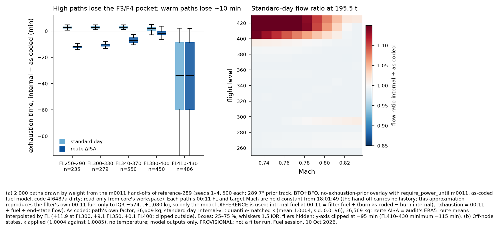

# Cross-check: internal-v1 against the fuel model as coded, on `reference-289` (delivery 2 of 3)

Fuel session, 10 Oct 2026. **PROVISIONAL: not a filter run.** Code: in-kernel, recorded in this note and in
`crosscheck-reference289-paths.csv`; models from `engine/fuel-model/` at the delivery-1 commit.

## Sources and declared deviations

**Sources.**
- **Paths.** Core's `runs/reference-289/bto-bfo/seed-{1..4}/handoff-m0011/handoff.toml`, read-only from core's
  workspace. The run was a 289.7° prior track, BTO+BFO, `davey2016` + `no-exhaustion-prior` +
  `reference-snapshots` + `reference-289`, with fuel as coded (factor N(1.0085, 0.0178), 36,609 kg) and
  `code_revision 4f6487a-dirty`.
- **Fuel model as coded.** The Python port of `fuel.rs` at 74e2e15.
- **Internal-v1.** Delivery 1.
- **Route temperatures.** The fuel audit's ERA5 means along 2,000 seed-1 routes.

**Deviations (with magnitudes).**
1. **Sample.** 2,000 of 400,000 hand-off rows: 500 per seed, drawn with replacement by weight.
2. **Constant-state paths.** The hand-off carries no history, so each path holds its 00:11 FL and target
   Mach from 18:01:49. Real paths average 2.1 climbs and 2.4 accelerations.
   - Run alone, this approximation reproduces the filter's own 00:11 fuel poorly: error median −13 kg,
     IQR −574 to +1,080 kg, correlation 0.45.
   - **Only the difference between the models is therefore used:** internal fuel at 00:11 = the filter's
     own fuel + (burn as coded − burn internal) along the same constant profile.
   - Exhaustion = 00:11 + fuel ÷ the flow at the 00:11 state.
3. **Temperature.**
   - The main case uses route ΔISA: the audit's FL300/350/400 means, interpolated in FL and clipped outside.
   - The bracket uses the 00:11 point value from the hand-off's `weather.temperature_k` (median +2.4 °C),
     which is colder than the route mean.
   - The standard day is shown for reference.
4. **Factor.** The internal κ is quantile-matched to each path's coded factor:
   κ = 1.0004 + 0.0196 (f − 1.0085)/0.0178.
5. **Weight on dry paths.** The reweighting below only removes paths that are dry before 00:11. It
   cannot add paths the coded model rejected, so it is not a posterior.

## 1. Flow over the envelope (`flow-ratio-internal-over-coded-envelope.csv`)

The grid is FL255–425 off-node × 175.5–220.5 t × M0.73–0.84, standard day, with each model's factor
(internal 1.0004, coded 1.0085). The table gives the ratio internal ÷ coded.

| band | median | 5 % | 95 % | min | max |
|---|---|---|---|---|---|
| FL250–290 | 0.992 | 0.969 | 1.008 | 0.899 | 1.079 |
| FL300–330 | 0.992 | 0.992 | 0.993 | 0.991 | 0.995 |
| FL340–370 | 0.993 | 0.992 | 1.021 | 0.991 | 1.177 |
| FL380–400 | 0.996 | 0.943 | 1.171 | 0.909 | 1.392 |
| FL410–430 | 1.046 | 0.939 | 1.286 | 0.909 | 1.366 |

12 % of states differ by more than 5 %, all at FL380 and above or at the FL250–290 frontier. Those are the F3,
F4 and above-ceiling cells. Elsewhere the difference is the factor alone (−0.8 %). On top of this, the
temperature term adds +3.4 % per +10 °C.

## 2. Along the posterior's paths (`crosscheck-reference289-by-band.csv`, Fig. 3)

*Footnote (Fig. 3).*
- **(a)** 2,000 paths drawn by weight from the `reference-289` m0011 hand-offs (seeds 1–4; run details
  above), each held at its constant 00:11 state. Only the difference between the models is applied to the
  filter's own 00:11 fuel. As coded: the path's factor, 36,609 kg, standard day. Internal-v1: κ
  quantile-matched, 36,569 kg, with route ΔISA or the standard day. Boxes span 25–75 %; whiskers are
  1.5 IQR; the y-axis is clipped at −95 min.
- **(b)** Off-node standard-day flow ratio at 195.5 t, with each model's factor.
- **Provisional; no filter run.**

Internal minus coded, median [10 %, 90 %]:

| band | n | Δ fuel at 00:11, route ΔISA (kg) | Δ exhaustion, standard day (min) | **Δ exhaustion, route ΔISA (min)** | Δ exhaustion, 00:11 point ΔISA (min) | dry before 00:11, route / point / standard day |
|---|---|---|---|---|---|---|
| FL250–290 | 235 | −1,179 | +2.8 | **−11.8 [−12.9, −10.7]** | −3.6 | 68 % / 32 % / 0 % |
| FL300–330 | 279 | −1,008 | +2.9 | **−10.5 [−11.9, −9.2]** | −0.8 | 58 % / 11 % / 0 % |
| FL340–370 | 550 | −631 | +2.9 | **−7.2 [−9.5, −4.0]** | −0.7 | 26 % / 4 % / 0 % |
| FL380–400 | 450 | −130 | +2.0 | **−1.5 [−27.6, +1.6]** | −1.1 | 16 % / 16 % / 14 % |
| FL410–430 | 486 | −3,009 | −33.8 | **−33.9 [−80.0, −1.2]** | −32.7 | 61 % / 60 % / 61 % |
| all | 2,000 | −839 | +2.4 | **−9.3 [−44.5, −1.0]** | −2.0 | 42 % / 25 % / 18 % |

Median exhaustion time over the sample: **00:23 as coded**, against **00:13** for internal with route ΔISA,
**00:17** with point ΔISA and **00:21** on the standard day. The coded filter's own rows are 0.45 % dry
before 00:11.

## 3. Where the differences come from

1. **The high paths (FL410–430, 24 % of the weight) lean on the F3/F4 pockets and on above-ceiling
   pricing.** They lose a median of 3,000 kg by 00:11, and 61 % run dry before 00:11 whatever the
   temperature. The reference posterior's high-altitude mass is therefore largely a fuel-model artefact,
   which agrees with the audit's F3–F5.
2. **The warm mid and low paths (FL250–370) lose 7–12 min to the temperature term** (+3–4 % flow at ISA+9
   to +12 °C). They gain about 3 min back from the corrected factor (F1). Because the coded filter kept
   these paths with little margin (mean 1,355 kg at 00:11), 26–68 % of them would be dry before 00:11.
3. **FL380–400 changes least,** because ΔISA ≈ 0 there and F1 and the edge fix partly cancel.

The magnitude depends on temperature. Route-mean ΔISA, which is warm (the 18:01–20:00 portion is
tropical), removes 42 % of the sampled weight. The 00:11 point value, which is cold, removes 25 %.
Core's run will use ERA5 along each path, which lies between the two.

## 4. The latitude effect (crude, provisional)

Removing the paths that run dry before 00:11, with no resampling, gives the following.

| removal under | weight kept | mean 00:11 latitude | Δ against all | P(34.5–36.5 °S at 00:11) |
|---|---|---|---|---|
| as sampled | 1.000 | −34.613 | — | 0.561 |
| internal, standard day | 0.821 | −34.714 | −0.10° | 0.567 |
| internal, route ΔISA | 0.582 | −34.553 | +0.06° | 0.543 |
| internal, point ΔISA | 0.752 | −34.766 | −0.15° | 0.568 |

The direction is **not determined**: the change runs from −0.15° to +0.06°. That is small next to the
path redistribution a filter run will make, because 18–42 % of the weight has to be replaced by slower,
more efficient states. **Only the bundled re-run can settle the 00:19 latitude.** Use fuel smoke S2–S4
(request 16 B) to read it off.

## 5. Implications for core's smoke tests

- Expect S2 (temperature) and S3 (F3/F4) to change the posterior far more than S1 (factor inversion). In
  this sample S1 alone moves exhaustion by about +2.5 min, S2 by −10 min at FL300–350, and S3 by −34 min
  at FL410–430.
- The weight dry before 00:11 is the main diagnostic. With rejection (F7, S5) it must be 0. The
  replacement mass will come from the endurance proposal, so check its acceptance rate.
