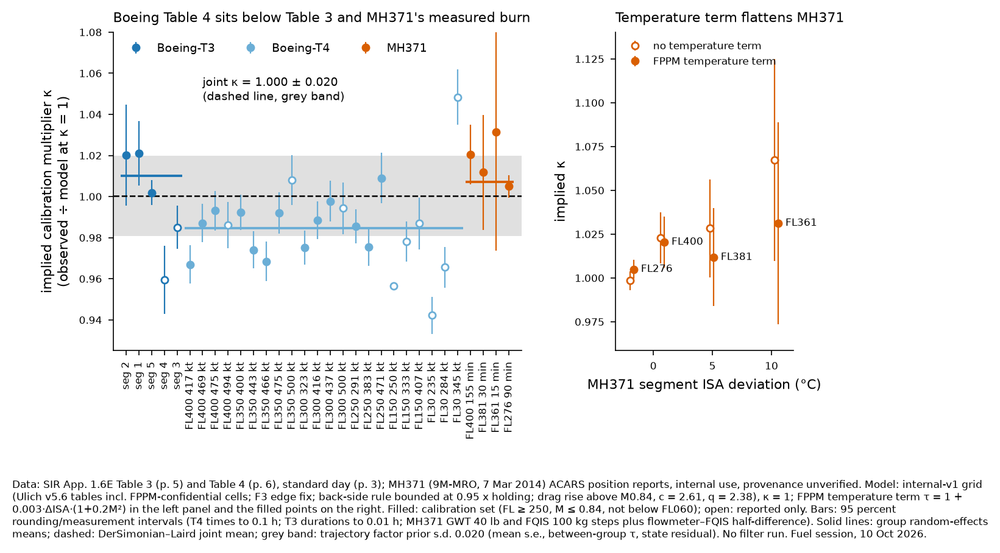
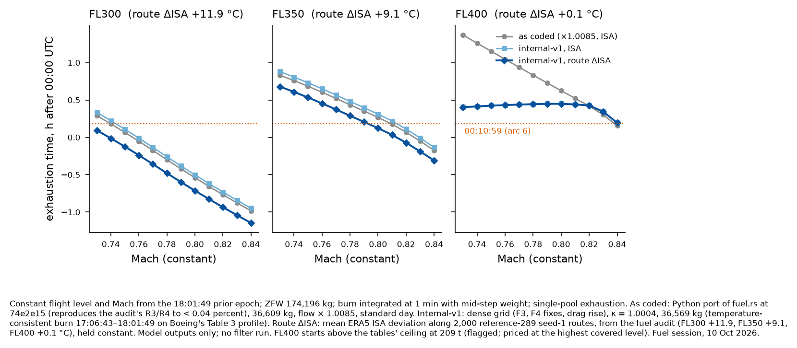

# Internal fuel model `internal-v1`: tables, corrections and calibration (delivery 1 of 3)

Fuel session, 10 Oct 2026, under `threads/master-prompts/fuel-model.md` (commit `74e2e15`) and core
request 16 C. Code: `engine/fuel-model/` (`tables.py`, `internal.py`, `calibrate.py`,
`build_internal.py`). Model file, **local use only, git-ignored**:
`engine/data/external/fuel-model/internal-v1.json` (8.3 MB). No `crates/` file was edited and no filter was run.

## Sources

| source | grade | used for |
|---|---|---|
| Ulich, 9M-MRO fuel model v5.6 (`data/fuel-tables.json`, sha256 `42d150e3…`, from engine-data artifact `2ba1a5a1`) | secondary; **includes FPPM-confidential cells**; ledger | all 16 grids: holding, MRC, CI 52, LRC, M0.84, LRC INOP, holding INOP. The repo copy `library_full_audit/MH370/9M-MRO Fuel Model V5.X.xlsm` (sha256 `a45373a2…`) extracts to **identical** grids, values and source classes in all 16 tables |
| Ulich v5.6 workbook, *Fuel Flow Model* and *Endurance Model* sheets (repo copy) | secondary (a public workbook) | temperature physics cross-check (TSFC ∝ θ^0.68, Reynolds +0.5 %/10 °C); the left/right tank estimate at 17:06:43 and the R/L cruise flow ratio 1.021 (*Endurance Model* C10, C11, C26). No table cell was taken from these sheets |
| SIR App. 1.6E (Boeing performance analysis), printed pp. 1–8 | primary, public | ACARS state (p. 1, p. 4); standard day (p. 3); Table 3 (p. 5); arc-1 fuel 73,908 lb and the R/L SFC note (p. 5); Table 4 (p. 6); simulator flame-out sequence (p. 8). Text copy in `ISO Sept 28 Status/inputs/end-of-flight/report-text/` |
| SIR Table 1.9A (printed p. 113, located via the archive citation ledger; not re-opened here) | primary, public | MH370 ACARS 17:01:43 and 17:06:43 |
| MH371, 9M-MRO ZBAA–WMKK, 7 Mar 2014: `library_full_audit/MH370/mh371-acars.xlsx`, `MH371_EHM_Export.xls` | **internal, provenance unverified**; ledger | 5.8 h of 5-min ACARS position reports (pressure altitude, Mach, SAT, gross weight from the flowmeter totaliser, FQIS fuel); EHM snapshots with per-engine fuel flow. Also the MH370 climb EHM report (16:52:21) in the same file |
| Fuel audit `results/fuel-model-audit-architecture.md` (`bffbe1a`) | project work | findings F1–F19; ERA5 route ISA deviations used in Fig. 2 |

## Declared deviations

1. **A second calibration source was added**: MH371's measured cruise burn (internal, provenance unverified). The brief names Boeing's 27 numbers and the ACARS state only. Results are given with and without it.
2. **The MH370 ACARS interval 17:01:43–17:06:43 was not used.** FQIS falls by 700 kg in 5 min, against a model value of 562 kg (implied κ = 1.24 ± 0.07). That is FQIS settling just after top of climb, so the interval carries no cruise information. The ACARS state enters as the initial condition only.
3. **No weight-dependent factor.** The residuals do not call for one once the evidence groups are separated (§3.3).
4. **Calibration set.** κ is fitted on 16 of the 27 Boeing numbers plus 4 MH371 segments: FL ≥ 250, M ≤ 0.84, not below FL060. The 5 items above M0.84 fit the drag-rise term instead. FL150 and FL030 (6 items) are reported, not fitted.
5. **Table 3 durations** are the printed hours. Distance ÷ ground speed would change seg 1 by 1 %; the printed hours sum to the ACARS-to-arc-1 clock interval to within 5 s.
6. **The model of record is the dense grid**, not the table lookup. They differ by a median of 0.03 %, but by up to 12 % between FL nodes in extrapolated regions (§2.2).

## 1. What the model is

    FF(FL, W, M, ΔISA) = κ_traj · τ(ΔISA, M) · G(FL, W, M)        kg/h, both engines

- **G** is a dense standard-day grid, trilinear:
  - FL015, 030, 050, then FL060–430 in steps of 10;
  - 150–250 t in steps of 1 t;
  - M0.40–0.90 in steps of 0.005;
  - a flag bitmask per cell.

  G is built from the table lookup with the audit's lookup fixes:
  - **F3:** bilinear corners with zero weight need not exist.
  - **F4:** below the slowest schedule, the a M² + b/M² fit is kept only when the slowest schedule
    is holding and its partner is at least 0.03 Mach away. The flow is never below 0.95 × the
    holding flow. Otherwise it is clamped at the slowest schedule's flow.
  - Below FL060, the FL060 Mach curve is scaled by holding(FL)/holding(FL060).
  - **Drag rise above M0.84:** D = 1 + c (M − 0.84)(C_L/0.35)^q, with c = 2.61 and q = 2.38,
    fitted to the 5 Boeing items above M0.84 at FL ≥ 250 (residual s.d. 2.1 %; **provisional**).
- **τ = 1 + 0.003 · ΔISA · (1 + 0.2 M²).** This is the FPPM footnote of +3 % per +10 °C of TAT
  (recorded in `extract.py`), written in the ISA deviation of SAT: 0.34 %/°C at M0.82. Ulich's
  physics form, θ^0.68 plus the Reynolds term, gives 0.36 %/°C. The audit's
  "0.3 %/°C of ΔISA" is 12 % smaller.
- **κ_traj is a multiplier** (Boeing ÷ model; > 1 burns more). The audit's F1 is removed by
  construction: nothing is divided.

### 1.1 Lookup checks

- **Port check.** With `fixed=False` the Python port reproduces the audit's "model ×1" column for all
  27 Boeing items to within 0.04 % (mid-step against start-of-step weight). It also reproduces
  the crate's worst flow of 23,571 kg/h at FL395, 217.86 t, M0.41.
- **Pockets (F4).** The F4 pocket states the audit quotes now price at 6,227 kg/h (FL400, 205 t,
  M0.73; coded 4,674) and 5,661 kg/h (FL430, 185 t, M0.73; coded 3,864).
- **Precondition test (F13).** Over the grid at 172–225 t, no cell falls more than **1.3 %** below
  the lowest tabulated schedule flow at that weight across all levels. At FL ≥ 250, no cell falls
  more than **5.0 %** below its own level's slowest schedule; this is the declared back-side bound.
- **Ceiling (F5)** is the highest level the tables price at each weight (`ceiling_fl` in the file):

  | weight t | 175–190 | 195–200 | 205–210 | 215–220 |
  |---|---|---|---|---|
  | FL | 430 | 420 | 410 | 400 |

## 2. Calibration (Fig. 1)

*Footnote (Fig. 1).* Data: SIR App. 1.6E Table 3 (p. 5) and Table 4 (p. 6), standard day (p. 3);
MH371 ACARS position reports (internal use; provenance unverified). Model: the internal-v1 grid at
κ = 1 with the FPPM temperature term (filled points on the right show the term; open points do
not). Filled points on the left are the calibration set; open points are reported only. Error bars
are 95 % rounding and measurement intervals. Solid lines are group means; the dashed line is the
joint mean; the grey band is the trajectory-factor prior s.d. No filter was run.

### 2.1 Result

| calibration | κ (multiplier) | s.e. | prior s.d. for κ_traj | audit-convention factor 1/κ |
|---|---|---|---|---|
| **Joint (recommended), with temperature term** | **1.0004** | 0.0085 | **0.0196** | 0.9996 |
| Joint, without temperature term | 1.0030 | 0.0109 | 0.0236 | 0.9970 |
| Boeing only (16 items), with or without temperature (standard day, so identical) | 0.9893 | 0.0037 | 0.0143 | 1.0108 |
| MH371 only, with temperature term | 1.0073 | 0.0026 | 0.0110 | 0.9928 |
| MH371 only, without temperature term | 1.0172 | 0.0088 | — | 0.9831 |
| Group: Boeing Table 3 (3 items) | 1.0102 | 0.0057 | residual s.d. 0.007 | |
| Group: Boeing Table 4 (13 items) | 0.9847 | 0.0032 | residual s.d. 0.0106 | |

The prior s.d. combines three parts in quadrature: the joint mean's s.e. (0.0085), the between-group
τ (0.0141, DerSimonian–Laird, Q = 33.3 on 2 d.f.) and the state-dependent residual (0.0106, Table 4
groups). That residual is systematic along a path that holds FL and Mach. Item values are in
`internal-calibration-items-{fppm,none}.csv`; fit details are in `internal-calibration.json`.

### 2.2 Findings

1. **The factor is now the right way round.** It sits close to 1: κ = 1.0004 ± 0.0196, against the
   coded N(1.0085, 0.0178) applied as a multiplier (F1). At standard day the internal model burns
   0.8 % less than as coded. With ERA5 route temperatures it burns 2.2–3.2 % more at FL300–350.
2. **Boeing's two tables disagree with each other by 2.5 %.** Table 3 (the 17:06–18:28 segments,
   heavy, M0.82–0.84) gives κ = 1.010. Table 4 (endurance from arc 1) gives 0.985. Table 4 is
   computed for constant altitude and TAS from 73,908 lb at arc 1. MH371's measured cruise burn at
   measured temperature, on the same airframe and engines a day earlier, gives 1.007. The measured
   flight thus agrees with Table 3, and Table 4 is the outlier. Table 4 is the most directly
   relevant figure for the post-arc-1 endurance, so the tension is carried as between-group τ, not
   resolved.
   - I checked one candidate explanation and rejected it: Table 4 timed to the left-engine
     flame-out under an R/L SFC asymmetry. Single-engine flow from the INOP tables is 0.80–0.99 of
     the twin flow (§4), so that shifts endurance by at most about 1 min.
3. **The temperature term is supported by MH371** (an internal check, not a proof). With no
   temperature term, MH371's four segments imply κ from 0.998 to 1.067, rising with ΔISA. With the
   FPPM term the spread falls (residual s.d. 0.0135 → 0) and the group mean moves from 1.017 to
   1.007, towards Boeing.
   - A free fit of the coefficient on MH371's flowmeter burn gives **0.0031 ± 0.0012 /°C**, against
     the FPPM rule's 0.0034 /°C. FQIS burn gives 0.0053 ± 0.0013 /°C.
   - It is confounded with flight level: the warm segment is FL361. Boeing's numbers are all
     standard day (p. 3), so they cannot test the term.
4. **Weight dependence is not called for.**
   - Within the Boeing set, a slope of +1.23 % per 10 t (± 0.32) appears. It is entirely the
     Table 3 against Table 4 contrast, because every Table 4 item has the same mean weight.
   - Within MH371 at FL400 (200 → 186 t, six 30-min blocks), κ runs 1.032, 1.026, 1.036, 1.023,
     1.023, 1.030, with no trend.
   - At FL276 (217 → 211 t) κ runs 1.003, 1.006, 1.001.
   - Audit F1b's weight trend is therefore treated as a group difference.
5. **Extrapolated regions (F6).**
   - Below the slowest schedule, the back-side rule brings the slow Boeing items into the cluster:
     FL350 M0.694 goes from 0.958 (clamped at holding) to 0.993. These states need no inflation.
   - Above M0.84, the drag-rise term leaves a 2.1 % residual, which core should carry as extra
     s.d. on those steps.
   - The grid differs from the table lookup by up to 12 % between FL nodes where the table lookup
     extrapolates from interpolated schedule points. The grid, linear in FL between priced nodes,
     is the stable choice, and the calibration is computed on it.

## 3. Fuel at 18:01:49 (supersedes F9's 36,725 kg for temperature-corrected runs)

The internal model is flown along Boeing's Table 3 profile from 43,800 kg at 17:06:43, with seg 3
ending at the radar end of 18:01:19 and seg 4 after that.

| case | fuel at 18:01:49 kg |
|---|---|
| κ = 1.0102 (reproduces Boeing Table 3), standard day | 36,749 (audit, Boeing's own fuel values: 36,725) |
| κ = 1.0004, standard day | 36,812 |
| **κ = 1.0004, ΔISA +10.5 at FL350 (ACARS SAT −43.8 °C), +10 at FL300** | **36,569** |
| same, FL300 at ΔISA +7 / +13 | 36,615 / 36,523 |

Boeing's 36,725 kg is a standard-day figure. A run that applies the temperature term after 18:01:49
should start from about **36,570 kg**. That is close to the configured 36,609 kg, by coincidence.
To keep the starting fuel consistent with each trajectory's own factor:
initial_kg = 43,800 − κ_traj × 7,228 kg, where 7,228 kg is the burn at κ = 1 with temperature.

## 4. Single engine: INOP data and the left/right imbalance (Pete's item 3)

**INOP data.**
- `grid_inop` in the model file holds the flow of the live engine with one engine inoperative,
  kg/h, at FL015–300, 150–250 t, M0.35–0.75. It comes from LRC INOP and from holding INOP ÷ 1.05,
  uncalibrated.
- Source classes: 296 of 297 LRC INOP flow cells are `fppm-open`; one is `fppm-confidential`.
- At about 176 t:
  - LRC INOP flows 5,312–5,498 kg/h at FL200–280;
  - holding INOP flows 4,350–4,827 kg/h at FL200–300;
  - the twin flow at FL350 M0.80 is 5,537 kg/h (κ = 1, ISA).
- The single-engine phase therefore burns at **0.79–0.99 of the twin flow**, not 0.6–0.7. On this
  basis the pooled exhaustion time and the left-engine flame-out differ by only Δt × (1 − ratio),
  about **0.1–1.5 min**, which is much less than the audit's F11 estimate of 0–6 min.

**Imbalance at 18:01:49** (`engine-imbalance-180149.csv`).

| input | value | source |
|---|---|---|
| L − R at 17:06:43 | +146 kg (L 21,973, R 21,827 kg) | Ulich v5.6, *Endurance Model* C10–C11: "from the fuel load sheet, R/L fuel flows during take-off and climb, and the last ACARS fuel report" (secondary) |
| R/L cruise flow ratio | **1.021** (range 1.013–1.035) | Ulich C26, from tank-quantity rates in level cruise on a prior 9M-MRO flight (secondary); MH371 EHM 05:06:41, FL400: WF-R/WF-L = 6,839/6,607 = 1.035 at equal EPR 1.243 (internal); MH370 EHM climb 16:52:21: 15,786/15,583 = 1.013 (internal). Direction confirmed by SIR App. 1.6E p. 5 (right engine SFC slightly greater) |
| burn 17:06:43 → 18:01:49 | 7,231 kg | §3 |

**Best estimate at 18:01:49:**
- **L − R = +221 kg** (L 18,395 kg, R 18,174 kg, of 36,569 kg).
- Range **+47 to +421 kg** over the flow ratio 1.013–1.035 and an imbalance at 17:06:43 of 0 to
  +296 kg.
- The right engine runs dry first. The left then has 280–1,030 kg (best 595 kg), which is
  **3–14 min** (best 7–8 min) at the single-engine flows above.
- That is consistent with the ATSB's "up to 15 min" (AE-2014-054, p. 9) and with Boeing's
  simulator choice of right first (App. 1.6E p. 8).
- For two fuel states, split each step's twin flow as R : L = r : 1 with r = 1.021 (s.d. ≈ 0.008).

## 5. Climb and descent (F10): recommendation

Adopt end of flight's form: **flow = level-flight flow × (thrust ÷ level-flight drag), with an idle
floor** (`results/eof-descent-fuel-oct09/README.md`).
- Thrust = D + W sin γ, so the factor is 1 + (L/D) sin γ.
- Use the same L/D that end of flight uses, and the idle floor from the ICAO Trent 892 idle mode as
  end of flight scales it.
- At 200 t this charges about 44 kg per 1,000 ft climbed, equal to the energy estimate of
  W g Δh / (η LHV) with η from the cruise state (the audit gave 42 kg).
- Two points for core:
  - The filter's 4,000 ft/min at FL350 implies about 2.5 × cruise flow, which is above
    climb-thrust capability at these weights. Cap the factor at a climb-thrust bound, or reduce
    the climb rate at high level.
  - Ulich's flight-plan coefficients (+0.37 % per 1,000 ft/min climb; −0.5 % per 1,000 ft/min
    descent; *Endurance Model* C29–C30) are two orders of magnitude below this physics. Do not
    use them for climb pricing.

## 6. Effect on exhaustion (Fig. 2)

*Footnote (Fig. 2).* Constant flight level and Mach from 18:01:49; single pool. As coded: Python
port of `fuel.rs` at 74e2e15, 36,609 kg, × 1.0085, standard day. Internal-v1: grid, κ = 1.0004,
36,569 kg. The route ΔISA values are the audit's ERA5 means along 2,000 `reference-289` seed-1
routes: +11.9 (FL300), +9.1 (FL350), +5.5 (FL370, interpolated), +1.9 (FL390, interpolated) and
+0.1 °C (FL400). Model outputs only; no filter was run.

Internal model minus as coded, in minutes of exhaustion time (`exhaustion-constant-profiles-internal-vs-coded.csv`):

| FL | standard day | route ΔISA |
|---|---|---|
| 300 | +2.1 to +2.6 | −9.7 to −11.7 |
| 350 | +2.4 to +2.9 | −8.1 to −9.2 |
| 370 | +2.6 to +2.9 | −4.2 to −4.4 |
| 390 | +1.0 to +2.7 | −1.4 to +0.2 |
| 400, M ≤ 0.80 | −10 to −58 (F3/F4: the coded endurance pocket removed) | same |
| 400, M ≥ 0.82 | +0.5 to +2.5 | +0.4 to +2.3 |

**Provisional.** These are constant profiles, not posterior paths. The cross-check along
`reference-289` paths is delivery 2.

## 7. What core needs: core requests 16 C-1 to C-8 (posted to `coordination/CORE_STAGES.md`)

1. **C-1, grid reader.** Load `data/external/fuel-model/internal-v1.json` → `grid`:
   - trilinear interpolation;
   - flags are the OR of the corners with non-zero weight;
   - a NaN corner with non-zero weight means unpriceable;
   - clamp to the grid in weight and Mach, flagging it.

   The unit test is `test_vectors`: 300 off-node points; match `flow_grid_kg_h` to 1e-9 relative.
   Gate it by config: `fuel.model = "internal-v1"`, with the current tables as the default, so
   `davey2016.toml` stays byte-identical.
2. **C-2, temperature argument.** Add it as
   `fuel_flow_kg_h(fl, weight_t, mach, delta_isa_k)`, with
   τ = 1 + 0.003 · ΔISA · (1 + 0.2 M²) and ΔISA = T_ERA5 − T_ISA(pressure altitude). This is a
   schema change to `FuelFlow`. Its consumers include end of flight's `takeover_priced`.
3. **C-3, factor.** κ_traj ~ N(1.0004, 0.0196) as a **multiplier**. Fix the doc comments. The
   sensitivity arms:

   | arm | κ_traj |
   |---|---|
   | Boeing-only | N(0.9893, 0.0143) |
   | MH371-only | N(1.0073, 0.0110) |
   | no temperature term | N(1.0030, 0.0236) |
4. **C-4, initial fuel.** Set it to 36,569 kg, or better 43,800 − κ_traj × 7,228 kg, for runs with
   the temperature term. 36,725 kg remains right only for a standard-day run.
5. **C-5, ceiling (F5).** Use `ceiling_fl(weight_t)` as the altitude bound, or as the declared
   penalty arm.
6. **C-6, extrapolation (F6).** Add an extra s.d. of 0.021 on steps above M0.84. Elsewhere none.
7. **C-7, two fuel states.** Initial L − R = +221 kg (s.d. ≈ 120 kg) at 18:01:49 and R : L = 1.021
   (s.d. ≈ 0.008). Use `grid_inop` for the live-engine flow after the first flame-out.
8. **C-8, climb and descent (F10).** As in §5.
