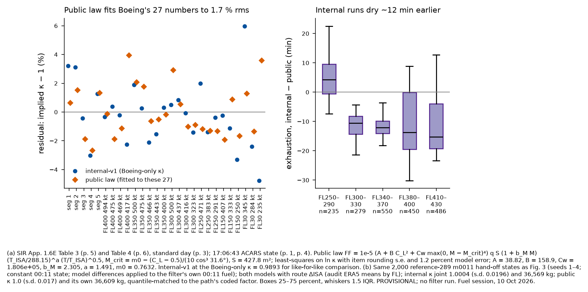

# Public parametric fuel-flow law (delivery 3 of 3), checked against `internal-v1`

Fuel session, 10 Oct 2026. Code: `engine/fuel-model/public.py`; parameters in `public-model.json`.
**PROVISIONAL**: the comparisons along posterior paths use the same constant-state method as delivery 2;
no filter was run.

## Sources and declared deviations

**Sources (all public).**
- SIR App. 1.6E, printed pp. 1–8:
  - the ACARS state (p. 1, p. 4);
  - the standard day (p. 3);
  - Table 3 (p. 5);
  - Table 4 (p. 6).
- The 777 reference wing area of 427.8 m² and quarter-chord sweep of 31.6°. These are standard published
  geometry values, not re-verified this session; a printed-page source is needed before submission.
- **Lock's wave-drag law** (C_Dw = 20 (M − M_crit)^4) and **Korn's C_L term** for the drag-rise Mach,
  dM/dC_L = −1/(10 cos³ Λ). These are textbook forms; a printed-page citation is needed before submission.
- **The corrected-parameter temperature scaling**, W_f/(δ√θ) constant at fixed F/δ and Mach. This is
  standard turbofan similarity; a printed-page citation is needed before submission.

**Deviations.**
1. **No openly published FPPM value was used.** The audit (§4) found no FPPM copy whose redistribution is
   licensed. The brief allowed such values; there were none to use.
2. **Fit set.** The fit uses all 27 Boeing numbers. The ACARS state enters only as the initial condition,
   because the 17:01–17:06 interval is FQIS settling (delivery 1, deviation 2).
3. **The temperature exponent is fixed at 0.5, not fitted.** Boeing's numbers are all standard day, so they
   cannot identify it. The standard-day altitude lapse of TSFC is a separate fitted exponent a.
4. **The parameter covariance is approximate** (Gauss–Newton). The s.e. of Cw is not meaningful: Cw is
   pinned by the 5 items above M0.84.

## 1. The law

    FF = 1e-5 · (A + B C_L² + Cw · max(0, M − M_crit)⁴) · q S · (1 + b_M M) · (T_ISA/288.15)^a · (T/T_ISA)^0.5
    q = 0.7 p M²,  C_L = W g / (q S),  M_crit = m0 − (C_L − 0.5) / (10 cos³ 31.6°),  S = 427.8 m²

The terms are:
- thrust = drag;
- a parabolic polar plus Lock's wave drag;
- TSFC linear in Mach with a power-law altitude lapse.

Only c_T·C_D0, c_T·K and c_T·C_w are identifiable from fuel data, so A, B and Cw absorb the TSFC scale.

| parameter | value | approx. s.e. |
|---|---|---|
| A | 38.82 | 12 |
| B | 158.9 | 28 |
| Cw | 1.806e+05 | 0.00081 |
| b_M | 2.305 | 1.2 |
| a | 1.491 | 0.35 |
| m0 | 0.7632 | 0.0067 |

**Fit quality.**
- rms of ln κ over all 27 numbers: **1.74 %** (internal-v1 at the Boeing-only κ:
  2.21 %, same formula).
- rms over the 15 items at FL ≥ 250 and M ≤ 0.84 (internal-v1 at the Boeing-only κ: 1.62 %): **1.48 %**.
- The worst item is 4.0 % (FL400 M0.727, the slowest FL400 point).
- Item residuals are in `public-model-boeing-items.csv` and Fig. 4a.
- Suggested trajectory factor: **N(1.0, 0.017)**, from the residual scatter.
- Temperature: +2.3 % flow per +10 °C at FL350 M0.80, against +3.4 % for the FPPM rule in internal-v1.
- Fuel at 18:01:49 along Boeing's Table 3 profile: **36,609 kg** with ΔISA +10.5/+10 °C,
  and 36,764 kg on the standard day.

## 2. Each model checked against the other

*Footnote (Fig. 4).*
- **(a)** Residuals on the 27 Boeing numbers (SIR App. 1.6E Tables 3–4, pp. 5–6; standard day, p. 3). The
  public law was fitted to them; internal-v1 uses the Boeing-only κ = 0.9893.
- **(b)** The same 2,000 `reference-289` m0011 hand-off states as delivery 2 (seeds 1–4, constant 00:11
  state, model differences applied to the filter's own 00:11 fuel), with route ΔISA:
  - internal: κ 1.0004 (s.d. 0.0196), 36,569 kg;
  - public: κ 1.0 (s.d. 0.017), 36,609 kg;
  - κ is quantile-matched to each path's coded factor.
- Provisional; no filter run.

**Along reference-289 paths, internal minus public exhaustion, median [10 %, 90 %], route ΔISA**
(`crosscheck-internal-vs-public-reference289-by-band.csv`):

| band | n | Δ exhaustion (min) | dry before 00:11, internal / public |
|---|---|---|---|
| FL250–290 | 235 | +4.2 [−2.6, +14.8] | 68 % / 76 % |
| FL300–330 | 279 | −10.5 [−16.8, −6.9] | 58 % / 11 % |
| FL340–370 | 550 | −12.1 [−15.2, −7.1] | 26 % / 0.4 % |
| FL380–400 | 450 | −13.7 [−24.5, +4.2] | 16 % / 8 % |
| FL410–430 | 486 | −15.2 [−21.0, +6.5] | 61 % / 51 % |
| all | 2,000 | **−11.5 [−19.9, +5.6]** | 42 % / 25 % |

The median exhaustion over the sample is **00:13 internal** and **00:21 public**.

**On constant profiles from 18:01:49** (`exhaustion-constant-profiles-internal-vs-public.csv`), internal minus
public with route ΔISA is:
- −7 to −16 min at FL300–350;
- −2 to −17 min at FL370;
- −29 to +8 min at FL390–400, slow to fast.

## 3. Where the differences come from (`internal-vs-public-decomposition.csv`)

| FL, M | ΔISA | calibration level (min) | temperature coefficient (min) | shape (min) | total (min) |
|---|---|---|---|---|---|
| FL300 M0.76 | +11.9 | −4.8 | −5.4 | +0.6 | −9.6 |
| FL300 M0.80 | +11.9 | −4.4 | −5.0 | −5.3 | −14.6 |
| FL350 M0.76 | +9.1 | −5.3 | −4.4 | −1.7 | −11.4 |
| FL350 M0.80 | +9.1 | −5.0 | −4.3 | −3.7 | −13.1 |
| FL370 M0.79 | +5.5 | −5.2 | −2.9 | −5.0 | −13.1 |
| FL400 M0.76 | +0.1 | −5.1 | −0.8 | −17.3 | −23.1 |
| FL400 M0.80 | +0.1 | −5.1 | −0.8 | −4.9 | −10.8 |
| FL400 M0.84 | +0.1 | −4.9 | −0.9 | +14.0 | +8.3 |

1. **Calibration level, about −5 min everywhere.** Internal-v1 is calibrated jointly to Boeing and to MH371's
   measured burn (κ 1.0004). The public law sees only Boeing, which is equivalent to the internal Boeing-only
   κ of 0.9893. That is 1.1 % more flow, plus the matching 18:01:49 fuel. **This is the Table 4 against
   MH371 tension, and it cannot be resolved with public data.**
2. **Temperature coefficient, −3 to −5 min at ΔISA +5 to +12 °C.** The FPPM rule gives 0.34 %/°C and the
   corrected-parameter √θ gives 0.23 %/°C. MH371's free fit (0.31 ± 0.12 %/°C, internal) lies between them
   and cannot separate them.
3. **Shape, which matters most at FL400.**
   - At M ≤ 0.80 the table model burns more (−5 to −17 min). Its holding schedule at heavy FL400 weights
     sits near M0.81, so the back-side rule raises flow below it. The smooth public polar puts minimum drag
     lower.
   - At M0.84 the public law's drag rise starts earlier (m0 = 0.763 + the Korn term) and burns more
     (+14 min).
   - At FL250–290 the public law burns more than the tables (+4 min), where the tables extrapolate above LRC.
   - Boeing's own FL400 items do not separate the two shapes: residuals −1.9 to +4.0 % (public) against
     −2.3 to +0.4 % (internal at the Boeing-only κ).

## 4. Recommendation for the paper and for core

- **The paper uses the public law**, with κ ~ N(1.0, 0.017) and the √θ temperature term. Internal-v1 is its
  validation, and the paper reports the three differences above as systematic uncertainties:
  - level ±1.1 % (Boeing Table 4 against measured burn);
  - temperature coefficient 0.23–0.34 %/°C;
  - shape at FL380+ and low Mach.
- **For the filter (fidelity), use internal-v1.** Run the public law as a sensitivity arm in the same
  `FuelFlow` schema, which needs core request 16 C-9 below. The ~11 min median difference in exhaustion along
  reference-289 paths is a measured quantity worth carrying into the paper as a model-form sensitivity.
- **Core request 16 C-9 (new, low priority, not for tonight's run).** Add a `fuel.model = "public-v1"` arm that
  evaluates the closed form above from `public-model.json`. It is about 20 lines and needs no tables, so it is
  shippable in the public repository.
