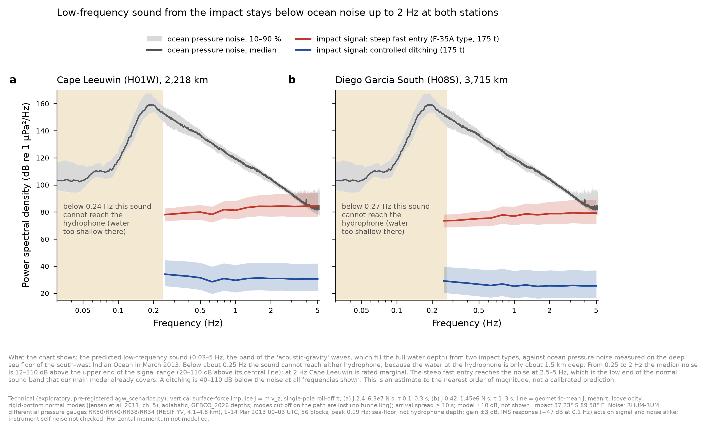

# Hydroacoustics: acoustic-gravity-wave (AGW) estimate for the two impact scenarios (EXPLORATORY)

*Hydroacoustic Module, 10 Oct 2026, ~23:45 UTC. Pre-registered at `55ebdcc` (`prepare/exploratory/agw_scenarios.py`, module
branch) before any noise record was fetched or any signal level computed. Results at `24f122ec`
(`results-data/agw_scenarios/`). Order of magnitude only. This is never a likelihood term.*

## Question
Pete asked: "any way we could estimate AGW for the same scenarios?" The scenarios are the same as on the noise-vs-impact
charts: (a) steep fast entry, F-35A type; (b) controlled ditching. Both use 175 t, an impact at 37.23° S 89.58° E,
and the receivers Cape Leeuwin (H01W, 2,218 km) and Diego Garcia South (H08S, 3,715 km).

## Result
1. **Below 0.24 Hz (H01W) and 0.27 Hz (H08S), no full-water-depth mode reaches the hydrophone at all.**
   - The water is about 1.5 km deep at both moorings: GEBCO gives 1,569 m at H01W, and 1,412 m on the approach to H08S.
   - The first mode is cut off below c/4h there.
   - So the true sub-cutoff AGW band, and the 0.1–0.2 Hz band that a 4 km source excites, cannot be seen at these
     stations. This holds whatever the source strength. (The gravity mode, i.e. surface waves, travels at
     ≤ 200 m/s and arrives hours later, under the infragravity noise.)
2. **From 0.25 to 2 Hz the median ocean noise is 12–110 dB above the upper end of the signal range** for both
   scenarios at both stations (20–110 dB above the central line).
   - The smallest margin is 11.6 dB, at 2 Hz at H01W, scenario (a). That band is rated "marginal" by the
     pre-registered rule. *(Corrected after review: the first version said 20–110 dB, which is the central line,
     not the upper end.)*
   - The secondary microseism peaks at 0.19 Hz, at 159 dB re 1 µPa²/Hz (median).
   - Pre-registered verdict: "not detectable" in every band up to 1.6 Hz (H01W) and 2.0 Hz (H08S).
3. **Only scenario (a) comes near the noise, at 2.5–5 Hz.**
   - The verdict there is "marginal" or "possibly detectable" (upper end of (a) up to +11.5 dB over the median noise
     at 5 Hz, H01W).
   - That band is the low end of the ordinary acoustic band that the SOFAR branch already models. It is not a separate
     AGW channel.
4. **Scenario (b) (ditching, vertical momentum only) is 40–110 dB below the median noise in every band.**
5. **Consistency check (not a calibration):** at 5 Hz this momentum-impulse model gives 84 dB (a) at H01W. The
   η-calibrated SOFAR model gave 91.5 dB at 10 Hz on the scenario chart. These agree to within the model's ±10 dB.

So AGWs add no detection channel for either scenario at the IMS stations. Kadri's "AGW" signals sit in his 2–40 Hz band.
Physically they are the acoustic arrival this module already models (as concluded on 9 Oct). This note now adds an
explicit number for the band below 2 Hz.

## Method (as pre-registered)
- **Source:** a vertical surface-force impulse J = m v_z with a single-pole roll-off τ.
  - (a) J = 2.4–6.3e7 N s, τ = 0.1–0.3 s;
  - (b) J = 0.42–1.45e6 N s, τ = 1–3 s.
- **Waveguide:** isovelocity, rigid-bottom normal modes (Jensen et al. 2011, ch. 5), with the source in the surface
  boundary condition.
  - Adiabatic, with GEBCO_2026 path depths.
  - A mode cut off anywhere on the path is lost. There is no tunnelling; Kadri, Abdolali & Kirby (2025) describe
    partial tunnelling.
  - Arrival spread ≥ 10 s. Modes are summed as if they overlapped in time, which favours detection.
- **Noise:** RHUM-RUM differential pressure gauges RR50, RR40, RR38 and RR34 (RESIF network YV; sea floor at 4.1–4.8 km).
  - 1–14 March 2013, 00–03 UTC; 56 three-hour blocks, none dropped.
  - Welch PSD, 600 s windows.
  - The plausibility gate passed: peak at 0.19 Hz, 8.6e3 Pa²/Hz, inside the pre-registered 1e-2–1e4. The level is near
    the top of that range; this is disclosed.

## Caveats
- The noise is measured on the sea floor, and the hydrophones are at 1.0–1.4 km depth. The year is 2013, not 2014.
  The DPG gain is uncertain by about ±3 dB.
- The model is uncertain by ±10 dB, which is not drawn.
- Horizontal momentum is not modelled.
- The IMS response is −47 dB at 0.1 Hz relative to 10 Hz. It scales signal and noise alike, but instrument self-noise
  was not checked. If self-noise dominates, detection is harder still.
- The audit of TL calibration (architecture, 17:50 −0600) applies to the 2.5–5 Hz overlap with the SOFAR branch.

## COVERAGE
- **Feasible set:** every impact the end-of-flight posterior allows, at all entry modes.
- **Model's reach:** a vertical-impulse source only; horizontal momentum and cavity collapse are outside the model's reach.
- **Proposal's coverage:** two fixed scenario points at one impact location. The posterior is not sampled, so there is
  no ESS.
- **Gap (declared):** other locations along the 7th arc. The receiver-depth cutoff (finding 1) does not depend on
  location. The 0.25–1.6 Hz margin is ≥ 17.7 dB at the upper end (11.6 dB at 2 Hz, H01W).
- **Parameter bounds and sources:**
  - 175 t and 270–360 m/s from the end-of-flight reference-289 dive branch;
  - vertical speed 2.4–8.3 m/s from the scenario chart's vertical KE of 0.5–6 MJ;
  - τ from aircraft length divided by speed (declared, not sourced).

- Hydroacoustic Module
