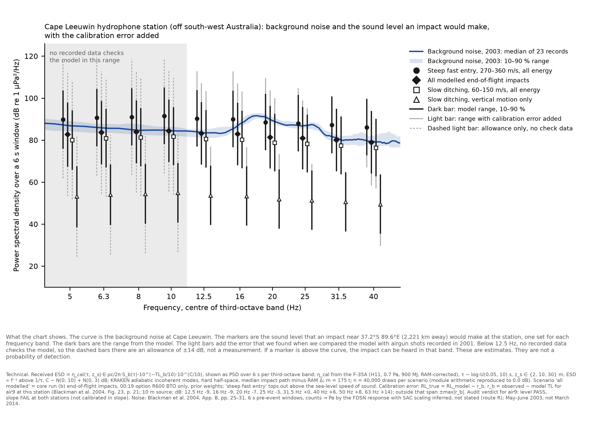
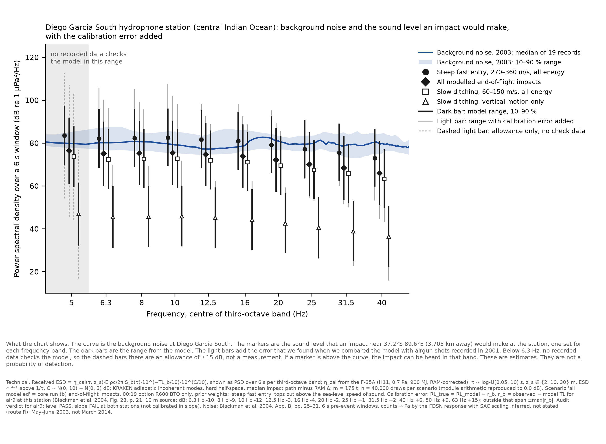
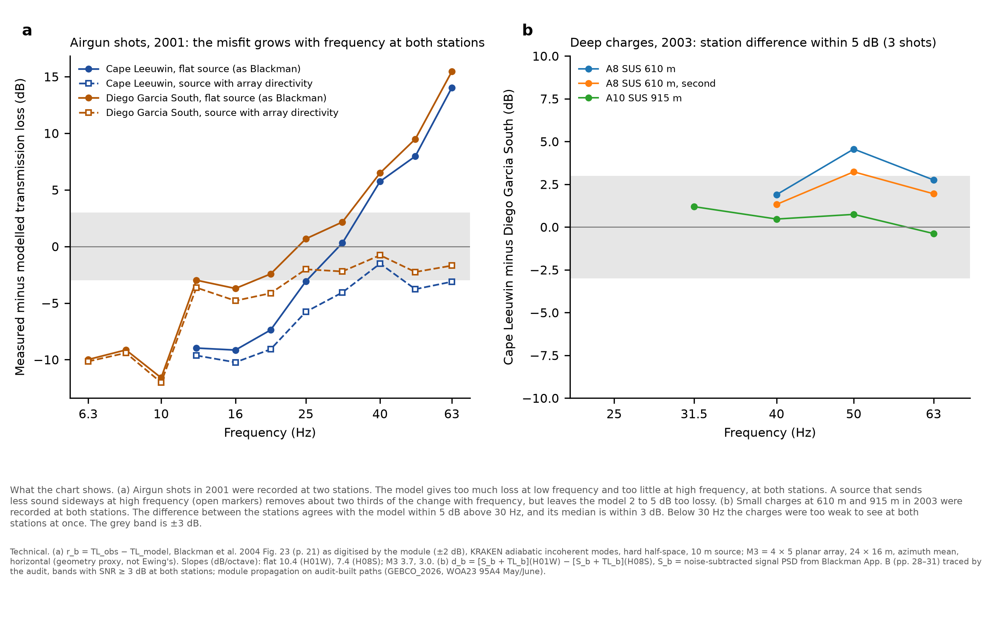

# Hydroacoustics: independent audit of bugs and model fidelity (architecture, 10–11 Oct 2026)

Commissioned by Modular Architecture at Pete's request (10 Oct 2026, ~17:45 −0600). The audit is read-only on module
code: module branch `hypothesis/hydroacoustics` @ `3412bc6`, scripts imported unchanged. Criteria were pre-registered
before any comparison: `criteria.md` (`940f1a3`) and the C3 source-model declaration (`7157b77`; amendments `90ab705`,
`adaf1ab` changed one citation and no number). All audit code, data and charts are in `results/hydroacoustics-audit/`.

## Verdict

The propagation engine is sound as code. Its arithmetic reproduces exactly, and its path part checks out. **But the
model is not calibrated in the bands that matter for an aircraft impact.**
- **Absolute transmission loss for a near-surface source** fails the pre-registered slope test at both stations. The
  misfit is +10.4 dB per octave at Cape Leeuwin and +7.4 at Diego Garcia South. The per-band errors run from −12 dB to
  +15.5 dB, even though the median errors (−1.4 and −2.4 dB) pass.
- **The airgun test cannot say why.** An array-directivity source model removes about two thirds of the tilt, but the
  amount depends on an array geometry that Blackman does not print. So the airgun data cannot calibrate how a
  near-surface point source couples into the sound channel.
- **The path part does reasonably well.**
  - The station difference for the near-surface source is PARTIAL: level −2.8 dB, slope +2.4 dB per octave.
  - For deep SUS charges, the station difference is PASS on 3 of 3 scorable shots, but only over 31.5 to 63 Hz.
- **Below 12.5 Hz**, the bands where the impact markers stand highest above noise, there is only one constraint:
  airgun data at Diego Garcia South (6.3–10 Hz). There the model over-predicts the loss by 9 to 12 dB, which makes it
  conservative. Nothing checks Cape Leeuwin below 12.5 Hz.
- **The source term** (η from the F-35A) reproduces to 0.02 dB. But it is one event at another site, and it constrains
  only a 5–40 Hz broadband product of η and the model's own coupling error there.
- **Under the module's own rule, the chain may enter only as a predictive or sensitivity calculation**, not as a
  likelihood that moves the posterior (criteria C6: NOT CALIBRATED).
- **The Pléiades hydro test is unaffected in substance.** Under every TL perturbation the audit tried, ln R_hyd stays
  within noise, with abs(ln R) ≤ 0.30. Its *power* is sensitive, though: E[ln R | H] runs from 0.015 to 0.37 in the
  primary scenario.

## Deviations and data limits (declared)

1. **No module-independent propagation code.** The propagation is the module's KRAKEN wrapper, imported read-only.
   The SUS paths come from the audit's own builder (`scripts/paths.py`): 0.5 km spacing, 3×3-cell GEBCO median and
   bilinear WOA23. Against the shared transport on air9→H01W it matches to a median depth difference of 0.9 m,
   sound speed within 8e-5 m/s, and TL within 0.15 dB at 10 and 31.5 Hz.
2. **Absolute SUS source spectra are not used.** Gaspin & Shuler (1971, NOLTR 71-160, DTIC AD0734381) is public, but
   DTIC blocks automated access. Chapman (1988, JASA) is closed. SUS is therefore scored source-free, by the station
   difference, and the implied source levels are reported, not graded. The absolute SUS part of C4 and its
   detection-consistency rule are **not scored**.
3. **Appendix B signal spectra** were traced by the audit with the module's frame and tick code and a red mask. The
   signal window is assumed to equal the 6 s noise window; the report states the window for the noise only. Two
   panels failed detection (A6sus3 at H01W, A7sus2 at H08S). The A11→H08S geodesic crosses the Cocos (Keeling)
   Islands, so the model gives no TL there.
4. **Power checks used N_SYN = 1,000** synthetic data sets per hypothesis, not the stand-in's 2,000. The base run
   reproduces the stand-in within Monte Carlo noise (held-out E[ln R | H] 0.077 against 0.069; mean P_D identical).
5. **ln R_hyd was recomputed on the stand-in's 5,000-row source packages** (8 nuisance replicas), **not** on the full
   impact rows of `rhyd_result.py`, which is heavy compute outside this audit's limits. The package base
   (R600 BTO only: −0.126) differs from the stand-in's full-row −0.046. Only the **shifts** between variants are
   interpreted. Values are provisional.
6. **The array-directivity model (M3)** uses the Langseth 4-string footprint as a proxy for Ewing's 20-gun array.
7. **The air9 observations are the module's digitisation of Fig. 23** (±2 dB). They were not re-digitised.
8. **`ims-noise` variant:** a +5.4 dB TL shift at both IMS stations stands in for the module's Blackman-noise offset
   at H01W. The H08S offset is −0.65 dB, but H08S does not enter scenario A.

## Components

| component | evidence | verdict (C6) | error |
|---|---|---|---|
| Absolute TL, near-surface source, 12.5–63 Hz | air9, C1 | **NOT CALIBRATED** (slope FAIL at both stations, every source depth 9/10/12 m) | level −1.4 (CL) / −2.4 (DGS) dB; slope +10.4 ± 0.9 / +7.4 ± 0.7 dB/oct; per band −12 to +15.5 dB |
| Absolute TL, near-surface source, below 12.5 Hz | air9 at DGS only (6.3–10 Hz) | **NOT CALIBRATED** (level FAIL) | −10.0 dB median (model 9–12 dB too lossy); Cape Leeuwin: no data |
| Path, near-surface source (station difference) | air9, C2 | PARTLY | level −2.8 dB, slope +2.4 ± 0.4 dB/oct, shape 0.7 dB |
| Path, deep source (station difference) | SUS A8 610 m ×2, A10 915 m, 31.5/40–63 Hz | PARTLY (C2 PASS, 3 shots, ≤ 1 octave) | median +2.8, +1.9, +0.6 dB; max 4.6 dB |
| Absolute level, deep source | SUS implied source level, 50 Hz, 13 shot-stations | not graded (no reference spectrum) | 187.6–212.5 dB re 1 µPa²·s/Hz at 1 m; sd 4.7 dB without A11 |
| Source term η_cal (F-35A) | arithmetic, C5 | arithmetic PASS (≤ 0.02 dB); transfer NOT CALIBRATED | one event; 22 dB spread across z_s ∈ {2, 10, 30} m; template choice 3.3 dB; band of the 0.7 Pa unknown |
| Background noise (Blackman App. B) | provenance trace | PARTLY | normalisation inferred, not stated; route R′ would be 48 dB lower; amplitude-averaging bias up to −1 dB; 2003 May–June, not March 2014 |
| P_D at IMS triads | code read | NOT CALIBRATED | IMOS 3274 detector curve + 4.8 dB triad gain + IMOS 3376 noise |
| Blockage (islands, ridges) | SUS A11→H08S | NOT CALIBRATED | geodesic adiabatic model blocks totally; the shot was observed |
| Timing (group speed) | code read; App. B | adequate | 1.482 ± 0.006 km/s (stand-in) against 1.49 (Rust default) |

## Findings

**F1 (high). The absolute TL from a near-surface source fails slope at both stations.** Data: `data/air9_audit_summary.json`.
- **H01W (Cape Leeuwin):** slope +10.37 ± 0.93 dB per octave over 12.5–63 Hz; level −1.39 dB; shape 1.72 dB.
- **H08S (Diego Garcia South):** slope +7.41 ± 0.70 dB per octave over 6.3–63 Hz; level −2.43 dB; shape 2.22 dB.
- **Source depth makes no difference:** the result is the same at 9, 10 and 12 m.
- **The residual is almost purely a linear tilt** (shape ≤ 2.2 dB). This is why the module's median and RMS rule read
  as "partly validated".
- **Fix:** adopt slope and shape criteria (these, or the module's own), and relabel air9 "not calibrated in slope".

**F2 (high). The source-spectrum hypothesis is not supported under the rule, and it is not refuted.** Data: C3.
- **M2, the vertical ghost** (module's sensitivity row): makes the fit worse. Slopes 9.6 / 4.7 dB per octave.
- **M3, horizontal array directivity:** slopes 3.67 / 3.02, so it fails the ≤ 3 dB per octave rule by 0.67 and 0.02.
  Levels −4.9 / −3.6 dB.
- **M4 (M2 + M3):** slopes 2.9 / 0.3, but the levels fail (−9.7 / −6.8 dB).
- **Geometry sensitivity** (not pre-registered): a 16 × 12 m array gives 7.0 / 5.2 dB per octave; a 36 × 24 m array
  gives 1.8 / 1.2 dB per octave.
- **Reading:** source directivity of the same size as the misfit is physically plausible. The NMFS notice, FR
  2012-07717, p. 10, says horizontal effective source levels are lower than downward ones. So **airgun data cannot
  calibrate near-surface point-source coupling in slope**, and the aircraft impact has no array.
- **Fix:** do not use air9 for absolute or slope calibration of the impact source. Use it for the path, through the
  station difference only.

**F3 (high). Nothing checks Cape Leeuwin below 12.5 Hz. At Diego Garcia South (6.3–10 Hz), the model is 9–12 dB too lossy.**
- **What the brief missed:** it said measured TL exists only at 13 Hz and above. That holds for H01W. Fig. 23 (DGS
  panel) has air9 from 5.4 Hz, and the module's own trace contains it.
- **SUS does not help below 30 Hz.** Its SNR is ≥ 3 dB below 30 Hz on only one path, A11→H01W (8–63 Hz). There the
  implied source spectrum rises +7.9 ± 0.3 dB per octave, against about +6 dB per octave expected for an
  explosion-bubble source well below its bubble frequency. That expectation is physical reasoning, not a measured
  SUS spectrum.
- **Consequence:** in the bands where the impact stands out most, the model is unconstrained at H01W, and
  conservative by about 10 dB at H08S, for an airgun source.

**F4 (medium). C_site ~ N(0, 10 dB) is frequency-flat; the measured error is a structured tilt.** Where it is used:
`lhyd.py:92`; the module's `f35a_eta_calibration.py` part 2.
- **In magnitude**, a flat 10 dB σ covers most single bands at 1σ.
- **In structure**, it misrepresents a broadband sum: the band errors are anti-correlated about 25–30 Hz, and
  their weighted sum depends on the spectral shape.
- **Fix:** carry the calibration error as level + slope (two nuisance parameters, σ from F1 and F2), plus an explicit
  "unconstrained" allowance below the data span. Label results "conditional on the calibration error model".

**F5 (medium). The F-35A η_cal reproduces, but as a calibration it transfers only a broadband product.**
- **Reproduction:** `data/f35a_eta_check.csv`, ≤ 0.02 dB at every station, source depth and τ (C5 PASS).
- **What η_cal is:** η × (the model's coupling at the Japan-trench site and in its shallow channel) × (the 0.7 Pa
  band assumption) × (the IMOS peak-to-exposure template; T_C2 against T_C1 is 3.3 dB).
- **The site's shallow channel is modelled.** The module's TL at H11 already contains it (TL at 5 Hz, 10 m source:
  124.4–125.2 dB at 3,342 km, against 135.8 dB at 1,663 km for air9→H01W). Brown's "upper bound" caveat therefore applies to
  Brown's own Arons-law estimate, not to η_cal.
- **What carries to MH370:** the difference between the model's coupling errors at the two sites. No data constrains
  that difference.
- **Fix:** state η_cal as an effective, single-event calibration. Add more aircraft impacts with energy estimates
  (task 2c list).

**F6 (low). Brown's η ≈ 2.1e-4 uses Arons' free-field shock law at 3,300 km.** Brown (2026) preprint, Eq. 2 on p. 9 and
the F-35 text on p. 17. Reproduced: W = 0.0447 kg TNT, η = 2.08e-4.
- **Problem:** the law is outside its domain at SOFAR ranges.
- **Status:** the module's predictions do not use it (good). It appears in briefs.
- **Fix:** do not quote "η ≈ 1e-4" as a coupling efficiency.

**F7 (low). `band_fraction` normalises over 1–500 Hz** (`imos_stageB_map.py:38-45`).
- **Effect:** for τ > 1 s the spectral shape inside the band is identical, so half the log-τ prior is degenerate, and
  the reported η values (up to 0.085 at z_s = 2 m) are "in 1–500 Hz" efficiencies, not physical ones.
- **No effect on predictions:** η_cal(τ) absorbs it exactly.
- **Fix:** normalise over 0–500 Hz, or document the convention.

**F8 (medium). The stand-in's IMS SNR uses the IMOS Perth Canyon proxy noise ("3376") at H01W and H08S** (`lhyd.py:158,186`).
- **What it should use:** the module made Blackman App. B noise primary. That noise is +5.4 dB at H01W (−0.65 dB at
  H08S) relative to the proxy.
- **Effect:** mean P_D at H01W drops from 0.596 to 0.423 (R600 BTO only), and E[ln R | H] (scenario A) from 0.18 to
  0.15.
- **Fix:** use the station's App. B noise.

**F9 (medium). P_D at the IMS triads is borrowed.** It is the IMOS 3274 logic fit plus a 4.8 dB triad gain (`lhyd.py:30`).
- **Problem:** neither the detector nor the gain is calibrated for IMS triads.
- **Fix:** injection-recovery on IMS-like records, once the raw data are held.

**F10 (medium). The noise provenance is traceable but not fully stated.**
- **Normalisation (route R):** a SAC amplitude spectrum, PSD = 2A²/T with T = 6 s. This is inferred from the legend
  file names. The report states counts and 6 s, nothing more (printed p. 25).
- **Averaging bias:** averaging amplitude spectra across sensors and smoothing biases the noise low by up to about 1 dB.
- **Response:** the FDSN response is one epoch from 2001/2002 to the present, and is assumed valid for 2003.
- **Season:** the noise is for May–June 2003, not March 2014 (whale choruses and shipping differ by season).
- **Fix:** carry ±3 dB conversion uncertainty, and replace with 2014 IMS spectra when the raw data arrive.

**F11 (medium). The adiabatic geodesic model treats islands as total blockage.**
- **Case:** A11sus→H08S crosses the Cocos (Keeling) Islands (12.19°S, 96.87°E; GEBCO −1 m), so the model gives no
  field. The shot was detected at H08S (Appendix B Fig. B11).
- **Bearing on MH370:** the same logic sets Chagos blocking for H08N.
- **Fix:** an N×2D or 3D check (horizontal refraction or diffraction) for small islands before any H08N
  non-detection is used.

**F12 (medium). The charts were not rigorous about calibration.**
- **What was missing:** the markers carried the module's flat C_site, with no frequency-structured error and no mark
  of where data constrain the model.
- **Scenario gap:** the scenarios left 150–270 m/s unshown; that range holds 22–24 % of the end-of-flight prior weight.
- **Infeasible speeds:** scenario (a) runs to 360 m/s, above the sea-level speed of sound.
- **Fix:** the corrected charts below.

**F13 (low). `impact_log_likelihood` returns 0.0** (`lib.rs:136-137`), as declared (predictive mode). No bug.

**F14 (low). Units and conventions are internally consistent.**
- **Source to received level:** SE_1m = ηEρc/2π (hemisphere; `physics.rs:75`); KRAKEN TL is re free-field monopole
  pressure at 1 m; the band PSD is SE/bandwidth/6 s, in Blackman's PSD-over-6 s convention. The 2π/4π choice cancels
  in the F-35A transfer.
- **Peak against energy:** these are linked only through R = p_pk²/SE.
- **TL sign:** consistent (TL = −20 log|p|).
- **Band integration:** third-octave power means.

## Fidelity against known data (task 2)

**a. air9 and air8.**
- **The air9 numbers reproduce** from the module's data (`scripts/air9_audit.py`). H08S matches the module's slope
  exactly. For H01W the audit gets 10.4 dB per octave on 8 bands (power mean, ≥ 2 points); the module quotes 12.7
  dB per octave on its own band set.
- **Blackman's source assumption:** a peak level of 230–240 dB re 1 µPa at 1 m "in the 5~60 Hz range" from the
  near-source hydrophone (Fig. 2; printed p. 7). Observed TL is source minus received level.
- **air8:** not re-run. The module's RAM result (+18.3 dB band mean) stands as a negative control, weakened.

**b. SUS 2003.** Scoring, results and limits:
- **Scored:** 8 shots detected at both H01W and H08S were traced; 13 shot-station spectra gave a usable 50 Hz signal.
- **Station difference:** 3 shots scorable, all PASS (`data/sus_summary.json`). It validates **path** propagation for
  deep sources over 31.5–63 Hz only.
- **Implied absolute source levels** at 50 Hz: 187.6–212.5 dB re 1 µPa²·s/Hz at 1 m; median 192.2 dB and sd 4.7 dB
  without A11. One 0.82 kg charge type should have one level, so the spread measures the absolute deep-source error of
  model plus chart reading. It is ungraded until a published SUS spectrum is in hand.

**c. Other calibrated events (candidates, not run).**
1. **Blackman 2001/2003 glass-sphere implosions** (sph1, 22 L at 690–725 m; sph5). Energy comes from volume ×
   hydrostatic pressure; App. B spectra are available; deep sources.
2. **Blackman 2001 air1–air7** (Fig. 23: DGN air1–5, DGS air7/air8, CL air7): more near-surface airgun lines; directivity
   is confounded as in F2.
3. **Kadri (2024) aircraft-impact list** (about 10 events). Near-surface and aircraft-like, so the most relevant to
   coupling. They need impact-energy estimates and IMS waveforms (CTBTO vDEC, not FDSN).
4. **Argentine Navy calibration explosion of 1 Dec 2017** (ARA San Juan search), recorded at IMS HA10/HA04. It appears
   in the CTBTO-station paper (PAGEOPH 2022, doi 10.1007/s00024-022-03090-0; closed access, not read); details are
   unverified.
5. **Heard Island Feasibility Test, 1991**: calibrated 57 Hz sources and Indian Ocean paths, but before H01/H08.
6. **Earthquake T-phases** are excluded: no credible source level.

**d. F-35A.** See F5 and F6. The upper-bound nature lies in the 0.7 Pa band and the peak-to-exposure ratio, both of
which bias η_cal high, and in the single-site transfer, whose sign is unknown. It enters MH370 predictions one for
one in dB, in every band, because η_cal multiplies SE.

**e. Below 13 Hz.**
- **Cape Leeuwin:** nothing.
- **Diego Garcia South:** the air9 airgun data at 6.3–10 Hz (model 9–12 dB too lossy), and SUS only at A11→H01W, from
  8 Hz (source-free shape only).
- **F-35A:** η_cal constrains only the broadband 5–40 Hz sum.

## Charts (task 3)

**What the corrected charts change:**
- **Markers:** the module's arithmetic is reproduced to 0.0 dB, and each marker carries a second, signed range that
  adds the air9 calibration error band by band.
- **No-data region:** shaded, with dashed ±max-error allowances.
- **New scenario (c):** "all modelled end-of-flight impacts", which covers the 150–270 m/s gap.
- **Labels and footnotes:** plain-language titles and legends; a two-part footnote (STE100 and technical) in the
  bottom quarter.

**Calibration checks:**

## Consequences for the Pléiades hydro test (task 4; sensitivity, provisional)

**Variants** (`scripts/sens.py`; stand-in scripts unchanged; N_SYN = 1,000):
- **TL ± 8 dB:** a level shift.
- **Tilt ± 10.4 dB per octave about 25 Hz**, clipped to ±15 dB.
- **emp:** the measured H08S per-band residual applied on the impact paths.
- **emp-recal:** emp, with η_cal re-inverted under the same correction on the H11 paths.
- **ims-noise:** see F8.

| 00:19 option | variant | E[ln R | H], A | P(abs(ln R) ≥ 1 | H), A | E[ln R | H], C (raw triads) | ln R_hyd (5k package), A |
|---|---|---|---|---|---|
| Held Out | base | 0.077 | 0.066 | 0.68 | −0.108 |
| | range over variants | 0.015 (TL+8) to 0.134 (TL−8) | 0.016–0.134 | 0.28–1.14 | −0.178 to −0.074 |
| R600 BTO Only | base | 0.181 | 0.146 | 0.96 | −0.126 |
| | range | 0.128 (emp-recal) to 0.227 (tilt+) | 0.105–0.212 | 0.66–1.60 | −0.237 to −0.126 |
| R600 BTO + Raw BFO | base | 0.184 | 0.148 | 0.91 | −0.131 |
| | range | 0.184 to 0.374 (tilt+) | 0.147–0.288 | 0.91–1.60 | −0.297 to −0.072 |

**What this shows:**
- **The R_hyd reading is robust.** Every variant keeps abs(ln R_hyd) ≤ 0.30, so "within noise" survives the
  calibration error.
- **The power check is not robust.** With held data (A), the test stays weakly informative, P(abs(ln R) ≥ 1) ≤ 0.29.
  With raw triads (C), its expected yield moves by a factor of about 2–4.
- **The stand-in's "within noise" is a genuine null for this model.** It is not evidence against the hypothesis
  beyond what the power check allows, and the power figure itself must carry the calibration label.

Data: `data/sensitivity_power_check.csv`, `data/sensitivity/<option>/`.

## Coverage (task 5; Pete's sampling-coverage rule)

**(a) Feasible set.** Ocean impact of a 175 t 777 at any speed and flight-path angle the end of flight can produce,
including ditching, spiral and rapid descents, in-air breakup and fragmentation, and multiple surface entries.

**(b) Model's reach.** The hydro source is E (total KE, or vertical KE as a variant) × η_cal(τ, z_s) from one
near-vertical high-speed event.
- **No dependence on angle, speed, attitude or breakup.** η is the same per joule for a 2° ditching and a 60° dive.
- **τ and z_s are drawn independently of the kinematics**, from fixed priors. The end-of-flight columns
  `latent:energy_transfer_tau90_s` and `latent:breakup_p_*` exist but are unused, and NaN in these packages.
- **Fragmentation and multiple entries:** not representable.

**(c) Proposal's coverage.** The end-of-flight impacts in the stand-in packages span speeds of 60–378 m/s and angles of
0.4–67°.

| region (prior weights, 5,000-row package) | Held Out: weight / ESS | R600 BTO Only: weight / ESS | R600 BTO + Raw BFO: weight / ESS |
|---|---|---|---|
| v < 100 m/s | 0.245 / 665 | 0.291 / 768 | 0.311 / 854 |
| 100–150 | 0.350 / 1,060 | 0.298 / 845 | 0.298 / 831 |
| 150–200 | 0.173 / 539 | 0.161 / 461 | 0.151 / 446 |
| 200–270 | 0.067 / 213 | 0.061 / 173 | 0.068 / 202 |
| ≥ 270 | 0.165 / 505 | 0.189 / 570 | 0.172 / 519 |
| flight-path angle < 5° | 0.691 / 2,072 | 0.633 / 1,770 | 0.649 / 1,832 |
| 5–30° | 0.139 / 383 | 0.172 / 460 | 0.169 / 470 |
| ≥ 30° | 0.171 / 520 | 0.194 / 584 | 0.183 / 547 |

**Gaps:**
- **G-H1 (reach):** coupling has no angle, speed or breakup dependence. Every result is conditional on "η per joule
  as for the F-35A". Status: OPEN; name it in every label.
- **G-H2 (reach/feasible):** speeds ≥ 340 m/s are supersonic at sea level, and appear both in end-of-flight samples
  (maximum 378 m/s) and in chart scenario (a). Refer to end of flight. Status: OPEN.
- **G-H3 (charts):** the 150–270 m/s descents were unshown. Status: CLOSED by scenario (c).
- **G-H4 (calibration span):** below 12.5 Hz at H01W the model is unconstrained. Status: OPEN; carried as an
  allowance.

## Prioritised fix list for the module

1. **Relabel air9 "not calibrated in slope"** and adopt slope and shape criteria (F1). Use air9 only via the station
   difference (F2).
2. **Replace flat C_site with a level + slope calibration-error model**, plus an explicit unconstrained allowance below
   the data span (F4). Propagate it into P_D and every chart.
3. **Bring in more near-surface calibration events:** Kadri's aircraft list with energy estimates, then the Blackman
   sphere implosions. Fetch Gaspin & Shuler (1971) by hand (public DTIC; automated access is blocked) so the absolute
   SUS test can be scored (F3, F5).
4. **In lhyd and the stand-in successors,** use App. B noise for IMS (F8). Label IMS P_D as borrowed until
   injection-recovery on IMS data (F9).
5. **Check island and ridge blockage with N×2D or 3D** before any H08N non-detection is used (F11).
6. **Coupling dependence on impact kinematics:** tie τ and z_s to the end-of-flight columns, or declare G-H1 in every
   label (coverage).
7. **Minor:** the band_fraction normalisation (F7); stop quoting Brown's η (F6); add ±3 dB noise conversion and a
   season caveat (F10).

## Files

- `hydroacoustics-audit/criteria.md`, `c3-source-models.md`: pre-registrations.
- `hydroacoustics-audit/scripts/`: `paths.py`, `sus_tl.py`, `sus_spectra.py`, `sus_score.py`, `air9_audit.py`,
  `markers.py`, `charts.py`, `fig_residuals.py`, `sens.py`.
- `hydroacoustics-audit/data/`: `air9_residuals.csv`, `air9_audit_summary.json`, `sus_tl.csv`, `sus_spectra.npz`,
  `sus_bands.csv`, `sus_summary.json`, `markers_audit.json`, `sensitivity_power_check.csv`, `sensitivity/`.
- Charts: `hydroacoustics-audit-noise-vs-impact-{H01W,H08S}.{png,pdf}`, `hydroacoustics-audit-calibration-checks.{png,pdf}`.

*Architecture audit, 11 Oct 2026.*
