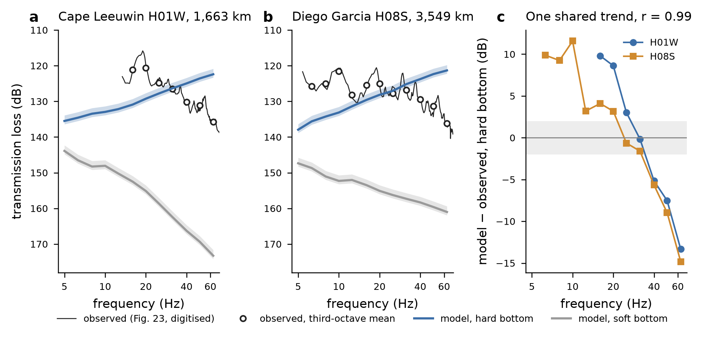

# Hydroacoustics: propagation engine against Blackman (2004), with air9 as the case and air8 as the negative control - PROVISIONAL

**Why provisional.** The ocean environment is the WOA23 + GEBCO_2026 path stub (rulings item 5 and H3), not
the shared ocean-transport API. The observed values are DIGITISED from a low-resolution chart (Fig. 23,
±2 dB). Both criteria were pre-registered and committed before the first run: `72046ff` for air9 and
`6fd9268` for air8. All code is on `hypothesis/hydroacoustics`.

## Engine

- **Model:** KRAKEN normal modes, one profile every 5 km, summed by FIELD as **incoherent adiabatic
  modes**. That is the shot- and band-averaged quantity Fig. 23 plots.
- **Volume attenuation:** Francois-Garrison, plus the spherical-spreading correction.
- **Source:** 10 m depth, with 9 and 12 m as the stated range.
- **Receivers:** FDSN triad centroid depths.
- **Bottom:** two declared half-space alternatives.
- **Checks on the engine:**
  - Against the closed-form incoherent mode sum in an ideal waveguide, the error is 0.0007 dB with an
    explicit mesh. KRAKEN's automatic mesh was 0.095 dB off, so the mesh is now set explicitly.
  - Digitisation is reproducible: the script regenerates the trace byte for byte.
- **Wall time** (single thread, outside the lock, as ruled): 171 s for 48 KRAKEN+FIELD runs (two paths ×
  two bottoms × 12 bands, 334 and 711 profiles), and 234 s for the air8 control (96 runs).

## 1. air9: pre-registered verdict **PARTLY VALIDATED** at both stations (hard bottom); soft bottom **rejected**

| station, hard bottom, 10 m source | bands | median residual | RMS residual | verdict |
|---|---|---|---|---|
| H01W (1,663 km) | 7 | −0.15 dB | 7.93 dB | partly validated |
| H08S (3,549 km) | 11 | +3.17 dB | 7.91 dB | partly validated |
| soft bottom, either station | | +28 to +36 dB | | not validated, rejected |

**The level is right and the frequency slope is wrong, by the same amount at both stations.** Over the
seven bands both stations share (16–63 Hz), the residuals correlate at **r = 0.988**. Once their
common component is removed, each station's residual is **1.7 dB RMS**, inside the chart-reading
uncertainty. The common component is a slope of about **−10.6 dB per octave**: the model lets high
frequencies couple too well and low frequencies too poorly. A term shared by a 1,663 km path and a
3,549 km path is a **source-side or near-source term, not a path term**. Two explanations were tested
and neither accounts for it:

- **A flat source level.** Blackman's Fig. 2 near-source PSD, digitised, is nearly flat over 10–63 Hz
  (about 227–231 dB re 1 µPa²/Hz). Correcting for it makes the fit worse (RMS 9.1 and 11.7 dB).
- **The surface ghost.** A correction for a ghost already contained in the quoted source level also
  makes the fit worse (RMS 9.0 dB at H01W).

What remains is the mechanism Blackman name in the text beside Fig. 2: **seafloor topography, slope and
roughness near the shot control how the down-going pulse couples into the sound channel.** A flat
half-space with no roughness cannot represent that. An exploratory test, not pre-registered, takes the
**station-to-station difference**, which cancels the source term. It fits to a median of −1.5 dB and
an RMS of 3.4 dB, so the **path** part of the engine does reasonably well.

**Consequence for MH370.** An aircraft impact is also a near-surface source over deep, rough
seafloor. **Near-source coupling must enter the predictions as a declared term with roughly ±10 dB of
frequency-dependent uncertainty.** It cannot come out of a flat-bottom model. This is the C_site of
literature-review implication 2, and it widens the coupling-efficiency (η) range the injection-recovery
study must span.

## 2. air8 negative control: **EXPLAINED** - the air8 path to H01 is blocked at a ridge near 28.6°S, 97.8°E

| hard bottom, 16–50 Hz | median Δ = TL(air8) − TL(air9) | pre-registered verdict |
|---|---|---|
| H01W (air8 not detected) | **+38.1 dB** | negative control **FOLLOWS** (≥ 10 dB) |
| H08S (air8 detected) | **+0.1 dB** | positive control **CONSISTENT** (≤ 5 dB) |

- **Where the loss happens.** It is concentrated at one ridge crossing, 1,112–1,277 km along the
  2,812 km path to H01W. The crest is at **1,116 m**, at 28.55°S, 97.78°E (Broken Ridge region), where
  the local channel axis is at 1,150 m. TL rises **40 dB above cylindrical spreading** across that
  stretch and by at most 3.1 dB anywhere else (the 200–600 km segment; correction 9 Oct: first written as "less than 3 dB"). That meets the pre-registered blockage rule (a step of at
  least 6 dB).
- **Why air9 escapes it.** The air9 path to H01W starts east of the ridge and never crosses it.
- **The soft bottom** also "follows", but it fails the positive control (+6.7 dB at H08S), so it does
  not count.
- **This differs from Blackman's own statement**, "blockage of air8 shots is not known to be
  significant". Their blockage modelling (de Groot-Hedlin's 8 Hz PE, Fig. 22) was mapped for H08N.

**Robustness** (post hoc and labelled). The crest depth comes from GEBCO's satellite-gravity prediction
(TID 40), not from soundings. Adiabatic theory strips modes at a ridge absolutely, which overstates real
blockage, where energy leaks by diffraction and mode coupling.

| crest depth | Δ at H01W |
|---|---|
| 1,116 m (GEBCO) | +38.1 dB |
| 1,416 m (+300) | +23.2 dB |
| 1,616 m (+500) | +16.6 dB |
| 1,916 m (+800) | +13.8 dB |

The verdict survives an 800 m error in crest depth. With the crest that deep, the remaining excess
comes mostly from the second shallow feature near 2,372–2,724 km (2,111 m). The magnitudes are upper
bounds until a coupled-mode or PE cross-check (RAM) is run.

## What this does and does not establish

- **Established, provisionally:**
  - Path propagation to about 3.4 dB RMS (differential).
  - The negative control: the model does **not** predict that air8 should have been seen at H01, which
    was the failure mode the brief warned of.
  - A strong rejection of the soft-bottom alternative.
- **Not established:**
  - Absolute TL from a near-surface source to better than about 8 dB RMS across 16–63 Hz.
  - Blockage magnitudes. Adiabatic modes overstate them; the coupled-mode or PE cross-check is next.
- **Next in the sequence:** the F-35A at H11 (Brown et al. 2026) as a second calibration, this time with
  a known aircraft source, and noise estimates from the raw data held.

*Hydroacoustics module, 2026-10-09.*

## Addendum, 9 October 2026: rerun on the shared ocean transport (ruling H5; `212e76d`)

The stub is retired. The same scripts were rerun, unchanged, on the shared API's paths:
- **Inputs:** the same GEBCO_2026 cells, now at 250 m spacing, and WOA23 October monthly fields above
  1,500 m instead of the Oct–Dec season.
- **How close they are:**
  - path lengths agree to 0.5 km;
  - median depth difference 0 m (95th percentile 10–13 m);
  - the air8 crest is identical (−1,116 m);
  - sound speed differs by ≤ 0.68 m/s (95th percentile) below 500 m and by 2.5–3.2 m/s near the surface.

| result | stub | shared | label |
|---|---|---|---|
| air9 H01W, hard, 10 m: median / RMS | −0.15 / 7.93 dB | −0.10 / **8.17 dB** | PARTLY → **NOT VALIDATED** |
| air9 H08S, hard, 10 m: median / RMS | +3.17 / 7.91 dB | +3.33 / **8.05 dB** | PARTLY → **NOT VALIDATED** |
| air8 Δ_H01 / Δ_H08S | +38.1 / +0.1 dB | +39.1 / +0.5 dB | EXPLAINED (unchanged) |
| inter-station correlation of residuals (exploratory) | 0.988 | 0.988 | |
| RMS after removing the common mode (exploratory) | 1.71 dB | 1.74 dB | |

**What this means.**
- The pre-registered criterion is RMS ≤ 8 dB, so on the authoritative environment **the air9 absolute
  verdict is NOT VALIDATED**, by 0.05–0.17 dB. The earlier "PARTLY VALIDATED" was marginal, and it does
  not survive a sub-dB change in near-surface sound speed.
- **The substance is unchanged.** The model reproduces the *difference* between the two stations to
  about 1.7 dB. The absolute misfit is a common, frequency-dependent near-source term of about
  −10.9 dB/octave, now carried as C_site with ±10 dB (ruling H6).
- The engine is therefore fit for **relative** propagation. Any absolute level must carry C_site.

*Hydroacoustics module, 2026-10-09.*
