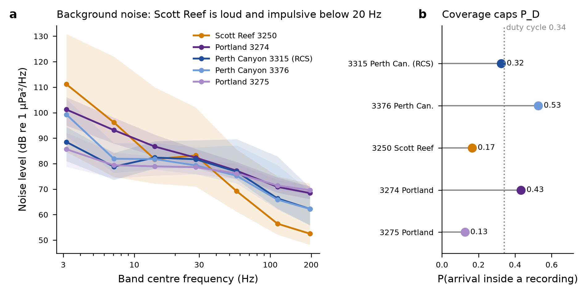

# Hydroacoustics item 1d: noise in the IMOS raw data, and what the recorders could have caught - PROVISIONAL

**Pre-registered** at `0ffa244` (`prepare/imos_preregistration.py`) before any sample was read. Run by
`prepare/imos_noise.py` at `hypothesis/hydroacoustics` HEAD. Outputs are in `results-data/imos1d/`.

**Data.** IMOS/Curtin CMST passive-acoustic loggers, from IMOS's public S3 copy (`MH370.zip`, sha256
00d02720…033a; `Portland_MH370.zip`, sha256 71696ef4…f58b). Per-file sha256 values are in
`data/imos/recordings.csv`.

| logger | site | recordings, 8 March | notes |
|---|---|---|---|
| 3315 | Perth Canyon; CMST's "RCS", 450 m | 100 | |
| 3376 | Perth Canyon, 2.8 km from 3315 | 100 | |
| 3250 | Scott Reef, 216 m | 100 | |
| 3274 | Portland | 144 | from 12:00 on 7 March |
| 3275 | Portland, 2 km from 3274 | 96 | |

All loggers sample at 6 kHz, recording about 307 s every 15 min (a 34% duty cycle). The analogue
high-pass corner is at 8 Hz.

## 1. Clock: the sign convention is resolved, and checked twice

The package does not say which way the logged clock error runs. The pre-registered test was the Curtin
event at RCS, which CMST 2014-30 (p. 6) places at **01:33:44 UTC ± 4 s**.

- **The test.** The 5–40 Hz envelope peak at 3315 converts to **01:33:43.76 UTC under convention A**
  (true = logger − e(t)), 0.24 s from CMST. Convention B lands at 01:34:35, 51 s off. **A is accepted**
  and is now used for every logger. The peak stands 4.6 times above the median envelope.
- **Independent check, made after the pre-registration.** CMST's Scott Reef note (Duncan, McCauley and
  Gavrilov, 4 September 2014, p. 2) gives the drift-corrected start of the 3250 record as 01:29:45.9.
  Convention A gives 01:29:44.9. The 1 s difference is the footer's sub-second field: "- 46818", read as
  1/65536 s, adds 0.71 s. That field will be used for timing in 2b.

## 2. Noise per band (dB re 1 µPa²/Hz; 1 s levels pooled over the background recordings)

| logger | 2–5 Hz | 5–10 | 10–20 | 20–40 | 40–80 | 80–160 | 160–240 |
|---|---|---|---|---|---|---|---|
| 3315 Perth Canyon (RCS) | 88.5 | 78.8 | 82.4 | 81.7 | 76.9 | 66.4 | 62.2 |
| 3376 Perth Canyon | 99.3 | 81.9 | 81.8 | 79.3 | 75.3 | 65.9 | 62.2 |
| 3250 Scott Reef | 111.2 | 96.2 | 81.7 | 83.2 | 69.2 | 56.4 | 52.5 |
| 3274 Portland | 101.2 | 93.2 | 86.7 | 82.4 | 77.2 | 70.9 | 68.5 |
| 3275 Portland | 85.7 | 79.4 | 78.9 | 78.6 | 76.2 | 71.4 | 69.6 |

Values are medians. The 5th and 95th percentiles, the Welch percentiles, the burstiness measures and the
calibration gains are in `noise_bands.csv` and `calibration_gain.csv`.

- **Background recordings per logger:** 25–47, about 2.1–4.0 h of audio. For 3315, 3376 and 3250 the
  background is asymmetric: about 0.5–1 h before the signal window and 6 h after, because the MH370 set
  starts at 00:00 on 8 March. This is reported, not padded.
- **Calibration:** the gain at 2–5 Hz is only 12–16 dB below the gain at 100 Hz, so no band trips the
  pre-registered 20 dB roll-off flag. The electronic self-noise floor is not in the package, so the
  2–5 Hz levels may partly be instrument noise. A recording at 2–5 Hz can carry no more than these
  levels allow.
- **The Perth Canyon pair agrees within 3 dB above 5 Hz.** That is an internal check on the calibration.
  3376 is 11 dB louder at 2–5 Hz, probably flow noise.
- **Scott Reef is loud and impulsive below 20 Hz.**
  - The 95th percentile reaches 131 dB at 2–5 Hz; P99 − P50 is 25–39 dB; excess kurtosis runs to
    thousands.
  - Exploratory: 16 of its 27 background recordings repeat strongly (autocorrelation > 0.3) at 8–9 s.
  - CMST's note says these recordings are dominated by Bryde's whale calls at 25–50 Hz, with short
    impulsive signals "of unknown but probably local origin". **The source of the periodicity is not
    identified here;** it is not called an airgun.
- **The Portland pair, 2 km apart, differs by about 8 dB at 10–20 Hz,** and by 15 dB at 2–5 Hz. These are
  site-specific, not regional, levels.

## 3. Coverage: the duty cycle alone caps P_D

The probability that the predicted SOFAR arrival from the core-region stand-in falls inside a recording
(convention A):

| logger | median arrival (UTC) | coverage | range, 2.5–97.5% |
|---|---|---|---|
| 3315 | 00:51:17 | **0.32** | 1,741–2,571 km |
| 3376 | 00:51:18 | **0.53** | 1,743–2,573 km |
| 3250 | 01:08:36 | **0.17** | 3,069–4,134 km |
| 3274 | 01:14:48 | **0.43** | 4,103–4,611 km |
| 3275 | 01:14:47 | **0.13** | 4,101–4,609 km |

Because the two loggers at each site are offset by about 5 min in schedule, the chance that **at least
one** Perth Canyon logger is recording is higher than either alone. Item 2b will compute that. Path
blockage is **not assessed**: there is no shared bathymetry for these paths (ruling request H5). The
Scott Reef path passes near North West Cape and the Exmouth Plateau.

## 4. What this gives the later items

- **2b and 2c have their positive controls.** The Curtin event (CMST's fix: Carlsberg Ridge, 2.11°N
  69.31°E, 00:25:13 ± 85 s; probably geological) is recorded at RCS (01:33:44) and Scott Reef (01:32:49).
  It is **predicted, and not yet looked for, at 3376**, 2.8 km from RCS. That is an independent
  positive control.
- **Item 3 has its noise:** injection-recovery uses these background recordings as its noise.

**Deviation, disclosed.** The metadata labels hydrophone sensitivity "dB re V²/Pa²". The values (−197.8,
−197.7, −196) are the magnitudes of a sensitivity re 1 V/µPa, and read literally every level would sit
120 dB above any measured ocean noise. The first run applied the literal label and gave about 200 dB re
1 µPa²/Hz. The method is unchanged; only the unit reading was corrected.

*Hydroacoustics module, 2026-10-09.*
