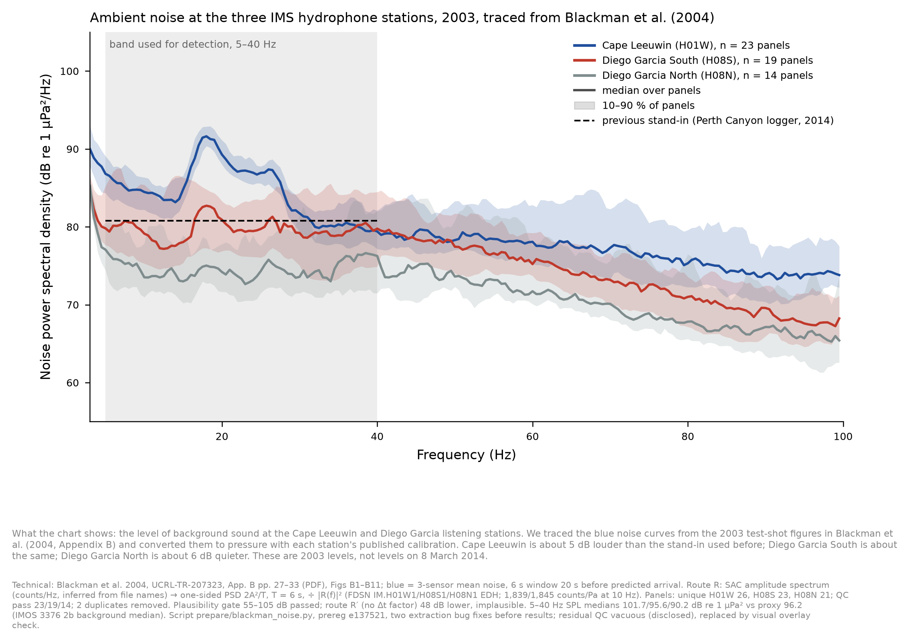
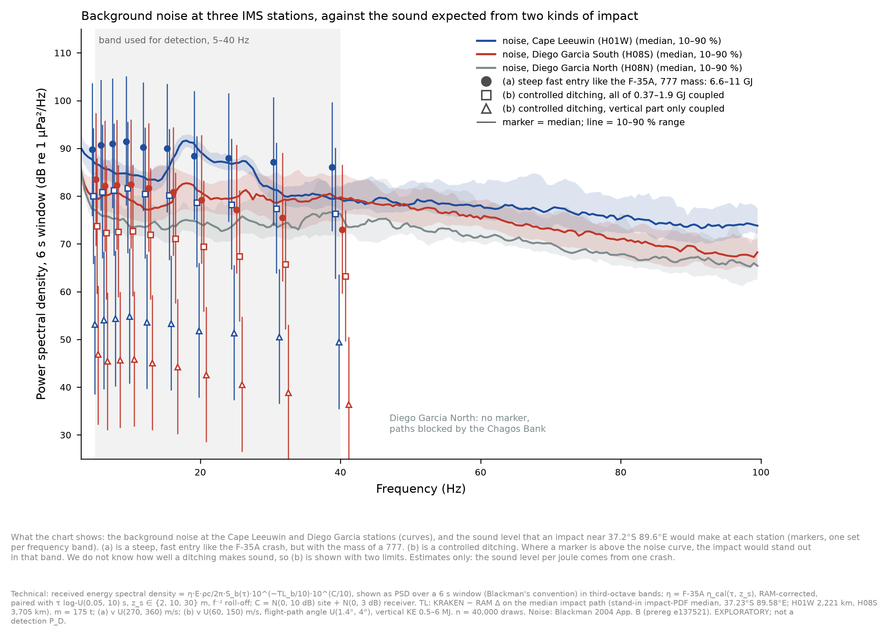
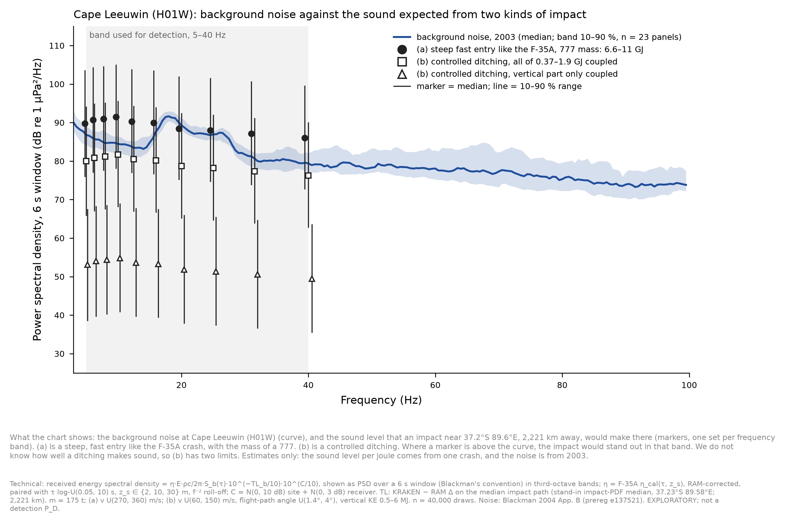
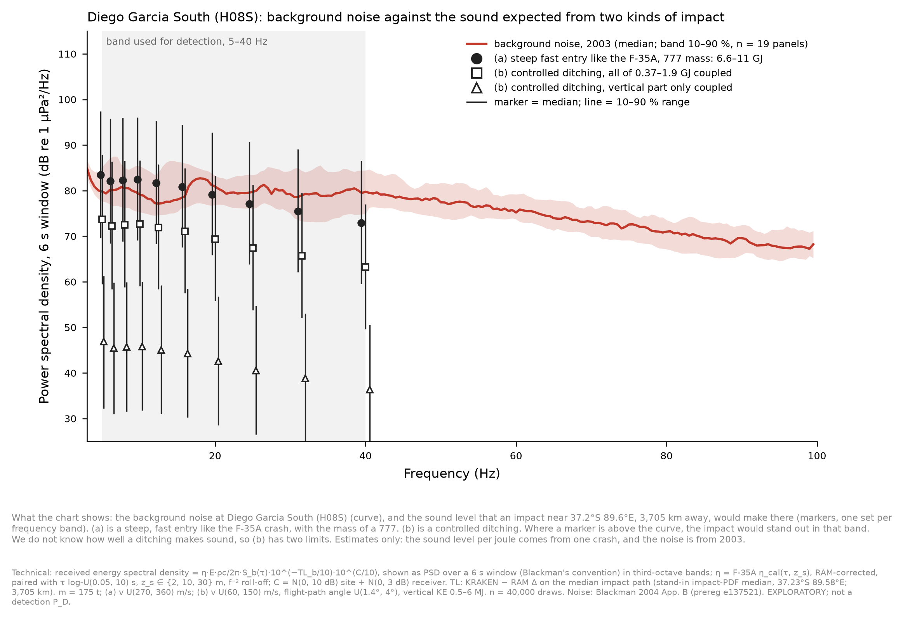
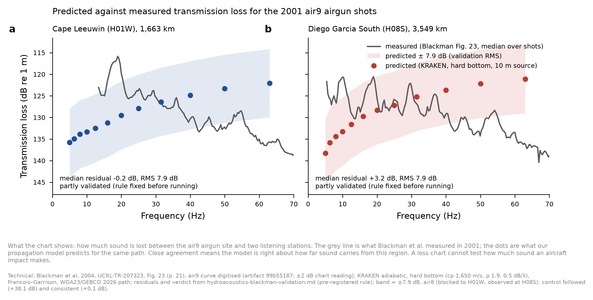
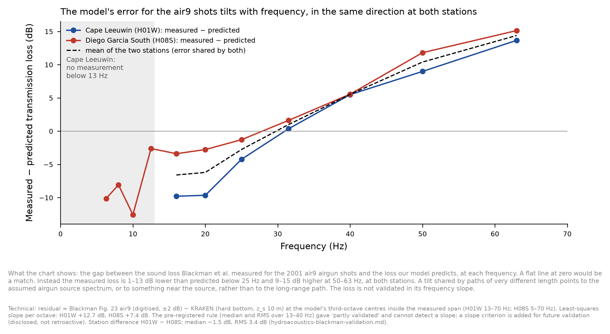

# Hydroacoustics: ambient noise at H01W, H08S and H08N, traced from Blackman et al. (2004) Appendix B

**What this is.** These are background-noise levels at the three IMS hydrophone stations relevant to MH370. They
replace the stand-in used until now, which was the Perth Canyon IMOS logger's 2014 level.
- **Source** [Blackman2004UCRL]: the blue noise curves in Appendix B (PDF pp. 27–33, Figs B1–B11), from the 2003
  cruise. Each curve is the mean of the three sensors over 6 s, taken 20 s before each shot's predicted arrival (p. 27).
- **Code:** `prepare/blackman_noise.py`, pre-registered at `e137521`; outputs at `889bc7f` (`results-data/blackman_noise/`).
- **Labels:** 2003 levels, not 8 Mar 2014; calibration convention inferred (see below).

## Result

| station | unique panels | passed QC | 5–40 Hz SPL, median (10–90 %), dB re 1 µPa² | against the stand-in (96.2) |
|---|---|---|---|---|
| H01W (Cape Leeuwin) | 26 | 23 | 101.7 (99.7–103.0) | **+5.4 dB** |
| H08S (Diego Garcia South) | 23 | 19 | 95.6 (92.6–101.3) | −0.7 dB |
| H08N (Diego Garcia North) | 21 | 14 | 90.2 (87.2–94.9) | −6.0 dB |

- Third-octave band levels (5–40 Hz, median and 10/90 %) are in `blackman_noise_summary.json`.
- H01W has a broad peak at 16–25 Hz, of about 88–90 dB re 1 µPa²/Hz. That is the band of fin and blue whale calls; I
  have not attributed it.
- **Pre-registered verdict:** the plausibility gate (55–105 dB re 1 µPa²/Hz at 5–40 Hz) and the extraction QC
  (≥ 2/3 of each station's panels) both **passed**. So, under the replacement rule, **these levels replace the
  stand-in** as the primary IMS noise in the near-limits and IMS P_D calculations. The stand-in is kept beside them as
  a sensitivity.
- **What it changes:** H01W SNR falls by about 5 dB against the earlier near-limits planning, and H08S rises by about
  1 dB. The near-limits P_D and information values will be re-run with these levels.

## Method and its weak points

- **Calibration (route R):** amplitude spectrum in counts/Hz → one-sided PSD = 2A²/T (T = 6 s) → ÷ |R(f)|². R(f) is
  the full FDSN response of IM.H01W1, H08S1 and H08N1 (EDH), one epoch covering 2003 and 2014.
  - **The counts/Hz convention is inferred**, from the SAC file names in each legend ("…noise.sac.am.ave"; SAC's FFT
    scales by the sample interval). The report does not state it.
  - The alternative without that factor (route R′) is 48 dB lower: 26–42 dB re 1 µPa²/Hz, which is below any
    deep-ocean ambient level. That supports route R.
  - The smoothing behind "ave" is unknown.
- **Extraction:**
  - frames come from continuous box lines; the log axis is fitted to the decade ticks, and the frame bottom is checked
    to be 10⁰;
  - blue pixels are tracked by continuity;
  - 2 reprinted H08N panels (site A4's column reprinted under A5, p. 30) were detected and removed.
- **Disclosed defects:**
  1. **Two bug fixes,** both made before any level was read:
     - the start column could fall between candidates;
     - the first frame detector paired crosshair and text lines into false boxes.
  2. **The pre-registered residual QC is vacuous as implemented.** The trace *is* the nearest blue-run centre, so its
     residual is 0 by construction. I replaced it with a visual overlay check (`blackman_overlay_A7.png`): the trace,
     drawn 6 px offset, follows the blue curve across all three columns, including where the azimuth arrows cross it.
- **Representativeness:**
  - May–June 2003, not March 2014.
  - Windows were chosen just before test shots, so these are ordinary conditions at those times.
  - The 2014 H08S record contained an airgun survey that these windows do not.

- Hydroacoustic Module, 10 Oct 2026

## Addendum (10 Oct, Pete's request): expected impact sound against this noise - EXPLORATORY

The markers show the received level per third-octave band (median, with 10–90 %) from an impact at the stand-in
impact-PDF median, 37.23 °S 89.58 °E. It is shown as PSD over a 6 s window, the same convention as Blackman's curves.
Coupling is the F-35A calibration (RAM-corrected), paired in τ and source depth. Data: `scenario_markers.json` in
`results-data/blackman_noise/`.

| scenario (m = 175 t) | energy coupled | Cape Leeuwin, 10 Hz, median (10–90 %) | Diego Garcia S, 10 Hz | noise median, 10 Hz (H01W / H08S) |
|---|---|---|---|---|
| (a) F-35A-type steep entry, 270–360 m/s | 6.6–11 GJ | 91.5 (78–105) | 82.5 (69–96) | 84.6 / 79.0 |
| (b) controlled ditching, total KE | 0.37–1.9 GJ | 81.6 (68–96) | 72.6 (59–87) | |
| (b) controlled ditching, vertical KE only | 0.5–6 MJ | 54.8 (41–69) | 45.8 (32–60) | |

**Reading.**
- (a) sits about 7 dB above the noise at Cape Leeuwin and about 3 dB above it at Diego Garcia South (medians).
- (b) with all its energy coupled sits about 3–6 dB below the noise. With only the vertical part coupled it is
  30–35 dB below, so it would be undetectable.
- The 10–90 % ranges are about ±13 dB. They are set mostly by the unknown coupling and site terms.
- This is not a P_D: detection also depends on the signal's duration and the detector. Diego Garcia North has no
  marker, because its paths are blocked.

- Hydroacoustic Module

### Per-station charts, and the air9 check on the propagation model

**What air9 does and does not validate.**
- *(Corrected the same evening, after Pete's question: the first version said "partly validated" with 13 Hz as the
  floor at both stations. See the correction below.)* Blackman's measured TL starts at about 13 Hz at Cape Leeuwin and
  about 5 Hz at Diego Garcia South (SNR > 3 dB).
- Within 13–40 Hz the model is partly validated: residual median −0.2 / +3.2 dB, RMS 7.9 dB.
  - At Cape Leeuwin, 15–20 Hz, the model is **pessimistic by about 13 dB**: measured 116–118 dB against predicted
    130–131 dB.
  - Above 40 Hz it is optimistic by about 8–12 dB, but that is outside the detection band.
- So the impact-detectability conclusions rest on modelled TL that is checked only in part of the band.
- A pre-registered end-to-end check on the 2003 SUS and sphere shots, detected or not at each station (Appendix B),
  is the next step.

- Hydroacoustic Module

### CORRECTION (10 Oct, ~23:40 UTC): the air9 match is NOT a validation of the frequency slope

- **Predicted and measured TL have opposite frequency trends.** Measured − predicted runs from −10 dB (Cape Leeuwin,
  16 Hz; Diego Garcia South, 6–10 Hz) to +14/+15 dB at 63 Hz. The tilt is +12.7 dB per octave at H01W and
  +7.4 dB per octave at H08S.
- **Why the verdict missed it.** The curves cross near 25–35 Hz. So over 13–40 Hz the median residual is near zero,
  and the pre-registered rule (median and RMS) cannot detect a slope.
- **The tilt is shared by both stations,** on paths of 1,663 and 3,549 km. That points to Blackman's assumed airgun
  source spectrum, or to something near the source, more than to the long-range path. The station difference fits
  to 3.4 dB RMS.
- **What stands:**
  - the station difference, to about 3 dB;
  - the broad ranking of the scenarios (steep entry above ditching; Cape Leeuwin better than Diego Garcia South).
- **What does not stand:**
  - absolute TL and its frequency slope, which are unvalidated (errors about ±10 dB, tilted);
  - the band-by-band margins on the impact charts ("about 7 dB above the noise"). These are provisional. The F-35A
    calibration cancels a constant offset, but not a tilt between the F-35A path spectrum and the impact paths.
- **Fixes:**
  1. A slope criterion is added to future validation rules: residual slope per octave within ±2 dB plus its
     standard error. It is not applied retroactively.
  2. The 2003 SUS-charge check comes forward. Its source spectra are well characterised, so it can separate a
     source-spectrum error from a propagation error.

## COVERAGE

See `hydroacoustics-coverage.md` for the three sets, ESS per option and family, the gaps and the parameter bounds. Specific to this note: The noise covers May 2003, before each predicted 2003 arrival, at H01, H08S and H08N (23/19/14 panels). Season and year differ from 8 Mar 2014 (declared). The impact markers depend on G2 and G3.
