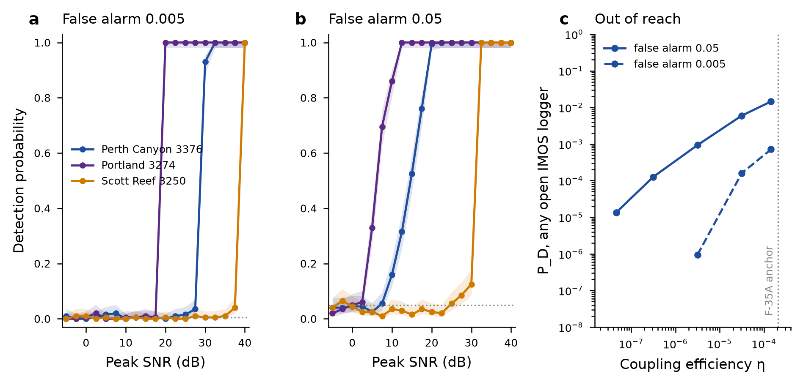

# Hydroacoustics item 3: injection-recovery and the P_D gate at the IMOS recorders - PROVISIONAL

**Pre-registrations:**
- Stage A (`eb83b31`): P_D against SNR by injection.
- Stage B (`64752c7`): from source energy to SNR.

**Code:**
- `imos_injection.py`; the declared extension `imos_injection_ext.py` (`7753820`);
- `imos_stageB_tl.py` (one disclosed deviation, `9e18559`); `imos_stageB_map.py` (`f465c85`).

**Outputs:** `engine/hypotheses/hydroacoustics/results-data/stageA|stageB/`.

**Background:** 14 days of IMOS raw data (1–7 and 9–15 March 2014) from 3376, 3274 and 3250, 1,344
recordings per logger; per-file sha256 in `data/imos_background/`.

## Stage A: P_D against SNR (real transients injected into real noise)

**Method:**
- **Injected transient:** the module's own far-field RCS recording of the 05:03:01 event (C2), scaled to
  a target SNR.
- **SNR:** the peak 1 s 5–40 Hz SPL minus the background median, as defined in 2b.
- **Detector:** "D1 or D2"; 200 injections per point.
- **Threshold:** set from the 14-day non-injected null of 50 s windows.

| logger | SNR₅₀ / SNR₉₀ at false alarm 0.005 | at 0.05 |
|---|---|---|
| 3376 Perth Canyon | **28.8 / 30.1 dB** | 13.7 / 20.1 dB |
| 3274 Portland | **18.6 / 19.4 dB** | 6.1 / 10.2 dB |
| 3250 Scott Reef | 38.5 / 39.5 dB | 29.9 / 38.8 dB |

**What the table shows:**
- **Real background is hard.** At Perth Canyon a 50 s window of ordinary background already reaches
  more than 20 dB above the median at its 99.5th percentile. Scott Reef's impulsive noise pushes its
  threshold to nearly 40 dB.
- **The second template** (C1, the Curtin event, with its long tail) gives thresholds within 2 dB.
- **Declared extension, not pre-registered.** The pre-registered grid, −5 to +20 dB, ended below the
  0.005 transition at 3376 and 3250. Those fits were unidentified (SNR₅₀ of about 10¹⁵). The same design
  was rerun from 22.5 to 40 dB and refitted on the union. The pre-registered grid's own result stands:
  **P_D ≤ 0.02 up to 17.5 dB at 3376.**

## Stage A2: the 2b MH370 windows against the 14-day null

**No detection on any logger** at the Bonferroni level (p < 0.005). With 1,344 background recordings
the smallest attainable p is about 0.0007, so 2b's power limit is removed.

**2b's closest window was not a near-detection.** At 3376, 00:39, its D2 p was 0.0054 against the 25 h
null; against the 14-day null it is **0.50**. The small null had made it look marginal.

## Stage B: P_D against coupling efficiency η

**Model:** source exposure ηE·ρc/2π; spectrum flat to 1/τ (τ swept 0.05–10 s); KRAKEN transmission loss
on the shared-transport paths; C_site and C_rcv each ±10 dB; the peak-to-energy ratio T_eff measured on
the template (2.7 s); η log-uniform over four decades below the F-35A anchor.

| η decade | P_D, any open logger, false alarm 0.05 | at 0.005 |
|---|---|---|
| 10⁻⁸ | 1.3×10⁻⁵ | ~0 |
| 10⁻⁶ | 9.4×10⁻⁴ | 9.5×10⁻⁷ |
| 10⁻⁴ to 2.1×10⁻⁴ (F-35A anchor) | **1.5×10⁻²** | **7.1×10⁻⁴** |

Marginal over the η prior, P_D is about 10⁻⁴ at false alarm 0.005, with either spectral roll-off.

**So, within this model, the IMOS recorders could not have detected the impact.** At the anchor the
predicted peak level is about 76 dB re 1 µPa, about 19 dB below the background median, where detection
needs about +29 dB. The 2b non-detection is therefore uninformative, which agrees with its 0.003-bit
bound.

## The gate: computed, not validated

The likelihood the module returns stays **0.0**, for three reasons:

1. **Transmission loss to seabed receivers is pessimistic.** Adiabatic modes lose a mode's energy where
   it cuts off up-slope. The Perth Canyon receivers sit on the canyon floor at 409–447 m and the Portland
   loggers on the shelf. Yet the Curtin event was recorded on the RCS canyon floor at 14.5 dB SNR from
   about 5,000 km. **P_D here is a lower bound.** A coupled-mode or parabolic-equation check (RAM) is
   needed; it is the same check already pending for air8.
2. **The η anchor mixes definitions.** 2.1×10⁻⁴ is Brown's Arons-based coupling, an equivalent explosive
   yield, not this module's radiated-energy fraction. The F-35A → H11 path, run through this engine with
   Metz's position and Brown's 0.7 Pa, calibrates η in the module's own definition. It waits only on
   GEBCO coverage north of 30°N.
3. **The informative receivers are not covered.** H01W+H08S, the two-site case that carries 1.7–3.2 bit,
   are IMS stations. Their raw data are not held, so their P_D cannot be measured by injection. That is
   the §9 request.

*Hydroacoustics module, 2026-10-09.*
