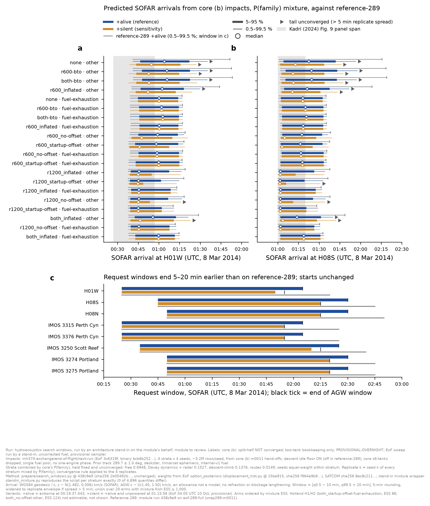

# Hydroacoustics: search and request windows from the core (b) impacts, +alive and +silent (stand-in run)

**Run by an architecture stand-in on the module's behalf; module to review.** Hydroacoustics was idle overnight. Its
pre-approved item (`coordination/OVERNIGHT-2026-10-10.md` §3, Hydroacoustics) is to re-derive its windows from the new
impacts once end of flight had ruled on impact times. End of flight ruled at 04:05 UTC (+alive reference, +silent
sensitivity) and `end-of-flight/next-run/READY` was written at 08:36Z. Run 09:18–10:03Z, 10 Oct 2026.

**Labels:** `core (b): split-half NOT converged` · `two-tank bookkeeping only` · `PROVISIONAL-OVERNIGHT` ·
`EoF sweep run by a stand-in` · `uncorrected fuel` · `provisional sampler`. Plus core's: deskstar, prior track
289.7° ± 1.0°, Inmarsat ephemeris, internal-v1 fuel.

## Provenance

- **Recipe:** the module's latest standard result, `results/hydroacoustics-search-windows-ref289.md`. That is
  `prepare/search_windows.py`, pre-registered at `55eb191`, outputs committed at `438c9e9` on
  `hypothesis/hydroacoustics`. The script is byte-identical at both commits (sha256 `1b05492b…`), and identical to the
  copy in the module's workspace.
  - **Weights:** end of flight's `option_posteriors` from `smoke/displacement_hist.py` at `15ba915`, read-only, sha256
    `f964a9b9…`. That is the same module the hydroacoustics run used. It is byte-identical at `3c6319f`, the commit that
    produced the new impacts.
  - **SATCOM:** `data/satcom-observations.csv` sha256 `8ec8c211…`, identical at `15ba915` and `3c6319f`.
  - **Receivers:** `data/stations.csv` and `data/ocean_paths/request.json` at `438c9e9`.
  - **Environment:** `mh370-hydro`, Python 3.12, as the module used.
- **Command,** the same as the module's except for the input and output paths:
  `PYTHONPATH=. python search_windows.py --runs <exchange>/end-of-flight/next-run/<stratum> --eof-module <displacement_hist.py @15ba915> --out … --tag next-run-b-<stratum>`.
  It ran once per stratum, at 1 thread (2 threads in total with the mixture pass below). The four runs took 628–707 s.
- **Impacts:** `mh370-exchange/end-of-flight/next-run/{next-free, next-repro-radar, next-descent-climb, next-routes}/seed-1..4`.
  - EoF `3c6319f`, binary `bcb6b252…`, from core (b) m0011 hand-offs. About 3.2 M rows per seed, 106 columns.
  - **The descent idle floor is ON** here; it was OFF in `eof-289-full`. Core's `s6-tanks.toml` was dropped, so EoF
    reads the single fuel pool and models no one-engine phase (see that README).
  - The script read the new schema without error (`impact_columns` from `run.json`).
  - The checksums of `run.json`, `terminal.json` and `COLUMNS.txt` verify. The `impacts.npy` checksums were **not**
    re-verified (43 GB).
- **Code changes:** none. Nothing in the module or EoF trees was edited.

### Combining strata (a stand-in addition, not module code)

The module's script pools the seeds of one run with equal weight and has no notion of strata. Core (b) has four strata,
which the overnight plan combines by core's P(family): free 0.6948, Davey dynamics + radar 0.1527, descent-climb
0.1376, routes 0.0149, taken from `next-run/summary/mixture.json`. These are held fixed and are **unconverged**.

`hydroacoustics-next-run-b-standin/standin_mixture.py` (sha256 `b04b54c6…`) imports the module's script unchanged, for
its constants, receivers, quantile and window rules. It repeats the script's per-seed arithmetic and also accumulates
each seed's CDF into the mixture:

- **Mixture CDF:** F_mix = Σ_s P_s · mean_k F_{s,k}.
- **Convergence:** the script's per-seed spread rule is applied to 4 **replicates**. Replicate k is seed k of every
  stratum, mixed by P(family).
- **ESS:** the Kish ESS of the combined weights, as in EoF's `mixture.json`.
- **Self-check:** run per stratum, the wrapper reproduces the unchanged script's quantiles exactly (0 of 4,896 differ).

**The mixture is the headline. The four per-stratum outputs are the module's recipe verbatim.**

## Validation

The module's pre-registered gate compares the impact-time shares and quantiles with **end of flight's own
impact-time-shares JSON for the same impacts**. No such file exists for `next-run`: EoF's stand-in did not produce
one, and producing it would mean running EoF's analysis. **The gate was therefore not run** (`validation.json`:
"not requested"). In its place:

| check | result |
|---|---|
| pooled ESS against EoF's `sweep-summary-<stratum>.json` `ess_total` (96 stratum × arm rows) | max relative difference 4.0e-16 |
| mixture Kish ESS against EoF's `mixture.json` (24 arms) | max relative difference 1.0e-13 |
| wrapper per-stratum quantiles against the unchanged script | 0 / 4,896 differ |
| mass beyond the 2 s pooling grid | ≤ 2.9e-11 |

These checks confirm the weights to the unit. They do not check the shares-before and shares-after numbers against an
EoF reference, so **the window numbers carry `validation gate not run`.**

*Footnote (as printed beneath the figure).* Stand-in run, module to review.
- **Labels:** core (b) split-half NOT converged; two-tank bookkeeping only; PROVISIONAL-OVERNIGHT; EoF sweep run by a
  stand-in; uncorrected fuel; provisional sampler.
- **Impacts:** EoF `3c6319f`, 4 strata × 4 seeds, descent idle floor ON, single fuel pool. Prior track 289.7°,
  deskstar, Inmarsat ephemeris, internal-v1 fuel.
- **Strata:** combined by fixed, unconverged P(family) 0.6948 / 0.1527 / 0.1376 / 0.0149.
- **Method:** `search_windows.py` @ `438c9e9` unchanged; EoF `option_posteriors` @ `15ba915`. SOFAR speed
  c ~ N(1.482, 0.006) km/s; AGW speed U(1.40, 1.50) km/s, an allowance, not a model.
- **Window:** [q0.5 − 10 min, q99.5 + 20 min], rounded to 5 min. It is widened to the replicate envelope when the
  replicate spread exceeds 5 min. The union is over the 20 arms with ESS ≥ 1,000.
- **Variants:** +alive = airborne at 00:19:37.443. +silent = +alive, and unpowered at 01:15:56.
- **Not shown:** H1 and H2 (ESS 86 and 124), which are not estimable.
- **Grey:** the module's reference-289 result (`438c9e9`).

## Impact times by option: mixture (core b) against reference-289 (pooled, UTC 8 Mar 2014)

The ESS columns are not like for like. The mixture's ESS is a Kish ESS over 16 seeds; reference-289's is summed over
4 seeds.

| arm + variant | ESS, mixture | 0.5 % | 50 % | 99.5 % | share after 01:15:56 | ESS, ref-289 | 0.5 % | 50 % | 99.5 % | share after 01:15:56 |
|---|---|---|---|---|---|---|---|---|---|---|
| `none__other+alive` | 20,976,872 | 00:19:58 | 00:40:16 | 01:11:26 | 0.0026 | 11,042,105 | 00:19:58 | 00:40:18 | 01:29:24 | 0.0209 |
| `none__other+silent` | 2,694,085 | 00:19:44 | 00:31:06 | 01:04:00 | 0.0000 | 1,872,897 | 00:19:46 | 00:34:24 | 01:12:20 | 0.0002 |
| `none__fuel-exhaustion+alive` | 1,899,891 | 00:19:48 | 00:36:14 | 00:51:20 | 0.0000 | 1,030,551 | 00:19:48 | 00:35:32 | 00:51:18 | 0.0000 |
| `r600_inflated__other+alive` | 6,595,990 | 00:20:50 | 00:38:36 | 01:06:32 | 0.0011 | 3,054,965 | 00:20:42 | 00:37:54 | 01:22:12 | 0.0092 |
| `r600_inflated__other+silent` | 687,852 | 00:20:28 | 00:28:12 | 01:01:00 | 0.0000 | 445,869 | 00:20:20 | 00:30:18 | 01:10:08 | 0.0001 |
| `r600_no-offset__other+alive` | 449,253 | 00:20:42 | 00:35:08 | 00:53:10 | 0.0000 | 197,539 | 00:20:38 | 00:35:14 | 00:55:46 | 0.0003 |
| `r600-bto__other+alive` | 13,047,626 | 00:20:30 | 00:41:34 | 01:11:46 | 0.0027 | 6,465,333 | 00:20:26 | 00:41:54 | 01:31:14 | 0.0247 |
| `r600-bto__other+silent` | 1,207,486 | 00:19:48 | 00:28:40 | 01:04:30 | 0.0000 | 828,126 | 00:19:50 | 00:33:18 | 01:13:14 | 0.0003 |
| `r1200_inflated__other+alive` | 129,133 | 00:19:50 | 00:20:30 | 00:52:28 | 0.0000 | 69,079 | 00:19:48 | 00:20:30 | 00:56:36 | 0.0004 |
| `both_inflated__other+alive` | 9,067 | 00:19:56 | 00:32:14 | 00:58:10 | 0.0001 | 4,784 | 00:19:56 | 00:31:26 | 01:06:34 | 0.0013 |
| `both_startup-offset__fuel-exhaustion+alive` (H1) | **86** | 00:19:46 | 00:27:06 | 00:45:02 | 0.0000 | **36** | 00:19:52 | 00:28:44 | 00:44:10 | 0.0000 |
| `both_no-offset__other+alive` (H2) | **124** | 00:19:48 | 00:31:50 | 01:01:38 | 0.0016 | **82** | 00:19:58 | 00:29:00 | 01:10:26 | 0.0000 |

Plain held out (`none__other`) for the mixture: 0.5 % 00:13:32, 50 % 00:38:42, 99.5 % 01:10:50, with 10.0 % before
00:19:37 (reference-289: 00:13:32 / 00:38:36 / 01:28:26).

- **Medians and early edges are unchanged within about 1 min.**
- **The late tail is much shorter.** Under +alive, the 99.5 % of the `other`-cause arms with ESS ≥ 1,000 moves
  3–21 min earlier: 15–21 min for held out, R600 inflated and the derived BTO arms, and 3–8 min for the rest. The
  share of held-out impacts after the unanswered 01:15:56 handshake falls from 2.1 % to 0.26 %.
- Two things changed between the runs: the hand-offs (core (b) against snap289) and the descent idle floor (ON here).
  This run cannot say which caused the shift; that is for EoF to attribute.
- **H1 and H2 remain NOT ESTIMABLE:** ESS 86 and 124, against the 1,000 gate. That agrees with EoF's prediction
  (searched-areas entry, ~08:40).

## Recommended request windows, mixture (SOFAR, UTC, 8 Mar 2014)

Each window is the union over the same 20 option × cause arms as reference-289 (ESS ≥ 1,000), padded −10/+20 min and
rounded to 5 min.

| receiver | +alive (reference) | +silent (sensitivity) | AGW end, +alive / +silent | ref-289 +alive | ref-289 +silent |
|---|---|---|---|---|---|
| H01W | 00:25–02:05 | 00:25–01:50 | 02:05 / 01:55 | 00:25–02:20 | 00:25–02:00 |
| H08S | 00:45–02:30 | 00:45–02:15 | 02:30 / 02:15 | 00:45–02:45 | 00:45–02:20 |
| H08N | 00:50–02:30 | 00:50–02:15 | 02:30 / 02:15 | 00:50–02:50 | 00:50–02:20 |
| IMOS 3315, 3376 (Perth Canyon) | 00:25–02:05 | 00:25–01:55 | 02:05 / 01:55 | 00:25–02:25 | 00:25–02:00 |
| IMOS 3250 (Scott Reef) | 00:35–02:25 | 00:35–02:10 | 02:25 / 02:15 | 00:35–02:40 | 00:35–02:20 |
| IMOS 3274, 3275 (Portland) | 00:50–02:30 | 00:50–02:20 | 02:30 / 02:20 | 00:50–02:45 | 00:50–02:25 |

Per stratum, the +alive SOFAR window is (free / Davey dynamics + radar / descent-climb / routes):

| receiver | free | Davey dynamics + radar | descent-climb | routes |
|---|---|---|---|---|
| H01W | 00:25–02:05 | 00:25–02:00 | 00:25–02:00 | 00:25–01:55 |
| H08S | 00:45–02:30 | 00:45–02:20 | 00:45–02:20 | 00:50–02:20 |
| H08N | 00:50–02:35 | 00:50–02:25 | 00:50–02:25 | 00:50–02:20 |

Per-stratum windows lie inside the reference-289 windows, with two exceptions:
- **AGW start edges.** The free-stratum AGW windows start 5 min before reference-289's: at H08S under +alive and
  +silent, and at 3274/3275 under +alive.
- **Routes, IMOS 3250 under +silent:** the window starts at 00:30, against reference-289's 00:35. Routes carries
  P(family) 0.0149.

All per-stratum outputs are in `hydroacoustics-next-run-b-standin/<stratum>/`.

**Comparison with reference-289 (mixture):**
- **SOFAR starts are identical** at every receiver.
- **SOFAR ends are 15–20 min earlier under +alive and 5–10 min earlier under +silent.**
- **Every mixture window lies inside its reference-289 window, with one exception:** the AGW window at H08S under
  +silent starts at 00:45, against 00:50.
- **The module's raw IMS request still covers the mixture with margin, AGW included.** That request is H01W
  00:25–02:20 and H08S/H08N 00:45–02:50. **No request change is needed.** A tighter request is possible but not
  recommended while the end edges are unconverged.

**The end edges are still UNCONVERGED.**
- In the mixture, 316 of 1,152 receiver × arm × variant rows are flagged; reference-289 had 289.
- Among the +alive/+silent rows with ESS ≥ 1,000, 134 of 640 are flagged. All of them are `other`-cause arms, with a
  replicate spread of 5.0–13.9 min at q99.5. Those rows are widened to the replicate envelope, as pre-registered.
- The start edges converge (spread ≤ 176 s).
- The +alive end at H01W is driven by `none__other` (q99.5 01:35:02, spread 612 s), and at H08S by `r600-bto__other`
  (q99.5 01:57:32, spread 784 s).
- **The late tail rests on few parents.** Core (b)'s split-half failure compounds this.

## Coverage of predicted arrivals by Kadri's traces

The method is the module's: linear interpolation between the 9 stored quantiles, so the values are approximate.
Kadri's spans are H01W 00:27–00:57 and H08S 01:00–01:20 [Kadri2024, Fig. 9].

| arm | H01W +alive / +silent (ref-289) | H08S +alive / +silent (ref-289) |
|---|---|---|
| `none__other` | 0.29 / 0.57 (0.30 / 0.50) | 0.43 / 0.70 (0.43 / 0.61) |
| `none__fuel-exhaustion` | 0.39 / 0.39 (0.42 / 0.42) | 0.56 / 0.56 (0.58 / 0.58) |
| `r600_inflated__other` | 0.32 / 0.66 (0.35 / 0.60) | 0.46 / 0.76 (0.49 / 0.68) |
| `r600_no-offset__other` | 0.43 / 0.81 (0.43 / 0.78) | 0.60 / 0.86 (0.60 / 0.82) |
| `r600-bto__other` | 0.25 / 0.63 (0.25 / 0.53) | 0.38 / 0.73 (0.36 / 0.60) |

The module's reading stands: Kadri's traces test a quarter to four-fifths of the predicted arrival mass. Under
+silent they test somewhat more than on reference-289.

## Caveats

- **Not converged upstream.** Core (b)'s split-half is NOT converged, and P(family) is held fixed. Every mixture number
  inherits both.
- **Fuel.** There is one fuel pool: two-tank bookkeeping only, with no one-engine phase. Internal-v1's one-engine flow
  is about 2× its source tables (core, ~07:20), which makes any one-engine phase too short.
- **Arrival model.** Arrivals follow the geodesic at one group speed, with no lengthening by refraction or blockage.
  The AGW allowance is assumed, not modelled.
- **Validation.** The validation gate was not run (no EoF shares file); only the ESS cross-check was done.
- **Mixture.** The P(family) mixture and replicate convergence are a stand-in construction, not part of the module's
  pre-registered script. The module should decide whether to adopt them, amend `search_windows.py`, or replace them.

## Files

- `results/hydroacoustics-next-run-b-standin/mixture/`: `windows_by_arm.csv`, `recommended_windows.csv`,
  `summary.json`, and `per_stratum_quantiles_selfcheck.json`.
- `results/hydroacoustics-next-run-b-standin/<stratum>/`: the unchanged script's outputs (`windows_by_arm.csv`,
  `recommended_windows.csv`, `summary.json`, `validation.json`).
- `results/hydroacoustics-next-run-b-standin/standin_mixture.py`: the wrapper.
- `results/hydroacoustics-search-windows-next-run-b-standin.{png,pdf}`: the figure.

- Modular Architecture (stand-in for Hydroacoustics), 10 Oct 2026 ~10:10 UTC
