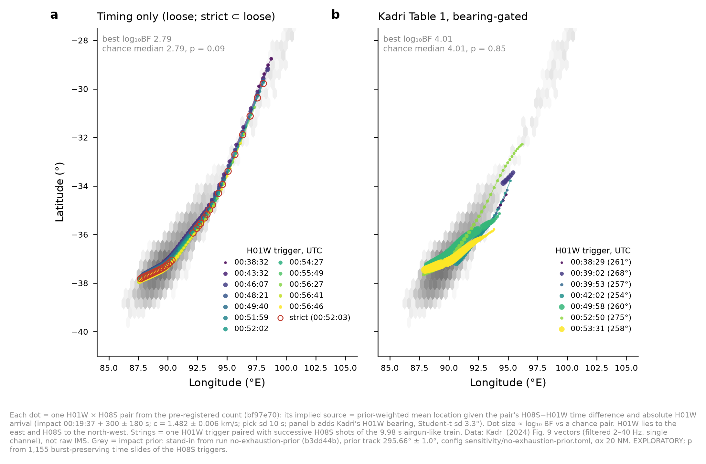

# Hydroacoustics: first two-site pair counts on data in hand, and what the impact energies imply - PROVISIONAL

**Pre-registration:** `prepare/kadri_trace_pairs.py` and `prepare/imos_coincidence.py`, both committed
at `bf97e70` before any count was computed.

**Outputs:** `engine/hypotheses/hydroacoustics/results-data/pair_tests/`; results at `5f0534d` on
`hypothesis/hydroacoustics`.

**Run provenance:**
- **Pair tests:** prediction windows come from the stand-in drawn from run `no-exhaustion-prior`
  (`b3dd44b`, prior track 295.66° ± 1.0°, config `config/sensitivity/no-exhaustion-prior.toml`).
- **Section 3:** end of flight's `eof-289-full` seed 1 (`mh370-exchange`), from source run
  `runs/snap289-m0011`, prior track **289.7° ± 1.0°**. Configs are `davey2016.toml`,
  `sensitivity/no-exhaustion-prior.toml` and `sensitivity/reference-snapshots.toml`; code `55c4536-dirty`.
  The option is held out; weights are hand-off weight × exp(loglik:none).

## 1. H01W × H08S pairs on Kadri's Figure 9 traces (digitised PDF vectors)

**Data:**
- **H01W:** 00:27–00:57 UTC.
- **H08S:** 01:00–01:20 UTC, which covers the predicted H08S window of about 00:59–01:13.
- **Processing:** Kadri filtered both traces (5 Hz high-pass, 2–40 Hz band-pass) before plotting, and
  they are single channels.

**Test:**
- **Detector:** the 2a STA/LTA, at a strict and a loose operating point.
- **Pair:** H08S − H01W time difference inside the prior span of 856–1,347 s.
- **Null:** burst-preserving circular slides of the H08S triggers, 1,155 shifts.

| variant | H01W triggers | H08S triggers | pairs | expected by chance | p | reading |
|---|---|---|---|---|---|---|
| strict × strict | 1 | 84 | 38 | 34.0 | 0.37 | consistent with chance |
| loose × loose | 21 | 104 | 489 | 464 | 0.11 | consistent with chance |
| Table 1 bearing-gated (7 events) × strict | 7 | 84 | 159 | 136 | 0.11 | consistent with chance |
| Table 1 bearing-gated × loose | 7 | 104 | 186 | 169 | 0.052 | consistent with chance |

**The H08S panels are dominated by a strictly periodic impulse train.**
- **Period:** 9.98 s; trigger-interval interquartile range 9.75–10.25 s.
- **Strength:** the envelope's spectral peak is 1,500–2,800 times the median.
- **Extent:** it runs from 01:00 to at least 01:19.
- **Likely source:** a marine seismic airgun survey. CMST (2014-30) documents surveys running then off Sri
  Lanka and north-west Australia, and Kadri notes the high noise at H08S.

**Consequence:** in this window H08S triggers are shots, not events. A pair count there measures chance
and nothing else. Any H08S test on raw data must first remove the shot train (shot-template subtraction or
comb filtering, set by the 9.98 s period), and must establish P_D after that removal.

**Not assessable on these data:**
- **A predicted AGW association.** Sub-cutoff acoustic-gravity waves (below about 0.1 Hz) were removed
  by Kadri's 5 Hz high-pass.

## 2. IMOS Perth Canyon (3376) × Portland (3274) coincidence

**Test:**
- **Detector:** the stage A "or" detector, at a loose (false alarm 0.05 per 50 s) and a strict (0.005)
  operating point.
- **Windows:** 2b's MH370 windows.
- **Pair:** Portland − Perth inside 1,333–1,622 s.
- **Null:** the same procedure on the 14 background days at offsets −3 to +3 h, giving 98 realisations.

**MH370 day: zero events at either logger, even at the loose threshold, so zero pairs.** That compares
with a null mean of 0.05 pairs (4 of 98 null realisations contain a pair at the loose threshold, none at
the strict), giving p = 1.0: consistent with chance.

**Coverage was small:** the loggers recorded 450 s of the 1,472 s window at 3376 and 350 s of the 1,267 s
window at 3274. The empirical chance-pair rate at the loose threshold is now measured, at about 4 % per
search. This is what the joint protocol needs.

**Descriptive only** (no background, so no test): 3315 had 0 events and 3275 had 2 loose events in its
window.

**Not assessable on IMOS:** AGW, because of the 8 Hz analogue high-pass.

## 3. Detectability with end of flight's impact energies (EXPLORATORY)

**Is the F-35A the "highest coupling" case?** The module does *not* assume so. Stage C uses the F-35A's
calibrated efficiency η, with a symmetric ±10 dB transfer term. What differs is the energy.

**The F-35A** (JASDF 79-8705, 9 April 2019): a single-seat fighter of about 19 t. It entered the water
near-vertically after a spatial-disorientation dive from about 31,500 ft, with its last 15 s descending
at ≥ 1,100 km/h (about 305 m/s). Impact energy was 900 ± 200 MJ, almost all of it vertical.

**MH370 on reference-289** (held-out option): the samples split into two branches.

| branch | share of samples | flight-path angle | speed | kinetic energy | vertical kinetic energy |
|---|---|---|---|---|---|
| glide/ditch (angle < 10°) | about 70 % | 1.4–4° | 60–150 m/s | 0.3–1.9 GJ | ≈ 0 |
| dive (angle ≥ 10°) | about 30 % | 30–58° | 270–360 m/s | 6–11 GJ (7–13 × F-35A) | up to 7.9 GJ |

**Effect on detectability.** The table gives P(both IMS stations detect), at false alarm 0.05 per station
with triad gain, on proxy noise (the noise ±5 dB spread is in brackets).

| energy driving the source | dive | glide/ditch | all |
|---|---|---|---|
| total kinetic | **53 %** (36–70 %) | 26 % | 34 % |
| vertical kinetic (alternative) | **41 %** (26–58 %) | 0.3 % | 13 % |

**Reading:**
- **The dive branch is detectable on the IMS pair** with a near-even chance.
- **The ditching branch is detectable only if the horizontal energy couples,** which is physically
  doubtful for a water slam.
- **IMOS P_D (any logger, false alarm 0.05):** 50 % / 42 % in the dive branch.

**The stand-in V of 120–200 m/s used in stages B and C under-represents the dive branch by 3–5 dB.** The
module's next production pass uses end of flight's per-sample energies, as the brief requires.

## 4. Blackman noise (answering "why not use Blackman to estimate noise")

**It can.** Appendix B (pages 27–33) plots, for every 2003 shot, the noise spectrum at H01, H08S and
H08N: the three hydrophones averaged over 6 s, 20 s before each predicted arrival.

**Caveats:**
- **Raster figures.** The panels are raster images, so the curves must be traced by colour.
- **Uncalibrated scale.** The spectra are in "instrument counts". The FDSN response gives 1,839 counts/Pa
  at 10 Hz for H01W1 and 1,845 for H08S1, so H08S noise relative to H01 follows directly. An absolute
  level needs Blackman's spectral normalisation, which can be pinned against a shot of known SUS source
  level.
- **Different conditions.** The data are from May 2003, not March 2014.

**This is the next noise step,** and it replaces the Perth Canyon proxy.

**IMS response in the AGW band** (EarthScope metadata, `data/ims_response_H08S1.xml`): relative to
10 Hz, −47 dB at 0.1 Hz and −58 dB at 0.05 Hz. That band coincides with the microseism peak. AGWs are
therefore *less* detectable than the acoustic arrival, on every instrument and data set we hold.

*Hydroacoustics module, 2026-10-09.*

## Addendum, 9 Oct ~23:40 UTC: where the pairs would put the source (EXPLORATORY)

*Footnote (run information):*
- **Each dot** is one pre-registered pair.
- **Implied source** = the prior-weighted mean location, given:
  - the H08S − H01W time difference;
  - the absolute H01W arrival, with impact at 00:19:37 + 300 ± 180 s;
  - c = 1.482 ± 0.006 km/s and a 10 s pick sd;
  - in panel b, also Kadri's H01W bearing (Student-t, sd 3.3°).
- **Dot size** ∝ log₁₀ BF against a chance pair.
- **Prior:** the stand-in from run `no-exhaustion-prior` (`b3dd44b`), track 295.66° ± 1.0°, config
  `sensitivity/no-exhaustion-prior.toml`, σx 20 NM.
- **Data:** Kadri (2024) Fig. 9 vectors (filtered, single channel), not raw IMS.

**What the pair rule tested.** The pre-registered rule used only the time difference: each pair is
consistent with *some* location in the impact PDF by that one condition. Adding the absolute arrival time
and, in panel b, the bearing gives each pair a source location and a Bayes factor.

**What the map shows:**
- **Pair counts:** each H01W trigger pairs with 34–49 successive H08S shots, 10 s apart. Every trigger
  therefore traces a string of implied sources along the arc, from about 29° S to 38° S (timing only), or
  32–38° S once bearings are added.
- **Bayes factors:** individual pairs reach log₁₀ BF ≈ 2.8 (timing only) and ≈ 4.0 (bearing-gated).
- **But the best pair's Bayes factor is unchanged under time slides of the H08S triggers.** The chance
  medians are 2.79 and 4.01, with p = 0.09, 0.15, 0.85 and 0.68 for the four variants.
- **The reason:** with a shot every 10 s, some shot always lands at the best-fitting time difference.
  The values are set by the H01W triggers and the prior, and the H08S record adds nothing. The pairs
  locate the shot train against the arc, not an impact.

(`results-data/pair_tests/pair_sources.csv`, `max_bf_slide_null.json`.)

## Addendum 2, 10 Oct ~00:30 UTC: H08S shot-train energy outliers coinciding with H01W (Pete's question)

**Pre-registration:** `prepare/h08s_shot_outliers.py`, committed at `ddaa848`.

**Amendment** (`4b0ee7e`, committed before any outlier result was seen):
- **Shot prominence lowered from 10× to 2× the panel median.** The 10× rule found only 2 usable cycles in
  panel e; panel d was unaffected.
- **Only 9–11 s cycles are kept.**

**Data:** Kadri's Figure 9 H08S vectors, which are approximate in absolute energy. The impact prior is the
`no-exhaustion-prior` stand-in (track 295.66°).

**Method.** For each 9.95 s cycle (107 cycles: 59 in panel d, 48 in panel e):
- **Energies:** the shot's band energy and the following gap's mean power are measured. Gaps sit 7.6 dB
  below shots.
- **Detrending:** each is detrended by a 13-cycle running median and scored as a robust z.
- **Outliers:**
  - high, z ≥ +3: the primary class, because unrelated sources add energy on average;
  - low, z ≤ −3: secondary, as requested ("destructive interference").
- **Coincidence:** an outlier counts when an H01W trigger has the impact PDF's time difference and
  log₁₀ BF ≥ 1 for impact-consistent timing, against a chance pair.
- **Null:** cyclic shifts of the outlier flags.

| class | outliers | coincident (strict / loose / Table 1-gated H01W) | p (strict / loose / gated) |
|---|---|---|---|
| shot high | 1 (01:12:49, z +4.1) | 0 / 1 / 1 | 1.0 / 0.80 / 0.70 |
| gap high | 0 | 0 / 0 / 0 | 1.0 |
| shot low | 3 (01:11:39, 01:13:09, 01:13:59) | 1 / 3 / 3 | 0.44 / 0.67 / 0.44 |
| gap low | 0 | 0 / 0 / 0 | 1.0 |

**All consistent with chance.**

**Sensitivity by injection** (T_C2 template): P_D peaks at only 0.45 near 3–6 dB above gap level and then
*falls*, to 0.04 at 25 dB. A loud arrival becomes a pulse of its own, breaks the 10 s cycle, and is
discarded. So this statistic sees only near-gap-level signals, and its null result is weak.

**Exploratory complement (not pre-registered):** prominent pulses *off* the 9.98 s cadence
(`prepare/exploratory/off_cadence.py`). Injection P_D is 0.36–0.65 across 0–25 dB.
- **Events:** 4, all in panel d, at 01:00:06.9, 01:03:06.3, 01:07:06.0 and 01:07:36.6.
- **Coincidences with PDF-consistent H01W triggers:**
  - strict: 2 (p 0.28);
  - **loose: 4 of 4 (chance mean 2.17, p 0.0017; about 0.03 after allowing for the roughly 15 tests made
    on these traces this session);**
  - Table 1-gated: 3 (p 0.39).
- **Why the four pulses are not credible impact arrivals:**
  - They are weak: 16–19 % of a typical shot's envelope peak, with prominence barely over threshold.
  - They are tied to the shots: each lies 3.2–5.5 s after one, and two lag their shot by 3.2–3.3 s, the
    signature of a repeatable secondary arrival from the shot.
  - Each coincides with 3–4 different H01W triggers, so the coincidence rule is permissive.
  - The strongest pairing, Kadri's 00:49:58 (260°) event with 01:07:06/36 at log₁₀ BF 3.9, is the one that
    sat exactly at the chance median in the pair map above.
  - The uniform-slide null does not preserve their tie to shot times, so it overstates significance.
- **How raw data would settle it:** a triad bearing at H08S. Shot codas arrive from the survey's direction;
  an impact would arrive from the arc, at 140–158°.

**Bottom line:** on the digitised traces, no shot-energy anomaly at H08S coincides with H01W beyond chance.
The one exploratory hint is best explained by shot multipath. The decisive check needs raw H08S triad data.
