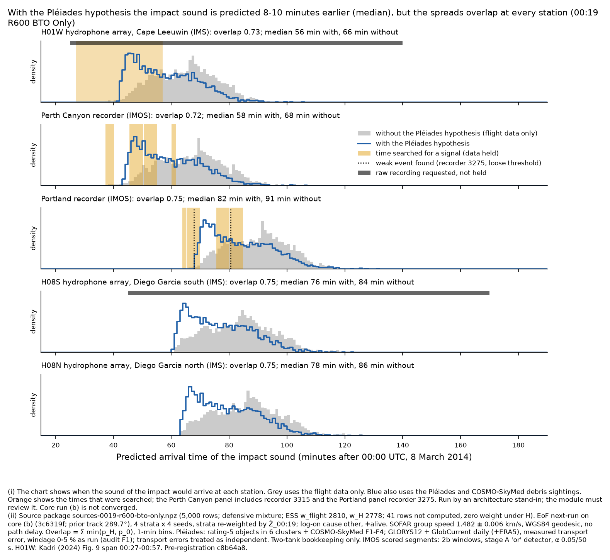
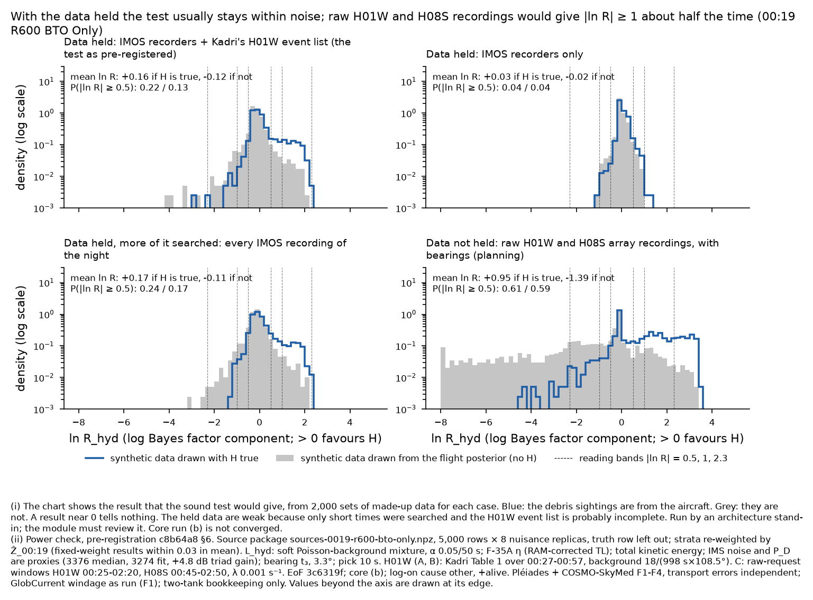
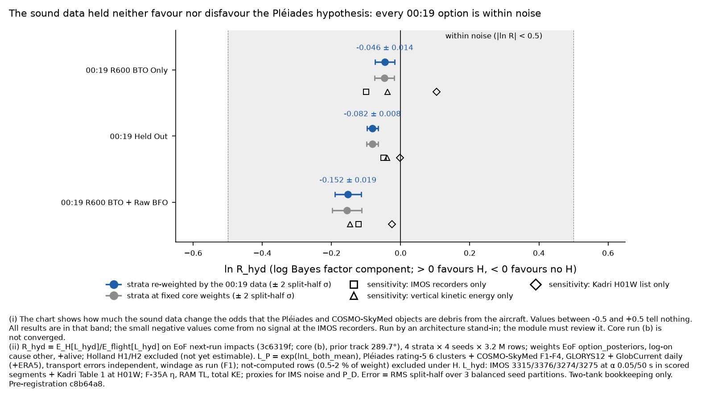

# Hydroacoustic test of the Pléiades hypothesis: first pass on core (b) (stand-in)

**Run by an architecture stand-in for the hydroacoustics module; module to review.** 10 Oct 2026.
**Labels:** core (b) not converged (split-half); two-tank bookkeeping only; Pléiades/COSMO transport errors treated as
independent (correlation pending from ocean transport); GlobCurrent windage as run (debris-drift audit F1); end-of-flight
sweep run by a stand-in (EoF `3c6319f`); L_hyd is a stand-in construction from the module's exploratory per-sample
model, not the module's gated likelihood (its `impact_log_likelihood` still returns 0.0). PROVISIONAL.

**Pre-registration:** `results/hydroacoustics-pleiades-test-preregistration.md`, commit **`c8b64a81112dc507e3c784740b4c58a635d7ba21`**,
pushed before any R_hyd was computed and before `READY` was read. Pete's near-limit instruction (~20:30 UTC) arrived
before that commit and is built into it, so there is no amendment.

## Result in one paragraph

The power check found the test **informative by the pre-registered stop rule**, but only weakly: with the data held,
the expected ln R_hyd is +0.16 if H is true and −0.12 if it is not (00:19 R600 BTO Only), and |ln R| ≥ 1 occurs in 13 %
and 5 % of synthetic data sets. Almost all of that power comes from Kadri's H01W event list; the IMOS recorders alone give
+0.03 / −0.02. The result is **within noise for every 00:19 option**: ln R_hyd = **−0.046 ± 0.014** (00:19 R600 BTO
Only), **−0.082 ± 0.008** (00:19 Held Out) and **−0.152 ± 0.019** (00:19 R600 BTO + Raw BFO), re-weighted strata,
split-half σ. The fixed-weight mixture agrees to 0.003. The small negative values come from the absence of any signal
at the IMOS recorders, partly offset (R600 BTO Only) by a slightly better fit of Kadri's H01W transients under H. The
observed values lie near the median of the synthetic distributions under both hypotheses. **Raw H01W and H08S
recordings would change this:** under the same model, |ln R| ≥ 1 in about half of data sets and ≥ 2.3 in 21-26 %.

## 1. What was computed

R_hyd = [Σ w L_P L_hyd / Σ w L_P] ÷ [Σ w L_hyd / Σ w] on end of flight's next-run impacts (4 strata × 4 seeds, 3.2 M
rows each, 51.2 M rows), as pre-registered (§1, §3, §4).
- **w:** EoF `option_posteriors` (displacement_hist.py `f964a9b9…`, unchanged), keys `r600-bto__other+alive`,
  `none__other+alive`, `r600_no-offset__other+alive`. Check: my re-derivation of each option's weights from EoF's
  `derived_logliks` and `constraint_log_factor` equals option_posteriors' to max |Δp| = 0 in all 48 seed × option cases.
- **L_P:** `exp(lnL_both_mean)` from the Pléiades stand-in's columns (`READY` 19:33:06Z; all SHA256SUMS verified; `row`
  and `parent` checked against the impacts in every seed). ESS per seed reproduces the Pléiades README exactly (e.g. free
  seed 1: 1,651,633 flight, 112,544 under H).
- **L_hyd:** soft near-limit likelihood, `lhyd.py` (sha256 `5000c56e…`, as pre-registered). IMOS 3315, 3376, 3274, 3275 at
  α = 0.05 per 50 s inside the scored segments (372.5 / 450.5 / 350.5 / 550.1 s; no events except two loose events at
  3275, 01:07:46.6 and 01:20:34.5 UTC); Kadri's Table 1 at H01W (19 transients with bearings) over 00:27-00:57;
  F-35A-calibrated η with RAM-corrected TL; total kinetic energy; one nuisance draw per row shared by all stations.
- **Not used:** H08S (Kadri's trace is an airgun shot train, no absolute P_D), H08N (blocked by the Great Chagos Bank),
  Scott Reef 3250 (blocked), raw H01W/H08S (not held), the AGW branch (filtered out of every record held).

## 2. Power check (before the result)

Overlap coefficient of the arrival-time densities with and without H (median shift, H earlier), source packages:

| 00:19 option | H01W | Perth Canyon 3376 | Portland 3274 | H08S | H08N | stop rule |
|---|---|---|---|---|---|---|
| 00:19 R600 BTO Only | 0.73 (9.4 min) | 0.72 (9.6 min) | 0.75 (8.6 min) | 0.75 (8.7 min) | 0.75 (8.6 min) | informative: proceed |
| 00:19 Held Out | 0.80 (5.2 min) | 0.80 (5.4 min) | 0.83 (4.7 min) | 0.80 (6.0 min) | 0.80 (5.9 min) | informative: proceed |
| 00:19 R600 BTO + Raw BFO | 0.71 (6.3 min) | 0.69 (6.5 min) | 0.74 (5.5 min) | 0.78 (5.1 min) | 0.78 (5.1 min) | informative: proceed |

Under H the predicted arrivals are 5-10 min earlier at every station, because the impact times weighted by the Pléiades
likelihood are earlier (the cause has not been attributed here). The spreads still overlap by 0.69-0.83 everywhere.

Expected ln R_hyd from 2,000 synthetic data sets per hypothesis and data set (strata re-weighted; MC = standard error of
the mean). Scenarios B and C are planning cases, not tests.

| 00:19 option | data set | E[ln R] if H true (± MC) | E[ln R] if no H (± MC) | P(\|ln R\| ≥ 0.5) H / no H | P(\|ln R\| ≥ 1) H / no H | P(\|ln R\| ≥ 2.3) H / no H |
|---|---|---|---|---|---|---|
| 00:19 R600 BTO Only | A: held, as pre-registered | +0.159 ± 0.014 | -0.119 ± 0.010 | 0.22 / 0.13 | 0.13 / 0.05 | 0.001 / 0.003 |
| 00:19 R600 BTO Only | A, IMOS only | +0.030 ± 0.005 | -0.024 ± 0.005 | 0.04 / 0.04 | 0.00 / 0.00 | 0.000 / 0.000 |
| 00:19 R600 BTO Only | B: held, all IMOS recordings scored | +0.168 ± 0.014 | -0.110 ± 0.010 | 0.24 / 0.17 | 0.12 / 0.06 | 0.001 / 0.002 |
| 00:19 R600 BTO Only | C: + raw H01W/H08S (not held) | +0.953 ± 0.030 | -1.391 ± 0.053 | 0.61 / 0.59 | 0.52 / 0.49 | 0.215 / 0.264 |
| 00:19 Held Out | A: held, as pre-registered | +0.069 ± 0.010 | -0.076 ± 0.008 | 0.16 / 0.10 | 0.06 / 0.04 | 0.000 / 0.002 |
| 00:19 Held Out | A, IMOS only | +0.006 ± 0.004 | -0.015 ± 0.004 | 0.02 / 0.03 | 0.00 / 0.00 | 0.000 / 0.000 |
| 00:19 Held Out | B: held, all IMOS recordings scored | +0.085 ± 0.010 | -0.096 ± 0.008 | 0.17 / 0.13 | 0.06 / 0.04 | 0.000 / 0.002 |
| 00:19 Held Out | C: + raw H01W/H08S (not held) | +0.677 ± 0.024 | -0.836 ± 0.043 | 0.58 / 0.51 | 0.44 / 0.40 | 0.079 / 0.147 |
| 00:19 R600 BTO + Raw BFO | A: held, as pre-registered | +0.175 ± 0.015 | -0.155 ± 0.012 | 0.26 / 0.20 | 0.14 / 0.08 | 0.003 / 0.006 |
| 00:19 R600 BTO + Raw BFO | A, IMOS only | +0.040 ± 0.007 | -0.046 ± 0.006 | 0.13 / 0.09 | 0.01 / 0.01 | 0.000 / 0.000 |
| 00:19 R600 BTO + Raw BFO | B: held, all IMOS recordings scored | +0.250 ± 0.016 | -0.166 ± 0.013 | 0.31 / 0.24 | 0.17 / 0.10 | 0.001 / 0.005 |
| 00:19 R600 BTO + Raw BFO | C: + raw H01W/H08S (not held) | +0.900 ± 0.029 | -1.272 ± 0.050 | 0.61 / 0.54 | 0.52 / 0.46 | 0.207 / 0.244 |

**Stop rule (pre-registration §6.4):** the overlaps are all ≥ 0.5, but P(|ln R| ≥ 0.5) exceeds 0.05 under both
hypotheses for every option in scenario A, so the test was **not** stopped. Read plainly: the data held can move ln R
by about ±0.5 in one data set in five, by ±1 in about one in ten if H is true, and almost never by ±2.3.

Check: the per-candidate decomposition used for the synthetic data reproduces `lhyd.station_terms` on the real events to
max |Δ ln L| = 0 (scenarios A and B).

## 3. Result

| 00:19 option | ln R_hyd, strata re-weighted (± split-half σ; max) | reading | ln R_hyd, fixed weights (± σ) | R_hyd (re-weighted) | ESS flight / under H (rows, 16 seeds) | not-computed weight |
|---|---|---|---|---|---|---|
| 00:19 R600 BTO Only | -0.046 ± 0.014 (0.017) | within noise (±2σ: within noise .. within noise) | -0.047 ± 0.014 | 0.955 | 28.0 M / 1.59 M | 0.7-2.0 % |
| 00:19 Held Out | -0.082 ± 0.008 (0.010) | within noise (±2σ: within noise .. within noise) | -0.082 ± 0.008 | 0.922 | 44.0 M / 4.23 M | 0.8-1.7 % |
| 00:19 R600 BTO + Raw BFO | -0.152 ± 0.019 (0.032) | within noise (±2σ: within noise .. within noise) | -0.155 ± 0.021 | 0.859 | 1.1 M / 0.08 M | 0.5-1.1 % |

R_hyd itself is 0.86-0.96. ESS is summed over 16 seeds (Kish, rows). Not-computed rows (outside 85-103 E, 43-25 S) are
excluded from the H-weighted sums and counted; they stay in the flight sums.

**Sensitivities and decomposition** (re-weighted strata, ± split-half σ):

| 00:19 option | IMOS only | H01W (Kadri) only | vertical kinetic energy | not-computed excluded from both | per stratum (free / Davey dyn.+radar / descent-climb / routes) |
|---|---|---|---|---|---|
| 00:19 R600 BTO Only | -0.100 ± 0.007 | +0.103 ± 0.017 | -0.037 ± 0.013 | -0.042 ± 0.014 | -0.050 / -0.074 / +0.004 / -0.010 |
| 00:19 Held Out | -0.049 ± 0.003 | -0.002 ± 0.011 | -0.040 ± 0.007 | -0.079 ± 0.008 | -0.082 / -0.103 / -0.055 / -0.038 |
| 00:19 R600 BTO + Raw BFO | -0.121 ± 0.009 | -0.025 ± 0.021 | -0.146 ± 0.011 | -0.145 ± 0.019 | -0.158 / -0.174 / -0.127 / -0.136 |

**Stratum weights** (ruling ~19:10 C): ln Ẑ_00:19 per family, computed by the stand-in from end of flight's columns (EoF
has not published its own), and the resulting P(family). They equal the Pléiades stand-in's values to rounding.

| 00:19 option | ln Ẑ_00:19 free / Davey dyn.+radar / descent-climb / routes (seed sd) | P(family) re-weighted | matches Pléiades stand-in |
|---|---|---|---|
| 00:19 R600 BTO Only | -5.802 (0.127) / -5.902 (0.049) / -5.734 (0.079) / -5.711 (0.028) | 0.6972 / 0.1386 / 0.1478 / 0.0164 | max \|Δ\| 1.1e-16 |
| 00:19 Held Out | -0.106 (0.029) / -0.109 (0.003) / -0.100 (0.009) / -0.113 (0.006) | 0.6946 / 0.1523 / 0.1383 / 0.0148 | max \|Δ\| 5.6e-17 |
| 00:19 R600 BTO + Raw BFO | -12.560 (0.048) / -12.566 (0.100) / -12.082 (0.404) / -12.313 (0.266) | 0.6388 / 0.1395 / 0.2041 / 0.0176 | max \|Δ\| 2.8e-17 |

Under 00:19 Held Out, Ẑ contains only the `+alive` factor (ln Ẑ ≈ −0.11 in every family), so the re-weighted and fixed
mixtures coincide to 10⁻⁴, as the ruling's "factor 1" intends.

**Where the observed values sit:** ln R_hyd for 00:19 R600 BTO Only is at the 49th percentile of the synthetic
distribution under H and the 66th under no H; the other options are at the 39th-45th (H) and 54th-56th (no H). The data
are typical of both hypotheses.

## 4. Reading (pre-registered bands)

| 00:19 option | reading | ±2σ band |
|---|---|---|
| 00:19 R600 BTO Only | within noise (−0.046; direction: no H) | within noise |
| 00:19 Held Out | within noise (−0.082; direction: no H) | within noise |
| 00:19 R600 BTO + Raw BFO | within noise (−0.152; direction: no H) | within noise |

The sign is stable across seeds, stratum weightings and sensitivities except the H01W-only decomposition for R600 BTO
Only (+0.10). It is a direction inside the noise band, not evidence. Holland H1/H2: excluded (not yet estimable).

## 5. What data would make the test informative

1. **Raw H01W and H08S triad recordings** (CTBTO vDEC or a national data centre; the module's request is outstanding:
   H01W 00:25-02:20, H08S 00:45-02:50 UTC). Scenario C: E[ln R] +0.95 if H true, −1.39 if not (R600 BTO Only); |ln R| ≥ 1
   in 49-52 % of data sets, ≥ 2.3 in 21-26 %. The gain comes from triad bearings at two sites and the timing of a common
   impact: H moves the predicted bearing and arrival time at both stations together.
2. **For scenario C to be a real likelihood, not a planning number:** a measured IMS noise level (Blackman App. B
   spectra, the module's next noise step), an injection-recovery P_D at the IMS triads, and shot-train removal at H08S.
3. **Not worth much:** scoring the rest of the IMOS recordings already held (scenario B) adds 0.01-0.08 to E[ln R]. It
   needs no new data and minutes of CPU, so it is cheap, but it will not change the reading.
4. **Kadri's own detection list on raw data,** with its threshold, would replace the doubtful completeness assumption in
   the H01W term, which carries most of scenario A's power.

## 6. Deviations and limitations (declared)

1. L_hyd is a stand-in construction from `near_limits_eof289.py` arithmetic. IMS noise and IMS P_D are proxies (3376
   background median; 3274 stage A fit; +4.8 dB triad gain).
2. The H01W term treats Kadri's Table 1 as a complete event list at a threshold comparable to the proxy P_D. That is
   doubtful: 17 of 18 distinct Table 1 times are not visible in his published traces (module note 2a).
3. TL is interpolated in latitude only and clamped outside 38.46-31.64 °S (about 20 % of a free seed-1 flight-posterior
   subsample lies outside; the conditional region under H lies inside).
4. Two numerical changes from the module's arithmetic, declared in the pre-registration: band fraction tabulated
   (max relative error 8.6 × 10⁻⁵); mean group speed with its spread as a timing sd.
5. The power check uses the 5,000-row source packages × 8 nuisance replicas with the truth row left out, and 2,000
   synthetic sets per hypothesis and data set. Its means carry MC errors of 0.004-0.05 (table above).
6. `power_check.py`, `rhyd_result.py` and `rhyd_mix.py` were written after the pre-registration commit, to its §4 and §6
   specification; they are committed with this note. Scenario B's background events are drawn over recorded segments
   between 00:00 and 04:00 UTC only (no predicted arrival lies outside).
7. To call `option_posteriors` unchanged on a column subset read once per seed, its module-level `np` was replaced by a
   proxy whose `load()` returns the in-memory columns; every other numpy call passes through.
8. Facts after 00:19: variant (a) `+alive`, because end of flight has not yet exposed (b).
9. Ẑ_00:19 is the stand-in's, from end of flight's columns (EoF owes its own).
10. Compute: one thread per process, at most two processes; no heavy lock. Wall time: power check about 40 min for three
    options; full-row pass 16 seeds in about 30 min.

## Files

- Pre-registration: `results/hydroacoustics-pleiades-test-preregistration.md` (`c8b64a8`).
- Scripts: `results/hydroacoustics-pleiades-test-standin/standin-scripts/` (`lhyd.py`, `extract_imos_events.py`,
  `power_check.py`, `rhyd_result.py`, `rhyd_mix.py`).
- Data: `results/hydroacoustics-pleiades-test-standin/` (`imos_events_searched.json`; `power/<option>/power_check.json`;
  `result/per_seed.json`, `result/rhyd_mixture.json`).
- Figures: `results/hydroacoustics-pleiades-test-standin-{windows,power}-<option>.png` and
  `results/hydroacoustics-pleiades-test-standin-result.png`.

**Hydroacoustics, please review:** the soft likelihood, the Kadri H01W term and its background density, the proxy P_D
at H01W, and the choice to exclude Kadri's H08S trace. Adopt, amend or replace; re-run in your own tree if you disagree.
**Pléiades:** nothing is needed from you for this pass.

— Modular Architecture (stand-in for Hydroacoustics)

## COVERAGE

See `hydroacoustics-coverage.md` for the three sets, ESS per option and family, the gaps and the parameter bounds. Specific to this note: R_hyd is reported for options 1-3 only. H1/H2 are excluded (G1). TL is provisional (G2, architecture 17:50 −0600). Not-computed rows (outside 85-103 E, 43-25 S) are carried at the neutral value (pass-0 ruling 1).
