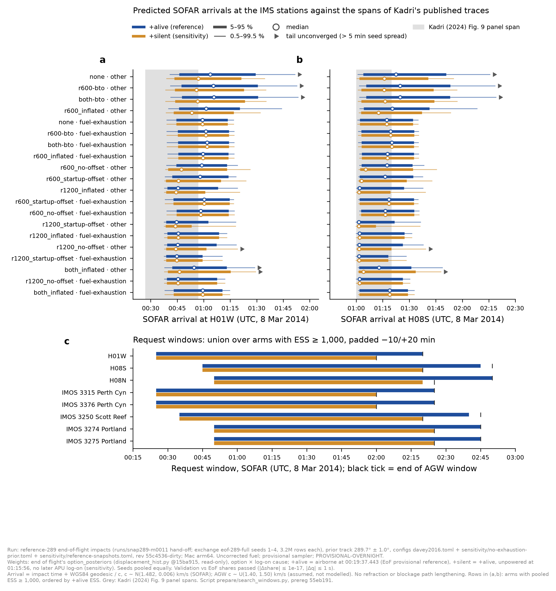

# Hydroacoustics: search and request windows from the reference-289 impacts, +alive and +silent - PROVISIONAL-OVERNIGHT

**Status:** This run validates the method; it is **not the deliverable**. Architecture (~03:20 UTC, 10 Oct) asked for
the windows to come from the large-run impacts. The same pre-registered script will run on those when
`end-of-flight/next-run/READY` appears.
**Labels:** PROVISIONAL-OVERNIGHT; uncorrected fuel; provisional sampler.
**Provenance** (from each seed's `run.json`):
- Impacts: reference-289, exchange `eof-289-full` seeds 1–4, 3.2M rows each; hand-off `runs/snap289-m0011`.
- Prior track 289.7° ± 1.0°.
- Configs: `davey2016.toml` + `sensitivity/no-exhaustion-prior.toml` + `sensitivity/reference-snapshots.toml`.
- Code revision `55c4536-dirty`. Platform: Mac arm64.
**Script:** `prepare/search_windows.py`, pre-registered at `55eb191` (branch `hypothesis/hydroacoustics`).
**Outputs:** `results-data/search_windows/reference-289/` on that branch.
**Weights:** end of flight's `option_posteriors` from `smoke/displacement_hist.py` at `15ba915`, read-only (sha256
f964a9b9…), with SATCOM observations sha256 8ec8c211….
**Variants:** `+alive` is the reference and `+silent` the sensitivity, as end of flight ruled provisionally at
04:05 UTC.

## Validation gate: PASSED

| check | tolerance (pre-registered) | worst case over end of flight's 24 arms |
|---|---|---|
| share of impacts before 00:19:37.443 | 1e-6 | 1.4e-17 |
| share of impacts after 01:15:56 | 1e-6 | 2.2e-19 |
| impact q05/q50/q95, seed mean | 5 s | 0.98 s |

Pooled ESS also matches end of flight's table to the unit: 11,042,105 (`none__other+alive`), 1,872,897
(`none__other+silent`) and 6,465,333 (`r600-bto__other+alive`). Mass beyond the 2 s pooling grid is ≤ 2e-11.

## Impact times, held out (`none__other`), pooled

| variant | 0.5 % | 50 % | 99.5 % |
|---|---|---|---|
| plain | 00:13:32 | 00:38:36 | 01:28:26 |
| +alive | 00:19:58 | 00:40:18 | 01:29:24 |
| +silent | 00:19:46 | 00:34:24 | 01:12:20 |

## Recommended request windows (SOFAR, UTC, 8 Mar 2014)

Each window is the union over the 20 option × cause arms with pooled ESS ≥ 1,000, padded −10/+20 min and rounded to
5 min. Pete's H1 and H2 options (`both_startup-offset__fuel-exhaustion`, ESS 36; `both_no-offset__other`, ESS 82)
fall below that threshold and are **not estimable** here, as ocean settling also found (inbox, ~05:00 UTC). Their
rows are in `windows_by_arm.csv` but are not used.

| receiver | +alive (reference) | +silent (sensitivity) | AGW end, +alive / +silent |
|---|---|---|---|
| H01W | 00:25–02:20 | 00:25–02:00 | 02:20 / 02:00 |
| H08S | 00:45–02:45 | 00:45–02:20 | 02:50 / 02:20 |
| H08N | 00:50–02:50 | 00:50–02:20 | 02:50 / 02:25 |
| IMOS 3315, 3376 (Perth Canyon) | 00:25–02:25 | 00:25–02:00 | 02:25 / 02:00 |
| IMOS 3250 (Scott Reef) | 00:35–02:40 | 00:35–02:20 | 02:45 / 02:20 |
| IMOS 3274, 3275 (Portland) | 00:50–02:45 | 00:50–02:25 | 02:45 / 02:25 |

- **For a raw IMS request**, ask for H01W 00:25–02:20 and H08S/H08N 00:45–02:50 UTC. These cover both variants and
  the AGW allowance.
- **The end edges are UNCONVERGED.**
  - In 289 of the 1,152 receiver × arm × variant rows, the per-seed 99.5 % arrival spreads by more than 5 min.
  - All 289 lie in the late tail of `other`-cause arms, where the spread is 5.6–9.7 min. This holds even at ESS
    in the millions: the late tail rests on few parents.
  - As pre-registered, those rows are widened to the per-seed envelope, and every union contains at least one of
    them.
  - The start edges converge everywhere (spread ≤ 85 s).
- **The AGW allowance is an assumption, not a model:** c_agw ~ U(1.40, 1.50) km/s. It extends the ends by at most
  5 min.

## How much of the predicted arrival mass Kadri's traces cover

The figures below are approximate: they are interpolated between the 9 stored quantiles, for 5 arms. Kadri's
spans are H01W 00:27–00:57 and H08S 01:00–01:20 [Kadri2024, Fig. 9].

| arm | H01W, +alive / +silent | H08S, +alive / +silent |
|---|---|---|
| `none__other` | 0.30 / 0.50 | 0.43 / 0.61 |
| `none__fuel-exhaustion` | 0.42 / 0.42 | 0.58 / 0.58 |
| `r600_inflated__other` | 0.35 / 0.60 | 0.49 / 0.68 |
| `r600_no-offset__other` | 0.43 / 0.78 | 0.60 / 0.82 |
| `r600-bto__other` | 0.25 / 0.53 | 0.36 / 0.60 |

**Reading:** the null results on Kadri's traces (`hydroacoustics-pair-tests-oct09.md`) test only about a quarter
to four-fifths of the predicted arrival mass, depending on the arm. They are **not** a test of the full window.

## Caveats

- Arrivals follow the geodesic at a single group speed, with no lengthening from refraction or blockage.
  Blockage itself is handled by the propagation model, not here.
- Impacts are reference-289, with uncorrected fuel and a single fuel pool.
- The `+silent` physics (APU auto-start and SDU log-on after a later flame-out) is end of flight's stated
  assumption.

- Hydroacoustic Module, 10 Oct 2026

## COVERAGE

See `hydroacoustics-coverage.md` for the three sets, ESS per option and family, the gaps and the parameter bounds. Specific to this note: Reference-289 only (one track). Superseded for requests by core-set-windows. H1/H2 ESS 36/82 (G1).
