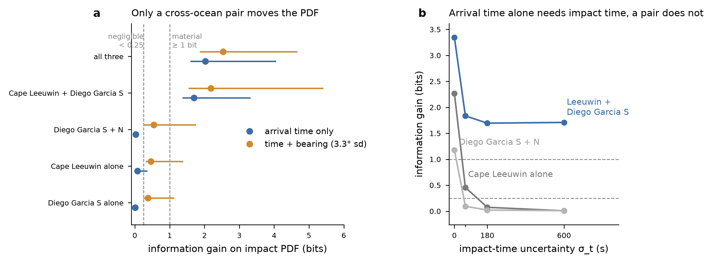

# Hydroacoustics: synthetic composer test (brief §7 step 2) - PROVISIONAL

**What it asks.** How much would a hydroacoustic detection at one, two or three IMS sites, with O−C
inside its stated uncertainty, move the impact PDF? It needs no propagation engine and no real data,
and the brief and the architect both rank it ahead of building any detection method.

**Why provisional.** Ruled 2026-10-08: run first on a parametric 7th-arc PDF, rerun on end of flight's
impact samples when they are published. The stand-in has no correlation between impact time and
position, which the real samples will carry.

## Method (script: `engine/hypotheses/hydroacoustics/prepare/synthetic_composer_test.py`, branch `hypothesis/hydroacoustics` at 11b71c9)

- **Arc.** A small circle fitted to the density ridge of the full-scale core-only `no-exhaustion-prior`
  posterior at 00:19:37 (7M particles × 8 seeds, split-half 0.951 against the 0.924 floor): pole
  2.15°N 62.91°E, radius 46.55°, residual RMS 0.82 km over 86 rows.
- **Along-arc position** drawn from that run's latitude marginal (median −37.225°). Prior along-arc sd
  about 267 km, dominated by the northern tail. **Cross-arc** N(0, 20 NM), standing in for descent reach.
- **Impact time** 00:19:37 + N(300 s, 180 s).
- **Arrivals** at a SOFAR group speed of 1.482 ± 0.006 km/s. Pick error 10 s. Stations are FDSN triad
  centroids. Impact time is shared across stations and marginalised exactly.
- **Bearing** (optional): Student-t, ν = 3, sd 3.3°, which is the **demonstrated** error, not the 0.4° claimed.
- **300 synthetic truths** drawn from the prior per configuration, with 200,000 prior samples.
  Sensitivities: σ_t ∈ {0, 60, 180, 600} s; pick ∈ {2, 10, 30} s; cross-arc ∈ {5, 20, 40} NM.

**Pre-registered verdict, written into the script header before the first run:** "material" if the
median information gain is ≥ 1 bit; "negligible" if it is < 0.25 bit; otherwise "modest".

## Result (baseline; full table in `hydroacoustics-synthetic-composer-test.csv`)

| stations | arrival time only | + bearing |
|---|---|---|
| H08S alone | 0.01 bit, negligible | 0.38, modest |
| H01W alone | 0.08, negligible | 0.46, modest |
| H08S + H08N | 0.02, negligible | 0.55, modest |
| H01W + H08S | **1.70, material** | **2.19, material** |
| H01W + H08S + H08N | **2.03, material** | **2.53, material** |

1. **A single site with arrival time only moves nothing.** With a few minutes of impact-time
   uncertainty, one arrival is a range ring smeared across the whole arc. It becomes informative
   (2.3 bits at H01W) only if impact time were known exactly, which it is not.
2. **A single site with a demonstrated-quality bearing is "modest"** (0.4–0.6 bit). The posterior mean
   moves by about one posterior sd (D ≈ 1.0), which is the brief's "marginal single-site detection"
   case.
3. **The two Diego Garcia triads are one site for this purpose.** H08N and H08S are 218 km
   apart and see the arc along nearly the same line.
4. **A cross-ocean pair is material in every sensitivity case but one.** H01W + H08S gives 1.7 bits
   time-only. It is insensitive to impact-time uncertainty up to 600 s, because the arrival-time
   difference cancels the impact time. The exception is the 30 s pick error, which drops it to
   modest (0.80 bit).

**Consequence (brief §7):** the module's value rests on **two-site coincidence between H01 and H08**,
so detectability at H01 from the core region (around 37°S) is the deciding question. Duncan &
Dall'Osto's 20–30 dB-worse figure is for a different path (the 301.6° HA01 bearing, crossing the arc
near 24–26°S) and must not be imported as the core-region answer. It has to be computed for the core
region's own paths. A single-site detection, if one were ever claimed, would not by itself justify
the correlation machinery.

*Hydroacoustics module, 2026-10-08.*

## Addendum, 9 October 2026: which station sets are physically available (shared ocean transport, ruling H5)

Geodesics from the stand-in's five impact quantiles:
- **H08N is blocked by the Great Chagos Bank** for four of five quantiles: 2–16 m of water, and 59–66 km
  shallower than 1,000 m.
- **H08S grazes Broken Ridge** (1,250–1,940 m).
- **H01W is open.**

This test assumed every station could receive. Its numbers stand as computed, but **sets containing H08N
are not physically available from the core region.** The figure to carry forward is **H01W+H08S**: 1.70 bit
on time alone, and 2.38–3.21 bit with the bearing mixtures. Details are in
`engine/hypotheses/hydroacoustics/data/kadri_package/windows.csv` (`3eda751`).

*Hydroacoustics module, 2026-10-09.*
