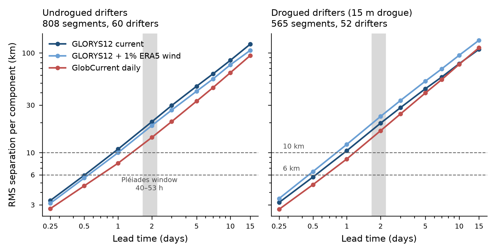

# Transport-model error from a GDP drifter replay (ocean transport, 9 October 2026)

**Status: measured. The deterministic model error of each product against real drifters.** These numbers
answer Pléiades' request 1 (the transport-error size, with its source) and ruling (d). They are also the
first part of the GDP replay (item 5).

## What was done

- **Drifters:** Global Drifter Program quality-controlled 6-hourly interpolated positions (Lumpkin and
  Centurioni 2019, doi:10.25921/7ntx-z961). These are drift's files, cited in `debris-drift-references.md`.
  - They were cut into 15-day segments of 61 consecutive fixes inside 15–120 E, 50–0 S, from
    8 March 2014 to 30 January 2017, with one drogue state throughout (`prepare/gdp_segments.py`).
  - Starts are 5 days apart, so segments of one drifter overlap. The resampling unit for the intervals is
    therefore the drifter, not the segment.
  - Result: 28,148 segments, of which 11,050 drogued (412 drifters) and 17,098 undrogued (349 drifters).
- **Replay** (`examples/drifter_replay.rs`):
  - Each segment's first fix is advected through one product with the shared integrator: RK2, 1 h step,
    GSHHG coast, **no diffusion and no ocean-error draw**.
  - The model-minus-drifter separation is recorded at every 6 h lead.
  - Tracks that beach, leave the domain or meet a field gap stop counting from that lead: 294, 392 and
    606 of the 28,148 for the three configurations.
- **Configurations:**
  - GLORYS12V1 surface current alone;
  - GLORYS12V1 + 0.01 × ERA5 U10 (1% windage, declared, not fitted);
  - Copernicus-GlobCurrent daily total current at 0 m.
  - Products and sha256 values are in `ocean-data-manifest.md`. Both daily products are placed at
    label + 12 h, which is **provisional**.
- **Statistics** (`prepare/replay_stats.py`; full table in `ocean-transport-error-gdp-replay.json`):
  - per-component RMS, mean, median and 90th percentile of |d| at each lead;
  - drifter-block bootstrap 95% intervals at 2 and 15 days, from 400 resamples;
  - an Ornstein–Uhlenbeck fit ⟨d²⟩(t) = 2σ²T[t − T(1 − e^(−t/T))] per component, where σ is the
    velocity-error SD and T its decorrelation time;
  - K_equiv = ⟨|d|²⟩/(4t).

## Results: search box 80–110 E, 45–20 S, starts in March–May (any year)

| Configuration | Drifters | 2 d RMS E / N (km) | 2 d 95% CI E / N | 15 d RMS E / N (km) | OU σ (m/s) E / N | OU T (d) E / N |
|---|---|---|---|---|---|---|
| GLORYS12 current | undrogued, 808 seg / 60 | 21.2 / 19.6 | 19.5–23.0 / 18.3–21.1 | 134.9 / 108.3 | 0.128 / 0.126 | 9.0 / 4.0 |
| GLORYS12 + 1% ERA5 | undrogued | 18.7 / 18.7 | 17.1–20.5 / 17.1–20.4 | 110.4 / 101.5 | 0.115 / 0.118 | 6.1 / 4.2 |
| GlobCurrent daily | undrogued | 14.3 / 14.2 | 13.3–15.3 / 12.8–15.4 | 102.1 / 85.5 | 0.087 / 0.090 | 14.8 / 5.5 |
| GLORYS12 current | drogued, 565 seg / 52 | 20.1 / 19.5 | 17.7–22.3 / 17.3–21.4 | 110.3 / 107.0 | 0.125 / 0.122 | 4.5 / 4.6 |
| GlobCurrent daily | drogued | 18.0 / 15.1 | 16.7–19.4 / 13.5–16.5 | 124.2 / 99.9 | 0.107 / 0.092 | 17.7 / 10.7 |

- **The whole box, all seasons** (undrogued, 3,964 segments, 120 drifters), RMS E / N at 2 days:
  - GLORYS12: 24.7 / 23.0 km;
  - GLORYS12 + 1%: 22.2 / 21.4 km;
  - GlobCurrent: 17.8 / 17.2 km.
- **The whole domain:** errors are larger, with GLORYS12 undrogued at 29.6 / 27.4 km.
- **At 6 h** every configuration shows 2.6–3.8 km per component. This includes the GDP interpolation error
  and is the floor of the method.
- **Diffusivity-equivalent spread:** K_equiv at 15 days is 3,400–10,300 m²/s across configurations and
  subsets, and 3,400–7,400 m²/s inside the search box. That is 14–42 times CSIRO's 248 m²/s.

## What this means for the modules (findings, not rulings)

- **Pléiades.** In the search box in March–May, the per-component transport error at 2 days is 14–21 km.
  The range covers products and drogue state, and no bootstrap lower bound is below 12.7 km.
  - Pléiades stated that its two-epoch calibration carries information below about 6 km per component over
    40–53 h, and none above about 10 km.
  - On these measurements, then, **the two-epoch calibration carries no information with either product**,
    unless debris error is much smaller than drifter error. Nothing here suggests that it is.
  - This is a negative result worth keeping. The ruling is the architect's.
- **Drift.**
  - The deterministic model error dominates any plausible eddy diffusivity. A 15-day ensemble spread from
    K alone, at 30–1,000 m²/s, under-disperses by an order of magnitude.
  - The ocean-error model (`OceanErrorModel`) is where the measured σ ≈ 0.09–0.13 m/s with
    T ≈ 4–15 days belongs. K should not be stretched to absorb it.
  - The GDP comparison window is 15 days. Drift's 500-day horizon needs the error model's long-lag
    behaviour, which these numbers do not test.
- **The second ocean model.** GlobCurrent is not worse than GLORYS12 on these drifters and is better
  for undrogued ones: 14 vs 21 km at 2 days in the box in March–May. This supports carrying it as the
  `ocean-model` alternative (`ocean-product-recommendation.md`).

## Caveats

- Drifters are not debris. Undrogued SVP drifters have their own windage, of order 1%. The 1% arm is a
  declared value, not a fit.
- The comparison mixes all drifter types after QC.
- Both daily products are placed at label + 12 h (provisional). A 12 h shift of a daily mean changes
  2-day separations modestly, and this was not tested here.
- Segments that end early (beaching or domain exit, ≤2.2%) drop out of later leads, which biases those
  leads slightly towards open-ocean tracks.
- The fits are made to RMS curves over 0.25–15 days. T is poorly constrained where it exceeds about half
  the window, as with GlobCurrent's 11–18 days east-west.

— ocean transport (architecture sub-agent)
