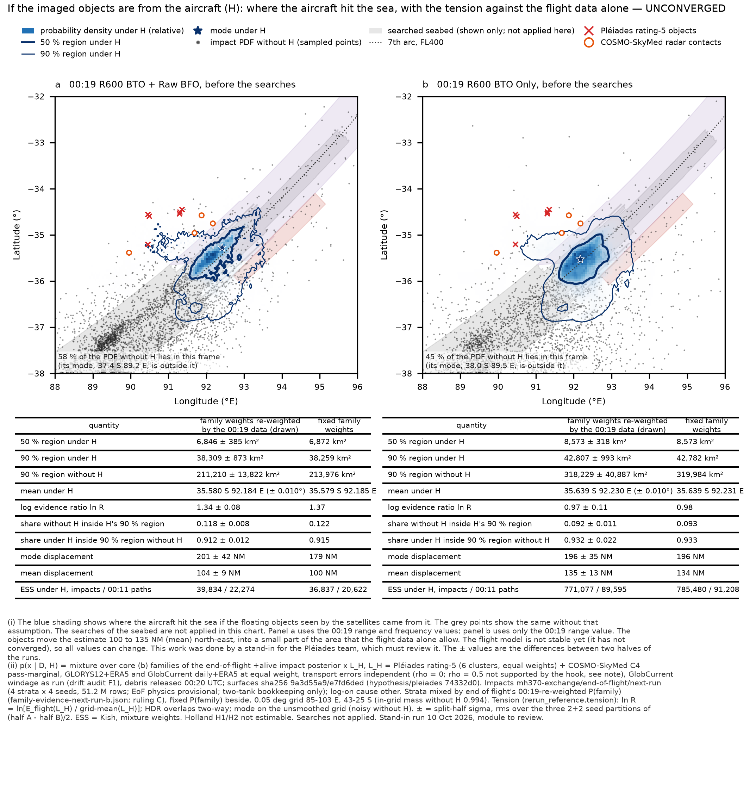
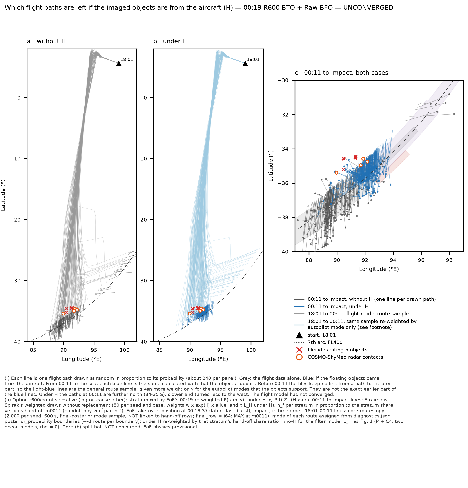
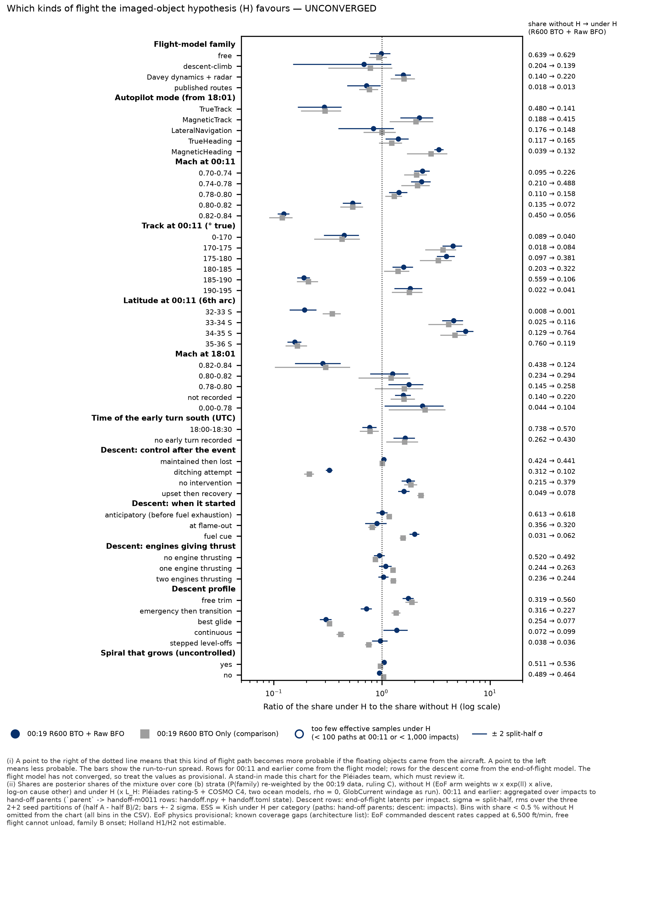
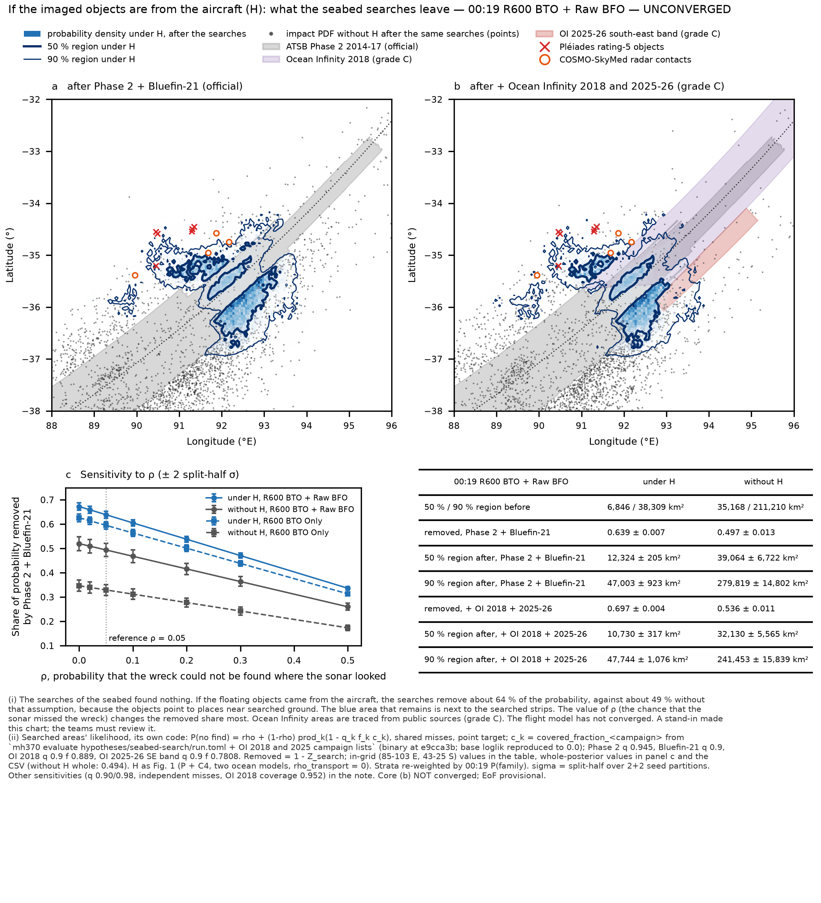

# Pléiades-conditional impact PDF on core (b), 00:19 R600 BTO + Raw BFO — trace-back and searches under H (stand-in)

10 Oct 2026, ~22:30 UTC. **Run by an architecture stand-in on behalf of the Pléiades module (with a searched-areas
component), at Pete's request (~14:50 −0600). The modules must review it.** Recipe replay: the modules' own code and
conventions with only the inputs changed; no physics or method change.

**Labels (every number below):** **UNCONVERGED — core (b) split-half NOT converged** · end-of-flight physics PROVISIONAL
(two-tank bookkeeping only; dive class (b), Boeing glide provisional) · Pléiades/COSMO transport errors **independent
(ρ = 0)**; the ρ = 0.5 upper sensitivity now measured by ocean transport (`results/ocean-transport-error-pairs.md`) is
**not supported by the module's hook surfaces** (see §5) · GlobCurrent windage as run (drift audit F1) · Holland H1/H2
**not estimable** · log-on cause `other`, end of flight's `+alive` existence constraint · PROVISIONAL-OVERNIGHT.

Figures (house style: faint points for the impact PDF without H; two-part footnotes): `pleiades-conditional-r600-raw-bfo-standin/fig1…fig4.png/pdf`.
Tables: `…/conditional-headline.csv`, `traceback-shares.csv`, `traceback-continuous.csv`, `strata-under-H.csv`,
`search-sensitivity.csv`, `ess-per-seed.csv`, `headline-and-search-all.csv`. Scripts: `…/scripts/`.

## Deviations (declared)
1. **Ran outside the heavy lock, at ≤ 2 threads.** `/tmp/.mh370-heavy.lock` was held by another job for > 25 min; every
   step here is light at 2 threads (search evaluation 38 s for all 16 seeds; one accumulation pass ≈ 20 s per seed,
   run twice; surface export 4.4 min). Peak RAM ≈ 1.1 GB per process (4.8 GB in the settling reweighting, §4). New data written ≈ 1.1 GB (workspace only; nothing
   written to the exchange).
2. **Engine binary rebuilt** from the working branch (engine identical to fed85b3; build label e9cca3b), and the **Pléiades
   surfaces regenerated** with the module's own export tests (`results/pleiades/hydro-test/standin-scripts/export_surfaces.sh`).
   sha256 `9a3d55a9…` / `e7fd6ded…`: **identical** to the module's run tree.
3. **Search likelihood: one evaluation per seed, the variants by arithmetic.** `mh370 evaluate hypotheses/seabed-search/run.toml
   scripts/oi-all.toml` — `oi-all.toml` is an input-only override, the union of searched areas' own `ocean-infinity-2018.toml`
   and `ocean-infinity-2025.toml`, with values copied verbatim. Every variant (ρ sweep, Phase 2 q, independent misses, OI layers)
   is then computed from the per-campaign `covered_fraction_*` columns with lib.rs's formula. This was verified against the
   binary's own `seabed-search:loglik`: max |Δ| = 0.0 on all 16 seeds (OI case) and on a 200,000-row slice (base case).
   searched areas' `impact_map_options.py` / `report.py` were **not** run. Their whole-posterior "removed" share is reproduced
   exactly (below). **Not computed:** the Phase 2 per-sensor ("repeat search") split, which needs the per-sensor layers.
4. **One grid for the areas.** All 50/90 % areas use the Pléiades grid (0.05°, 85–103 E, 43–25 S), both under H and without
   H, with the module's `hdr_level` / `tension`. Without H, 0.994 of the mass is in the grid. Searched areas' own areas (0.02°,
   smoothed, whole domain) are therefore not comparable with the without-H areas here. The removed share is given both in the
   grid and for the whole posterior.
5. **Trajectory history before 00:11 is not linked per path.** Core's m0011 hand-off rows carry `final_row` = i64::MAX, and
   `routes.npy` is an unlinked 2,000-route sample per seed. The 18:01–00:11 part of Fig. 2 and the "Mach at 18:01" /
   "early turn" rows therefore come from the **hand-off state** (handoff.toml `early.*`, counts, mode, Mach, fuel). The
   Fig. 2 route lines are re-weighted **by autopilot mode only**, an approximation that is labelled on the chart. Route-to-mode
   assignment uses the diagnostics.json posterior boundaries, so it is uncertain by ±1 route per boundary.
6. **Not-computed cells.** A model that is not computed counts as zero likelihood in that model, then the two models are
   averaged. This is the module's `build_branch` convention (≡ lnL_other − ln 2).
7. **P(family)** re-weighted values were read from end of flight's `summary/family-evidence-next-run-b.json`, not derived.
   Fixed P(family) is given beside them throughout.
8. **Settling: reweighted, not re-run.** Settling's own (b) core-set samples (its workspace, `field/nrb*`, read-only) were
   reweighted by L_H with a weighted copy of its `seabed_density` (§4). Its constraint is `unpowered`, not `+alive`.
9. **Transport ρ = 0.5: not run on (b)** (§5).

## Reproduction checks (all pass)
- **Per stratum, before search (P + C4, under H):** the 90 % area and mean reproduce the stand-in table (`results/pleiades/hydro-test/standin-columns.md`)
  in 8 of 8 rows, for example free 37,678 km², −35.582 / 92.182.
- **Mixture before search:** 38,309 km² with re-weighted P(family) and 38,259 km² with fixed P(family), equal to the published
  values.
- **After searches** (module's `next-run-b-core/closeups/closeup-stats.csv`):
  - Phase 2 + Bluefin-21: 47,003 km² (re-weighted) and 46,854 km² (fixed);
  - + OI: 47,744 / 47,591 km²;
  - the share the searches leave, under H: 0.361 / 0.303; without H: 0.503 / 0.464;
  - 00:19 R600 BTO Only: 52,558 and 53,595 km².
  All equal to the published values.
- **Searched areas' whole-posterior removed share, fixed P(family), ρ 0.05:** 0.4930 (R600 BTO + Raw BFO) and 0.3287
  (R600 BTO Only), against the published 49.3 % and 32.9 %.
- **ESS under H per seed (R600 BTO + Raw BFO):** 1,844–7,236 rows, equal to the stand-in table.

## 1. Conditional impact PDF p(x | D, H) with the three tension quantities

| quantity | R600 BTO + Raw BFO, re-weighted P(family) | fixed P(family) | R600 BTO Only, re-weighted | fixed |
|---|---|---|---|---|
| 50 % region under H (km²) | 6,846 ± 385 | 6,872 | 8,573 ± 318 | 8,573 |
| 90 % region under H (km²) | 38,309 ± 873 | 38,259 | 42,807 ± 993 | 42,782 |
| 90 % region without H (km², in grid) | 211,210 ± 13,822 | 213,976 | 318,229 ± 40,887 | 319,984 |
| mean under H, latitude | -35.580 ± 0.010 | -35.579 | -35.639 ± 0.010 | -35.639 |
| mean under H, longitude | 92.184 ± 0.017 | 92.185 | 92.230 ± 0.011 | 92.231 |
| median latitude under H | -35.554 ± 0.011 | -35.553 | -35.618 ± 0.012 | -35.617 |
| median latitude without H | -37.489 ± 0.072 | -37.459 | -37.985 ± 0.090 | -37.979 |
| **evidence ratio ln R** (flight posterior vs flat over grid, under L_H) | 1.34 ± 0.08 | 1.37 | 0.97 ± 0.11 | 0.98 |
| ln S (suspiciousness) | -0.36 ± 0.21 | -0.31 | -0.48 ± 0.28 | -0.46 |
| **overlap: share without H inside H's 90 % HDR** | 0.118 ± 0.008 | 0.122 | 0.092 ± 0.011 | 0.093 |
| **overlap: share under H inside the no-H 90 % HDR** | 0.912 ± 0.012 | 0.915 | 0.932 ± 0.022 | 0.933 |
| **mode displacement (NM)** | 201 ± 42 | 179 | 196 ± 35 | 196 |
| mean displacement (NM) | 104 ± 9 | 100 | 135 ± 13 | 134 |
| ESS under H, impacts / 00:11 paths (mixture) | 39,834 / 22,274 | 36,837 / 20,622 | 771,077 / 89,595 | 785,480 / 91,208 |

± is the split-half σ: the rms over the three 2+2 seed partitions of (half A − half B)/2, applied to all strata together.
ln R is the module's evidence ratio: ln[E_flight(L_H) / mean over the grid of L_H], i.e. P(D_Pléiades | flight posterior,
H) against a flat position prior over the grid (absolute scale). ln Z_H = ln E_flight(L_H) is -13.27 ± 0.08
(per km², absolute; `conditional-headline.csv`).

**Reading.**
- **H relocates the estimate; it does not sharpen it in the flight data's terms.**
  - The conditional is narrow: 38,309 km² at 90 %, against 211,210 km² without H.
  - But it holds only **0.118** of the flight posterior's own mass. The converse overlap is 0.91, so the H region lies
    inside the no-H 90 % region, in a minor part of it.
  - The mean moves **104 ± 9 NM** north-east, to 35.58 S 92.18 E.
  - The mode moves 201 ± 42 NM (179 NM at fixed weights). **The no-H mode is not stable**: it is a raw-grid maximum and
    moves 0.7° in latitude between halves. Quote the mean displacement and the overlaps, not the mode displacement, until
    core converges.
- **ln R = +1.34 ± 0.08 is positive.** The flight posterior puts more probability where the Pléiades + COSMO likelihood is high
  than a flat prior over the grid does. So the tension is one of location within the corridor, not of absence of support.
  ln S = −0.36 ± 0.21 is within noise of 0.
- **The 00:19 R600 BTO Only option (beside):**
  - the region under H is wider (42,807 km²) and the overlap smaller (0.092);
  - the mean displacement is larger (135 NM);
  - ln R is lower (0.97). The raw BFO already pulls the no-H median about 0.5° north (−37.99 → −37.49 on this grid), towards the Pléiades region.
- **Re-weighted against fixed P(family):** the differences are ≤ 0.4 % in area and ≤ 0.002° in mean, below the split-half σ.

**Strata under H (R600 BTO + Raw BFO).** The H evidence differs between families by up to 0.84 nat, so H itself re-weights
the families:

| stratum | share without H (re-weighted P(family)) | share under H | ln Z_H,f (absolute) |
|---|---|---|---|
| free | 0.6388 | 0.6286 | -13.288 |
| Davey dynamics + radar | 0.1395 | 0.2198 | -12.818 |
| descent-climb | 0.2041 | 0.1390 | -13.657 |
| published routes | 0.0176 | 0.0127 | -13.600 |

## 2. Which trajectories H selects (trace-back through `parent` to core's 00:11 hand-off)

**Method.**
- The impact weights (EoF arm × alive) are summed per hand-off parent, without H and × L_H, and joined to the hand-off row:
  `handoff.npy` and `handoff.toml`, parsed (`aircraft.*`, `early.*`, `tanks.*`).
- Descent variables are end of flight's per-impact latents.
- Mixture shares use the re-weighted P(family). Under H, the stratum share is P(f) Z_f(H) / Σ.
- σ is split-half; ESS is Kish within each category (paths: hand-off parents; descent: impacts).
- All bins, and both strata-weight variants, are in `traceback-shares.csv`.

**Plainly: what H favours (R600 BTO + Raw BFO; ratios ± σ).**
1. **Further north at 00:11.**
   - The 6th-arc crossing at 34–35 S rises from 0.129 to **0.764** (×5.9 ± 0.5), and 33–34 S rises ×4.6.
   - 35–36 S falls ×0.16. Everything north of 32 S drops to ≈ 0 under H.
   - At 00:19:37, the median latitude is 35.48 S under H against 37.15 S without H.
2. **Slower, on a more southerly track.**
   - Mach 0.70–0.78 at 00:11: ×2.3–2.4. Mach 0.82–0.84: ×0.12.
   - Track 170–180° true: ×3.9–4.6. Track 185–190°: ×0.19.
   - Mach at 18:01 shifts the same way: 0.82–0.84 falls ×0.28.
3. **Autopilot mode.**
   - Favoured: magnetic heading ×3.4 ± 0.1, magnetic track ×2.2 ± 0.4, true heading ×1.4 ± 0.2.
   - Disfavoured: true track ×0.29 ± 0.06, the largest single loss (0.48 → 0.14).
   - LNAV: ×0.84 ± 0.22, not resolved.
4. **Family.**
   - Favoured: Davey dynamics + radar ×1.58 ± 0.12 (0.140 → 0.220).
   - Free: unchanged (×0.98 ± 0.10).
   - Descent-climb: ×0.68 ± 0.26, **not resolved at 2σ**.
   - Routes: ×0.72 ± 0.12.
5. **Descent (end of flight).**
   - Ditching attempts are strongly disfavoured (×0.33 ± 0.01), and so is best glide (×0.30 ± 0.02).
   - Free trim is favoured (×1.75), and so are no intervention (×1.76) and upset then recovery (×1.6).
   - Onset: fuel cue ×2.0. Flame-out and anticipatory onsets are unchanged within σ.
   - Engines thrusting: unchanged.
   - Consequence: impacts lie closer to the 7th arc (median 3 NM against 32 NM), earlier (00:30.6 against 00:35.2), and after
     shorter descents (median 780 s against 1,012 s).
   - **Option-dependent:** "emergency then transition" is ×0.72 under Raw BFO but ×1.37 under BTO Only.
6. **Not resolvable (ESS too low under H):**
   - the 00:11 latitude bands north of 32 S (ESS 1–35 paths; the shares are ≈ 0 anyway);
   - single published-route indices other than 27 and 9;
   - the fuel-cue × upset / no-intervention sub-families (ESS 47–80 impacts);
   - the early descent-climb excursion (33 paths).
   These are reported as coverage gaps, not dropped.

**R600 BTO + Raw BFO, re-weighted P(family):**

| variable | value | share without H | share under H (± σ) | ratio H / no-H (± σ) | ESS under H |
|---|---|---|---|---|---|
| core sampling family | free | 0.639 | 0.629 ± 0.064 | 0.98 ± 0.10 | 10,138 paths |
| core sampling family | descent-climb | 0.204 | 0.139 ± 0.054 | 0.68 ± 0.26 | 7,664 paths |
| core sampling family | Davey dynamics + radar | 0.140 | 0.220 ± 0.017 | 1.58 ± 0.12 | 14,311 paths |
| core sampling family | published routes | 0.018 | 0.013 ± 0.002 | 0.72 ± 0.12 | 7,290 paths |
| autopilot mode stratum (filter) | TrueTrack | 0.480 | 0.141 ± 0.012 | 0.29 ± 0.06 | 2,710 paths |
| autopilot mode stratum (filter) | MagneticTrack | 0.188 | 0.415 ± 0.049 | 2.21 ± 0.36 | 10,643 paths |
| autopilot mode stratum (filter) | LateralNavigation | 0.176 | 0.148 ± 0.019 | 0.84 ± 0.22 | 2,883 paths |
| autopilot mode stratum (filter) | TrueHeading | 0.117 | 0.165 ± 0.016 | 1.42 ± 0.16 | 3,575 paths |
| autopilot mode stratum (filter) | MagneticHeading | 0.039 | 0.132 ± 0.026 | 3.36 ± 0.14 | 2,781 paths |
| lateral mode flown at 00:11 | TrueTrack | 0.480 | 0.141 ± 0.012 | 0.29 ± 0.06 | 2,710 paths |
| lateral mode flown at 00:11 | MagneticTrack | 0.188 | 0.415 ± 0.049 | 2.21 ± 0.36 | 10,643 paths |
| lateral mode flown at 00:11 | TrueHeading | 0.155 | 0.208 ± 0.014 | 1.34 ± 0.11 | 4,356 paths |
| lateral mode flown at 00:11 | LateralNavigation | 0.126 | 0.079 ± 0.014 | 0.63 ± 0.21 | 1,534 paths |
| lateral mode flown at 00:11 | MagneticHeading | 0.051 | 0.158 ± 0.028 | 3.10 ± 0.20 | 3,340 paths |
| Mach at 00:11 | 0.82-0.84 | 0.450 | 0.056 ± 0.004 | 0.12 ± 0.01 | 1,446 paths |
| Mach at 00:11 | 0.74-0.78 | 0.210 | 0.488 ± 0.014 | 2.33 ± 0.23 | 10,665 paths |
| Mach at 00:11 | 0.80-0.82 | 0.135 | 0.072 ± 0.003 | 0.54 ± 0.05 | 1,461 paths |
| Mach at 00:11 | 0.78-0.80 | 0.110 | 0.158 ± 0.013 | 1.43 ± 0.13 | 4,290 paths |
| Mach at 00:11 | 0.70-0.74 | 0.095 | 0.226 ± 0.012 | 2.37 ± 0.18 | 4,635 paths |
| altitude at 00:11 (ft) | 39-41k | 0.281 | 0.166 ± 0.005 | 0.59 ± 0.07 | 3,904 paths |
| altitude at 00:11 (ft) | 37-39k | 0.274 | 0.214 ± 0.022 | 0.78 ± 0.13 | 5,337 paths |
| altitude at 00:11 (ft) | 35-37k | 0.139 | 0.188 ± 0.024 | 1.35 ± 0.12 | 4,154 paths |
| altitude at 00:11 (ft) | 30-35k | 0.116 | 0.185 ± 0.009 | 1.59 ± 0.14 | 3,928 paths |
| altitude at 00:11 (ft) | 41-43k | 0.101 | 0.111 ± 0.010 | 1.09 ± 0.16 | 2,395 paths |
| altitude at 00:11 (ft) | 0-30k | 0.053 | 0.084 ± 0.008 | 1.59 ± 0.10 | 1,600 paths |
| altitude at 00:11 (ft) | >43k | 0.035 | 0.052 ± 0.003 | 1.47 ± 0.02 | 1,091 paths |
| track at 00:11 (deg true) | 185-190 | 0.559 | 0.106 ± 0.002 | 0.19 ± 0.01 | 2,778 paths |
| track at 00:11 (deg true) | 180-185 | 0.203 | 0.322 ± 0.012 | 1.59 ± 0.16 | 6,765 paths |
| track at 00:11 (deg true) | 175-180 | 0.097 | 0.381 ± 0.006 | 3.94 ± 0.35 | 7,660 paths |
| track at 00:11 (deg true) | 0-170 | 0.089 | 0.040 ± 0.005 | 0.45 ± 0.08 | 965 paths |
| track at 00:11 (deg true) | 190-195 | 0.022 | 0.041 ± 0.005 | 1.82 ± 0.25 | 1,632 paths |
| track at 00:11 (deg true) | 170-175 | 0.018 | 0.084 ± 0.008 | 4.55 ± 0.45 | 2,127 paths |
| track at 00:11 (deg true) | 195-200 | 0.008 | 0.016 ± 0.003 | 2.00 ± 0.36 | 1,329 paths |
| track at 00:11 (deg true) | 200-360 | 0.003 | 0.009 ± 0.001 | 2.74 ± 0.31 | 270 paths |
| ground speed at 00:11 (kt) | 440-460 | 0.413 | 0.240 ± 0.011 | 0.58 ± 0.04 | 5,302 paths |
| ground speed at 00:11 (kt) | 460-480 | 0.215 | 0.069 ± 0.002 | 0.32 ± 0.03 | 1,651 paths |
| ground speed at 00:11 (kt) | 420-440 | 0.162 | 0.407 ± 0.007 | 2.51 ± 0.21 | 9,084 paths |
| ground speed at 00:11 (kt) | 400-420 | 0.123 | 0.255 ± 0.012 | 2.08 ± 0.15 | 5,543 paths |
| ground speed at 00:11 (kt) | >480 | 0.078 | 0.012 ± 0.001 | 0.16 ± 0.03 | 311 paths |
| ground speed at 00:11 (kt) | 380-400 | 0.009 | 0.016 ± 0.004 | 1.76 ± 0.34 | 407 paths |
| latitude at 00:11 (6th arc) | 35-36 S | 0.760 | 0.119 ± 0.006 | 0.16 ± 0.01 | 5,225 paths |
| latitude at 00:11 (6th arc) | 34-35 S | 0.129 | 0.764 ± 0.018 | 5.92 ± 0.50 | 15,337 paths |
| latitude at 00:11 (6th arc) | 33-34 S | 0.025 | 0.116 ± 0.014 | 4.60 ± 0.48 | 3,248 paths |
| latitude at 00:11 (6th arc) | 26-27 S | 0.020 | 0.000 ± 0.000 | 0.00 ± 0.00 **(ESS too low)** | 1 paths |
| latitude at 00:11 (6th arc) | 28-29 S | 0.014 | 0.000 ± 0.000 | 0.00 ± 0.00 **(ESS too low)** | 1 paths |
| latitude at 00:11 (6th arc) | 29-30 S | 0.014 | 0.000 ± 0.000 | 0.00 ± 0.00 **(ESS too low)** | 3 paths |
| latitude at 00:11 (6th arc) | 27-28 S | 0.012 | 0.000 ± 0.000 | 0.00 ± 0.00 **(ESS too low)** | 3 paths |
| latitude at 00:11 (6th arc) | 30-31 S | 0.010 | 0.000 ± 0.000 | 0.00 ± 0.00 **(ESS too low)** | 11 paths |
| latitude at 00:11 (6th arc) | 31-32 S | 0.008 | 0.000 ± 0.000 | 0.00 ± 0.00 **(ESS too low)** | 35 paths |
| latitude at 00:11 (6th arc) | 32-33 S | 0.008 | 0.001 ± 0.000 | 0.19 ± 0.03 | 263 paths |
| initial Mach (18:01) | 0.82-0.84 | 0.438 | 0.124 ± 0.012 | 0.28 ± 0.06 | 2,612 paths |
| initial Mach (18:01) | 0.80-0.82 | 0.234 | 0.294 ± 0.017 | 1.26 ± 0.24 | 5,183 paths |
| initial Mach (18:01) | 0.78-0.80 | 0.145 | 0.258 ± 0.050 | 1.77 ± 0.31 | 4,736 paths |
| initial Mach (18:01) | not recorded | 0.140 | 0.220 ± 0.017 | 1.58 ± 0.12 | 14,311 paths |
| initial Mach (18:01) | 0.00-0.78 | 0.044 | 0.104 ± 0.035 | 2.37 ± 0.65 | 2,216 paths |
| early turn south: time (UTC) | 18:00-18:30 | 0.738 | 0.570 ± 0.038 | 0.77 ± 0.05 | 10,674 paths |
| early turn south: time (UTC) | no early turn recorded | 0.262 | 0.430 ± 0.038 | 1.64 ± 0.18 | 12,786 paths |
| early turn south: final track (deg) | 200-360 | 0.738 | 0.570 ± 0.038 | 0.77 ± 0.05 | 10,674 paths |
| early turn south: final track (deg) | none | 0.262 | 0.430 ± 0.038 | 1.64 ± 0.18 | 12,786 paths |
| turns after the early turn | 1 | 0.556 | 0.167 ± 0.011 | 0.30 ± 0.03 | 3,760 paths |
| turns after the early turn | 2 | 0.350 | 0.652 ± 0.020 | 1.86 ± 0.22 | 14,746 paths |
| turns after the early turn | 3+ | 0.084 | 0.179 ± 0.013 | 2.14 ± 0.16 | 3,718 paths |
| turns after the early turn | 0 | 0.011 | 0.002 ± 0.000 | 0.16 ± 0.01 | 1,017 paths |
| fuel at 00:11 (kg) | 500-1000 | 0.494 | 0.507 ± 0.046 | 1.03 ± 0.12 | 8,721 paths |
| fuel at 00:11 (kg) | 1000-1500 | 0.226 | 0.209 ± 0.024 | 0.92 ± 0.23 | 5,910 paths |
| fuel at 00:11 (kg) | 0-500 | 0.194 | 0.131 ± 0.003 | 0.68 ± 0.11 | 4,090 paths |
| fuel at 00:11 (kg) | 1500-2000 | 0.054 | 0.095 ± 0.015 | 1.75 ± 0.09 | 3,809 paths |
| fuel at 00:11 (kg) | 2000-3000 | 0.028 | 0.047 ± 0.009 | 1.67 ± 0.04 | 1,965 paths |
| fuel at 00:11 (kg) | >3000 | 0.004 | 0.010 ± 0.007 | 2.84 ± 0.38 | 356 paths |
| one engine dry before 00:11 | no | 0.741 | 0.791 ± 0.020 | 1.07 ± 0.02 | 17,714 paths |
| one engine dry before 00:11 | yes | 0.259 | 0.209 ± 0.020 | 0.81 ± 0.04 | 4,563 paths |
| end-of-flight descent family: control | maintained then lost | 0.424 | 0.441 ± 0.005 | 1.04 ± 0.02 | 19,443 impacts |
| end-of-flight descent family: control | ditching attempt | 0.312 | 0.102 ± 0.004 | 0.33 ± 0.01 | 9,823 impacts |
| end-of-flight descent family: control | no intervention | 0.215 | 0.379 ± 0.012 | 1.76 ± 0.11 | 12,087 impacts |
| end-of-flight descent family: control | upset then recovery | 0.049 | 0.078 ± 0.005 | 1.60 ± 0.09 | 2,839 impacts |
| end-of-flight descent family: onset | anticipatory (before fuel exhaustion) | 0.613 | 0.618 ± 0.016 | 1.01 ± 0.05 | 24,074 impacts |
| end-of-flight descent family: onset | at flame-out | 0.356 | 0.320 ± 0.024 | 0.90 ± 0.10 | 12,465 impacts |
| end-of-flight descent family: onset | fuel cue | 0.031 | 0.062 ± 0.011 | 2.01 ± 0.09 | 3,723 impacts |
| end-of-flight descent family: engines thrusting | no engine thrusting | 0.520 | 0.492 ± 0.017 | 0.95 ± 0.05 | 18,138 impacts |
| end-of-flight descent family: engines thrusting | one engine thrusting | 0.244 | 0.263 ± 0.012 | 1.08 ± 0.07 | 11,192 impacts |
| end-of-flight descent family: engines thrusting | two engines thrusting | 0.236 | 0.244 ± 0.006 | 1.03 ± 0.05 | 10,768 impacts |
| descent profile shape | free trim | 0.319 | 0.560 ± 0.011 | 1.75 ± 0.09 | 17,875 impacts |
| descent profile shape | emergency then transition | 0.316 | 0.227 ± 0.003 | 0.72 ± 0.04 | 13,153 impacts |
| descent profile shape | best glide | 0.254 | 0.077 ± 0.002 | 0.30 ± 0.02 | 3,669 impacts |
| descent profile shape | continuous | 0.072 | 0.099 ± 0.006 | 1.37 ± 0.17 | 6,733 impacts |
| descent profile shape | stepped level-offs | 0.038 | 0.036 ± 0.003 | 0.96 ± 0.07 | 2,392 impacts |
| spiral divergent (free dynamics) | yes | 0.511 | 0.536 ± 0.003 | 1.05 ± 0.01 | 20,228 impacts |
| spiral divergent (free dynamics) | no | 0.489 | 0.464 ± 0.003 | 0.95 ± 0.01 | 19,753 impacts |
| breakup family at impact | fragmented | 0.544 | 0.715 ± 0.003 | 1.31 ± 0.01 | 26,067 impacts |
| breakup family at impact | intact | 0.285 | 0.161 ± 0.002 | 0.56 ± 0.01 | 9,525 impacts |
| breakup family at impact | broken | 0.171 | 0.125 ± 0.001 | 0.73 ± 0.01 | 5,549 impacts |
| descent timed out | no | 1.000 | 1.000 ± 0.000 | 1.00 ± 0.00 | 39,834 impacts |

**Continuous variables (mixture quantiles):**

| quantity | without H: 5 / 50 / 95 % (σ of median) | under H: 5 / 50 / 95 % (σ of median) | R600 BTO Only, under H: median |
|---|---|---|---|
| latitude at 00:19:37 (7th arc, last transmission) | -37.97 / -37.15 / -29.16 (0.10) | -36.21 / -35.48 / -34.78 (0.02) | -35.46 |
| impact latitude | -39.43 / -37.46 / -29.01 (0.07) | -36.51 / -35.53 / -34.88 (0.01) | -35.59 |
| impact time (minutes after 00:00 UTC) | 21.6 / 35.2 / 49.0 (0.2) | 21.1 / 30.6 / 47.2 (0.1) | 34.0 |
| descent-model take-over time (minutes after 00:00 UTC) | 11.7 / 16.9 / 19.1 (0.2) | 11.0 / 17.5 / 19.2 (0.0) | 18.9 |
| time descending (s) | 194 / 1,012 / 1,756 (4) | 163 / 780 / 1,665 (8) | 919 |
| maximum descent rate (ft/min) | 3434.8 / 7350.7 / 56999.7 (71.0) | 3464.1 / 9684.1 / 59257.1 (283.2) | 8936.6 |
| impact distance from 7th arc (NM, signed) | -20.3 / 32.0 / 97.4 (1.2) | -37.5 / 3.3 / 49.0 (0.1) | 9.7 |

**00:19 R600 BTO Only, brief comparison.** Same direction everywhere, with the same ordering of modes and Mach bands. The family
ratios agree within σ. The descent profile differs as noted.

| variable | value | share without H | share under H (± σ) | ratio H / no-H (± σ) | ESS under H |
|---|---|---|---|---|---|
| core sampling family | free | 0.697 | 0.651 ± 0.058 | 0.93 ± 0.08 | 42,223 paths |
| core sampling family | descent-climb | 0.148 | 0.115 ± 0.034 | 0.78 ± 0.23 | 37,504 paths |
| core sampling family | Davey dynamics + radar | 0.139 | 0.222 ± 0.027 | 1.60 ± 0.19 | 63,198 paths |
| core sampling family | published routes | 0.016 | 0.013 ± 0.001 | 0.76 ± 0.07 | 34,506 paths |
| autopilot mode stratum (filter) | TrueTrack | 0.481 | 0.143 ± 0.010 | 0.30 ± 0.06 | 11,624 paths |
| autopilot mode stratum (filter) | MagneticTrack | 0.204 | 0.421 ± 0.044 | 2.06 ± 0.44 | 41,588 paths |
| autopilot mode stratum (filter) | LateralNavigation | 0.141 | 0.142 ± 0.017 | 1.00 ± 0.16 | 11,645 paths |
| autopilot mode stratum (filter) | TrueHeading | 0.124 | 0.153 ± 0.012 | 1.23 ± 0.14 | 14,536 paths |
| autopilot mode stratum (filter) | MagneticHeading | 0.050 | 0.142 ± 0.028 | 2.85 ± 0.56 | 11,056 paths |
| Mach at 00:11 | 0.82-0.84 | 0.417 | 0.050 ± 0.003 | 0.12 ± 0.01 | 5,491 paths |
| Mach at 00:11 | 0.74-0.78 | 0.233 | 0.497 ± 0.016 | 2.13 ± 0.30 | 43,351 paths |
| Mach at 00:11 | 0.80-0.82 | 0.118 | 0.064 ± 0.002 | 0.54 ± 0.06 | 6,485 paths |
| Mach at 00:11 | 0.78-0.80 | 0.118 | 0.153 ± 0.012 | 1.30 ± 0.11 | 16,899 paths |
| Mach at 00:11 | 0.70-0.74 | 0.113 | 0.236 ± 0.011 | 2.09 ± 0.24 | 18,609 paths |
| latitude at 00:11 (6th arc) | 35-36 S | 0.734 | 0.121 ± 0.009 | 0.17 ± 0.02 | 36,963 paths |
| latitude at 00:11 (6th arc) | 34-35 S | 0.158 | 0.747 ± 0.017 | 4.73 ± 0.62 | 59,025 paths |
| latitude at 00:11 (6th arc) | 33-34 S | 0.031 | 0.129 ± 0.009 | 4.13 ± 0.70 | 12,694 paths |
| latitude at 00:11 (6th arc) | 26-27 S | 0.016 | 0.000 ± 0.000 | 0.00 ± 0.00 **(ESS too low)** | 1 paths |
| latitude at 00:11 (6th arc) | 29-30 S | 0.013 | 0.000 ± 0.000 | 0.00 ± 0.00 **(ESS too low)** | 18 paths |
| latitude at 00:11 (6th arc) | 28-29 S | 0.011 | 0.000 ± 0.000 | 0.00 ± 0.00 **(ESS too low)** | 1 paths |
| latitude at 00:11 (6th arc) | 27-28 S | 0.010 | 0.000 ± 0.000 | 0.00 ± 0.00 **(ESS too low)** | 2 paths |
| latitude at 00:11 (6th arc) | 30-31 S | 0.010 | 0.000 ± 0.000 | 0.00 ± 0.00 **(ESS too low)** | 16 paths |
| latitude at 00:11 (6th arc) | 32-33 S | 0.008 | 0.003 ± 0.001 | 0.35 ± 0.03 | 1,430 paths |
| latitude at 00:11 (6th arc) | 31-32 S | 0.008 | 0.000 ± 0.000 | 0.01 ± 0.00 | 131 paths |
| end-of-flight descent family: control | maintained then lost | 0.371 | 0.373 ± 0.001 | 1.01 ± 0.01 | 307,626 impacts |
| end-of-flight descent family: control | ditching attempt | 0.340 | 0.072 ± 0.001 | 0.21 ± 0.01 | 107,809 impacts |
| end-of-flight descent family: control | no intervention | 0.249 | 0.461 ± 0.007 | 1.86 ± 0.12 | 325,951 impacts |
| end-of-flight descent family: control | upset then recovery | 0.041 | 0.093 ± 0.006 | 2.29 ± 0.07 | 60,842 impacts |
| descent profile shape | free trim | 0.348 | 0.656 ± 0.003 | 1.89 ± 0.11 | 457,222 impacts |
| descent profile shape | continuous | 0.307 | 0.128 ± 0.002 | 0.42 ± 0.02 | 123,118 impacts |
| descent profile shape | best glide | 0.202 | 0.066 ± 0.002 | 0.33 ± 0.00 | 65,454 impacts |
| descent profile shape | emergency then transition | 0.071 | 0.096 ± 0.002 | 1.35 ± 0.06 | 93,445 impacts |
| descent profile shape | stepped level-offs | 0.071 | 0.054 ± 0.002 | 0.75 ± 0.02 | 50,833 impacts |

## 3. Searched areas under H

Searched areas' own likelihood, ρ = 0.05, Phase 2 + Bluefin-21 (base):

| 00:19 R600 BTO + Raw BFO | under H | without H |
|---|---|---|
| removed by the searches, in grid | **0.639 ± 0.007** | 0.497 ± 0.013 (whole posterior 0.494) |
| 50 % / 90 % region after (km²) | 12,324 ± 205 / **47,003 ± 923** | 39,064 / 279,819 |
| mean after | 35.657 S 92.181 E | — |
| removed, + OI 2018 + 2025-26 (grade C) | 0.697 ± 0.004 | 0.536 ± 0.011 |
| 50 % / 90 % region after + OI (km²) | 10,730 / 47,744 | 32,130 / 241,453 |

00:19 R600 BTO Only, beside: under H the base search removes 0.595 (without H 0.334),
and the 90 % region after is 52,558 km² (without H 396,142).

**Standard sensitivities** (whole-posterior removed share, re-weighted P(family); the fixed-weight values are in the CSV):

| variant | removed under H (± σ), Raw BFO | removed without H (± σ), Raw BFO | removed under H, BTO Only | removed without H, BTO Only |
|---|---|---|---|---|
| rho 0 | 0.672 ± 0.007 | 0.520 ± 0.014 | 0.626 | 0.347 |
| rho 0.02 | 0.659 ± 0.007 | 0.509 ± 0.014 | 0.614 | 0.340 |
| rho 0.05 (reference) | 0.639 ± 0.007 | 0.494 ± 0.013 | 0.595 | 0.329 |
| rho 0.1 | 0.605 ± 0.007 | 0.468 ± 0.013 | 0.564 | 0.312 |
| rho 0.2 | 0.538 ± 0.006 | 0.416 ± 0.011 | 0.501 | 0.277 |
| rho 0.3 | 0.471 ± 0.005 | 0.364 ± 0.010 | 0.438 | 0.243 |
| rho 0.5 | 0.336 ± 0.004 | 0.260 ± 0.007 | 0.313 | 0.173 |
| Phase 2 q 0.90 | 0.608 ± 0.007 | 0.470 ± 0.013 | 0.567 | 0.314 |
| Phase 2 q 0.98 | 0.662 ± 0.007 | 0.512 ± 0.014 | 0.617 | 0.341 |
| independent misses | 0.639 ± 0.007 | 0.494 ± 0.013 | 0.595 | 0.329 |
| + OI 2018 (coverage 0.889, grade C) | 0.681 ± 0.005 | 0.529 ± 0.012 | 0.640 | 0.346 |
| + OI 2018 (coverage 0.952, grade C) | 0.684 ± 0.005 | 0.532 ± 0.011 | 0.644 | 0.347 |
| + OI 2025-26 SE band (grade C) | 0.655 ± 0.006 | 0.498 ± 0.013 | 0.614 | 0.333 |
| + OI 2018 + OI 2025-26 (grade C) | 0.697 ± 0.004 | 0.533 ± 0.011 | 0.659 | 0.349 |

**Reading.**
- **Under H the searches remove more: 64 % against 49 %.** The H-conditional mass sits largely on and beside Phase 2 ground,
  and the ratio of retained mass under H to without H is 0.71 at ρ 0.05.
- **The 90 % region under H then grows** from 38,309 to 47,003 km². The no-find removes the middle of the H region and leaves
  two lobes: one north-west of Phase 2, towards the objects, and one south-east of it. The OI layers (grade C) cut into both
  lobes but barely change the area (47,744 km²).
- **ρ is the dominant sensitivity**, as for searched areas without H: the removed share under H runs from 0.67 (ρ 0) to
  0.34 (ρ 0.5). Phase 2 q 0.90–0.98 moves it ±0.03.
- **Independent misses equal shared misses here.** Phase 2 and Bluefin-21 do not overlap at these impacts. The repeat-search
  case (per-sensor split) was not computed.

## 4. What the impact-PDF update means downstream (settling / seabed) — done, as a pure reweighting

The H-conditional impact PDF (Fig. 1a; after the searches, Fig. 4a) is what end-to-end would carry to settling and seabed.

**Settling's own core-set run on (b) has per-impact samples that can be reweighted.** That run is
`results/settling-core-set-next-run-b/`, at hypothesis/settling 5b595bf. Its files are in settling's workspace, `field/nrb*`,
and were read without change:
- each element carries its input row and draw;
- `nrb_draws.npz` gives every resampled impact of each option;
- `nrbB_impacts.f64` carries (stratum, seed, parent, position).

Each resampled impact was matched to its end-of-flight row by (stratum, seed, `parent`, latitude): 84,978 of 84,978 matched,
exactly. It was then weighted by L_H of that row. The mass-weighted seabed density is settling's `seabed_density` with that
one weight added. Grid and HPD follow settling's convention: 0.02°, Gaussian 0.1°, `hpd_levels`. Without H, settling's
published areas reproduce exactly: 238.8 → 239.4 thousand km² (Raw BFO, re-weighted P(family)), and 363.8 → 364.9 (BTO Only).

| 00:19 option (re-weighted P(family)) | case | 90 % region: impacts → seabed (km²) | 50 % region: impacts → seabed (km²) | settling adds, 90 % | settled offset p50 / p90 / p99 (km) | ESS of the 40,000 resampled impacts |
|---|---|---|---|---|---|---|
| R600 BTO + Raw BFO | without H | 238,787 → 239,351 | 40,908 → 41,134 | +0.24 % | 0.36 / 3.83 / 21.57 | 40,000 |
| R600 BTO + Raw BFO | **under H** | **41,902 → 42,085** | 8,123 → 8,180 | +0.44 % | 0.37 / 2.97 / 20.28 | **2,963** |
| R600 BTO Only | under H | 45,007 → 45,189 | 9,661 → 9,698 | +0.40 % | 0.36 / 2.91 / 20.62 | 2,225 |

Fixed-weight rows are in `settling-reweighted-under-H.csv`.

**Reading.**
- **Under H, settling still does not widen the PDF materially:** the 90 % region grows by +0.4 %.
- The settled offset is slightly tighter (p90 3.0 km against 3.8 km). The H-selected descents end closer to the arc, with
  fewer glides and ditchings.
- **The H-conditional seabed PDF is, to < 1 %, the H-conditional impact PDF.**
- **Caveats:**
  - The ESS is 2,963 of 40,000: estimable, above settling's floor of 1,000, but thin. A dedicated H-conditional resample would
    be better.
  - Settling's run uses EoF's `unpowered` constraint (alive + not powered at 01:15:56) rather than `+alive`. Settling reports
    that this removes ≤ 0.3 % of weight in any stratum.
  - Settling's 0.02° smoothed grid gives 41,902 km² for the impact 90 % region under H, against 38,309 km² on the Pléiades
    unsmoothed 0.05° grid (§1). This difference is the grid and smoothing convention, not the physics.
  - Searches are not applied in this table.
- **To carry it further:** settling's seabed-search field-coverage check under H would be the same reweighting applied to
  `field_coverage_check.py`. It was not run here.

## 5. Transport-error correlation ρ = 0.5 (Pléiades/COSMO)

**Not computed on (b).** The module's hook and its exported surfaces assume independent Pléiades/COSMO transport errors.
The only correlated computation in the module is the `audit_closeup.py` test oracle, an independent RK4 integration on the
raw ocean fields over a sub-box. It is not a hook surface, and it needs the module's release tables and the ocean data.
On reference-289 (`results/pleiades/closeup-289/audit/audit-correlation.csv`):
- the flight-conditioned 90 % area after the OI searches grows from 59,316 km² (ρ 0) to 75,821 km² (ρ 0.5), i.e. +28 %;
- the mean moves by ≤ 12 km;
- the share outside past searches changes by ≤ 1 point.
**Expect a similar widening of the (b) areas above (inference).** The means and overlaps should move little. For the
module: exporting a ρ = 0.5 surface would make this a pure reweighting of the same impacts.

## COVERAGE (Pete's standing rule, architecture 90ee3eb5)

**What the inputs can and cannot reach.**
- Core (b) **split-half NOT converged in any stratum**, the free stratum included. The split-half σ above carries part of
  that, but not the bias.
- End of flight:
  - commanded descent rates capped at 6,500 ft/min (architecture's list);
  - free flight cannot unload;
  - family-B onset is a known gap.
  - Not checked here, beyond this: `max_descent_rate_fpm` reaches 57,000–59,000 ft/min at the 95th percentile, from the
    uncontrolled descents.
- Holland H1/H2 not estimable (not used here).
- The 18:01–00:11 history is not linked per path (deviation 5).
- Pléiades grid: 85–103 E, 43–25 S. Impacts outside it, and cells not computed in both models, get zero likelihood under H.
  This is 0.6 % of the no-H mass.

**ESS under H, 00:19 R600 BTO + Raw BFO, per stratum and seed — rows (00:11 paths):**

| stratum | seed 1 | seed 2 | seed 3 | seed 4 |
|---|---|---|---|---|
| free | 5,776 (3,320) | 4,957 (2,659) | 5,158 (2,842) | 2,263 (1,475) |
| Davey dynamics + radar | 6,556 (3,600) | 6,255 (3,209) | 6,959 (3,758) | 7,236 (3,936) |
| descent-climb | 4,636 (2,600) | 3,849 (1,993) | 2,426 (1,356) | 5,196 (2,832) |
| published routes | 3,794 (1,999) | 4,220 (2,275) | 4,267 (2,222) | 1,844 (910) |

- **Mixture:** 39,834 impacts / 22,274 paths with re-weighted P(family), 36,837 / 20,622 with fixed.
- **R600 BTO Only:** 771,077 / 89,595, about 19 times larger in impacts and 4 times in paths. **The primary option's conditional rests on about 5 % of the
  BTO-only effective sample in impacts (39,834 / 771,077) and 25 % in 00:11 paths (22,274 / 89,595).** Its HDR contours are visibly grainy (Fig. 1a).
- **Per region:** the ESS by 00:11 latitude band and by category is the last column of the trace-back table. Categories under
  100 paths or 1,000 impacts are flagged and are coverage gaps (§2, item 6).
- **After the searches, under H:** the base search leaves an ESS of
  26,948 impacts.

## For review
- **Pléiades:**
  - Adopt or redo §1–2.
  - In particular, check the trace-back convention: per-parent sums of the EoF arm weights × L_H, and the stratum share
    P(f) Z_f(H).
  - Consider exporting a ρ = 0.5 surface.
- **Searched areas:**
  - Check the arithmetic variants against `report.py` on one stratum.
  - Add the per-sensor repeat-search case if wanted.
- **Settling:** check the §4 reweighting of your `nrb` samples (one weight added to `seabed_density`). Consider a dedicated H-conditional resample for more ESS.
- **Core:** a hand-off that kept the 18:01 route per row (or a linked `early` record) would let §2 trace the full path.

— architecture stand-in (for Pléiades and searched areas), to be reviewed by the modules
