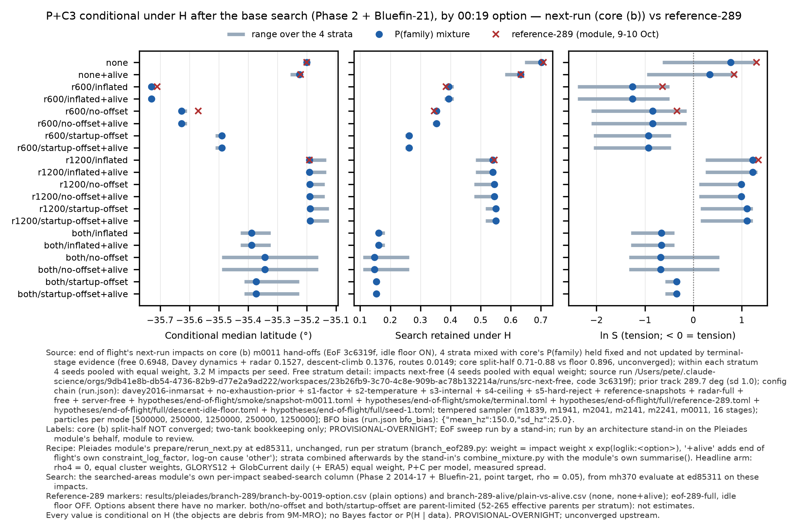
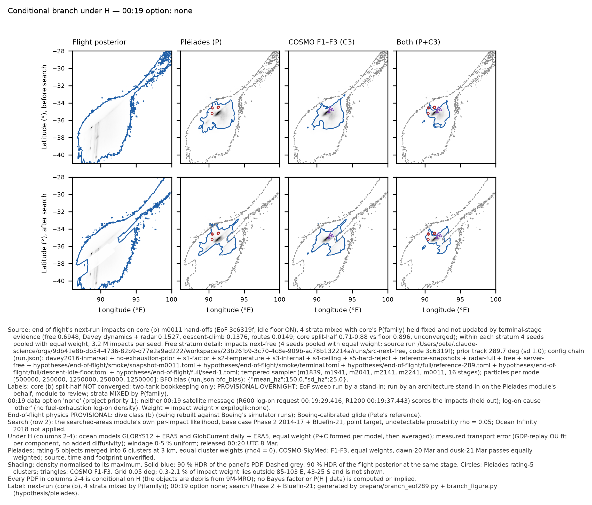
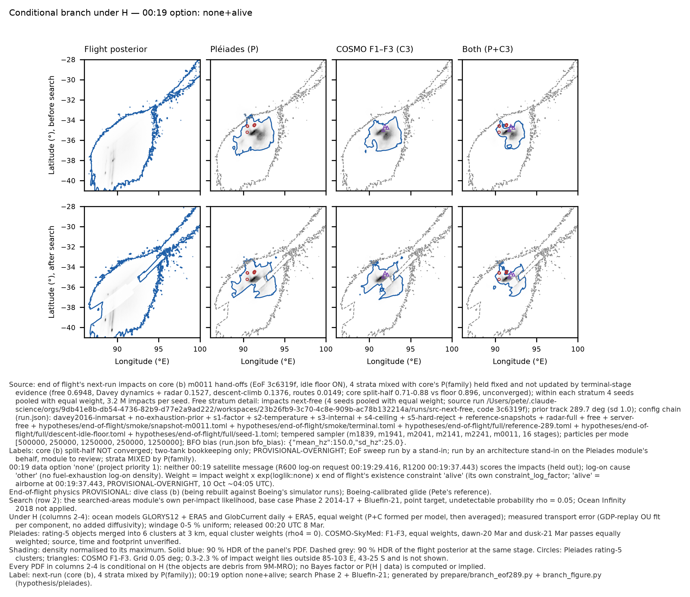
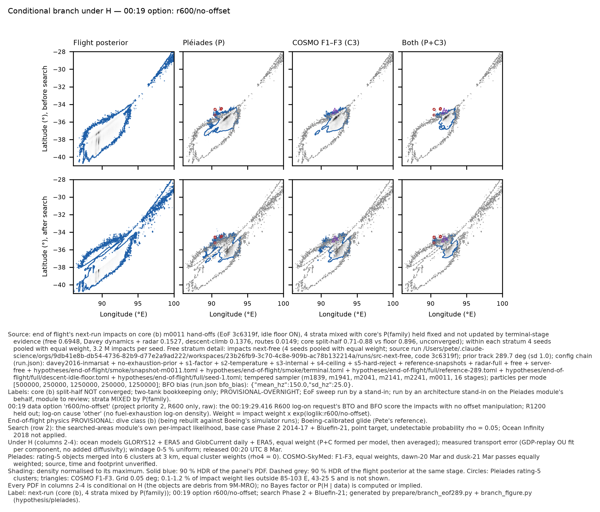

# Pléiades / COSMO-SkyMed conditional branch on end of flight's next-run (core (b)) impacts: stand-in re-run

10 Oct 2026, ~11:40 UTC. **Run by an architecture stand-in on the Pléiades module's behalf; module to review.**

**Labels:** `core (b) split-half NOT converged` · `two-tank bookkeeping only` · `PROVISIONAL-OVERNIGHT` · `EoF sweep run by a stand-in`.
Upstream labels carried as well: deskstar, prior track 289.7°, Inmarsat ephemeris, internal-v1 fuel (its one-engine flow is 2x its tables, per core ~06:10), descent idle floor ON.

**Every PDF and number here is conditional on H**, "the observed objects are debris from 9M-MRO". No Bayes factor and no P(H | D) is computed (P1). Every number rests on an unconverged source posterior, so all of them are provisional.

## What ran

The Pléiades standard result is the conditional branch reported in `results/pleiades/branch-289/` and `branch-289-alive/`. The module's own driver for new impacts is `hypotheses/pleiades/prepare/rerun_next.py`. It was written for this overnight job and smoke-tested on 2 seeds (`results/pleiades/smoke-rerun-next/`, untracked in the module's workspace).

| | |
|---|---|
| Code | `claude-science-sep29` at **`ed85311`**, the module's own last commit and the HEAD of its workspace. Clean worktree in the stand-in's workspace. `rerun_next.py`, `branch_eof289.py`, `branch_figure.py`, `rerun_reference.py` and EoF's `smoke/displacement_hist.py` are byte-identical to the module's workspace copies (cmp). **No code was changed.** |
| Binary | `cargo build --offline --release -j 2` at ed85311, rustc 1.98.0 aarch64-apple-darwin; `mh370` sha256 `c8d8d38575ca76a8…`. Every `evaluate.json` reads `code_revision` ed85311. |
| Generated inputs (git-ignored), copied read-only from the module's workspace `engine/runs/pleiades/` | `likelihood-surface.{f32,toml}` (sha256 `9a3d55a9…`, `a2e544c9…`), `cosmo-surface.{f32,toml}` (`e7fd6ded…`, `33d14bed…`), `eval-oi/base.toml` (`b68acee3…`), `eval-oi/oi2018-2025.toml` (`a8b6ea7b…`; its OI layer files are read in place from the module's `geom/`) |
| Impacts | `/Users/pete/Downloads/mh370-exchange/end-of-flight/next-run/` (READY 08:36:15Z): `next-free`, `next-repro-radar`, `next-descent-climb`, `next-routes`, seeds 1–4 each, 3.2 M impacts per seed, 51.2 M in total. All 16 SHA256SUMS were verified before use. EoF 3c6319f. Prior track 289.7° (sd 1.0) at 18:01:49, read from run.json. |
| Command | `python rerun_next.py <next-run>/<stratum> next-run-b-standin/<stratum> "<labels>; stratum <stratum>"`, once per stratum. Two strata ran concurrently at `RAYON_NUM_THREADS=1` each, so 2 threads in total; `cargo run -j 2`. No heavy lock was taken. Timing: free 68 min, Davey dynamics + radar 67 min, routes 41 min, descent-climb 44 min (09:22–11:13Z). |
| Options | Every `loglik:` column in COLUMNS.txt (10), each plain and under EoF's `+alive` (its own `constraint_log_factor`, log-on cause `other`), as `rerun_next.py` does; 20 options. |
| Search | The searched-areas module's own per-impact `seabed-search:loglik` from `mh370 evaluate`: base (Phase 2 + Bluefin-21, ρ = 0.05) and + OI 2018 + OI 2025-26 SE band (grade C). |
| Pléiades / COSMO | Unchanged: measured spread; GLORYS12 + ERA5 and GlobCurrent daily + ERA5 at equal weight; P+C formed per ocean model, then averaged. The headline arm is ρ4 = 0 with equal cluster weights; the dawn-20 Mar and dusk-21 Mar COSMO passes are equally weighted. |
| Strata | Combined afterwards with core's P(family) **held fixed**: free 0.6948, Davey dynamics + radar 0.1527, descent-climb 0.1376, routes 0.0149. The mixture is formed on each stratum's normalised pre- and post-search grids (`branch-maps.npz`), and its summaries use the module's own `summarise()`. Check: re-deriving each stratum's pooled headline rows from its maps reproduces its `branch.csv` exactly (max |Δ| = 0 in median, HDR, ln S and retained; `mixture/check-maps-vs-branch-csv.csv`). |

## Results across the 00:19 options (P(family) mixture; the comparison is with reference-289)

P+C3 after the base search, every option. **Bold rows are the module's headline options.** `both/no-offset` and `both/startup-offset` are parent-limited (52–265 effective parents per stratum, EoF README) and are not estimates. `+alive` leaves every option that scores a 00:19 burst unchanged, as the module found on reference-289. ln S range and retained range are over the four strata.

| 00:19 option | median lat | ref-289 | mean shift, NM | cond. 90 % HDR km² | ref-289 | flight 90 % HDR km² | ln S | ref-289 | ln S over strata | tension p | retained under H | ref-289 | retained, unconditional |
|---|---|---|---|---|---|---|---|---|---|---|---|---|---|
| **none** | **-35.20** | -35.20 | 78 | 52,145 | 49,925 | 610,655 | 0.77 | 1.30 | -0.64 to 1.31 | 0.74 | 0.702 | 0.709 | 0.698 |
| none+alive | -35.22 | -35.22 | 86 | 61,164 | 59,338 | 643,661 | 0.34 | 0.84 | -0.96 to 0.88 | 0.51 | 0.633 | 0.634 | 0.684 |
| r600/inflated | -35.73 | -35.71 | 112 | 46,711 | 46,492 | 347,118 | -1.26 | -0.64 | -2.39 to -0.50 | 0.19 | 0.394 | 0.385 | 0.633 |
| r600/inflated+alive | -35.73 | — | 112 | 46,711 | — | 347,118 | -1.26 | — | -2.39 to -0.50 | 0.19 | 0.394 | — | 0.633 |
| **r600/no-offset** | **-35.63** | -35.57 | 56 | 42,605 | 41,724 | 281,699 | -0.84 | -0.34 | -2.11 to -0.14 | 0.24 | 0.353 | 0.346 | 0.504 |
| r600/no-offset+alive | -35.63 | — | 56 | 42,605 | — | 281,673 | -0.84 | — | -2.11 to -0.14 | 0.24 | 0.353 | — | 0.504 |
| r600/startup-offset | -35.49 | — | 45 | 41,682 | — | 260,045 | -0.93 | — | -2.06 to -0.46 | 0.22 | 0.263 | — | 0.485 |
| r600/startup-offset+alive | -35.49 | — | 45 | 41,682 | — | 260,018 | -0.93 | — | -2.06 to -0.46 | 0.22 | 0.263 | — | 0.485 |
| r1200/inflated | -35.19 | -35.19 | 48 | 22,817 | 22,364 | 213,910 | 1.22 | 1.34 | 0.25 to 1.32 | 1.00 | 0.540 | 0.546 | 0.421 |
| r1200/inflated+alive | -35.19 | — | 48 | 22,817 | — | 213,910 | 1.22 | — | 0.25 to 1.32 | 1.00 | 0.540 | — | 0.421 |
| r1200/no-offset | -35.19 | — | 51 | 19,683 | — | 124,114 | 0.99 | — | 0.12 to 0.95 | 1.00 | 0.545 | — | 0.413 |
| r1200/no-offset+alive | -35.19 | — | 51 | 19,683 | — | 124,114 | 0.99 | — | 0.12 to 0.95 | 1.00 | 0.545 | — | 0.413 |
| r1200/startup-offset | -35.19 | — | 53 | 19,224 | — | 141,185 | 1.11 | — | 0.15 to 1.22 | 1.00 | 0.551 | — | 0.408 |
| r1200/startup-offset+alive | -35.19 | — | 53 | 19,224 | — | 141,185 | 1.11 | — | 0.15 to 1.22 | 1.00 | 0.551 | — | 0.408 |
| both/inflated | -35.39 | — | 25 | 16,506 | — | 99,327 | -0.66 | — | -1.29 to -0.39 | 0.23 | 0.161 | — | 0.417 |
| both/inflated+alive | -35.39 | — | 25 | 16,506 | — | 99,327 | -0.66 | — | -1.29 to -0.39 | 0.23 | 0.161 | — | 0.417 |
| both/no-offset | -35.34 | — | 28 | 1,184 | — | 3,685 | -0.67 | — | -1.33 to 0.53 | 0.17 | 0.147 | — | 0.355 |
| both/no-offset+alive | -35.34 | — | 28 | 1,184 | — | 3,685 | -0.67 | — | -1.33 to 0.53 | 0.17 | 0.147 | — | 0.355 |
| both/startup-offset | -35.37 | — | 41 | 3,103 | — | 11,075 | -0.35 | — | -0.58 to -0.30 | 0.29 | 0.154 | — | 0.305 |
| both/startup-offset+alive | -35.37 | — | 41 | 3,103 | — | 11,075 | -0.35 | — | -0.58 to -0.30 | 0.29 | 0.154 | — | 0.305 |

*Footnote.* Source: end of flight's next-run impacts on core (b) m0011 hand-offs (EoF 3c6319f, idle floor ON). The four strata are mixed by core's P(family), held fixed (free 0.6948 / Davey dynamics + radar 0.1527 / descent-climb 0.1376 / routes 0.0149; core split-half 0.71–0.88 against the 0.896 floor). Prior track 289.7°. Recipe: Pléiades `rerun_next.py` at ed85311 per stratum, followed by the stand-in's mixture step. Headline arm: ρ4 = 0, equal clusters, GLORYS12 + GlobCurrent daily (+ ERA5) at equal weight, measured spread. Search: Phase 2 + Bluefin-21, point target, ρ = 0.05. Red crosses mark the module's reference-289 values (eof-289-full, idle floor off); options with no reference value carry no cross. Labels: core (b) split-half NOT converged; two-tank bookkeeping only; PROVISIONAL-OVERNIGHT; EoF sweep run by a stand-in; run by an architecture stand-in, module to review. Everything is conditional on H.

### Held out (priority 1), plain and `+alive`: P, P+C3, P+C4, every stage (reference-289 in brackets)

| option | field | search | median lat | cond. 90 % HDR km² | flight 90 % HDR km² | ln S | ln S over strata | retained under H | retained, unconditional |
|---|---|---|---|---|---|---|---|---|---|
| none | P | none | -35.40 (-35.37) | 112,587 (109,681) | 500,126 (620,510) | 0.24 (0.77) | -0.83 to 0.83 | 1.000 (1.000) | 1.000 |
| none | P | Phase 2 + Bluefin-21 | -35.26 (-35.24) | 102,516 (99,508) | 610,655 (730,427) | 0.57 (1.07) | -0.52 to 1.10 | 0.722 (0.730) | 0.698 |
| none | P+C3 | none | -35.28 (-35.28) | 52,408 (50,821) | 500,126 (620,510) | 0.46 (1.01) | -0.80 to 1.06 | 1.000 (1.000) | 1.000 |
| none | P+C3 | Phase 2 + Bluefin-21 | -35.20 (-35.20) | 52,145 (49,925) | 610,655 (730,427) | 0.77 (1.30) | -0.64 to 1.31 | 0.702 (0.709) | 0.698 |
| none | P+C4 | none | -35.30 (-35.30) | 61,405 (58,900) | 500,126 (620,510) | 0.44 (1.00) | -0.84 to 1.05 | 1.000 (1.000) | 1.000 |
| none | P+C4 | Phase 2 + Bluefin-21 | -35.23 (-35.22) | 59,823 (57,306) | 610,655 (730,427) | 0.78 (1.31) | -0.62 to 1.32 | 0.721 (0.726) | 0.698 |
| none | P | + OI 2018 + 2025-26 | -35.27 (-35.25) | 104,880 (101,881) | 562,053 (690,996) | 0.45 (0.98) | -0.68 to 1.00 | 0.639 (0.645) | 0.660 |
| none | P+C3 | + OI 2018 + 2025-26 | -35.20 (-35.20) | 54,480 (52,061) | 562,053 (690,996) | 0.66 (1.24) | -0.89 to 1.23 | 0.594 (0.603) | 0.660 |
| none | P+C4 | + OI 2018 + 2025-26 | -35.23 (-35.22) | 61,969 (59,316) | 562,053 (690,996) | 0.66 (1.24) | -0.86 to 1.24 | 0.618 (0.625) | 0.660 |
| none+alive | P | none | -35.46 (-35.44) | 121,133 (117,856) | 519,714 (648,409) | 0.01 (0.54) | -1.02 to 0.63 | 1.000 (1.000) | 1.000 |
| none+alive | P | Phase 2 + Bluefin-21 | -35.29 (-35.28) | 116,853 (114,449) | 643,661 (772,707) | 0.23 (0.71) | -0.88 to 0.76 | 0.670 (0.674) | 0.684 |
| none+alive | P+C3 | none | -35.33 (-35.33) | 56,897 (55,611) | 519,714 (648,409) | 0.21 (0.74) | -0.89 to 0.83 | 1.000 (1.000) | 1.000 |
| none+alive | P+C3 | Phase 2 + Bluefin-21 | -35.22 (-35.22) | 61,164 (59,338) | 643,661 (772,707) | 0.34 (0.84) | -0.96 to 0.88 | 0.633 (0.634) | 0.684 |
| none+alive | P+C4 | none | -35.35 (-35.34) | 66,847 (64,487) | 519,714 (648,409) | 0.18 (0.72) | -0.96 to 0.80 | 1.000 (1.000) | 1.000 |
| none+alive | P+C4 | Phase 2 + Bluefin-21 | -35.25 (-35.24) | 69,379 (67,385) | 643,661 (772,707) | 0.35 (0.85) | -0.95 to 0.90 | 0.656 (0.656) | 0.684 |
| none+alive | P | + OI 2018 + 2025-26 | -35.31 (-35.29) | 119,981 (117,717) | 594,419 (732,623) | 0.08 (0.57) | -1.08 to 0.62 | 0.590 (0.591) | 0.650 |
| none+alive | P+C3 | + OI 2018 + 2025-26 | -35.23 (-35.23) | 64,744 (63,115) | 594,419 (732,623) | 0.16 (0.69) | -1.27 to 0.73 | 0.528 (0.528) | 0.650 |
| none+alive | P+C4 | + OI 2018 + 2025-26 | -35.25 (-35.25) | 71,951 (70,424) | 594,419 (732,623) | 0.18 (0.71) | -1.23 to 0.76 | 0.557 (0.555) | 0.650 |

*Footnote.* 00:19 option `none`: neither 00:19 message scores the impacts; log-on cause `other`. Rows: before and after the base search. Columns: the flight posterior, then P, C3 and P+C3 under H. Solid blue is the 90 % HDR of each panel; dashed grey is the flight posterior's 90 % HDR at the same stage. Strata are mixed by P(family), held fixed. Prior 289.7°, EoF 3c6319f, idle floor ON, dive class (b) provisional, Boeing-calibrated glide. Ocean models GLORYS12 + GlobCurrent daily (+ ERA5), measured spread, windage 0–5 %. 0.3–2.1 % of the impact weight lies outside 85–103 E, 43–25 S and is not scored. All labels as above. The figure's own footnote gives the full config chain.

*Footnote.* As above, with EoF's existence constraint `alive` (airborne at 00:19:37.443; PROVISIONAL-OVERNIGHT, EoF 10 Oct ~04:05 UTC) applied through EoF's own `constraint_log_factor`. All labels as above.

*Footnote.* 00:19 option `r600/no-offset` (priority 2): the R600 log-on request's BTO and BFO, raw; R1200 held out. All labels and parameters as above.

Figures for every other option are in `pleiades/next-run-b-standin/mixture/branch-<option>.png`, each with its own footnote. PDFs are committed for `none`, `none+alive`, `r600-no-offset`, `r600-inflated` and `r1200-inflated`.

### Per stratum (P+C3, after the base search)

| option | stratum | median lat | mean shift, NM | cond. 90 % HDR km² | ln S | tension p | retained under H | retained, unconditional |
|---|---|---|---|---|---|---|---|---|
| none | next-free | -35.20 | 81 | 52,879 | 0.65 | 0.65 | 0.707 | 0.698 |
| none | next-repro-radar | -35.20 | 45 | 49,489 | 1.31 | 1.00 | 0.693 | 0.721 |
| none | next-descent-climb | -35.20 | 107 | 50,594 | 0.46 | 0.57 | 0.697 | 0.675 |
| none | next-routes | -35.21 | 130 | 55,492 | -0.64 | 0.29 | 0.646 | 0.656 |
| none | mixture | -35.20 | 78 | 52,145 | 0.77 | 0.74 | 0.702 | 0.698 |
| none+alive | next-free | -35.22 | 89 | 62,082 | 0.21 | 0.47 | 0.638 | 0.684 |
| none+alive | next-repro-radar | -35.23 | 51 | 58,095 | 0.88 | 0.97 | 0.621 | 0.707 |
| none+alive | next-descent-climb | -35.22 | 116 | 59,195 | 0.03 | 0.41 | 0.629 | 0.665 |
| none+alive | next-routes | -35.26 | 140 | 63,409 | -0.96 | 0.25 | 0.581 | 0.647 |
| none+alive | mixture | -35.22 | 86 | 61,164 | 0.34 | 0.51 | 0.633 | 0.684 |
| r600/inflated | next-free | -35.73 | 112 | 47,064 | -1.40 | 0.18 | 0.396 | 0.634 |
| r600/inflated | next-repro-radar | -35.73 | 64 | 45,383 | -0.50 | 0.29 | 0.393 | 0.648 |
| r600/inflated | next-descent-climb | -35.74 | 160 | 45,031 | -1.95 | 0.14 | 0.380 | 0.618 |
| r600/inflated | next-routes | -35.73 | 172 | 45,409 | -2.39 | 0.13 | 0.410 | 0.608 |
| r600/inflated | mixture | -35.73 | 112 | 46,711 | -1.26 | 0.19 | 0.394 | 0.633 |
| r600/no-offset | next-free | -35.63 | 48 | 41,239 | -0.92 | 0.23 | 0.355 | 0.501 |
| r600/no-offset | next-repro-radar | -35.61 | 16 | 41,017 | -0.14 | 0.35 | 0.352 | 0.524 |
| r600/no-offset | next-descent-climb | -35.63 | 136 | 38,773 | -1.92 | 0.16 | 0.341 | 0.497 |
| r600/no-offset | next-routes | -35.61 | 151 | 39,615 | -2.11 | 0.14 | 0.364 | 0.493 |
| r600/no-offset | mixture | -35.63 | 56 | 42,605 | -0.84 | 0.24 | 0.353 | 0.504 |
| r1200/inflated | next-free | -35.19 | 50 | 21,728 | 1.06 | 1.00 | 0.541 | 0.421 |
| r1200/inflated | next-repro-radar | -35.19 | 71 | 22,975 | 1.32 | 1.00 | 0.539 | 0.485 |
| r1200/inflated | next-descent-climb | -35.18 | 6 | 20,563 | 0.96 | 0.97 | 0.536 | 0.357 |
| r1200/inflated | next-routes | -35.13 | 30 | 21,208 | 0.25 | 0.48 | 0.483 | 0.324 |
| r1200/inflated | mixture | -35.19 | 48 | 22,817 | 1.22 | 1.00 | 0.540 | 0.421 |

Full tables, with every field, stage, search variant, option and stratum: `pleiades/next-run-b-standin/mixture/by-0019-option-by-stratum-and-mixture.csv` and `comparison-vs-reference-289.csv`. The module's own per-stratum output is `<stratum>/by-0019-option.csv` and `provenance.json`. Every arm, ocean model and seed is in the git-ignored `engine/runs/pleiades/next-run-b-standin/<stratum>/branch-*/branch.csv` in the stand-in's workspace.

## Comparison with reference-289 (stand-in's reading; module to review)

1. **The conditional location is unchanged.** In every estimable option the mixture median under H matches reference-289 to within 0.02° (held out −35.20 against −35.20; `+alive` −35.22 against −35.22; R1200 inflated −35.19 against −35.19). The exception is R600 raw, at −35.63 against −35.57. The four strata agree to within 0.06° in every estimable option. Under H, the answer is still set by the drift likelihood, not by the flight posterior.
2. **The search removes the same share under H.** Held out: 0.702 retained against 0.709. `+alive`: 0.633 against 0.634. R600 raw: 0.353 against 0.346. R600 inflated: 0.394 against 0.385. R1200 inflated: 0.540 against 0.546. Unconditionally the search removes more on (b): 0.698 retained against 0.729, held out. This agrees with searched areas' finding that (b) puts more mass on searched ground.
3. **The flight posterior is narrower and lies further from H, so ln S falls.**
   - The flight 90 % HDR after the search is 610,655 km² against 730,427 km² (held out).
   - The P+C3 mean shift from the flight posterior grows from 62 to 78 NM. The (b) mixture median is −37.03 against −36.78 (EoF README).
   - Held-out P+C3 ln S after the search is 0.77 against 1.30. Under `+alive` it is 0.34 against 0.84. With R600 raw it is −0.84 against −0.34, and with R600 inflated −1.26 against −0.64.
   - **Held out is still not in tension in the mixture**: tension p is 0.74 for P+C3 after the search, and every mixture field and stage, plain and `+alive`, gives ln S from 0.015 to 0.78.
   - **Two strata go negative on the held-out option.** Routes is negative in every field (−0.94 to −0.33). Descent-climb's minimum is −0.08. Davey dynamics + radar stays at 0.83–1.32. These strata carry P(family) 0.01 and 0.14, and core has not converged them.
4. **With R600 scored, the tension deepens.**
   - R600 raw: ln S −0.84, tension p 0.24.
   - R600 inflated: ln S −1.26, p 0.19.
   - R600 Holland start-up offset (new here; there is no reference value): ln S −0.93, p 0.22, and the search leaves only 0.263 of the conditional mass.
   - None of these is significant at conventional levels. But on (b), "Pléiades debris on unsearched ground" is less compatible with an R600-scored flight posterior than it was on reference-289. The module's reading stands, and is strengthened: the answer depends chiefly on how the 00:19:29 R600 message is treated.
5. **The conditional HDRs widen slightly**: held-out P+C3 is 52,145 km² against 49,925 km² (+4 %), and P is 102,516 km² against 99,508 km² (+3 %).
6. **What the new impacts change, and what they do not.**
   - The transport-only figures, the code audit (`closeup-289/audit/`), the common-origin test and the prior-work comparison do not depend on the flight posterior, so they are unchanged.
   - The common-origin test is recomputed per stratum, in `common-origin.csv` in the run tree. It is a flat-prior test and does not use the impacts.

## Deviations from the brief and from the module's recipe (declared)

- **Per-stratum invocation and a stand-in mixture step.**
  - `rerun_next.py` takes one impacts root, but next-run has four strata. It was run once per stratum, unchanged.
  - The P(family) mixture, the comparison table and the summary chart come from two stand-in scripts, `standin-scripts/combine_mixture.py` and `make_report.py`, committed beside the results. They are not module code. They import the module's `summarise()` and `branch_figure.make()` read-only.
  - For the mixture figures only, the figure's source line is replaced by a mixture-aware line built from the module's own `run_provenance()` on the free stratum. The per-stratum figures are the module's own output.
- **Search column built at ed85311, not abc3062.** The reference-289 `evaluate.json` reads `abc3062`. Since then `hypotheses/seabed-search/lib.rs` has changed (+379 lines), as has `crates/hypothesis/src/lib.rs` (+9). The module's recipe builds at HEAD, so this is what it would have run. Consistency check: the unconditional held-out `+alive` retained share on this grid is 0.684, against searched areas' own (b) figure of 0.688 (31.2 % removed). The grid excludes 0.3–2.3 % of the weight.
- **Threads.** Two single-threaded streams (2 threads in total) rather than one 2-thread stream. The heavy lock was not used. Peak memory was not separately logged. Each `branch_eof289.py` reads its seed by memory map.
- **Figures committed:** all 20 mixture PNGs; PDFs for 5 options plus the summary; per stratum, only the CSV and provenance.json. The remaining per-stratum figures (40 per stratum) are in the stand-in's workspace run tree and results copy, not in git.
- **Not run:** the H01W arrival table under H. It is not part of `rerun_next.py`, and hydroacoustics has its own stand-in re-run. Nothing else was run.

- Modular Architecture (stand-in for Pléiades / COSMO-SkyMed)
