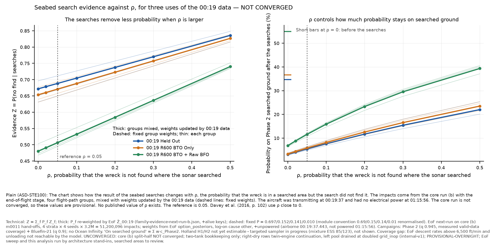
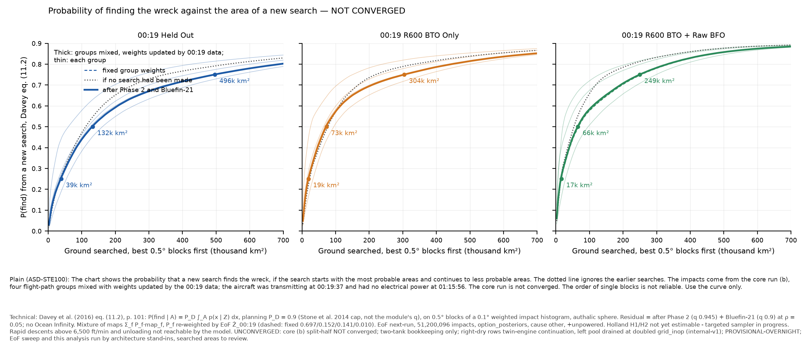

# Searched areas on core (b): the ρ sweep, the Davey eq. (11.2) curve, and the field-coverage check (architecture stand-in)

10 October 2026, run by an **architecture stand-in on searched areas' behalf; searched areas to review.**
**Every number here is UNCONVERGED** (core (b) split-half not converged). Charts and data in
`searched-areas-next-run-b-rho-eq11-2-coverage-standin/`.

**Labels, required of every number here:** UNCONVERGED - core (b) split-half NOT converged; two-tank bookkeeping only; right-dry rows:
twin-engine continuation, left pool drained at doubled grid_inop (internal-v1); PROVISIONAL-OVERNIGHT; EoF sweep run by a stand-in;
this analysis run by an architecture stand-in; **rapid descents above 6,500 ft/min and unloading not reachable by the model**;
00:19 Holland H1 / H2 **not yet estimable - targeted sampler in progress**; deskstar; track 289.7°; Inmarsat ephemeris.

## Deviations from the brief and from the module's recipe (all declared)

1. **Driver.** `report.py` was not run from its CLI. A stand-in driver (`standin_sweep_b.py`) imports the module's own `report.py`
   (`scenarios`, `evaluate`, `candidate_areas`, `smooth`, `stats`, `overlap`) and end of flight's `option_posteriors`, unchanged, and
   copies `report.py`'s accumulation loop line for line. `mh370 evaluate` runs **once per seed per scenario (20 scenarios × 16 seeds)**,
   and the result is reused for every 00:19 option. `report.py` would re-run it for each option, and it cannot read the derived option
   "R600 BTO Only", which is not a `loglik:` column. **No script of the module was edited.** `report.py`'s own five-page PDF was not
   regenerated: its chart titles predate the language ruling. Two new charts follow the ruling.
2. **Options beyond the brief.** The brief asked for `+alive`. I ran `+alive` **and** `+unpowered`: airborne at 00:19:37 and not
   powered at 01:15:56 (ruling B, ~19:10 UTC; settling adopted it at ~21:50). I also show the mixture **re-weighted** by end of flight's
   Ẑ_00:19 per family (ruling C) beside the fixed-weight mixture. The re-weighted P come from `family-evidence-next-run-b.json`,
   `p_family_reweighted` of the `+alive` keys, and are also used for `+unpowered`, as settling did. **`+unpowered` and `+alive` agree
   to 4 decimals in every Z reported here**, because the share of the late tail after 01:15:56 on (b) is small. Headline =
   `+unpowered`, re-weighted. Reproduction anchor = `+alive`, fixed.
3. **Fixed weights.** The fixed mixture uses the module's own (b) convention: 0.69 / 0.15 / 0.14 / 0.01, renormalised. Core's exact
   values (0.6948 / 0.1527 / 0.1376 / 0.0149) would change the mixture Z by ≤ 0.0001.
4. **Machine.** The run waited about 2.5 h in the queue for the heavy lock and never got it. On architecture's instruction it then ran
   **outside the lock at 2 threads**: 22.8 min wall (22:26-22:49 UTC). The field check took about 2 min more. **Peak RSS: driver
   7.98 GB, `mh370 evaluate` child 3.24 GB.** The two overlap in time, so the combined peak may have been about 11 GB, **above the 8 GB
   (architecture) and 10 GB (brief) caps.** A smaller footprint means keeping only the needed columns from `option_posteriors`; that is
   left to the module. New data written: 15 MB in the repo, under 1 GB of temporary files (deleted).
5. **Field coverage, inputs.** The old settling stand-in (b) samples no longer exist: that workspace was cleared. The settling
   `-wider` stand-in was stopped as superseded (`bc8740b`). I used **settling's own core-set samples on (b)**: tag `nrb`, settling
   `5b595bf`, `+unpowered`, real ocean 75-115 E, 45-10 S (`results/settling-core-set-next-run-b/`). They were read from settling's
   session workspace (`field/nrb*`), because they are not in `mh370-exchange`. They are **not** published, so this cannot be
   reproduced from the exchange. **Settling, please post `nrb{A,B}_{impacts,elements}.f64`, `nrb_draws.npz` and `nrb_info.json` to
   `mh370-exchange/settling/`.** `standin_field_coverage_b.py` adapts the layout only. Per (option, mixture) it writes the selected
   outcomes as `A_draws.npz` (`rows_0`/`draws_0`), the matching element rows, and a copy of the impact table. It then runs the module's
   unchanged `field_coverage_check.py`, including the script's assertion against `no_find_probability`, which passed in every run.
   It also checks that the draws file and the element files list identical outcome sets.
6. **Field coverage, step.** I used `--step 5` on Held Out (200,000 → 40,000 outcomes, the module's convention) and **`--step 1`** on
   the 40,000-outcome options. Step 5 there would leave 8,000.
7. **Holland H1 / H2 field coverage: not run.** The module's script keys an outcome as `row × 1000 + draw`. In settling's resample, one
   H1 impact is drawn 1,638 times (832 distinct impacts in 40,000 outcomes) and one H2 impact 1,038 times (1,033 distinct impacts), so
   the key overflows. This is a symptom of the coverage gap below, not a separate finding. For the module: widen the key (e.g.
   `row × 10⁶`) when H1/H2 become estimable.
8. **Statistics that differ from the module's (b) README by construction.** Medians come from `report.py`'s 0.05° grid smoothed at
   0.1°, not from `impact_map_options.py`'s 13,000-bin histogram, so they differ by ≤ 0.03°. ESS here is Kish on the **mixed** weights
   (Held Out 20,832,854), the same definition settling uses (20,973,322). The module README's 44,034,132 is a different aggregate, so
   the two should not be compared. No 90 % areas: `report.py` does not compute them.
9. **Citations.** Davey et al. (2016) eq. (11.2), printed p. 101, follows the module's code. ρ ≈ 0, p. 102, follows the brief. Neither
   page was re-read against the book in this session.

## Reproduction check (passed)

`+alive`, fixed weights, ρ = 0.05 reproduces the module's (b) README to every printed digit. Mixture Z: Held Out **0.6883**,
R600 BTO Only **0.6713**, R600 BTO + Raw BFO **0.5070**, H1 0.4575, H2 0.3581. Strata, Held Out: 0.6878 / 0.7115 / 0.6686 / 0.6497.
R600 BTO + Raw BFO: 0.5042 / 0.5279 / 0.4993 / 0.4948.

## 1. The ρ sweep (reference ρ = 0.05; Davey p. 102 assumes ρ ≈ 0)

Mixture, cause `other`. Each cell gives **Z / share of probability on Phase 2 searched ground after the searches**. No Ocean Infinity.

| 00:19 option | weights | ρ=0 | ρ=0.02 | ρ=0.05 | ρ=0.1 | ρ=0.2 | ρ=0.3 | ρ=0.5 |
|---|---|---|---|---|---|---|---|---|
| 00:19 Held Out (+unpowered) | re-weighted | 0.6718 / 3.1% | 0.6784 / 4.1% | 0.6882 / 5.4% | 0.7046 / 7.6% | 0.7374 / 11.7% | 0.7703 / 15.4% | 0.8359 / 22.0% |
| 00:19 Held Out (+unpowered) | fixed | 0.6719 / 3.1% | 0.6785 / 4.1% | 0.6883 / 5.4% | 0.7047 / 7.6% | 0.7375 / 11.7% | 0.7703 / 15.4% | 0.8360 / 22.0% |
| 00:19 Held Out (+alive) | re-weighted | 0.6718 / 3.1% | 0.6784 / 4.1% | 0.6882 / 5.4% | 0.7046 / 7.6% | 0.7375 / 11.7% | 0.7703 / 15.4% | 0.8359 / 22.0% |
| 00:19 Held Out (+alive) | fixed | 0.6719 / 3.1% | 0.6785 / 4.1% | 0.6883 / 5.4% | 0.7047 / 7.6% | 0.7375 / 11.7% | 0.7704 / 15.4% | 0.8360 / 22.0% |
| 00:19 R600 BTO Only (+unpowered) | re-weighted | 0.6535 / 3.4% | 0.6604 / 4.4% | 0.6708 / 5.8% | 0.6881 / 8.2% | 0.7228 / 12.6% | 0.7574 / 16.5% | 0.8267 / 23.5% |
| 00:19 R600 BTO Only (+unpowered) | fixed | 0.6540 / 3.3% | 0.6609 / 4.4% | 0.6713 / 5.8% | 0.6886 / 8.2% | 0.7232 / 12.5% | 0.7578 / 16.5% | 0.8270 / 23.5% |
| 00:19 R600 BTO Only (+alive) | re-weighted | 0.6535 / 3.4% | 0.6604 / 4.4% | 0.6708 / 5.8% | 0.6881 / 8.2% | 0.7228 / 12.6% | 0.7574 / 16.5% | 0.8267 / 23.5% |
| 00:19 R600 BTO Only (+alive) | fixed | 0.6540 / 3.3% | 0.6609 / 4.4% | 0.6713 / 5.8% | 0.6886 / 8.2% | 0.7232 / 12.5% | 0.7578 / 16.5% | 0.8270 / 23.5% |
| 00:19 R600 BTO + Raw BFO (+unpowered) | re-weighted | 0.4804 / 6.8% | 0.4908 / 8.8% | 0.5064 / 11.6% | 0.5323 / 15.9% | 0.5843 / 23.3% | 0.6363 / 29.5% | 0.7402 / 39.4% |
| 00:19 R600 BTO + Raw BFO (+unpowered) | fixed | 0.4811 / 6.8% | 0.4915 / 8.8% | 0.5070 / 11.6% | 0.5330 / 15.8% | 0.5849 / 23.3% | 0.6368 / 29.5% | 0.7405 / 39.3% |
| 00:19 R600 BTO + Raw BFO (+alive) | re-weighted | 0.4804 / 6.8% | 0.4908 / 8.8% | 0.5064 / 11.6% | 0.5323 / 15.9% | 0.5843 / 23.3% | 0.6363 / 29.5% | 0.7402 / 39.4% |
| 00:19 R600 BTO + Raw BFO (+alive) | fixed | 0.4811 / 6.8% | 0.4915 / 8.8% | 0.5070 / 11.6% | 0.5330 / 15.8% | 0.5849 / 23.3% | 0.6368 / 29.5% | 0.7405 / 39.3% |

Per stratum, `+unpowered` (the spread is the price of core (b)'s non-convergence):

| 00:19 option | free | Davey dyn.+radar | descent-climb | routes | spread |
|---|---|---|---|---|---|
| 00:19 Held Out, ρ=0 | 0.6714 | 0.6963 | 0.6512 | 0.6313 | 0.0651 |
| 00:19 Held Out, ρ=0.05 | 0.6878 | 0.7115 | 0.6686 | 0.6497 | 0.0618 |
| 00:19 Held Out, ρ=0.5 | 0.8357 | 0.8482 | 0.8256 | 0.8156 | 0.0325 |
| 00:19 R600 BTO Only, ρ=0 | 0.6522 | 0.6770 | 0.6397 | 0.6308 | 0.0462 |
| 00:19 R600 BTO Only, ρ=0.05 | 0.6696 | 0.6932 | 0.6577 | 0.6493 | 0.0439 |
| 00:19 R600 BTO Only, ρ=0.5 | 0.8261 | 0.8385 | 0.8198 | 0.8154 | 0.0231 |
| 00:19 R600 BTO + Raw BFO, ρ=0 | 0.4781 | 0.5030 | 0.4730 | 0.4682 | 0.0348 |
| 00:19 R600 BTO + Raw BFO, ρ=0.05 | 0.5042 | 0.5279 | 0.4993 | 0.4948 | 0.0331 |
| 00:19 R600 BTO + Raw BFO, ρ=0.5 | 0.7391 | 0.7515 | 0.7365 | 0.7341 | 0.0174 |

Other sensitivities at ρ = 0.05 (mixture, `+unpowered`, re-weighted), and the mass each campaign removes at ρ = 0:

| scenario | 00:19 Held Out | 00:19 R600 BTO Only | 00:19 R600 BTO + Raw BFO |
|---|---|---|---|
| run.toml | 0.6882 | 0.6708 | 0.5064 |
| Phase 2 q 0.90 | 0.7031 | 0.6865 | 0.5299 |
| Phase 2 q 0.98 | 0.6767 | 0.6586 | 0.4881 |
| Phase 2 split, shared misses | 0.6863 | 0.6686 | 0.5031 |
| Phase 2 split, independent misses | 0.6845 | 0.6665 | 0.4999 |
| + OI 2025-26 inferred, outboard band only | 0.6848 | 0.6674 | 0.5021 |
| + OI 2018 inferred, coverage 0.889 | 0.6577 | 0.6543 | 0.4710 |
| + OI 2018 inferred, coverage 0.952 | 0.6555 | 0.6532 | 0.4685 |
| mass removed at ρ=0, alone: bluefin-2014 | 0.0000 | 0.0000 | 0.0000 |
| mass removed at ρ=0, alone: phase2-2014-2017 | 0.3282 | 0.3465 | 0.5196 |
| mass removed at ρ=0, alone: ocean-infinity-2018 | 0.0324 | 0.0175 | 0.0375 |
| mass removed at ρ=0, adding, in order: ocean-infinity-2018 | 0.3603 | 0.3639 | 0.5569 |

Location (mixture, `+unpowered`, re-weighted, ρ = 0.05):

| 00:19 option (+unpowered, re-weighted) | median before → after | 2.5–97.5 % after | on Phase 2 before → after | split-half after |
|---|---|---|---|---|
| 00:19 Held Out | -37.24 → -37.23 | -40.50 / -26.64 | 0.347 → 0.054 | 0.913 |
| 00:19 R600 BTO Only | -37.94 → -38.47 | -40.73 / -26.36 | 0.367 → 0.058 | 0.915 |
| 00:19 R600 BTO + Raw BFO | -37.46 → -37.72 | -39.85 / -26.04 | 0.550 → 0.116 | 0.890 |

**Reading.**
1. **ρ is still the largest term the module controls.** From ρ = 0 to 0.5, Held Out Z goes from 0.6718 to 0.8359, R600 BTO Only from
   0.6535 to 0.8267, and R600 BTO + Raw BFO from 0.4804 to 0.7402. What ρ chiefly sets is the share left on searched ground: 3.1 % →
   22.0 % (Held Out) and 6.8 % → 39.4 % (raw BFO). That is the number a revisit plan uses, and it has no published value.
2. **On (b) the source posterior is worth as much as ρ over its defensible range.** The spread of Z across strata is 0.033-0.062 at
   ρ = 0.05. That is larger than the whole ρ 0 → 0.05 step (0.016-0.026), larger than q 0.90-0.98 (0.026-0.042), and comparable to
   Ocean Infinity 2018 in or out (0.017-0.035).
3. **The re-weighting by the 00:19 data changes Z by ≤ 0.0007** (R600 BTO + Raw BFO, where descent-climb's weight rises 0.138 →
   0.204). Fixed and re-weighted mixtures are shown side by side, as ruling C requires.
4. Bluefin-21 again removes 0.0000. Phase 2 alone removes 0.328 (Held Out) to 0.520 (raw BFO) at ρ = 0.

## 2. The Davey eq. (11.2) curve

P(find | A) = P_D ∫_A p(x | Z) dx, with planning P_D = 0.9 (Stone et al. 2014 cap, not the module's q), on 0.5° blocks ranked by
residual mass, at ρ = 0.05, after Phase 2 + Bluefin-21 (no Ocean Infinity). Each cell gives **blocks / area** needed to reach that
P(find):

| 00:19 option | weights | 25 % | 50 % | 75 % | same, search disabled (25/50/75 %) |
|---|---|---|---|---|---|
| 00:19 Held Out (+unpowered) | re-weighted | 16 / 39k | 54 / 132k | 198 / 496k | 15 / 36k / 46 / 113k / 141 / 347k |
| 00:19 Held Out (+unpowered) | fixed | 16 / 39k | 54 / 132k | 198 / 496k | 15 / 36k / 46 / 113k / 142 / 350k |
| 00:19 Held Out (+alive) | re-weighted | 16 / 39k | 54 / 132k | 198 / 496k | 15 / 36k / 46 / 113k / 141 / 347k |
| 00:19 Held Out (+alive) | fixed | 16 / 39k | 54 / 132k | 198 / 496k | 15 / 36k / 46 / 113k / 142 / 350k |
| 00:19 R600 BTO Only (+unpowered) | re-weighted | 8 / 19k | 30 / 73k | 124 / 304k | 10 / 24k / 32 / 78k / 90 / 219k |
| 00:19 R600 BTO Only (+unpowered) | fixed | 9 / 22k | 30 / 73k | 125 / 307k | 10 / 24k / 32 / 78k / 91 / 222k |
| 00:19 R600 BTO Only (+alive) | re-weighted | 8 / 19k | 30 / 73k | 124 / 304k | 10 / 24k / 32 / 78k / 90 / 219k |
| 00:19 R600 BTO Only (+alive) | fixed | 9 / 22k | 30 / 73k | 125 / 307k | 10 / 24k / 32 / 78k / 91 / 222k |
| 00:19 R600 BTO + Raw BFO (+unpowered) | re-weighted | 7 / 17k | 27 / 66k | 99 / 249k | 7 / 17k / 22 / 54k / 63 / 154k |
| 00:19 R600 BTO + Raw BFO (+unpowered) | fixed | 7 / 17k | 28 / 68k | 101 / 255k | 7 / 17k / 23 / 56k / 65 / 159k |
| 00:19 R600 BTO + Raw BFO (+alive) | re-weighted | 7 / 17k | 27 / 66k | 100 / 252k | 7 / 17k / 22 / 54k / 63 / 154k |
| 00:19 R600 BTO + Raw BFO (+alive) | fixed | 7 / 17k | 28 / 68k | 101 / 255k | 7 / 17k / 23 / 56k / 65 / 159k |
| 00:19 Held Out (+unpowered), free only | — | 14 / 34k | 52 / 127k | 195 / 489k | 14 / 34k / 44 / 108k / 138 / 340k |
| 00:19 R600 BTO Only (+unpowered), free only | — | 7 / 17k | 29 / 70k | 121 / 298k | 9 / 22k / 30 / 73k / 87 / 212k |
| 00:19 R600 BTO + Raw BFO (+unpowered), free only | — | 7 / 17k | 28 / 68k | 100 / 253k | 7 / 17k / 22 / 54k / 64 / 157k |
| 00:19 Held Out (+unpowered), Davey dyn.+radar only | — | 22 / 54k | 66 / 162k | 223 / 562k | 22 / 54k / 57 / 141k / 173 / 430k |
| 00:19 R600 BTO Only (+unpowered), Davey dyn.+radar only | — | 14 / 34k | 39 / 95k | 148 / 368k | 17 / 42k / 42 / 103k / 115 / 281k |
| 00:19 R600 BTO + Raw BFO (+unpowered), Davey dyn.+radar only | — | 12 / 29k | 40 / 98k | 119 / 301k | 12 / 30k / 30 / 74k / 82 / 203k |
| 00:19 Held Out (+unpowered), descent-climb only | — | 13 / 31k | 49 / 120k | 169 / 418k | 11 / 27k / 42 / 103k / 120 / 294k |
| 00:19 R600 BTO Only (+unpowered), descent-climb only | — | 7 / 17k | 27 / 65k | 98 / 237k | 7 / 17k / 29 / 70k / 80 / 194k |
| 00:19 R600 BTO + Raw BFO (+unpowered), descent-climb only | — | 3 / 7k | 15 / 36k | 70 / 172k | 4 / 10k / 13 / 32k / 47 / 115k |
| 00:19 Held Out (+unpowered), routes only | — | 5 / 12k | 25 / 61k | 113 / 279k | 6 / 15k / 19 / 46k / 84 / 207k |
| 00:19 R600 BTO Only (+unpowered), routes only | — | 3 / 7k | 11 / 26k | 62 / 151k | 4 / 10k / 12 / 29k / 56 / 137k |
| 00:19 R600 BTO + Raw BFO (+unpowered), routes only | — | 3 / 7k | 9 / 22k | 53 / 131k | 3 / 7k / 8 / 19k / 37 / 91k |

Top residual blocks, for orientation only. A 0.5° block holds about 1-2 % of the mass, so **the ranking is not resolved; use the curve**:

| 00:19 option | rank | block (S, E) | residual mass | P(find) | km² | mass, search disabled |
|---|---|---|---|---|---|---|
| 00:19 Held Out | 1 | 39.50 S 89.00 E | 0.0344 | 0.0310 | 2,394 | 0.0237 |
| 00:19 Held Out | 2 | 39.00 S 89.00 E | 0.0316 | 0.0285 | 2,411 | 0.0219 |
| 00:19 Held Out | 3 | 40.00 S 89.00 E | 0.0274 | 0.0247 | 2,377 | 0.0189 |
| 00:19 Held Out | 4 | 40.50 S 89.00 E | 0.0263 | 0.0236 | 2,359 | 0.0181 |
| 00:19 Held Out | 5 | 39.50 S 88.50 E | 0.0202 | 0.0182 | 2,394 | 0.0139 |
| 00:19 R600 BTO Only | 1 | 39.50 S 89.00 E | 0.0542 | 0.0488 | 2,394 | 0.0363 |
| 00:19 R600 BTO Only | 2 | 39.00 S 89.00 E | 0.0468 | 0.0421 | 2,411 | 0.0315 |
| 00:19 R600 BTO Only | 3 | 40.00 S 89.00 E | 0.0413 | 0.0372 | 2,377 | 0.0277 |
| 00:19 R600 BTO Only | 4 | 40.50 S 89.00 E | 0.0367 | 0.0330 | 2,359 | 0.0246 |
| 00:19 R600 BTO Only | 5 | 39.50 S 88.50 E | 0.0324 | 0.0291 | 2,394 | 0.0217 |
| 00:19 R600 BTO + Raw BFO | 1 | 39.00 S 89.00 E | 0.0673 | 0.0605 | 2,411 | 0.0342 |
| 00:19 R600 BTO + Raw BFO | 2 | 39.50 S 89.00 E | 0.0559 | 0.0503 | 2,394 | 0.0283 |
| 00:19 R600 BTO + Raw BFO | 3 | 38.50 S 89.50 E | 0.0535 | 0.0482 | 2,427 | 0.0438 |
| 00:19 R600 BTO + Raw BFO | 4 | 40.00 S 89.00 E | 0.0386 | 0.0347 | 2,377 | 0.0195 |
| 00:19 R600 BTO + Raw BFO | 5 | 39.00 S 89.50 E | 0.0332 | 0.0299 | 2,411 | 0.0168 |

**Reading.** P(find) = 50 % needs about 132,000 km² with the 00:19 data held out, 73,000 km² with the R600 BTO, and 66,000 km² with
the raw R600 BFO (mixture, re-weighted). For Held Out (113,000 km² with the search disabled) and raw BFO (54,000) the searches make
the problem larger, because they removed the most probable ground. For R600 BTO Only the residual curve is **steeper** than the
disabled one up to about 50 % (73,000 against 78,000 km²) and shallower beyond it (75 %: 304,000 against 219,000 km²). Its mass
moves south, off the searched corridor (the median goes from −37.94 to −38.47), so the best unsearched blocks hold a larger share of
what is left. The per-stratum curves (thin lines) differ from each other far more than the fixed and re-weighted mixtures do: 50 %
for Held Out spans 61,000 (routes) to 162,000 km² (Davey dynamics + radar) across strata.

## 3. Field-coverage check against settling's own (b) wreckage samples

ρ = 0.05; q = 0.945 (Phase 2) and 0.900 (Bluefin-21). The "point" arm reads coverage at the impact position, "field (mean)" is the
mass-weighted mean over settled elements (the module's reported treatment), and "any piece" is 1 − Π(1 − c) over settled elements
(the optimistic bound). Afloat pieces are excluded. Equally weighted settling outcomes. `+unpowered`.

| 00:19 option (+unpowered) | weights | outcomes / settled elements | Z point | Z field (mean) | Z any piece | mean − point | any − mean | Phase 2 cov.: field − point mean (sd) | share point unsearched, field partly searched | reverse |
|---|---|---|---|---|---|---|---|---|---|---|
| 00:19 Held Out | reweighted | 40,000 / 2,129,564 | 0.6867 | 0.6869 | 0.6651 | +0.0001 | -0.0217 | -0.0002 (0.022) | 2.24 % | 0.00 % |
| 00:19 Held Out | fixed | 40,001 / 2,129,901 | 0.6857 | 0.6858 | 0.6638 | +0.0001 | -0.0220 | -0.0001 (0.022) | 2.30 % | 0.00 % |
| 00:19 R600 BTO Only | reweighted | 40,000 / 2,088,749 | 0.6732 | 0.6731 | 0.6511 | -0.0001 | -0.0219 | +0.0001 (0.021) | 2.29 % | 0.00 % |
| 00:19 R600 BTO Only | fixed | 40,000 / 2,088,590 | 0.6740 | 0.6739 | 0.6520 | -0.0001 | -0.0219 | +0.0001 (0.021) | 2.29 % | 0.00 % |
| 00:19 R600 BTO + Raw BFO | reweighted | 40,000 / 2,086,610 | 0.5085 | 0.5081 | 0.4767 | -0.0004 | -0.0314 | +0.0004 (0.029) | 3.28 % | 0.00 % |
| 00:19 R600 BTO + Raw BFO | fixed | 40,000 / 2,088,805 | 0.5079 | 0.5076 | 0.4760 | -0.0003 | -0.0316 | +0.0004 (0.029) | 3.31 % | 0.00 % |
| 00:19 Holland H1 | reweighted | not run: one impact drawn 1,638 times (832 distinct impacts; mixture ESS 86) | — | — | — | — | — | — | — | — |
| 00:19 Holland H1 | fixed | not run: one impact drawn 1,638 times (832 distinct impacts; mixture ESS 86) | — | — | — | — | — | — | — | — |
| 00:19 Holland H2 | reweighted | not run: one impact drawn 1,038 times (1,033 distinct impacts; mixture ESS 124) | — | — | — | — | — | — | — | — |
| 00:19 Holland H2 | fixed | not run: one impact drawn 1,038 times (1,033 distinct impacts; mixture ESS 124) | — | — | — | — | — | — | — | — |

**Reading.**
1. **The point target is adequate on (b) as on reference-289.** Field minus point is −0.0004 to +0.0001 in Z for every estimable
   option and both mixtures (reference-289, Held Out: +0.0003).
2. **The detection-definition bracket is 0.022 for Held Out and R600 BTO Only, and 0.031 for R600 BTO + Raw BFO.** The raw-BFO
   posterior sits more on the corridor edge: 3.3 % of its outcomes have the impact point on unsearched ground while part of the
   settled field lies on searched ground, against 2.2-2.3 % for the other two options. The reverse never happens.
3. The point-arm Z here (e.g. Held Out 0.6867) differs from the sweep's 0.6882 because it uses settling's 40,000-outcome resample:
   that is Monte Carlo noise in the resample. The comparison within each row is paired on the same outcomes.

## COVERAGE (Pete's sampling-coverage rule, 15:45 -0600)

**(a) Feasible set.** For this module, the wreck can rest anywhere on the seabed that the impact and settling distributions reach.
Detection is limited to the ground the searches imaged with valid data. Sources: Phase 2 measured valid-data coverage (ATSB); Bluefin-21
display polygons; Ocean Infinity 2018 and 2025-26 **inferred, grade C** (MH370-CAPTION tracings; `coverage/PROVENANCE.md`); never merged
into the ATSB-only estimate.

**(b) Model's reach, and its gaps.**

| gap | where it comes from | status | effect here |
|---|---|---|---|
| Commanded descent rates above 6,500 ft/min not reachable; free flight cannot unload | end of flight's descent model | open (reach gap, biases against rapid descents) | every result is labelled; H1/H2 cannot be estimated |
| Holland H1 / H2 not yet estimable | within-parent sampling (EoF smoke 2, ~20:00 UTC) | open, sampler change awaits Pete | ESS 85 / 123 (mixture); field check not run (key overflow) |
| Family B (deliberate descent begun before fuel exhaustion) onset | not a separate family in the next-run sweep (B defined at ~21:20 UTC) | open | no family-B share or result here |
| Core free stratum (69 %) unconverged | core (b) | open; run C in progress | strata spread 0.033-0.062 in Z at ρ = 0.05 |
| Right-dry rows and doubled grid_inop | core (b) / internal-v1 | open | labelled |
| ρ has no published value | searched areas | declared sweep 0-0.5 | largest module-controlled term |
| No burial or terrain-shadow model | settling / searched areas | inside ρ | — |
| Impacts north of 18° S | settling's old window | **closed**: settling's samples use 75-115 E, 45-10 S | — |
| Coverage raster 0.01° vs 500 m extraction spacing | searched areas | open (Pete reminder) | — |

**(c) Proposal coverage: Kish ESS** per option, mixture or stratum, and declared region (after the searches, ρ = 0.05; each region cell
gives **share of posterior / ESS**). Impacts: 51,200,096 (4 strata × 4 seeds × 3.2 M).

| 00:19 option | group | ESS before | ESS after (ρ=0.05) | split-half before | N of 33 S share / ESS | 33-39.5 S | S of 39.5 S | Phase 2 cover >0.5 | ≤0.5 |
|---|---|---|---|---|---|---|---|---|---|
| 00:19 Held Out (+unpowered) | mixture, re-weighted | 20,980,512 | 15,228,815 | 0.930 | 0.129 / 1,877,495 | 0.736 / 11,457,545 | 0.134 / 1,912,901 | 0.054 / 6,694,472 | 0.946 / 13,730,720 |
| 00:19 Held Out (+unpowered) | mixture, fixed | 20,829,331 | 15,124,484 | 0.929 | 0.129 / 1,869,789 | 0.736 / 11,371,580 | 0.135 / 1,901,683 | 0.054 / 6,641,488 | 0.946 / 13,637,388 |
| 00:19 Held Out (+unpowered) | free | 11,013,295 | 7,988,910 | 0.905 | 0.128 / 974,812 | 0.736 / 6,004,880 | 0.136 / 1,018,705 | 0.054 / 3,517,219 | 0.946 / 7,202,337 |
| 00:19 Held Out (+unpowered) | Davey dyn.+radar | 10,996,369 | 8,214,402 | 0.948 | 0.156 / 1,227,322 | 0.760 / 6,351,416 | 0.083 / 642,802 | 0.048 / 3,177,274 | 0.952 / 7,484,022 |
| 00:19 Held Out (+unpowered) | descent-climb | 11,079,735 | 7,856,679 | 0.960 | 0.108 / 801,354 | 0.706 / 5,713,068 | 0.186 / 1,357,653 | 0.058 / 3,767,945 | 0.942 / 7,016,082 |
| 00:19 Held Out (+unpowered) | routes | 10,933,776 | 7,579,268 | 0.937 | 0.074 / 525,875 | 0.775 / 6,004,927 | 0.152 / 1,060,880 | 0.063 / 3,938,819 | 0.937 / 6,700,779 |
| 00:19 R600 BTO Only (+unpowered) | mixture, re-weighted | 13,004,630 | 9,172,087 | 0.931 | 0.104 / 944,731 | 0.691 / 6,427,868 | 0.206 / 1,804,498 | 0.058 / 4,485,461 | 0.942 / 8,199,583 |
| 00:19 R600 BTO Only (+unpowered) | mixture, fixed | 12,958,062 | 9,149,795 | 0.931 | 0.105 / 955,885 | 0.691 / 6,416,822 | 0.204 / 1,782,558 | 0.058 / 4,458,616 | 0.942 / 8,181,738 |
| 00:19 R600 BTO Only (+unpowered) | free | 6,863,279 | 4,827,099 | 0.908 | 0.103 / 495,853 | 0.694 / 3,405,384 | 0.203 / 929,441 | 0.058 / 2,378,994 | 0.942 / 4,313,074 |
| 00:19 R600 BTO Only (+unpowered) | Davey dyn.+radar | 6,330,196 | 4,598,800 | 0.952 | 0.134 / 625,062 | 0.723 / 3,385,136 | 0.143 / 595,930 | 0.053 / 1,990,072 | 0.947 / 4,154,239 |
| 00:19 R600 BTO Only (+unpowered) | descent-climb | 7,261,121 | 5,026,728 | 0.949 | 0.081 / 414,760 | 0.639 / 3,345,132 | 0.280 / 1,284,131 | 0.061 / 2,619,544 | 0.939 / 4,463,927 |
| 00:19 R600 BTO Only (+unpowered) | routes | 7,439,491 | 5,089,019 | 0.932 | 0.046 / 240,213 | 0.738 / 3,848,415 | 0.217 / 1,011,086 | 0.063 / 2,763,823 | 0.937 / 4,498,994 |
| 00:19 R600 BTO + Raw BFO (+unpowered) | mixture, re-weighted | 509,632 | 293,157 | 0.931 | 0.157 / 40,790 | 0.759 / 226,097 | 0.084 / 27,196 | 0.115 / 258,824 | 0.885 / 233,267 |
| 00:19 R600 BTO + Raw BFO (+unpowered) | mixture, fixed | 446,373 | 257,179 | 0.929 | 0.162 / 37,810 | 0.762 / 199,510 | 0.075 / 20,380 | 0.114 / 226,362 | 0.886 / 204,744 |
| 00:19 R600 BTO + Raw BFO (+unpowered) | free | 234,201 | 133,708 | 0.903 | 0.169 / 21,120 | 0.779 / 107,684 | 0.052 / 5,521 | 0.116 / 120,081 | 0.884 / 106,131 |
| 00:19 R600 BTO + Raw BFO (+unpowered) | Davey dyn.+radar | 223,777 | 132,559 | 0.914 | 0.200 / 25,551 | 0.734 / 100,856 | 0.066 / 6,843 | 0.106 / 107,693 | 0.894 / 107,467 |
| 00:19 R600 BTO + Raw BFO (+unpowered) | descent-climb | 316,654 | 181,539 | 0.873 | 0.095 / 14,988 | 0.709 / 133,650 | 0.197 / 33,546 | 0.117 / 163,209 | 0.883 / 143,695 |
| 00:19 R600 BTO + Raw BFO (+unpowered) | routes | 258,273 | 147,921 | 0.864 | 0.077 / 10,167 | 0.814 / 120,563 | 0.109 / 17,436 | 0.119 / 134,335 | 0.881 / 116,547 |
| 00:19 Holland H1 (+alive) | mixture, fixed | 85 | 49 | 0.503 | 0.311 / 8 | 0.638 / 50 | 0.051 / 6 | 0.136 / 49 | 0.864 / 37 |
| 00:19 Holland H1 (+alive) | free | 45 | 27 | 0.415 | 0.389 / 7 | 0.604 / 25 | 0.007 / 1 | 0.126 / 25 | 0.874 / 21 |
| 00:19 Holland H1 (+alive) | Davey dyn.+radar | 34 | 20 | 0.396 | 0.149 / 2 | 0.533 / 19 | 0.317 / 4 | 0.170 / 20 | 0.830 / 14 |
| 00:19 Holland H1 (+alive) | descent-climb | 62 | 86 | 0.504 | 0.050 / 3 | 0.923 / 80 | 0.027 / 5 | 0.155 / 29 | 0.845 / 66 |
| 00:19 Holland H1 (+alive) | routes | 41 | 40 | 0.405 | 0.224 / 7 | 0.776 / 34 | 0.000 / 1 | 0.138 / 19 | 0.862 / 31 |
| 00:19 Holland H2 (+alive) | mixture, fixed | 123 | 57 | 0.633 | 0.286 / 22 | 0.679 / 36 | 0.035 / 1 | 0.208 / 87 | 0.792 / 37 |
| 00:19 Holland H2 (+alive) | free | 64 | 29 | 0.534 | 0.265 / 11 | 0.685 / 18 | 0.050 / 1 | 0.214 / 46 | 0.786 / 19 |
| 00:19 Holland H2 (+alive) | Davey dyn.+radar | 61 | 23 | 0.322 | 0.520 / 9 | 0.478 / 16 | 0.001 / 2 | 0.193 / 47 | 0.807 / 15 |
| 00:19 Holland H2 (+alive) | descent-climb | 103 | 47 | 0.617 | 0.147 / 6 | 0.850 / 42 | 0.003 / 4 | 0.196 / 72 | 0.804 / 31 |
| 00:19 Holland H2 (+alive) | routes | 70 | 26 | 0.563 | 0.113 / 6 | 0.887 / 22 | 0.000 / 2 | 0.167 / 53 | 0.833 / 19 |

**Holland H1 and H2 are kept in the table, not dropped.** Their ESS (85 and 123 mixed; 14-50 per stratum) and their split-half values
(0.50 and 0.63 before the searches) make them a coverage gap. The proposed fix is end of flight's exact within-parent burst-time
sampler (study B2/B3, after core request 9), which awaits Pete's approval. Every estimable option has ESS ≥ 1,000 in every declared
region. The smallest is 5,521: R600 BTO + Raw BFO, free stratum, south of 39.5 S, which holds 5.2 % of that stratum's posterior.

**Parameter bounds and their sources.** ρ: 0-0.5 swept, reference 0.05, no published value (Davey p. 102 assumes ≈ 0). Phase 2 q
0.945: ATSB-derived (ledger A-8, Figure 73 percentages unverified); 0.90 is Stone et al. (2014)'s cap; 0.98 is a sensitivity.
Bluefin-21 q 0.9. Planning P_D 0.9 (Stone et al. 2014). Ocean Infinity 2018 coverage fraction 0.889 / 0.952 (inferred, grade C).

## Files

- `rho-sweep-b.{png,pdf}`, `eq11-2-curve-b.{png,pdf}`: the two charts, each with STE100 and technical footnotes.
- `standin-sweep-b.json`: every scenario, option, stratum and mixture; candidate-block curves and thresholds; region ESS.
  `standin-sweep-b-densities.npz`: the smoothed latitude densities.
- `field-coverage-b.json`: the module script's output for every (option, mixture), plus the not-run H1/H2 records.
- `standin_sweep_b.py`, `standin_field_coverage_b.py`, `standin_charts_b.py`, `sweep.log`: the stand-in's code and log.

## Reproduce (from `engine/`, after `adapt_exchange_run.sh` for each `next-<stratum>` as `b-<stratum>`, and `cargo build --release`)

    RAYON_NUM_THREADS=2 python ../results/searched-areas-next-run-b-rho-eq11-2-coverage-standin/standin_sweep_b.py <out> \
        runs/b-free runs/b-repro-radar runs/b-descent-climb runs/b-routes
    python ../results/searched-areas-next-run-b-rho-eq11-2-coverage-standin/standin_field_coverage_b.py <settling field dir> <out>
    python ../results/searched-areas-next-run-b-rho-eq11-2-coverage-standin/standin_charts_b.py <out>/standin-sweep-b.json <out>

Engine built from `claude-science-sep29` at `db07014` (seabed-search code unchanged up to `c94566f`). EoF `displacement_hist.py` at
the same commit (carries `unpowered`).

- Modular Architecture (stand-in for Searched Areas)
