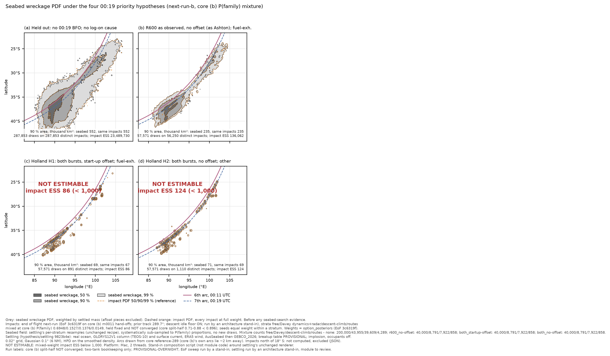
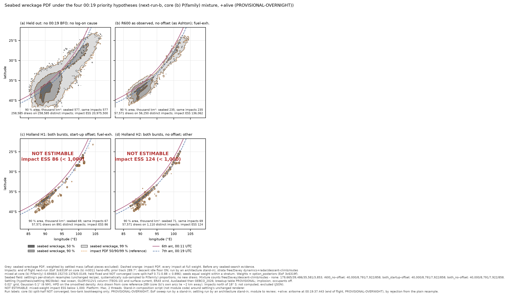
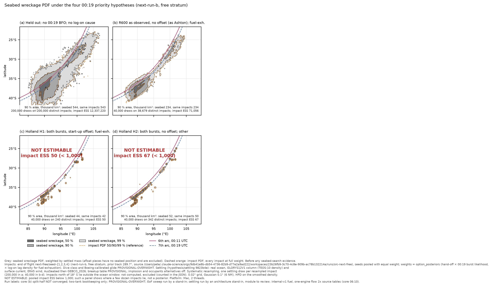
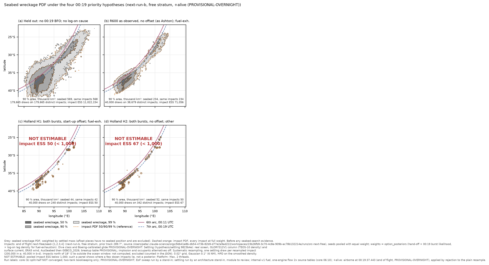
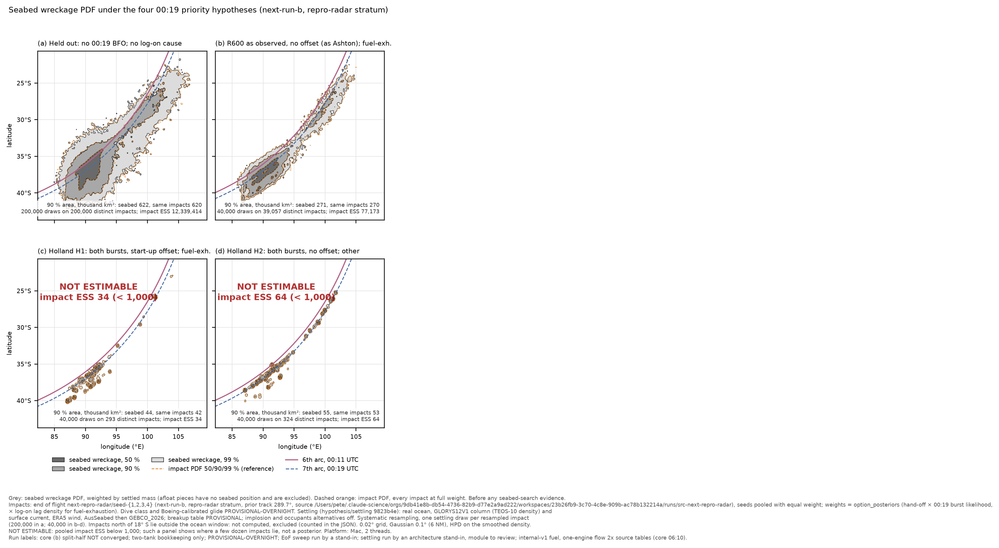
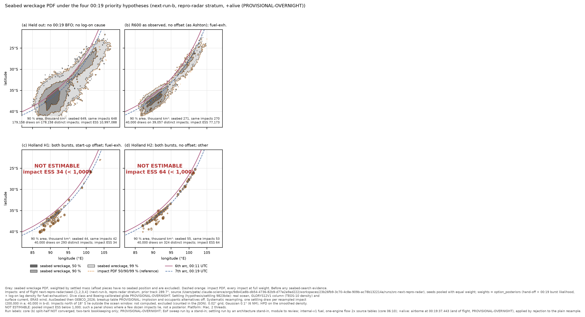
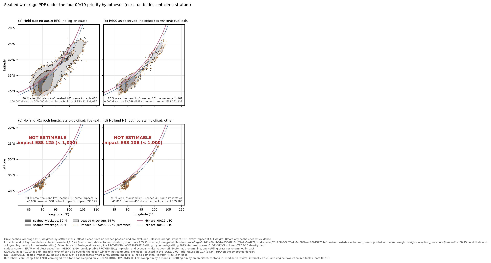
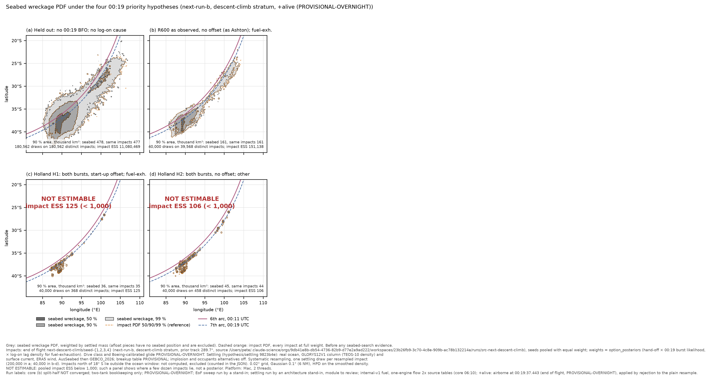
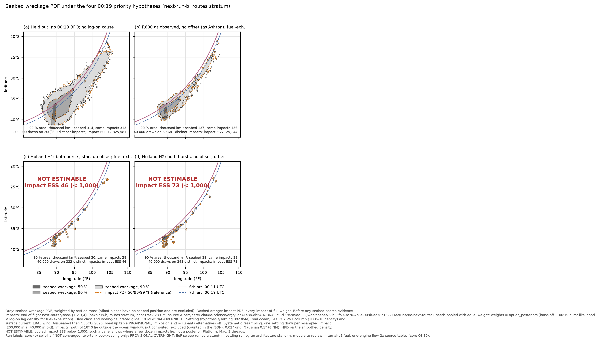
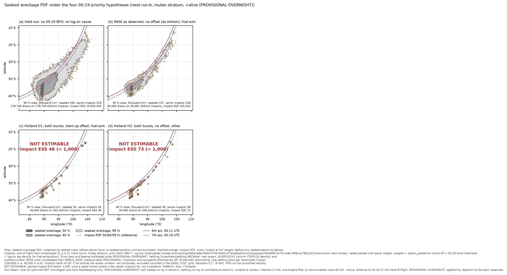

# Ocean settling: seabed wreckage field on end of flight's next-run (core (b)) impacts — stand-in re-run

**Labels:** `core (b): split-half NOT converged` · `two-tank bookkeeping only` · `PROVISIONAL-OVERNIGHT` · `EoF sweep run by a stand-in` · **run by an architecture stand-in on the module's behalf; module to review.** Plus core's: deskstar, prior track 289.7°, Inmarsat ephemeris, internal-v1 fuel (one-engine flow 2× its source tables, core ~06:10).

Ocean settling was idle overnight (its watcher was cleared when its thread ended its turn). Pete pre-approved the re-run of each module's standard result on `end-of-flight/next-run/READY` (`coordination/OVERNIGHT-2026-10-10.md` §3). An architecture sub-agent ran settling's own recipe with **only the impact input changed** and **no code changes**. Settling should review this note and re-run it if it disagrees.

## Provenance

- **Recipe:** `results/settling-wreckage-field-289-priorities/wreckage_field_rerun.sh` (settling's re-run driver, 10 Oct ~04:30), which calls `wreckage_field_prep_keys.py` (set A: `none__other`, 50,000 per seed, Generator 20261010; set B: R600 no-offset × FE, H1, H2, 10,000 per seed each, Generator 20261011), the `settling::tests::wreckage_field` generator, and `wreckage_map_priorities_run.py`; then the `+alive` map with `WF_CONSTRAINT=alive` (rejection from the plain resample, no new draws), as settling did at ~05:00. The four scripts used are the committed copies at `claude-science-sep29` d3b2d24; each is byte-identical to the copy in settling's workspace.
- **Settling code:** `hypothesis/settling` **9823b4e** (the commit named in the reference-289 result), run.toml baseline. Built clean in the stand-in's workspace (`cargo test --release -p mh370-hypotheses --no-run`, `-j 2`, rustc 1.98.0). **Check:** re-running settling's own 500-impact check file (`field/A_check_impacts.f64`) reproduced its `A_check_elements.f64` **bit for bit**.
- **End-of-flight tools:** `option_posteriors` / `hpd_levels` from `hypothesis/end-of-flight` **3c6319f** (the commit that produced the impacts). `displacement_hist.py` and `displacement_greyscale.py` are byte-identical at 1a5f168, at 3c6319f and in end of flight's working copy, which settling used. `engine/data/satcom-observations.csv` is also identical.
- **Ocean data:** run.toml's absolute manifests under `/Users/pete/Downloads/mh370-ocean-data/` (GLORYS12V1 column and surface, ERA5, AusSeabed, GEBCO_2026), read in place.
- **Impacts:** `/Users/pete/Downloads/mh370-exchange/end-of-flight/next-run/next-<stratum>/seed-<1..4>/impacts.npy` (106 columns; READY 08:36:15Z). These were read through the driver's own environment options, `WF_RUN_PATTERN=next-<stratum>/seed-{s}` and `WF_SEED_PATTERN=.`, because in this layout run.json sits beside impacts.npy. All 14 settling input columns and every `option_posteriors` column are present. The pooled impact ESS reproduces end of flight's README exactly, for example free `none__other` 12,337,220.
- **Arcs (plot overlay only):** core `runs/reference-289/run.json` (sha256 `a00732d5…`), as in the recipe. Core (b)'s own `reference_arcs` lie 2.0–2.2 km away between 25° and 40° S, which is invisible at this map scale.
- **Scale:** identical to the reference-289 result **in each stratum**: 200,000 resampled impacts for (a) and 40,000 for each of (b)–(d), with one settling draw per resampled impact. Each stratum needed 1.28 M settling draws in total. Wall time per stratum: set A 325–407 s, set B 207–245 s, at 2 threads outside the heavy lock (load 15–27 on 18 cores, from drift and others). Total 56.5 min, 09:18–10:15Z.
- **Element files** (about 1.3 GB per stratum, 5.3 GB in all) are not committed. They stay in the stand-in's workspace (`work/<stratum>/field/`), and their sha256 are in `settling-next-run-b-standin/SHA256SUMS-field.txt`.

## Combining strata with core's P(family)

settling's recipe takes one impact set, so it was run **once per stratum**, unchanged. The P(family) mixture (free 0.6948, Davey dynamics + radar 0.1527, descent-climb 0.1376, routes 0.0149, **held fixed, not converged**) was then composed by a **stand-in script, `combine_mixture.py`, which is not module code**. It drives settling's unchanged renderer (`wreckage_map_priorities.py`, exec'd as the module's run script does):
- impact PDF: every impact at full weight, seed weight 1/4 within a stratum, stratum weight P(family);
- seabed field: each stratum's resample, systematically sub-sampled (by stride) to P(family) proportions, with no new draws. The free stratum keeps all its resampled impacts. (a) uses 200,000 / 43,955 / 39,609 / 4,289 impacts by stratum, and (b)–(d) use 40,000 / 8,791 / 7,922 / 858;
- mixed-weight impact ESS = 1 / Σ_f P_f² Σ_s (1/16) / ESS_fs.

## Result: comparison with settling's reference-289 result (P(family) mixture)

Areas are HPD areas of the smoothed density in thousand km². "Same impacts → seabed" compares the resampled impact density with the settled-mass seabed density built on those same impacts, which is the module's measure of what settling adds.

**Plain**

| option | reference-289: impact ESS | 90 % area, same impacts → seabed (k km²) | settling growth 90 % / 99 % | next-run-b mixture: impact ESS | 90 % area, same impacts → seabed (k km²) | settling growth 90 % / 99 % | change in 90 % seabed area | status (next-run-b) |
|---|---|---|---|---|---|---|---|---|
| (a) held out × other | 12,358,800 | 700.6 → 701.3 | +0.10 % / +0.11 % | 23,489,730 | 551.6 → 552.3 | +0.13 % / +0.21 % | -21.2 % | estimable |
| (b) R600 as observed (no offset) × fuel-exh. | 59,512 | 265.7 → 266.5 | +0.30 % / +0.54 % | 136,062 | 234.6 → 235.4 | +0.34 % / +0.54 % | -11.7 % | estimable |
| (c) Holland H1 (both, start-up offset) × fuel-exh. | 36 | 41.2 → 42.6 | +3.40 % / +5.74 % | 86 | 67.1 → 69.4 | +3.43 % / +4.69 % | not meaningful | **NOT ESTIMABLE** |
| (d) Holland H2 (both, no offset) × other | 82 | 57.5 → 59.3 | +3.13 % / +4.59 % | 124 | 68.6 → 70.6 | +2.92 % / +4.61 % | not meaningful | **NOT ESTIMABLE** |

**`+alive`** (airborne at 00:19:37.443; end of flight's recommended downstream reference, PROVISIONAL-OVERNIGHT, settling's adopted reference)

| option | reference-289: impact ESS | 90 % area, same impacts → seabed (k km²) | settling growth 90 % / 99 % | next-run-b mixture: impact ESS | 90 % area, same impacts → seabed (k km²) | settling growth 90 % / 99 % | change in 90 % seabed area | status (next-run-b) |
|---|---|---|---|---|---|---|---|---|
| (a) held out × other | 11,042,105 | 738.3 → 739.0 | +0.09 % / +0.12 % | 20,975,500 | 576.7 → 577.5 | +0.14 % / +0.21 % | -21.9 % | estimable |
| (b) R600 as observed (no offset) × fuel-exh. | 59,511 | 265.7 → 266.5 | +0.30 % / +0.54 % | 136,062 | 234.6 → 235.4 | +0.34 % / +0.54 % | -11.7 % | estimable |
| (c) Holland H1 (both, start-up offset) × fuel-exh. | 36 | 41.2 → 42.6 | +3.40 % / +5.74 % | 86 | 67.1 → 69.4 | +3.43 % / +4.69 % | not meaningful | **NOT ESTIMABLE** |
| (d) Holland H2 (both, no offset) × other | 82 | 57.5 → 59.3 | +3.13 % / +4.59 % | 124 | 68.6 → 70.6 | +2.92 % / +4.61 % | not meaningful | **NOT ESTIMABLE** |

### What it shows

1. **Settling still does not materially widen the impact PDF.** Wherever the option is estimable, the seabed 90 % area is the impact 90 % area plus 0.13–0.34 % in the mixture (0.17–0.44 % across strata), and the 99 % area plus 0.2–0.7 %. On reference-289 the same figures were +0.1–0.3 % and +0.1–0.5 %. The settled-offset kernel is unchanged: p50 0.34–0.37 km, p90 3.4–3.9 km, p99 20.8–22.0 km, 7.0–7.9 % of the mass beyond 5 km (estimable panels; reference-289: 0.36 / 3.4–3.6 / 21.0–21.3 km, 7.1–7.4 %), and 18.0–18.4 % afloat (excluded). So the module's reading carries over to (b): **the main-wreckage seabed PDF is the impact PDF to under 1 % in area, and the 00:19 option sets the search area.**
2. **The areas themselves change, and that change belongs to core (b) and end of flight, not to settling.** In the P(family) mixture, held out's 90 % seabed area falls from 701,300 to 552,300 km² (−21 %; `+alive` 739,000 → 577,500 km², −22 %). R600 as observed falls from 266,500 to 235,400 km² (−12 %). Across strata held out runs from 314,100 km² (routes) to 621,500 km² (Davey dynamics + radar), so **the mixture area depends on core's unconverged P(family) and is not a converged number.**
3. **Holland H1 and H2 remain NOT ESTIMABLE.** The mixed-weight impact ESS is 86 (H1) and 124 (H2), and 34–125 per stratum, against 36 and 82 on reference-289. Their 90 % areas (67,000–70,600 km² in the mixture) **must not be quoted** as H1 or H2 search areas. Settling's larger relative effect there (+2.6–4.3 % at 90 %) is the same artefact of a few hundred point clusters noted on reference-289.

### For the module: one observation, no action taken

**Not computed** (outside run.toml's ocean window [80, 112] °E × [−45, −18] °; recorded and excluded, never treated as impossible). The mixture loses 45 of 287,853 impacts in (a) (0.016 %) and 6 of 57,571 in (b) (0.010 %), consistent with settling's "<0.02 %" note. **In single strata the share is higher.** Estimable panels reach 70 of 200,000 (0.035 %, Davey dynamics + radar, held out) and 19 of 40,000 (0.048 %, Davey dynamics + radar, R600). The not-estimable routes-H1 panel has 120 of 40,000 (0.30 %), which comes from two distinct impacts near 15.5° S, 107.2° E, each drawn about 60 times. The excluded impacts reach as far north as 5.9° S. Settling's own rule is to widen the window if real mass goes there. This stand-in did not change it.

## Per stratum and mixture, all four options

**Plain**

| option | stratum (P) | impact ESS | resampled / distinct | not computed | 90 % area, same impacts → seabed (k km²) | 99 % area → seabed (k km²) | settled offset p50 / p90 / p99 (km) | mass > 5 km | afloat | status |
|---|---|---|---|---|---|---|---|---|---|---|
| (a) held out × other | free (0.6948) | 12,337,220 | 200,000 / 200,000 | 22 | 542.9 → 543.9 | 1,597.1 → 1,601.7 | 0.35 / 3.44 / 20.99 | 7.1 % | 18.2 % | estimable |
|  | repro-radar (0.1527) | 12,339,414 | 200,000 / 200,000 | 70 | 620.4 → 621.5 | 1,571.5 → 1,575.5 | 0.36 / 3.40 / 20.77 | 7.0 % | 18.2 % | estimable |
|  | descent-climb (0.1376) | 12,336,817 | 200,000 / 200,000 | 34 | 461.8 → 462.9 | 1,449.4 → 1,453.2 | 0.35 / 3.48 / 21.18 | 7.2 % | 18.2 % | estimable |
|  | routes (0.0149) | 12,325,581 | 200,000 / 200,000 | 43 | 313.3 → 314.1 | 1,284.2 → 1,287.5 | 0.34 / 3.49 / 21.27 | 7.2 % | 18.3 % | estimable |
|  | **mixture** | 23,489,730 | 287,853 / 287,853 | 45 | 551.6 → 552.3 | 1,600.4 → 1,603.7 | 0.35 / 3.44 / 20.96 | 7.1 % | 18.2 % | estimable |
| (b) R600 as observed (no offset) × fuel-exh. | free (0.6948) | 71,056 | 40,000 / 38,679 | 1 | 233.6 → 234.4 | 607.3 → 610.8 | 0.36 / 3.77 / 21.42 | 7.6 % | 18.4 % | estimable |
|  | repro-radar (0.1527) | 77,173 | 40,000 / 39,057 | 19 | 270.0 → 271.1 | 661.5 → 665.9 | 0.36 / 3.71 / 21.40 | 7.5 % | 18.3 % | estimable |
|  | descent-climb (0.1376) | 151,138 | 40,000 / 39,568 | 1 | 160.5 → 161.1 | 515.5 → 518.7 | 0.34 / 3.80 / 21.85 | 7.8 % | 18.0 % | estimable |
|  | routes (0.0149) | 125,244 | 40,000 / 39,681 | 4 | 136.5 → 137.1 | 483.0 → 486.3 | 0.35 / 3.87 / 22.00 | 7.8 % | 18.3 % | estimable |
|  | **mixture** | 136,062 | 57,571 / 56,250 | 6 | 234.6 → 235.4 | 625.6 → 629.0 | 0.36 / 3.77 / 21.46 | 7.6 % | 18.3 % | estimable |
| (c) Holland H1 (both, start-up offset) × fuel-exh. | free (0.6948) | 50 | 40,000 / 240 | 0 | 42.3 → 44.0 | 96.3 → 102.6 | 0.34 / 2.86 / 22.14 | 6.4 % | 18.4 % | **NOT ESTIMABLE** |
|  | repro-radar (0.1527) | 34 | 40,000 / 293 | 0 | 42.4 → 44.2 | 99.6 → 106.5 | 0.39 / 3.45 / 21.10 | 7.0 % | 18.3 % | **NOT ESTIMABLE** |
|  | descent-climb (0.1376) | 125 | 40,000 / 368 | 0 | 35.1 → 36.0 | 75.9 → 78.7 | 0.32 / 3.16 / 20.92 | 6.7 % | 18.0 % | **NOT ESTIMABLE** |
|  | routes (0.0149) | 46 | 40,000 / 332 | 120 | 28.3 → 29.5 | 76.9 → 82.3 | 0.34 / 2.50 / 21.71 | 5.9 % | 18.3 % | **NOT ESTIMABLE** |
|  | **mixture** | 86 | 57,571 / 891 | 2 | 67.1 → 69.4 | 149.3 → 156.3 | 0.34 / 2.99 / 21.73 | 6.5 % | 18.3 % | **NOT ESTIMABLE** |
| (d) Holland H2 (both, no offset) × other | free (0.6948) | 67 | 40,000 / 342 | 0 | 50.2 → 52.0 | 110.6 → 116.7 | 0.36 / 3.41 / 21.46 | 7.0 % | 18.4 % | **NOT ESTIMABLE** |
|  | repro-radar (0.1527) | 64 | 40,000 / 324 | 0 | 52.8 → 54.9 | 115.9 → 123.6 | 0.35 / 2.69 / 20.96 | 6.0 % | 18.3 % | **NOT ESTIMABLE** |
|  | descent-climb (0.1376) | 106 | 40,000 / 458 | 0 | 43.5 → 44.7 | 96.5 → 101.2 | 0.35 / 3.30 / 21.18 | 6.9 % | 18.0 % | **NOT ESTIMABLE** |
|  | routes (0.0149) | 73 | 40,000 / 348 | 0 | 37.6 → 38.6 | 89.1 → 94.1 | 0.32 / 2.95 / 21.80 | 6.5 % | 18.3 % | **NOT ESTIMABLE** |
|  | **mixture** | 124 | 57,571 / 1,110 | 0 | 68.6 → 70.6 | 164.8 → 172.4 | 0.36 / 3.29 / 21.35 | 6.9 % | 18.3 % | **NOT ESTIMABLE** |

**`+alive`**

| option | stratum (P) | impact ESS | resampled / distinct | not computed | 90 % area, same impacts → seabed (k km²) | 99 % area → seabed (k km²) | settled offset p50 / p90 / p99 (km) | mass > 5 km | afloat | status |
|---|---|---|---|---|---|---|---|---|---|---|
| (a) held out × other | free (0.6948) | 11,022,154 | 179,665 / 179,665 | 21 | 568.2 → 569.2 | 1,643.0 → 1,647.9 | 0.36 / 3.61 / 21.31 | 7.4 % | 18.2 % | estimable |
|  | repro-radar (0.1527) | 10,997,088 | 179,158 / 179,158 | 64 | 648.3 → 649.4 | 1,610.3 → 1,614.6 | 0.37 / 3.56 / 21.06 | 7.3 % | 18.2 % | estimable |
|  | descent-climb (0.1376) | 11,080,469 | 180,562 / 180,562 | 34 | 477.3 → 478.4 | 1,488.2 → 1,492.1 | 0.35 / 3.64 / 21.49 | 7.5 % | 18.2 % | estimable |
|  | routes (0.0149) | 10,934,420 | 178,749 / 178,749 | 41 | 329.0 → 329.8 | 1,323.5 → 1,327.0 | 0.34 / 3.67 / 21.61 | 7.5 % | 18.3 % | estimable |
|  | **mixture** | 20,975,500 | 258,585 / 258,585 | 42 | 576.7 → 577.5 | 1,644.0 → 1,647.5 | 0.36 / 3.61 / 21.32 | 7.4 % | 18.2 % | estimable |
| (b) R600 as observed (no offset) × fuel-exh. | free (0.6948) | 71,056 | 40,000 / 38,679 | 1 | 233.6 → 234.4 | 607.3 → 610.8 | 0.36 / 3.77 / 21.42 | 7.6 % | 18.4 % | estimable |
|  | repro-radar (0.1527) | 77,173 | 40,000 / 39,057 | 19 | 270.0 → 271.1 | 661.5 → 665.9 | 0.36 / 3.71 / 21.40 | 7.5 % | 18.3 % | estimable |
|  | descent-climb (0.1376) | 151,138 | 40,000 / 39,568 | 1 | 160.5 → 161.1 | 515.5 → 518.7 | 0.34 / 3.80 / 21.85 | 7.8 % | 18.0 % | estimable |
|  | routes (0.0149) | 125,244 | 40,000 / 39,681 | 4 | 136.5 → 137.1 | 483.0 → 486.3 | 0.35 / 3.87 / 22.00 | 7.8 % | 18.3 % | estimable |
|  | **mixture** | 136,062 | 57,571 / 56,250 | 6 | 234.6 → 235.4 | 625.6 → 629.0 | 0.36 / 3.77 / 21.46 | 7.6 % | 18.3 % | estimable |
| (c) Holland H1 (both, start-up offset) × fuel-exh. | free (0.6948) | 50 | 40,000 / 240 | 0 | 42.3 → 44.0 | 96.3 → 102.6 | 0.34 / 2.86 / 22.14 | 6.4 % | 18.4 % | **NOT ESTIMABLE** |
|  | repro-radar (0.1527) | 34 | 40,000 / 293 | 0 | 42.4 → 44.2 | 99.6 → 106.5 | 0.39 / 3.45 / 21.10 | 7.0 % | 18.3 % | **NOT ESTIMABLE** |
|  | descent-climb (0.1376) | 125 | 40,000 / 368 | 0 | 35.1 → 36.0 | 75.9 → 78.7 | 0.32 / 3.16 / 20.92 | 6.7 % | 18.0 % | **NOT ESTIMABLE** |
|  | routes (0.0149) | 46 | 40,000 / 332 | 120 | 28.3 → 29.5 | 76.9 → 82.3 | 0.34 / 2.50 / 21.71 | 5.9 % | 18.3 % | **NOT ESTIMABLE** |
|  | **mixture** | 86 | 57,571 / 891 | 2 | 67.1 → 69.4 | 149.3 → 156.3 | 0.34 / 2.99 / 21.73 | 6.5 % | 18.3 % | **NOT ESTIMABLE** |
| (d) Holland H2 (both, no offset) × other | free (0.6948) | 67 | 40,000 / 342 | 0 | 50.2 → 52.0 | 110.6 → 116.7 | 0.36 / 3.41 / 21.46 | 7.0 % | 18.4 % | **NOT ESTIMABLE** |
|  | repro-radar (0.1527) | 64 | 40,000 / 324 | 0 | 52.8 → 54.9 | 115.9 → 123.6 | 0.35 / 2.69 / 20.96 | 6.0 % | 18.3 % | **NOT ESTIMABLE** |
|  | descent-climb (0.1376) | 106 | 40,000 / 458 | 0 | 43.5 → 44.7 | 96.5 → 101.2 | 0.35 / 3.30 / 21.18 | 6.9 % | 18.0 % | **NOT ESTIMABLE** |
|  | routes (0.0149) | 73 | 40,000 / 348 | 0 | 37.6 → 38.6 | 89.1 → 94.1 | 0.32 / 2.95 / 21.80 | 6.5 % | 18.3 % | **NOT ESTIMABLE** |
|  | **mixture** | 124 | 57,571 / 1,110 | 0 | 68.6 → 70.6 | 164.8 → 172.4 | 0.36 / 3.29 / 21.35 | 6.9 % | 18.3 % | **NOT ESTIMABLE** |

The full table, including reference-289, is in `settling-next-run-b-standin/settling-next-run-b-standin-summary.csv`.

## Figures

### P(family) mixture, plain

*Footnote (rendered beneath the chart):* strata free / Davey dynamics + radar / descent-climb / routes mixed at core (b) P(family) 0.6948 / 0.1527 / 0.1376 / 0.0149, **held fixed and NOT converged** (core split-half 0.71-0.88 against 0.896); seeds equal weight within a stratum; impact PDF contours from every impact at full weight; seabed field from settling's per-stratum resamples, systematically sub-sampled to P(family) proportions (counts in the chart), no new settling draws; mixed-weight impact ESS = 1 / Σ_f P_f² Σ_s (1/16)/ESS_fs; settling 9823b4e real ocean as above; arcs from core reference-289 (core (b)'s own arcs lie ~2 km away); 0.02° grid, Gaussian 0.1°; Mac, 2 threads; stand-in composition script around settling's unchanged renderer. Run labels as above.

### P(family) mixture, `+alive`

*Footnote (rendered beneath the chart):* strata free / Davey dynamics + radar / descent-climb / routes mixed at core (b) P(family) 0.6948 / 0.1527 / 0.1376 / 0.0149, **held fixed and NOT converged** (core split-half 0.71-0.88 against 0.896); seeds equal weight within a stratum; impact PDF contours from every impact at full weight; seabed field from settling's per-stratum resamples, systematically sub-sampled to P(family) proportions (counts in the chart), no new settling draws; mixed-weight impact ESS = 1 / Σ_f P_f² Σ_s (1/16)/ESS_fs; settling 9823b4e real ocean as above; arcs from core reference-289 (core (b)'s own arcs lie ~2 km away); 0.02° grid, Gaussian 0.1°; Mac, 2 threads; stand-in composition script around settling's unchanged renderer. Run labels as above. `+alive`: impacts after 00:19:37.443 kept, by rejection from the plain resample.

### Stratum free (P 0.6948), plain

*Footnote (rendered beneath every per-stratum chart, by settling's own renderer):* run = end of flight next-run, `next-<stratum>/seed-{1..4}` (EoF 3c6319f on core (b) m0011 hand-offs, prior track 289.7°, descent idle floor ON, EoF sweep run by a stand-in); seeds pooled with equal weight; weights = EoF `option_posteriors` (hand-off × 00:19 burst likelihood, × log-on lag density for fuel-exhaustion); dive class and Boeing-calibrated glide PROVISIONAL-OVERNIGHT; settling hypothesis/settling 9823b4e, run.toml baseline (real ocean: GLORYS12V1 column with TEOS-10 density and surface current, ERA5 wind, AusSeabed then GEBCO_2026; breakup table PROVISIONAL; implosion and occupants off); systematic resampling, one settling draw per resampled impact (200,000 in a; 40,000 in b-d); impacts north of 18° S not computed and excluded; 0.02° grid, Gaussian 0.1° (6 NM); NOT ESTIMABLE below pooled impact ESS 1,000; Mac, 2 threads. Run labels: core (b) split-half NOT converged; two-tank bookkeeping only; PROVISIONAL-OVERNIGHT; EoF sweep run by a stand-in; settling run by an architecture stand-in, module to review; internal-v1 fuel, one-engine flow 2x source tables (core 06:10). Arcs: core reference-289 run.json.

### Stratum free (P 0.6948), `+alive`

*Footnote (rendered beneath every per-stratum chart, by settling's own renderer):* run = end of flight next-run, `next-<stratum>/seed-{1..4}` (EoF 3c6319f on core (b) m0011 hand-offs, prior track 289.7°, descent idle floor ON, EoF sweep run by a stand-in); seeds pooled with equal weight; weights = EoF `option_posteriors` (hand-off × 00:19 burst likelihood, × log-on lag density for fuel-exhaustion); dive class and Boeing-calibrated glide PROVISIONAL-OVERNIGHT; settling hypothesis/settling 9823b4e, run.toml baseline (real ocean: GLORYS12V1 column with TEOS-10 density and surface current, ERA5 wind, AusSeabed then GEBCO_2026; breakup table PROVISIONAL; implosion and occupants off); systematic resampling, one settling draw per resampled impact (200,000 in a; 40,000 in b-d); impacts north of 18° S not computed and excluded; 0.02° grid, Gaussian 0.1° (6 NM); NOT ESTIMABLE below pooled impact ESS 1,000; Mac, 2 threads. Run labels: core (b) split-half NOT converged; two-tank bookkeeping only; PROVISIONAL-OVERNIGHT; EoF sweep run by a stand-in; settling run by an architecture stand-in, module to review; internal-v1 fuel, one-engine flow 2x source tables (core 06:10). Arcs: core reference-289 run.json. `+alive` applied by rejection from the plain resample.

### Stratum Davey dynamics + radar (P 0.1527), plain

*Footnote (rendered beneath every per-stratum chart, by settling's own renderer):* run = end of flight next-run, `next-<stratum>/seed-{1..4}` (EoF 3c6319f on core (b) m0011 hand-offs, prior track 289.7°, descent idle floor ON, EoF sweep run by a stand-in); seeds pooled with equal weight; weights = EoF `option_posteriors` (hand-off × 00:19 burst likelihood, × log-on lag density for fuel-exhaustion); dive class and Boeing-calibrated glide PROVISIONAL-OVERNIGHT; settling hypothesis/settling 9823b4e, run.toml baseline (real ocean: GLORYS12V1 column with TEOS-10 density and surface current, ERA5 wind, AusSeabed then GEBCO_2026; breakup table PROVISIONAL; implosion and occupants off); systematic resampling, one settling draw per resampled impact (200,000 in a; 40,000 in b-d); impacts north of 18° S not computed and excluded; 0.02° grid, Gaussian 0.1° (6 NM); NOT ESTIMABLE below pooled impact ESS 1,000; Mac, 2 threads. Run labels: core (b) split-half NOT converged; two-tank bookkeeping only; PROVISIONAL-OVERNIGHT; EoF sweep run by a stand-in; settling run by an architecture stand-in, module to review; internal-v1 fuel, one-engine flow 2x source tables (core 06:10). Arcs: core reference-289 run.json.

### Stratum Davey dynamics + radar (P 0.1527), `+alive`

*Footnote (rendered beneath every per-stratum chart, by settling's own renderer):* run = end of flight next-run, `next-<stratum>/seed-{1..4}` (EoF 3c6319f on core (b) m0011 hand-offs, prior track 289.7°, descent idle floor ON, EoF sweep run by a stand-in); seeds pooled with equal weight; weights = EoF `option_posteriors` (hand-off × 00:19 burst likelihood, × log-on lag density for fuel-exhaustion); dive class and Boeing-calibrated glide PROVISIONAL-OVERNIGHT; settling hypothesis/settling 9823b4e, run.toml baseline (real ocean: GLORYS12V1 column with TEOS-10 density and surface current, ERA5 wind, AusSeabed then GEBCO_2026; breakup table PROVISIONAL; implosion and occupants off); systematic resampling, one settling draw per resampled impact (200,000 in a; 40,000 in b-d); impacts north of 18° S not computed and excluded; 0.02° grid, Gaussian 0.1° (6 NM); NOT ESTIMABLE below pooled impact ESS 1,000; Mac, 2 threads. Run labels: core (b) split-half NOT converged; two-tank bookkeeping only; PROVISIONAL-OVERNIGHT; EoF sweep run by a stand-in; settling run by an architecture stand-in, module to review; internal-v1 fuel, one-engine flow 2x source tables (core 06:10). Arcs: core reference-289 run.json. `+alive` applied by rejection from the plain resample.

### Stratum descent-climb (P 0.1376), plain

*Footnote (rendered beneath every per-stratum chart, by settling's own renderer):* run = end of flight next-run, `next-<stratum>/seed-{1..4}` (EoF 3c6319f on core (b) m0011 hand-offs, prior track 289.7°, descent idle floor ON, EoF sweep run by a stand-in); seeds pooled with equal weight; weights = EoF `option_posteriors` (hand-off × 00:19 burst likelihood, × log-on lag density for fuel-exhaustion); dive class and Boeing-calibrated glide PROVISIONAL-OVERNIGHT; settling hypothesis/settling 9823b4e, run.toml baseline (real ocean: GLORYS12V1 column with TEOS-10 density and surface current, ERA5 wind, AusSeabed then GEBCO_2026; breakup table PROVISIONAL; implosion and occupants off); systematic resampling, one settling draw per resampled impact (200,000 in a; 40,000 in b-d); impacts north of 18° S not computed and excluded; 0.02° grid, Gaussian 0.1° (6 NM); NOT ESTIMABLE below pooled impact ESS 1,000; Mac, 2 threads. Run labels: core (b) split-half NOT converged; two-tank bookkeeping only; PROVISIONAL-OVERNIGHT; EoF sweep run by a stand-in; settling run by an architecture stand-in, module to review; internal-v1 fuel, one-engine flow 2x source tables (core 06:10). Arcs: core reference-289 run.json.

### Stratum descent-climb (P 0.1376), `+alive`

*Footnote (rendered beneath every per-stratum chart, by settling's own renderer):* run = end of flight next-run, `next-<stratum>/seed-{1..4}` (EoF 3c6319f on core (b) m0011 hand-offs, prior track 289.7°, descent idle floor ON, EoF sweep run by a stand-in); seeds pooled with equal weight; weights = EoF `option_posteriors` (hand-off × 00:19 burst likelihood, × log-on lag density for fuel-exhaustion); dive class and Boeing-calibrated glide PROVISIONAL-OVERNIGHT; settling hypothesis/settling 9823b4e, run.toml baseline (real ocean: GLORYS12V1 column with TEOS-10 density and surface current, ERA5 wind, AusSeabed then GEBCO_2026; breakup table PROVISIONAL; implosion and occupants off); systematic resampling, one settling draw per resampled impact (200,000 in a; 40,000 in b-d); impacts north of 18° S not computed and excluded; 0.02° grid, Gaussian 0.1° (6 NM); NOT ESTIMABLE below pooled impact ESS 1,000; Mac, 2 threads. Run labels: core (b) split-half NOT converged; two-tank bookkeeping only; PROVISIONAL-OVERNIGHT; EoF sweep run by a stand-in; settling run by an architecture stand-in, module to review; internal-v1 fuel, one-engine flow 2x source tables (core 06:10). Arcs: core reference-289 run.json. `+alive` applied by rejection from the plain resample.

### Stratum routes (P 0.0149), plain

*Footnote (rendered beneath every per-stratum chart, by settling's own renderer):* run = end of flight next-run, `next-<stratum>/seed-{1..4}` (EoF 3c6319f on core (b) m0011 hand-offs, prior track 289.7°, descent idle floor ON, EoF sweep run by a stand-in); seeds pooled with equal weight; weights = EoF `option_posteriors` (hand-off × 00:19 burst likelihood, × log-on lag density for fuel-exhaustion); dive class and Boeing-calibrated glide PROVISIONAL-OVERNIGHT; settling hypothesis/settling 9823b4e, run.toml baseline (real ocean: GLORYS12V1 column with TEOS-10 density and surface current, ERA5 wind, AusSeabed then GEBCO_2026; breakup table PROVISIONAL; implosion and occupants off); systematic resampling, one settling draw per resampled impact (200,000 in a; 40,000 in b-d); impacts north of 18° S not computed and excluded; 0.02° grid, Gaussian 0.1° (6 NM); NOT ESTIMABLE below pooled impact ESS 1,000; Mac, 2 threads. Run labels: core (b) split-half NOT converged; two-tank bookkeeping only; PROVISIONAL-OVERNIGHT; EoF sweep run by a stand-in; settling run by an architecture stand-in, module to review; internal-v1 fuel, one-engine flow 2x source tables (core 06:10). Arcs: core reference-289 run.json.

### Stratum routes (P 0.0149), `+alive`

*Footnote (rendered beneath every per-stratum chart, by settling's own renderer):* run = end of flight next-run, `next-<stratum>/seed-{1..4}` (EoF 3c6319f on core (b) m0011 hand-offs, prior track 289.7°, descent idle floor ON, EoF sweep run by a stand-in); seeds pooled with equal weight; weights = EoF `option_posteriors` (hand-off × 00:19 burst likelihood, × log-on lag density for fuel-exhaustion); dive class and Boeing-calibrated glide PROVISIONAL-OVERNIGHT; settling hypothesis/settling 9823b4e, run.toml baseline (real ocean: GLORYS12V1 column with TEOS-10 density and surface current, ERA5 wind, AusSeabed then GEBCO_2026; breakup table PROVISIONAL; implosion and occupants off); systematic resampling, one settling draw per resampled impact (200,000 in a; 40,000 in b-d); impacts north of 18° S not computed and excluded; 0.02° grid, Gaussian 0.1° (6 NM); NOT ESTIMABLE below pooled impact ESS 1,000; Mac, 2 threads. Run labels: core (b) split-half NOT converged; two-tank bookkeeping only; PROVISIONAL-OVERNIGHT; EoF sweep run by a stand-in; settling run by an architecture stand-in, module to review; internal-v1 fuel, one-engine flow 2x source tables (core 06:10). Arcs: core reference-289 run.json. `+alive` applied by rejection from the plain resample.

## Deviations from the recipe (all declared)

1. **Run once per stratum, plus a mixture composed by a stand-in script.** The recipe takes one impact set. The P(family) mixture is new composition code around the unchanged renderer, not module code. In the mixture the three minor strata are systematically sub-sampled from their own resamples: Davey dynamics + radar uses 22 % of its resample, descent-climb 20 % and routes 2 %. Each per-stratum result uses its full resample.
2. **Impact layout** mapped through the driver's own `WF_RUN_PATTERN` / `WF_SEED_PATTERN` options. No script was edited.
3. **Run labels** passed through `WF_RUN_LABELS`. This replaces the driver's default label, "uncorrected fuel (fuel-model audit F1–F14 open)", with the overnight labels above plus internal-v1 and the one-engine-flow label. Settling should decide whether its default label still applies to core (b).
4. **Settling's engine** was built in the stand-in's workspace from 9823b4e, verified bit-identical on settling's 500-impact check. End-of-flight tools come from 3c6319f, byte-identical to the copies settling used.
5. **No heavy lock.** Each stratum's settling pass (9–11 min) ran at 2 threads outside the lock. The driver's comment suggests the lock above ~10 min, but the stand-in's brief forbids taking it, and OVERNIGHT §3 allows ≤4 threads outside the lock.
6. **A first launch failed in 1 s per stratum and produced no outputs.** The stand-in had extracted the two end-of-flight scripts without the `engine/data` tree they read. The cause was the stand-in's setup, not the impacts' schema. The run was repeated from a proper 3c6319f checkout.

## Reproduce

`run_strata.sh` (stand-in driver around `wreckage_field_rerun.sh`), then `combine_mixture.py <eof smoke> <next-run root> <reference-289 run.json> <settling-wreckage-field-289-priorities dir> [alive]`, run from a directory containing `work/`. Both are in `settling-next-run-b-standin/`.

— Modular Architecture (stand-in for Ocean Settling)
